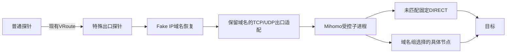

# 协作文档

- 适用规则: AI协作规则
- 后续工作传递声明: 本文档必须传递给后续阶段与后续角色。
- 需求编号: REQ-PEN-MIHOMO-EXIT-001
- 需求前缀: REQ-PEN-MIHOMO-EXIT-001
- 当前阶段: Architect最终复核已放行
- 最近更新角色: Architect
- 最近更新时间: 2026-08-14T15:35:00+08:00
- 工作依据文档: `doc/ai-coding-collaboration.md`; 用户于2026-08-13确认的特殊出口探针、Mihomo二次分流、主控GUI、独立Linux amd64安装包、Docker壳和程序自升级需求; 现有 `probe_controller`、`probe_node`、`docker/probe_node` 实现; Mihomo官方配置、API、发布物、Go模块和许可证资料
- 状态: 已完成

## 第1章 Architect章节
- 章节责任角色: Architect
- 状态: 已完成

### 1.1 需求定义
- 状态: 已完成

#### 1.1.1 需求目标
- REQ-PEN-MIHOMO-EXIT-001-R01: 新增独立发布物和程序名 `probe_exit_node`，作为兼容现有CloudHelper虚拟路由协议的特殊出口探针；它与普通探针从同一 `probe_node` Go包构建，使用 `mihomo_exit` build tag、现有 `runProbeNodeEntry` 接缝和不可运行时切换的构建标识隔离特殊功能；主控节点记录新增向后兼容的 `node_kind=normal|mihomo_exit`。
- REQ-PEN-MIHOMO-EXIT-001-R02: 特殊出口探针直接复用同包内现有节点身份、主控连接、拓扑、ticket、WebSocket/H3、虚拟路由帧、Path Ping/Pong和gVisor末跳实现，不复制或另行提取第二套VRoute运行时。
- REQ-PEN-MIHOMO-EXIT-001-R03: 特殊出口探针收到最终出口流量后恢复原始域名并将域名目标交给本机Mihomo；每组域名固定选择一个由Clash配置提取的具体节点作为出口，未匹配域名固定DIRECT，不再提供REJECT、策略组、默认动作、端口或网络条件。
- REQ-PEN-MIHOMO-EXIT-001-R04: 每个特殊出口探针自动聚合为且仅聚合为一条供普通探针使用的 `probe_exit` 路由规则；规则条目为该探针全部启用二次分流条目的规范化去重并集。聚合规则使用稳定ID并从特殊出口配置实时派生，不在普通 `RouteRules` 中重复持久化。
- REQ-PEN-MIHOMO-EXIT-001-R05: 二次分流对普通探针透明；普通探针不得接收订阅URL、代理凭证、策略组、节点或内部动作。私有配置使用单调 `revision` 和内容SHA-256，特殊出口必须报告build_kind及desired/applied revision；现有HMAC认证算法保持不变。
- REQ-PEN-MIHOMO-EXIT-001-R06: 主控 `/mng/route` 的“二次分流”Tab仅管理已创建特殊出口的Clash配置源和域名分流；页面不得自动选择探针，选择后按单列展示Clash配置、提取出的出口节点、域名分流、聚合路由规则和运行状态；每条分流仅包含一组域名和一个出口节点，不展示配置名称、总开关、默认动作、策略组、规则名称、规则开关、端口或网络条件；该Tab不得创建探针或生成安装信息。
- REQ-PEN-MIHOMO-EXIT-001-R07: 特殊出口探针与普通探针共用 `/mng/probe` 的创建和安装入口，通过创建时选择 `node_kind=mihomo_exit` 区分产品；创建后从同一探针列表生成独立Linux amd64原生或Docker安装信息，不提供Windows、ARM64或Android版本。
- REQ-PEN-MIHOMO-EXIT-001-R08: 工作目录按 `data/`、`log/`、`temp/` 分区；升级不得覆盖持久化数据。
- REQ-PEN-MIHOMO-EXIT-001-R09: 提供Docker壳版本；镜像只提供固定环境和entrypoint，业务程序及Mihomo由持久化目录中的程序按带版本、构建类型、兼容范围和SHA-256的升级清单自行安装、升级、校验、替换和成对回滚。
- REQ-PEN-MIHOMO-EXIT-001-R10: 主控独占保存和刷新最多32个Clash配置源的URL及可选请求头，使用结构化YAML解析、限制下载并防止SSRF；所有启用源并发抓取后必须原子合并，任一源失败或跨源节点名冲突都保留last-known-good代理快照；特殊出口只接收已规范化的代理节点和“域名组到具体节点”规则，不接收配置URL和请求头；敏感快照只下发给对应特殊出口。
- REQ-PEN-MIHOMO-EXIT-001-R11: 主控、相邻探针承载、升级和Mihomo上游防回环流量必须绕过Mihomo二次分流；若CloudHelper VRoute TUN无法移除，Mihomo的DIRECT、代理节点连接和引导DNS必须绑定或策略路由到TUN之外的物理出口。
- REQ-PEN-MIHOMO-EXIT-001-R12: TCP、UDP与QUIC业务流量均须具备可测试的二次分流闭环，不能只实现HTTP或TCP代理。
- REQ-PEN-MIHOMO-EXIT-001-R13: 管理端和管理API使用同一简化模型；Clash配置解析后的完整节点及认证秘密只保存在主控私有快照中，管理响应仅返回可选节点名称；保存时后端强制把每条域名组编译为指定节点规则并校验节点存在，旧多动作配置不要求兼容。

#### 1.1.2 需求范围
- 主控特殊出口配置存储、规范化、校验、敏感字段作用域和配置同步。
- 每个特殊出口唯一聚合规则的生成、更新、禁用、删除和冲突检测。
- `/mng/route` 二次分流Tab及聚合规则只读投影。
- 独立 `probe_exit_node` Linux amd64程序。
- 从同一 `probe_node` Go包构建普通和特殊两个发布物，特殊代码由build tag隔离。
- Fake IP到原始域名恢复、类型化出口目标适配和Mihomo规则配置生成。
- Mihomo进程、配置、日志、健康检查、升级与回滚。
- 原生systemd安装脚本和Docker壳。
- 单元、集成、安装升级和端到端验证。

#### 1.1.3 非范围
- Windows、Linux ARM64、Android特殊出口探针。
- Clash Verge桌面GUI。
- 由主控承载代理业务流量。
- 把Clash订阅节点直接当成CloudHelper虚拟路由协议端点。
- 改变普通探针现有路由语义或向普通探针加入Mihomo依赖。
- 通过SSH/SCP手工替换线上探针二进制。

#### 1.1.4 验收标准
- AC-01: 主控可创建、保存、读取、更新、禁用和删除特殊出口配置，旧路由配置文件可无损加载。
- AC-02: 每个启用特殊出口仅生成一条稳定ID的聚合规则；条目规范化、去重并稳定排序；重启和刷新后由单一特殊出口配置确定性重建，普通 `RouteRules` 中不存在重复副本。
- AC-03: 普通探针配置响应不包含特殊出口秘密；对应特殊出口只收到自己的规范化私有快照，且不包含订阅URL/请求头；desired/applied revision和SHA-256可核对。
- AC-04: 跨特殊出口、与手工路由规则的相同或语义重叠条目在保存时得到确定性拒绝，至少覆盖嵌套域名后缀和相交CIDR，不依赖数组顺序；派生规则使用保留ID命名空间，手工规则不得占用。
- AC-05: 二次分流Tab可完成已创建特殊出口的多Clash配置源、节点提取、域名组绑定节点和聚合预览；每个配置源可独立命名、启用、删除并在折叠的高级请求设置中按需配置请求头，公开订阅无需请求头；订阅和节点秘密不明文回显；未选择探针时详情隐藏，选择后页面按Clash配置、出口节点、域名分流、聚合路由规则、运行状态单列展示，聚合与状态只属于当前探针；状态同时核对desired/applied revision与hash、BuildKind、健康和exit_ready；页面不存在探针创建或安装入口以及旧基础配置或多动作控件。
- AC-06: `probe_exit_node`独立发布物可作为现有虚拟路由拓扑节点完成鉴权、承载、Ping/Pong、RTT、重连和最终帧处理；普通构建回归测试通过；主控配置响应提供expected_node_kind，探针状态上报build_kind，二者不匹配时特殊配置拒绝应用并上报错误；特殊版不启动本地代理接管、系统DNS接管、同步和DDNS调度器。
- AC-07: 同一特殊出口内的不同域名组可分别命中所选的具体Mihomo节点，未匹配域名固定DIRECT，普通探针仅看到统一出口规则。
- AC-08: TCP、UDP和QUIC端到端测试通过；Fake IP映射缺失时明确补取或失败，不允许错误直连Fake IP。
- AC-09: 主控、承载、升级连接不进入Mihomo；不存在二次分流回环；Mihomo不健康或当前revision未成功应用时 `exit_ready=false`，业务失败关闭且不回落物理直连；ICMP不得绕过Mihomo向目标直连。
- AC-10: `/mng/probe` 使用与普通探针相同的创建API和探针列表流程创建 `mihomo_exit` 节点，并按节点类型生成原生Linux amd64或Docker安装信息；原生安装、幂等重装、自升级和失败回滚保留 `data/`、`log/`，仅清理可重建的 `temp/`；升级候选必须匹配 `mihomo_exit` 构建类型并通过清单哈希和Mihomo配置校验。
- AC-11: Docker壳首次缺二进制时下载，已有二进制时直接运行；容器重建保留程序和数据；日常应用升级无需拉取镜像。
- AC-12: 主控、普通探针、特殊出口和页面测试通过；CI从同一源码分别构建普通矩阵和仅Linux amd64特殊发布物，并记录未执行测试及残余风险。
- AC-13: 管理API拒绝缺少域名或出口节点、引用不存在节点及尝试写入旧动作模型的请求；Clash刷新后节点名称立即进入节点池和规则下拉框；桌面及390px窄屏完成“添加配置 -> 提取节点 -> 添加域名组 -> 选择节点 -> 保存”且无横向溢出、控件重叠或控制台错误。

#### 1.1.5 风险
- 现有VRoute并非独立协议库：`probe_node`下153个Go文件同属 `package main`，carrier、ticket、控制帧、全局状态和gVisor末跳网络栈耦合；因此不能新建第二个Go包直接导入，也不应复制或大规模提取。优化方案是在同一包内通过build tag构建独立特殊发布物。
- 当前末跳在进入出口拨号前把Fake IP域名解析为IPv4，只把 `IP:port` 交给拨号器；该路径会丢失Mihomo域名规则所需信息，必须新增保留 `domain:port` 的类型化出口目标。
- 当前TCP出口抽象返回 `net.Conn`，可对接SOCKS5；UDP出口固定返回 `*net.UDPConn`，不能直接承载SOCKS5 UDP Associate，QUIC也因此未被证明。
- Mihomo官方Go模块主入口为 `package main` 且采用GPLv3。禁止静态库式嵌入；固定采用独立受控子进程，通过回环SOCKS5/mixed端口与受保护的回环REST API协作，并履行二进制分发许可证义务。
- UDP/QUIC、DNS、具体节点规则热更新及旧会话排空涉及会话生命周期与回滚。
- 订阅URL属于高敏感配置且可形成SSRF入口；必须仅保存在主控，禁止复制到特殊出口。
- 同一源码双构建会引入普通发布物误带特殊功能、升级下载错资产或特殊版误启普通后台服务的风险，必须由build tag、产品profile、构建标识、expected_node_kind/build_kind核对和资产命名阻断。
- 当前 `runProbeNodeEntry` 接缝位于参数解析、日志初始化、升级校验和启动锁之后，且普通探针日志目录为 `logs/`；特殊版若只替换该入口，无法保证早期路径、资产和命令边界。必须增加在 `main` 早期可读、由build tag确定且不可运行时切换的产品描述，不改变普通版默认值。
- 主控配置、派生规则和Mihomo实际配置存在短暂版本差；必须用revision、内容哈希和last-known-good快照消除不可观察的半应用状态。
- Mihomo SOCKS出口不承载ICMP；现有特殊末跳若复用物理ICMP会绕过二次分流，特殊产品必须显式失败关闭或返回不可达，并以TCP/UDP应用层诊断替代真实ICMP探测。
- 代理节点主机名解析若误进Mihomo自身规则会形成DNS/上游回环；生成配置必须区分业务域名解析和代理服务器引导解析，并固定防回环出口。

#### 1.1.6 遗留事项
- 全量实施前必须由TASK-PEN-000证明同包双构建、域名不丢失、SOCKS5 TCP/UDP和QUIC闭环可用；未通过时回到Architect调整数据面边界。
- 首期仅支持包含已展开具体 `proxies` 的Clash/Mihomo标准YAML配置；不执行或向探针下发配置内的远程 `proxy-providers` URL。聚合层和特殊出口私有规则都只接受域名后缀；每组域名必须直接选择一个已提取的具体节点，不提供CIDR、端口、网络类型、进程、用户、源网卡或源IP条件。
- 产品层“指定Mihomo节点”直接编译为Mihomo规则目标；未匹配域名追加固定 `MATCH,DIRECT`，不生成用户可配置的selector策略组。

#### 1.1.7 结论
- 产品方案可行；同包双构建消除了独立运行时复制/提取风险，但UDP接口、域名保持和双构建隔离仍需PoC证明。仅有条件放行TASK-PEN-000，不允许直接进入全量实施。

### 1.2 总体架构
- 状态: 已完成

#### 1.2.1 架构目标
- 让特殊出口在主路由层保持普通 `probe_exit` 兼容性，在最终出口层封装私有二次分流。
- 保持主控为特殊出口配置、聚合条目和Fake IP映射权威来源。
- 使原生和Docker部署共享同一持久化、自升级和回滚模型。

#### 1.2.2 总体设计
- 构建面：保留一个 `probe_node` Go包和一套VRoute实现；普通发布物按当前矩阵构建，特殊发布物使用 `mihomo_exit` build tag、现有 `runProbeNodeEntry` 接缝、在 `main` 早期生效的编译期产品profile、`BuildKind=mihomo_exit` 和独立资产名，仅产出Linux amd64 `probe_exit_node`。
- 控制面：节点记录以默认值为 `normal` 的 `node_kind` 区分特殊出口；主控独占保存/刷新订阅，从同一规范模型实时派生每节点唯一聚合规则和带revision/hash的私有快照，并将含派生规则的有效虚拟路由配置下发给所有探针；仅将对应私有快照下发给匹配的特殊出口节点。
- 主路由数据面：普通探针按聚合规则命中 `probe_exit`，通过现有虚拟路由协议将流量送至特殊出口。
- 特殊出口数据面：复用现有VRoute运行时和gVisor末跳网络栈；特殊出口恢复Fake IP域名并保留域名和端口，通过本机SOCKS5 TCP/UDP接口交给Mihomo，由Mihomo执行二次规则和出口选择。CloudHelper不再维护一套重复的出口规则引擎。
- Mihomo运行面：固定采用同安装包内独立二进制，由 `probe_exit_node` 监管；代理端口和REST API仅绑定回环，API使用随机秘密，配置候选通过Mihomo校验并健康检查后原子切换。
- 就绪面：VRoute控制连接与业务出口就绪解耦；只有当前desired revision/hash经Mihomo校验、激活和健康检查后才报告 `exit_ready=true`。未就绪期间保持拓扑控制能力但拒绝新业务会话，聚合规则不因短暂故障反复增删。
- 进程面：特殊产品profile仅启用身份/主控报告、路由同步、VRoute carrier与末跳、升级、状态和Mihomo管理；禁用普通探针本地代理接管、系统DNS接管、文件同步、DDNS和无关调度器。VRoute基础TUN是否可去除由PoC裁决。
- 部署面：原生systemd与Docker壳都运行持久化目录内的 `probe_exit_node`；程序按升级清单管理自身和Mihomo版本，任一候选失败则保持或恢复成对兼容的last-known-good组合。

#### 1.2.3 关键模块
| 模块编号 | 模块名称 | 职责 | 输入 | 输出 |
|---|---|---|---|---|
| MOD-PEN-01 | 特殊出口配置仓库 | 持久化Clash配置源、节点快照、域名组和状态 | 管理请求 | 规范化私有配置 |
| MOD-PEN-02 | 有效规则投影 | 从特殊出口配置实时派生唯一普通路由规则并与手工规则组合、检测冲突 | 私有二次规则 | 非持久化 `probe_exit` 有效规则 |
| MOD-PEN-03 | 主控管理API/UI | 探针页统一创建/安装；路由页提取节点、绑定域名组、展示聚合与状态 | 管理会话 | 脱敏JSON与页面 |
| MOD-PEN-04 | 私有配置编译与分发 | 主控刷新订阅、编译规范快照并按节点身份裁剪 | 节点鉴权请求 | revision/hash及普通或特殊配置 |
| MOD-PEN-05 | 双构建与产品profile | 从同一Go包构建normal和mihomo_exit发布物，隔离入口、依赖和启用组件 | build tag/ldflags/profile | 独立资产，共享VRoute实现 |
| MOD-PEN-06 | 特殊出口运行时 | 主控连接、拓扑、承载、Ping/Pong、最终帧和域名目标恢复 | 配置和VRoute帧 | 类型化域名/IP出口目标 |
| MOD-PEN-07 | 出口适配层 | 将全部类型化业务目标接入Mihomo SOCKS5 TCP/UDP并管理会话排空 | 域名/IP/端口/协议 | 出口连接、数据报会话或失败 |
| MOD-PEN-08 | Mihomo管理器 | 订阅、规则配置生成、子进程、REST控制、健康、日志、许可证和回滚 | 私有配置 | Mihomo数据面 |
| MOD-PEN-09 | 安装升级 | 原生/Docker首次安装、自升级和回滚 | 安装身份/版本 | 可运行服务 |

#### 1.2.4 关键接口
| 接口编号 | 接口名称 | 调用方 | 提供方 | 说明 |
|---|---|---|---|---|
| IF-PEN-001 | `/mng/api/route/special_exits` | 二次分流Tab | 主控 | GET/POST/PATCH/DELETE特殊出口配置 |
| IF-PEN-002 | `/mng/api/route/special_exits/subscription/refresh` | 二次分流Tab | 主控 | 安全刷新订阅并生成规范化快照，URL/请求头不下发 |
| IF-PEN-003 | `/mng/api/route/special_exits/status` | 二次分流Tab | 主控 | 配置同步和运行状态 |
| IF-PEN-004 | `/mng/api/probe/node/install` | 探针管理页安装弹窗 | 主控 | 已创建 `mihomo_exit` 节点的原生或Docker壳安装信息；二次分流模块不暴露安装接口 |
| IF-PEN-005 | `/api/probe/route/config`扩展 | 探针 | 主控 | 普通VRoute配置及按节点私有快照，包含expected_node_kind/revision/hash |
| IF-PEN-006 | ManagedSpecialExitRule | Fake IP/普通探针路由 | 聚合规则引擎 | 每节点唯一派生 `probe_exit`规则 |
| IF-PEN-007 | ProbeBuildVariant | CI/启动入口 | 同一 `probe_node` Go包 | build tag、BuildKind、expected_node_kind核对及独立资产 |
| IF-PEN-008 | ExitTarget | VRoute末跳 | 出口适配层 | 保留域名的TCP连接目标或UDP会话目标 |
| IF-PEN-009 | MihomoRuntime | 出口适配层 | Mihomo管理器 | 回环SOCKS5 TCP/UDP、REST控制和状态 |
| IF-PEN-010 | SelfUpgradeManifest | 主控/本地运行时 | 特殊出口升级器 | 带build kind、兼容范围和SHA-256的程序/Mihomo成对升级回滚 |

#### 1.2.5 关键约束
- 特殊出口派生规则ID稳定，不因条目顺序、订阅刷新或显示名改变。
- 派生规则ID固定使用保留命名空间 `special-exit:<node_id>`；普通手工规则创建/修改时拒绝该前缀。
- 特殊出口配置是聚合规则唯一持久化来源；有效规则在读取、Fake IP授权和探针配置下发时统一投影，禁止把派生规则复制进普通 `RouteRules`。
- 二次分流规则只允许指定已提取的具体节点；未匹配业务固定DIRECT，管理API不得接受REJECT、策略组、默认动作、端口或网络条件。
- 订阅URL和请求头只存储于主控；特殊出口仅存规范化快照中的节点连接秘密，管理响应仅返回掩码状态。
- 主控、相邻承载、升级和 `198.18.0.0/15` 内部流量必须绕过Mihomo。
- 如果PoC证明CloudHelper VRoute仍依赖TUN，Mihomo生成配置和Linux路由必须把DIRECT、代理节点连接及引导DNS绑定至探针选定的物理出口或专用routing mark；网络变化时重新解析出口，无法确定物理出口时 `exit_ready=false`。
- Docker壳参照 `docker/probe_node`，不在每次启动覆盖持久化二进制。
- VRoute不提取、不复制第二套carrier/控制帧实现；普通与特殊发布物必须从同一Go包构建，任何公共路径修改都必须同时跑普通和特殊变体测试。
- 特殊产品profile采用默认拒绝：只有身份/报告、路由同步、VRoute、升级、状态和Mihomo列入启用清单；新增普通探针后台组件不会自动进入特殊版。
- 编译期产品profile必须先于参数解析、日志初始化、升级校验和启动锁生效，统一给出BuildKind、服务名、允许命令、资产前缀以及 `./data`、`./log`、`./temp` 路径；普通profile保留现有默认行为和 `logs/` 路径。特殊版不得暴露普通探针本地TUN安装等无关维护命令。
- Mihomo不使用TUN，不接管宿主机默认路由；仅开放回环SOCKS5/mixed和REST API，避免CloudHelper TUN、Docker NET_ADMIN和测试网段冲突。
- Fake IP域名命中时必须把域名而不是预解析IP交给Mihomo；二次分流配置不接受CIDR规则。
- 聚合层和Mihomo私有规则共用同一域名组；页面只接受域名选择器，不提供CIDR、端口或TCP/UDP细化条件。
- `data/`保存身份、有效配置、Mihomo home和版本状态，`log/`保存两进程日志，`temp/`仅保存可丢弃的下载和候选文件。
- 主控私有配置是唯一规则源；聚合规则与Mihomo规则必须从同一个规范化规则模型生成，禁止页面、主控和探针分别解释三套语义。
- CloudHelper出口适配层不重复执行域名节点选择；全部业务流都进入受认证Mihomo listener，由Mihomo执行域名到具体节点规则及固定DIRECT兜底。Mihomo不可用时失败关闭。
- 应用配置采用 `desired_revision -> validate -> activate -> applied_revision` 状态机；失败保留last-known-good，状态上报不得把“已下发”误报为“已生效”。
- 特殊出口ICMP不允许调用现有物理直连探测路径；首期明确返回不可达，页面使用经Mihomo的TCP/UDP诊断展示可用性。
- Mihomo DNS配置必须为业务域名和代理服务器主机名提供分离的解析路径；代理服务器引导解析、主控、承载和升级目标固定绕过业务规则，避免自引用。
- 主控限制订阅下载字节数、解析节点数、规则数和单条字段长度；特殊探针限制候选配置大小、子进程重启频率、日志大小及文件描述符，超限时保留last-known-good。

#### 1.2.6 风险
- 双构建若只靠运行参数切换，普通探针可能意外启用特殊功能；必须使用build tag排除Mihomo管理代码，通过配置响应和状态报告核对BuildKind与expected_node_kind，同时保持现有HMAC认证算法不变。
- SOCKS5 UDP Associate必须保留每会话目标、回包来源和超时语义；QUIC是强制验收项。
- Docker数据面不依赖Mihomo TUN，因此不应为Mihomo额外增加NET_ADMIN；PoC必须分别验证仅作VRoute末跳时是否能移除CloudHelper TUN，若承载本身仍需要则按实际调用面最小授权。
- 分发未修改的Mihomo二进制仍需随包保留GPLv3许可证和对应源码获取方式；不得把其Go包静态链接进CloudHelper专有二进制。
- 订阅解析器与Mihomo实际兼容性可能漂移；候选快照除结构化解析外必须通过目标Mihomo版本的配置校验，且订阅刷新不能自动覆盖仍被规则引用但暂时缺失的节点。

#### 1.2.7 结论
- 修订后的子进程加SOCKS5架构满足独立安装包、透明聚合、主控GUI、Linux amd64和Docker壳要求；数据面须先通过PoC门禁。

### 1.3 单元设计
- 状态: 已完成

#### 1.3.1 单元清单
| 单元编号 | 单元名称 | 所属模块 | 职责 | 输入 | 输出 |
|---|---|---|---|---|---|
| UNIT-PEN-01 | SpecialExitStore | MOD-PEN-01 | 规范化、保存Clash源、节点秘密和域名组 | JSON配置 | 特殊出口配置 |
| UNIT-PEN-02 | SpecialExitAggregator | MOD-PEN-02 | 合并条目并生成唯一派生规则 | 特殊出口列表 | 路由规则 |
| UNIT-PEN-03 | SpecialExitConflictValidator | MOD-PEN-02 | 检测跨出口和手工规则的相同或语义重叠冲突 | 候选规则 | 校验结果 |
| UNIT-PEN-04 | SpecialExitMngHandler | MOD-PEN-03 | 二次分流配置CRUD、刷新和状态响应 | HTTP请求 | JSON |
| UNIT-PEN-05 | SpecialExitRoutePage | MOD-PEN-03 | 二次分流Tab交互 | 管理API | 页面状态 |
| UNIT-PEN-06 | SpecialExitConfigCompiler | MOD-PEN-04 | 刷新订阅、编译规范快照并按节点裁剪 | node_id/revision | 配置响应 |
| UNIT-PEN-07 | ProbeBuildVariant | MOD-PEN-05 | 同包构建normal/mihomo_exit，校验构建与节点类型 | build tag/ldflags | 独立发布物 |
| UNIT-PEN-08 | ExitControllerClient | MOD-PEN-06 | 身份、配置同步、心跳和命令 | 主控URL/secret | 运行配置 |
| UNIT-PEN-09 | ExitVRouteRuntime | MOD-PEN-06 | carrier、转发、最终帧、Ping/Pong和出口目标恢复 | VRoute配置 | 类型化目标/状态 |
| UNIT-PEN-10 | ExitFakeIPResolver | MOD-PEN-06 | Fake IP到域名及规则恢复 | Fake IP | 域名映射 |
| UNIT-PEN-11 | ExitTransportAdapter | MOD-PEN-07 | 将域名/IP目标接入Mihomo TCP/UDP会话并阻止ICMP直连旁路 | 域名/IP/端口/协议 | 连接/数据报会话/不可达 |
| UNIT-PEN-12 | MihomoConfigBuilder | MOD-PEN-08 | 结构化配置生成和校验 | 订阅/规则 | YAML配置 |
| UNIT-PEN-13 | MihomoRuntimeManager | MOD-PEN-08 | 进程、健康、日志和热切换 | 有效配置 | 数据面状态 |
| UNIT-PEN-14 | ExitUpgradeManager | MOD-PEN-09 | 程序/Mihomo升级与回滚 | 版本命令 | 新运行时 |
| UNIT-PEN-15 | NativeInstaller | MOD-PEN-09 | Linux amd64 systemd安装 | 安装身份 | 原生服务 |
| UNIT-PEN-16 | DockerShell | MOD-PEN-09 | 首次下载和持久化执行 | 环境变量 | 容器进程 |
| UNIT-PEN-17 | ProbeMngSpecialExitWorkflow | MOD-PEN-03 | 在普通探针管理流程中创建、展示并安装特殊出口 | 探针管理API | 节点记录和安装信息 |

#### 1.3.2 单元设计
##### UNIT-PEN-01
- 单元名称: SpecialExitStore
- 职责: 在路由配置仓库独立配置域中保存特殊出口私有配置。
- 输入: 管理API JSON和现存配置。
- 输出: 规范化、版本化配置。
- 处理规则: 空秘密更新保留旧值；文件权限0600；稳定ID；字段上限；每条域名组至少包含一个规范化域名并选择一个当前节点池中的具体节点；默认动作固定DIRECT；每次有效变更增加单调revision并计算规范JSON的SHA-256。
- 异常规则: 缺少域名、缺少或不存在的节点、非法订阅或旧动作字段拒绝保存且不改当前配置。

##### UNIT-PEN-02
- 单元名称: SpecialExitAggregator
- 职责: 为每个特殊出口生成一条非持久化派生规则，并与手工规则组成唯一有效规则视图。
- 输入: 全部启用二次规则。
- 输出: 稳定排序的 `probe_exit` 规则。
- 处理规则: 复用现有条目规范化；去重；稳定ID `special-exit:<node_id>`；拒绝手工规则占用保留前缀；只投影现有VRoute可表达的选择器；在读取、Fake IP授权、冲突校验和探针配置下发时调用同一投影函数；不写回普通RouteRules。
- 异常规则: 无有效条目时不生成可吸收流量的启用规则。

##### UNIT-PEN-03
- 单元名称: SpecialExitConflictValidator
- 职责: 防止同一条目含糊归属。
- 输入: 派生规则和手工规则。
- 输出: 冲突清单或通过。
- 处理规则: 保存前确定性比较规范化条目及语义交集；至少识别相同条目、嵌套域名后缀、相交CIDR以及可证明相交的前缀/关键字组合；无法证明互斥的跨所有者宽泛关键字规则按冲突处理。
- 异常规则: 冲突返回400和具体规则/条目，不隐式重排。

##### UNIT-PEN-04
- 单元名称: SpecialExitMngHandler
- 职责: 提供二次分流配置管理CRUD、订阅刷新和运行状态。
- 输入: 管理会话请求。
- 输出: 脱敏JSON。
- 处理规则: 管理鉴权、方法限制、请求体限制；订阅只允许受控HTTPS访问；URL和请求头只保留在主控，刷新结果进入候选快照；首期只接受已展开的具体proxies，远程proxy-provider引用返回明确的不支持错误。
- 异常规则: SSRF、超时、过大响应、无效YAML或保存失败不破坏旧配置。

##### UNIT-PEN-05
- 单元名称: SpecialExitRoutePage
- 职责: 在 `/mng/route` 管理二次分流配置和运行状态，不承担探针生命周期管理。
- 输入: IF-PEN-001至003。
- 输出: Clash配置编辑器、脱敏节点池、域名组到节点的绑定、聚合预览、desired/applied状态、exit_ready、版本和错误。
- 处理规则: 订阅及节点秘密不回显；规则只提供域名列表和节点选择器；派生规则只读；页面沿用现有样式并保持单列。
- 异常规则: API失败保留最后成功状态并显示错误。

##### UNIT-PEN-17
- 单元名称: ProbeMngSpecialExitWorkflow
- 职责: 在 `/mng/probe` 复用普通探针创建、列表和安装弹窗管理特殊出口。
- 输入: 探针名称、`node_kind=mihomo_exit`、已创建节点和安装方式。
- 输出: 不可变节点类型、Linux x64原生命令或Docker Compose。
- 处理规则: 创建复用现有探针API且只登记节点，不自动打开安装弹窗；编辑页的`target_system`允许Linux或Docker并禁用Windows/Android；用户点击节点行内独立“安装”按钮后默认生成所选版本，也可在Linux x64与Docker间切换；二次分流页不调用安装接口。
- 异常规则: 非特殊节点拒绝特殊安装信息；节点类型修改和Windows/Android目标拒绝；安装信息加载失败不影响已创建节点。

##### UNIT-PEN-06
- 单元名称: SpecialExitConfigCompiler
- 职责: 从主控Clash配置、域名组和所选具体节点编译唯一规范快照，并仅向对应特殊出口发送。
- 输入: 已认证node_id、期望node_kind、订阅解析结果和全局配置。
- 输出: 可选 `special_exit` 快照、desired_revision和SHA-256，不含订阅URL/请求头。
- 处理规则: 精确node_id和期望node_kind匹配；聚合规则与Mihomo规则共用同一规范模型；普通探针字段省略；不改变现有HMAC签名口径。
- 异常规则: 重复绑定、未知节点、构建类型不匹配或无法编译的规则拒绝发布并保留旧revision。

##### UNIT-PEN-07
- 单元名称: ProbeBuildVariant
- 职责: 从同一 `probe_node` Go包构建普通和特殊两个独立发布物，VRoute公共代码只保留一份。
- 输入: 默认构建或 `-tags mihomo_exit`、产品profile、`BuildKind`、`BuildVersion`。
- 输出: 普通平台矩阵资产和仅Linux amd64的 `probe_exit_node` 资产。
- 处理规则: 通过 `runProbeNodeEntry` tag变体选择编译期产品profile；特殊入口/依赖仅存在于tag文件；公共文件不得反向依赖特殊代码；特殊profile按启用清单启动组件；配置响应携带expected_node_kind，状态报告携带BuildKind，应用前核对；保留现有HMAC、magic、字段、checksum、ticket和重连语义。
- 异常规则: profile未在参数、日志和升级路径之前生效、普通构建包含特殊入口、特殊profile启动未列入清单的普通组件、错误资产可被升级器选择、构建类型不匹配仍应用配置或任一普通回归失败即阻塞。

##### UNIT-PEN-08
- 单元名称: ExitControllerClient
- 职责: 复用探针身份、配置同步、心跳和升级命令。
- 输入: node_id、node_secret、controller_url。
- 输出: 私有快照、desired revision和VRoute配置。
- 处理规则: HTTPS/HMAC；校验内容哈希；原子落盘至 `data/`；应用成功后报告applied revision/hash。
- 异常规则: 拉取失败继续使用最后有效配置并退避重试。

##### UNIT-PEN-09
- 单元名称: ExitVRouteRuntime
- 职责: 参与现有拓扑并在终点交付业务帧。
- 输入: VRoute配置和carrier帧。
- 输出: 保留域名或原始IP的类型化TCP/UDP目标、控制响应和状态。
- 处理规则: 与普通探针保持桥接方向和Path Ping/Pong一致；Fake IP目标禁止在出口适配前预解析为IP；Path Ping/Pong仅表示VRoute承载可达，不冒充Mihomo业务就绪。
- 异常规则: carrier失败清理会话并限频记录，不回落错误直连。

##### UNIT-PEN-10
- 单元名称: ExitFakeIPResolver
- 职责: 恢复主控Fake IP映射。
- 输入: 目的Fake IP。
- 输出: 域名、规则和出口所有权。
- 处理规则: 本地缓存优先，缺失时通过受鉴权主控接口补取。
- 异常规则: 补取失败快速失败，不把Fake IP交给Mihomo或公网。

##### UNIT-PEN-11
- 单元名称: ExitTransportAdapter
- 职责: 对TCP返回通用 `net.Conn`，对UDP提供不依赖 `*net.UDPConn` 的数据报会话抽象，并将全部业务目标交给Mihomo。
- 输入: 域名或IP、端口和TCP/UDP协议；ICMP帧只用于显式失败处理。
- 输出: 受认证SOCKS5连接/UDP Associate会话或失败。
- 处理规则: 域名保持到SOCKS5请求；回包携带正确源地址；旧会话按超时排空；不在CloudHelper出口适配层重复执行域名节点选择；Mihomo不可用或revision未应用时不隐式直连；ICMP返回不可达且不得调用物理出口。
- 异常规则: UDP Associate、目标选择或Mihomo健康失败时快速失败并限频记录。

##### UNIT-PEN-12
- 单元名称: MihomoConfigBuilder
- 职责: 从订阅和私有规则生成由Mihomo直接执行的完整规则配置。
- 输入: 主控下发的规范化代理节点/规则快照、选择项和防回环目标，不接收订阅URL。
- 输出: `temp/`候选配置。
- 处理规则: 结构化YAML、最小秘密、随机SOCKS用户名/密码、固定回环端口、REST秘密、显式绕行规则和域名到具体节点规则；业务域名DNS与代理服务器引导DNS分离；必要时为DIRECT、代理节点及引导DNS生成物理接口绑定或routing mark；域名后缀从同一规范模型编译，末尾固定生成 `MATCH,DIRECT`；候选配置先由目标Mihomo版本校验。
- 异常规则: 校验失败不替换 `data/` 中有效配置。

##### UNIT-PEN-13
- 单元名称: MihomoRuntimeManager
- 职责: 管理独立Mihomo子进程生命周期、回环REST API和健康。
- 输入: 已校验配置和二进制。
- 输出: TCP/UDP/QUIC数据面及 `exit_ready`、版本、会话/字节/错误计数状态。
- 处理规则: stdout/stderr写入 `log/` 并滚动；代理和API只绑定回环；SOCKS listener使用随机凭据且不得配置loopback免认证；当前revision激活并通过数据面健康检查后才置 `exit_ready=true`；热切换前后健康检查；失败回滚；分发物附许可证和源码链接。
- 异常规则: 异常退出退避重启；重复错误节流。

##### UNIT-PEN-14
- 单元名称: ExitUpgradeManager
- 职责: 自行升级 `probe_exit_node` 和Mihomo。
- 输入: 主控升级命令、版本检查和升级清单。
- 输出: 原子替换、exec重启或回滚。
- 处理规则: 清单固定build_kind、probe版本、Mihomo版本、兼容范围、资产名和SHA-256；参照普通探针候选校验、下载续传、备份和回滚；仅在全部候选就绪后切换。
- 异常规则: 任一步失败恢复旧程序、旧Mihomo和旧配置的last-known-good组合，禁止只留下半升级状态。

##### UNIT-PEN-15
- 单元名称: NativeInstaller
- 职责: 安装Linux amd64 systemd服务。
- 输入: 主控生成的安装身份。
- 输出: `/opt/cloudhelper/probe_exit_node`服务。
- 处理规则: 幂等；在服务WorkingDirectory下精确创建 `data/`、`log/`、`temp/`；特殊版早期日志也写入 `log/`；不覆盖持久化文件。
- 异常规则: 非Linux amd64明确退出。

##### UNIT-PEN-16
- 单元名称: DockerShell
- 职责: 提供固定容器环境并执行持久化二进制。
- 输入: 环境变量和挂载目录。
- 输出: `exec probe_exit_node`。
- 处理规则: 缺失时优先主控代理下载；已有时不覆盖；host network；仅在PoC证明CloudHelper VRoute承载确实需要时授予NET_ADMIN/TUN。
- 异常规则: 下载失败明确退出，由容器重启策略重试。

#### 1.3.3 风险
- TASK-PEN-000和正式实现均已证明build tag隔离、域名目标及TCP/UDP/QUIC闭环；特殊产品没有切换到TUN或复制VRoute运行时。
- 保留风险为Linux systemd实机安装/回滚演练、高吞吐QUIC缓冲压测和本机未执行race；已在2.5.7至2.5.8记录，均不改变协议正确性和失败关闭边界。

#### 1.3.4 结论
- 控制面、数据面和部署实现均完成；本地、Linux交叉构建、Docker Linux壳及官方Mihomo真实进程证据满足最终门禁。

### 1.4 Code任务执行包
- 状态: 已完成

#### 1.4.1 执行边界
- 允许修改: `probe_controller/internal/core/probe_route_config_store.go`; `probe_controller/internal/core/probe_route_handlers.go`; `probe_controller/internal/core/probe_virtual_router.go`; `probe_controller/internal/core/probe_registry.go`; `probe_controller/internal/core/mng_route_actions.go`; `probe_controller/internal/core/mng_route_handlers.go`; `probe_controller/internal/core/mng_probe_handlers.go`; `probe_controller/internal/core/probe_command.go`; `probe_controller/internal/core/probe_runtime.go`; `probe_controller/internal/core/probe_ws.go`; `probe_controller/internal/core/mng_pages/probe.html`; `probe_controller/internal/core/mng_pages/route.html`; `probe_controller/internal/core/server.go`; `probe_controller/internal/core/install_scripts.go`; `probe_controller/internal/core/install_scripts/`; `probe_controller/internal/core/*special_exit*`; `probe_controller/internal/core/*test.go`; `probe_node`内双构建、出口适配、Mihomo管理、升级清单及测试所需文件; `.github/workflows/release.yml`; 新增 `docker/probe_exit_node/`; `THIRD_PARTY_LICENSES/mihomo-LICENSE`; `README.md`; `doc/install_upgrade.md`; 本协作文档Code章节。补充列出的状态/命令/报告文件及许可证均为TASK-PEN-002、004、005既有接口和许可证验收项的必要落点，不扩展需求行为。
- 禁止修改: Android/mobilecore行为; 普通探针Windows安装逻辑; 主控认证边界; 现有VRoute线协议语义; 线上部署文件; 用户未授权的远程运行环境。

#### 1.4.2 任务清单
| 任务编号 | 需求编号 | 单元编号 | 文件范围 | 操作类型 | 验收标准 |
|---|---|---|---|---|---|
| TASK-PEN-000 | R01,R02,R03,R08,R11,R12 | UNIT-PEN-07,09,10,11,12,13 | `probe_node`内新增最小mihomo_exit tag入口/产品profile/构建标识、出口适配PoC和测试；禁止拆分或复制VRoute | 验证性新增/最小修改 | profile在参数/日志/升级前生效且特殊版精确使用data/log/temp；默认构建与Linux amd64特殊构建均成功；expected_node_kind/BuildKind错配拒绝应用且HMAC不变；特殊profile不启动代理/DNS/同步/DDNS或暴露无关TUN维护命令；普通VRoute fixture不变；Fake IP恢复后以域名进入受认证Mihomo SOCKS5；TCP、UDP、QUIC闭环；验证末跳是否可无TUN运行，若保留TUN则Mihomo全部上游固定物理出口；代理服务器DNS不自回环；revision未应用或Mihomo崩溃时exit_ready=false且不回落直连；ICMP不走物理出口；形成继续/整改结论 |
| TASK-PEN-001 | R01,R04,R05,R10 | UNIT-PEN-01,02,03,06 | 主控route/node store、special_exit新增文件、route handlers及测试 | 新增/修改 | AC-01至04；普通节点无秘密/订阅URL，revision/hash可核对，聚合稳定；保留ID、嵌套域名后缀、相交CIDR和宽泛关键字冲突均可测 |
| TASK-PEN-002 | R06 | UNIT-PEN-04,05 | mng handlers、server.go、route.html及页面测试 | 新增/修改 | AC-05；CRUD/刷新/状态完整，秘密不回显，desired/applied、exit_ready、版本和错误可见 |
| TASK-PEN-003 | R02 | UNIT-PEN-07 | `probe_node`双构建/profile边界、CI发布矩阵、升级资产选择及测试 | 新增/修改 | 普通平台矩阵不变；特殊仅Linux amd64且组件启用清单固定；同一VRoute源码；expected_node_kind/BuildKind和资产选择负向测试通过；HMAC兼容fixture不变 |
| TASK-PEN-004 | R01,R02,R03,R11 | UNIT-PEN-08,09,10,11 | `probe_node`内特殊出口控制面、末跳目标、SOCKS5 TCP/UDP适配和测试 | 新增/修改 | AC-06、08、09；可作为正式节点完成最终帧处理；desired/applied revision与exit_ready准确；ICMP无直连旁路 |
| TASK-PEN-005 | R03,R10,R11,R12 | UNIT-PEN-12,13 | probe_exit_node Mihomo配置、子进程监管、REST控制及测试 | 新增 | AC-07至09；域名组到具体节点、固定DIRECT兜底和TCP/UDP/QUIC闭环；受认证回环监听、业务/引导DNS分离、资源上限和许可证交付通过 |
| TASK-PEN-006 | R07,R08,R09 | UNIT-PEN-14,15,16 | 安装脚本、install_scripts.go、docker/probe_exit_node、升级清单代码和测试 | 新增/修改 | AC-10、11；原生/Docker持久化、构建类型/哈希校验、程序与Mihomo成对自升级及回滚通过 |
| TASK-PEN-007 | R01-R12 | 全部 | README、install_upgrade、本协作文档Code章节、端到端测试 | 修改 | AC-12；文档、证据、风险和回滚完整 |
| TASK-PEN-008 | R06,R07,R09 | UNIT-PEN-05,15,16,17 | `mng_pages/probe.html`、`mng_pages/route.html`、管理安装路由及页面/handler测试、本协作文档 | 修改 | 特殊出口与普通探针共用创建API、探针列表和安装弹窗；创建时显式提交 `node_kind=mihomo_exit`；特殊安装仅Linux x64/Docker；二次分流Tab无创建和安装入口；主控全量及浏览器交互通过 |
| TASK-PEN-009 | R06,R10 | UNIT-PEN-01,04,05,06 | `probe_special_exit.go`、`probe_special_exit_mng.go`、`mng_pages/route.html`、专项测试、README及本协作文档 | 修改 | 旧单订阅无损迁移；每探针最多32个订阅源且请求头可选；管理响应逐源脱敏；全部启用源原子刷新并确定性合并，任一失败或重名不覆盖last-known-good；多订阅编辑器单列响应式显示；控制器全量/vet、JS语法和桌面/移动Playwright通过 |
| TASK-PEN-010 | R06 | UNIT-PEN-04,05 | `mng_pages/route.html`、页面测试、README及本协作文档 | 修改 | 不自动选择首台探针；选择器位于全部详情之前；未选择时隐藏详情；选择后依次显示基础配置、订阅、规则、聚合和运行状态；聚合和状态只显示当前节点；状态额外核对主控desired与探针applied revision/hash；桌面/移动Playwright切换节点通过 |
| TASK-PEN-012 | R03,R06,R13 | UNIT-PEN-01,04,05,06,12 | `probe_controller/internal/core/probe_special_exit.go`、`probe_controller/internal/core/probe_special_exit_mng.go`、`probe_controller/internal/core/mng_pages/route.html`、`probe_controller/internal/core/probe_special_exit_test.go`、必要的`probe_node`快照/Mihomo编译文件及测试、`README.md`、`doc/install_upgrade.md`、本协作文档 | 修改/删除 | 删除管理面旧多动作模型和基础配置；Clash配置解析形成脱敏节点池；页面每条规则只有域名列表和具体节点下拉；后端强制具体节点规则且未匹配固定DIRECT；管理API负向测试、JS语法、主控及普通/特殊探针回归、桌面和390px Playwright流程通过 |

#### 1.4.3 源码修改规则
- 修改源代码时必须注意可能存在的 GBK 编码并保持原文件编码，避免乱码或误转码。
- 每次仅执行一个任务或一个可独立验证的子闭环，完成后立即更新第2章证据。
- TASK-PEN-000前置门禁已通过，TASK-PEN-001至007已按依赖顺序实施并完成。
- TASK-PEN-004不得早于TASK-PEN-003兼容测试通过。
- TASK-PEN-005不得引入Mihomo Go包静态链接或切换到TUN；发现SOCKS5 UDP/QUIC语义不满足时必须在第2.6节记录“执行阻塞”并等待Architect裁决。
- 禁止为了独立程序名新建第二套VRoute Go包或复制现有carrier/控制帧实现；独立性由发布物、build tag、服务名、工作目录和升级通道保证。

#### 1.4.4 交付物
- 主控特殊出口存储/API/UI与测试。
- 同一 `probe_node` Go包的普通/特殊双构建边界、独立发布物和兼容fixture。
- Linux amd64 `probe_exit_node`源码与测试。
- Mihomo二次分流运行时。
- 原生安装脚本和Docker壳。
- 更新后的README、安装升级文档及本协作文档Code证据。

#### 1.4.5 门禁输入
- AI协作规则v2.5已读取。
- 需求、非范围、接口、单元、文件范围、操作类型和可测试验收标准均已声明；同包双构建、域名保持和SOCKS UDP/QUIC均已有正式证据。
- Code章节固定结构已预创建。
- 当前工作树可能有用户变更，Code必须先检查并保留无关修改。
- 2026-08-13 Architect先关闭TASK-PEN-000前置条件，Code随后完成TASK-PEN-001至008并提交第2章完整证据。

#### 1.4.6 结论
- TASK-PEN-012已由Architect定义并有条件放行Code执行：二次分流管理模型收敛为Clash节点池及“域名组 -> 具体节点”，不保留旧多动作配置兼容。

### 1.5 Architect需求跟踪矩阵
- 状态: 已完成

| 需求编号 | 需求描述 | 架构章节 | 单元设计章节 | Code任务章节 | 状态 | 备注 |
|---|---|---|---|---|---|---|
| R01 | 独立特殊出口程序 | 1.2 | UNIT-PEN-07至09 | TASK-PEN-000,003,004 | 已完成 | 同包构建独立Linux amd64发布物，构建类型不可运行时切换 |
| R02 | 复用现有VRoute协议 | 1.2 | UNIT-PEN-07,09 | TASK-PEN-000,003,004 | 已完成 | 同一源码直接复用，不提取不复制 |
| R03 | Mihomo二次分流 | 1.2 | UNIT-PEN-10至13 | TASK-PEN-000,004,005,012 | 已完成 | 正式快照、具体节点规则、固定DIRECT兜底、监管和Mihomo TCP/UDP/QUIC闭环 |
| R04 | 每节点唯一聚合规则 | 1.2 | UNIT-PEN-02 | TASK-PEN-001 | 已完成 | 稳定ID，实时派生且Fake IP库使用有效规则 |
| R05 | 私有配置作用域 | 1.2 | UNIT-PEN-01,06 | TASK-PEN-001 | 已完成 | revision/hash，订阅URL不下发，快照只给目标特殊探针 |
| R06 | 主控二次分流Tab | 1.2 | UNIT-PEN-04,05 | TASK-PEN-002,008,009,010,012 | 已完成 | 先选择探针，再按Clash配置、出口节点、域名分流、聚合规则、运行状态单列展示 |
| R07 | Linux amd64独立安装 | 1.2 | UNIT-PEN-15 | TASK-PEN-006,008 | 已完成 | 探针管理页统一创建/安装入口；无Windows/ARM |
| R08 | data/log/temp分区 | 1.2 | UNIT-PEN-14至16 | TASK-PEN-006 | 已完成 | 原生三目录，Docker另分program，升级保留持久数据 |
| R09 | Docker壳与程序自升级 | 1.2 | UNIT-PEN-14,16 | TASK-PEN-006,008 | 已完成 | 探针安装弹窗提供Docker壳配置；清单校验、成对回滚，非镜像日常升级 |
| R10 | 安全订阅与秘密 | 1.2 | UNIT-PEN-01,04,06,12 | TASK-PEN-001,002,005,009 | 已完成 | 多订阅、可选请求头、原子合并、HTTPS/SSRF/脱敏/作用域/0600运行秘密均通过 |
| R11 | 承载绕行防回环 | 1.2 | UNIT-PEN-09,12,13 | TASK-PEN-000,004,005 | 已完成 | 无TUN、回环SOCKS/REST、失败不直连 |
| R12 | TCP/UDP/QUIC | 1.2 | UNIT-PEN-09,11,13 | TASK-PEN-000,004,005 | 已完成 | 模拟与官方Mihomo真实进程均通过 |
| R13 | 节点池与域名组简化模型 | 1.2 | UNIT-PEN-01,04,05,06,12 | TASK-PEN-012 | 已完成 | 管理API、页面和Mihomo快照只接受域名组绑定具体节点；旧模型不兼容 |

### 1.6 Architect关键接口跟踪矩阵
- 状态: 已完成

| 接口编号 | 需求编号 | 接口名称 | 调用方 | 提供方 | 输入 | 输出 | 状态 | 备注 |
|---|---|---|---|---|---|---|---|---|
| IF-PEN-001 | R06,R13 | SpecialExits CRUD | 路由页 | 主控 | Clash配置源及域名组节点绑定 | 脱敏配置和节点名称池 | 进行中 | 管理鉴权，写入秘密不回显；拒绝旧动作模型 |
| IF-PEN-002 | R06,R10,R13 | Subscription Refresh | 路由页 | 主控 | 特殊出口ID | 多源合并后的节点名称池/revision/hash | 进行中 | 启用源并发抓取、全成才提交；HTTPS固定解析、防SSRF/重定向/大小限制，URL及节点秘密不下发 |
| IF-PEN-003 | R06 | SpecialExit Status | 路由页 | 主控 | 无 | desired/applied revision/hash、BuildKind、版本、exit_ready、健康、计数和错误 | 已完成 | 不含秘密 |
| IF-PEN-004 | R07,R09 | Install Info | 探针管理页 | 主控 | node/mode | 安装参数 | 已完成 | `/mng/api/probe/node/install`提供native/docker入口、身份和HTTPS参数；路由页不调用 |
| IF-PEN-005 | R02,R05 | Probe Route Config | 探针 | 主控 | 现有HMAC请求 | expected_node_kind/revision/hash作用域快照 | 已完成 | 探针验证并原子应用，错配失败关闭 |
| IF-PEN-006 | R04 | Managed Rule | 路由/Fake IP | 聚合器 | 私有规则 | 单一派生规则 | 已完成 | `special-exit:<node_id>`稳定ID |
| IF-PEN-007 | R01,R02 | Probe Build Variant | CI/配置应用/状态报告 | 同一probe_node Go包 | tag/BuildKind/expected_node_kind | 独立发布物和状态 | 已完成 | 特殊仅Linux amd64，候选程序自检构建类型 |
| IF-PEN-008 | R03 | Exit Target | VRoute末跳 | 出口适配层 | 域名/IP/端口/协议 | 连接或数据报会话 | 已完成 | PoC确认域名不预解析且普通语义不变 |
| IF-PEN-009 | R03,R12 | Mihomo Runtime | 出口适配层 | Mihomo管理器 | SOCKS5/REST | 出口/状态 | 已完成 | 子进程监管、REST、健康、滚动日志和数据面通过 |
| IF-PEN-010 | R08,R09 | Self Upgrade Manifest | 主控/运行时 | 升级器 | 版本/构建/哈希/兼容范围 | 成对替换/回滚 | 已完成 | 原生/Docker首次安装与自身升级共享配对约束 |

### 1.7 门禁裁判
- 状态: 已完成

#### 1.7.1 门禁输入
| 文档 | 路径 | 状态 |
|---|---|---|
| 协作文档 | `doc/REQ-PEN-MIHOMO-EXIT-001-collaboration.md` | 已完成 |
| AI协作规则 | `doc/ai-coding-collaboration.md` | 已读取 |

#### 1.7.2 裁判检查
| 检查项 | 结果 | 证据 | 备注 |
|---|---|---|---|
| 协作文档存在 | 通过 | 本文件 | 无 |
| Architect章节存在 | 通过 | 第1章 | 无 |
| Code章节存在 | 通过 | 第2章 | TASK-PEN-000至012证据完整 |
| 必需子章节存在 | 通过 | 1.1至1.7、2.1至2.6 | 无 |
| 需求前缀一致 | 通过 | REQ-PEN-MIHOMO-EXIT-001 | 无 |
| 需求编号一致 | 通过 | R01至R13 | 无 |
| 接口编号一致 | 通过 | IF-PEN-001至010 | 无 |
| 模板字段完整 | 通过 | 文档头及固定章节 | 无 |
| GBK编码文件无乱码或误转码 | 通过 | 最终差异、编译、浏览器中文渲染 | 未出现乱码或误转码 |
| Code证据完整 | 通过 | 2.1至2.6、特别是2.5.1至2.5.9 | TASK-PEN-012接口、文件、命令、结果和风险已补充 |
| Code任务反馈已处理 | 通过 | 2.6无未处理反馈 | 无 |
| 验收标准可测试 | 通过 | AC-01至13 | TASK-PEN-012具备API、脚本、回归及浏览器验收路径 |
| 需求任务覆盖完整 | 通过 | 1.5矩阵 | 无 |
| 任务自测覆盖完整 | 通过 | TEST-PEN-000至012 | 管理API、快照v2、主控/普通/特殊全量及浏览器流程均通过 |
| 修改文件在允许范围内 | 通过 | 2.5.4与补充后的1.4.1逐项核对 | 状态/命令/许可证必要落点已显式列出 |
| 测试失败已记录缺陷 | 通过 | DEFECT-PEN-001至016；2.5.6并行抖动记录 | 最终整改和稳定复跑全部通过 |
| 未执行测试原因完整 | 通过 | 2.5.7 | systemd实机、race、最终联网重建均说明替代证据 |
| 遗留风险可接受 | 通过 | 2.5.8 | 不影响协议兼容、秘密边界、事务提交或失败关闭 |
| 最终整改闭合 | 通过 | DEFECT-PEN-009至011；定向测试、普通/特殊/主控全量 | 旧订阅结果拒绝、深拷贝事务落盘后提交、连续健康失败受监管重启均完成 |
| 无Ruby产品依赖 | 通过 | Go结构化解析workflow、Docker Compose v5.3.0原生解析、Bash语法检查 | 构建、安装、CI与运行均不需要Ruby |
| 创建安装入口符合产品边界 | 通过 | TASK-PEN-008、TEST-PEN-008、DEFECT-PEN-012 | `/mng/probe`统一创建/安装；`/mng/route`仅配置和状态 |
| 多订阅与单列纠偏闭合 | 通过 | TASK-PEN-009、TEST-PEN-009、DEFECT-PEN-013 | 多源原子刷新、逐源脱敏、旧配置迁移；桌面/移动固定单列无溢出 |
| 探针选择与派生信息顺序闭合 | 通过 | TASK-PEN-010、TEST-PEN-010、DEFECT-PEN-014 | 未选择时详情隐藏；聚合和状态在配置后且只显示当前探针 |
| 节点池与域名组简化 | 通过 | TASK-PEN-012、TEST-PEN-012、DEFECT-PEN-016 | 持久模型和快照升级为v2，仅保留`id/domains/target`；API负向及桌面/窄屏证据通过 |

#### 1.7.3 冲突记录
| 冲突编号 | 冲突条款 | 最终采用条款 | 裁决人 | 裁决结论 |
|---|---|---|---|---|
| CONFLICT-PEN-001 | 初始草稿误放 `plans/`，不符合规则固定输出目录和单文档要求 | 删除草稿，仅保留本 `doc/...-collaboration.md` | Architect | 已处理 |
| CONFLICT-PEN-002 | 初始允许清单未逐项列出状态报告/命令文件和第三方许可证落点 | 按已声明IF-PEN-003、007、TASK-PEN-002、004、005补充必要文件，禁止借此扩展其他行为 | Architect | 已处理 |
| CONFLICT-PEN-003 | 初版为兼容旧配置在持久模型和探针快照保留固定的动作、启用、端口和网络字段 | 用户明确允许全部修改且无需兼容；升级为v2域名节点模型并拒绝v1快照 | Architect | 已处理 |

#### 1.7.4 裁判结论
- 结论: 通过
- 放行阻塞: 放行
- 条件: 无。
- 责任方: 无。
- 关闭要求: 已满足。
- 整改关闭: 已完成。

#### 1.7.5 结论
- TASK-PEN-012已按用户最终模型完成；快照v2、失败关闭、秘密边界、全量回归和浏览器证据均满足门禁，需求放行。

## 第2章 Code章节
- 章节责任角色: Code
- 状态: 已完成

### 2.1 Code需求跟踪矩阵
- 状态: 已完成

| 需求编号 | 任务编号 | 实现文件 | 实现状态 | 自测状态 | 证据 | 备注 |
|---|---|---|---|---|---|---|
| R01,R02,R03,R08,R11,R12 | TASK-PEN-000 | `probe_node/product_profile*.go`、末跳目标/传输接缝及测试 | 已完成 | 已完成 | 2.5.5至2.5.6 | 前置PoC及正式实现共用同一VRoute源码 |
| R04,R05,R10 | TASK-PEN-001 | `probe_special_exit*.go`、route store/actions/handlers | 已完成 | 已完成 | TEST-PEN-001 | 私有存储、订阅、聚合、冲突与Fake IP有效规则 |
| R06 | TASK-PEN-002 | 管理handlers、`server.go`、`mng_pages/route.html` | 已完成 | 已完成 | TEST-PEN-002、007 | CRUD、刷新、状态和真实浏览器验证 |
| R01,R02,R07 | TASK-PEN-003 | 产品profile、CI矩阵、升级资产自检 | 已完成 | 已完成 | TEST-PEN-003 | 特殊发布物仅Linux amd64 |
| R01,R02,R03,R11,R12 | TASK-PEN-004 | 路由配置同步、正式末跳TCP/UDP出口、运行报告 | 已完成 | 已完成 | TEST-PEN-004 | 作用域快照、失败关闭、普通协议透明 |
| R03,R10,R11,R12 | TASK-PEN-005 | `probe_special_exit_mihomo.go`及测试 | 已完成 | 已完成 | TEST-PEN-005 | Mihomo配置、监管、REST、健康、滚动日志、TCP/UDP/QUIC |
| R07,R08,R09 | TASK-PEN-006 | 原生安装、Docker壳、发布清单、成对升级 | 已完成 | 已完成 | TEST-PEN-006 | data/log/temp分区、候选校验、成对替换/回滚 |
| R01-R12 | TASK-PEN-007 | README、安装升级文档、端到端回归与本章 | 已完成 | 已完成 | TEST-PEN-007 | 全部交付物和证据闭合 |
| R06,R07,R09 | TASK-PEN-008 | `mng_pages/probe.html`、`mng_pages/route.html`、probe安装handler/路由、节点类型约束及测试 | 已完成 | 已完成 | TEST-PEN-008 | 与普通探针共用创建/列表/安装流程；二次分流页仅配置和状态 |
| R06,R10 | TASK-PEN-009 | `probe_special_exit.go`、`probe_special_exit_mng.go`、`mng_pages/route.html`、专项测试和文档 | 已完成 | 已完成 | TEST-PEN-009 | 最多32个脱敏订阅源、请求头可选、原子合并与单列编辑；旧单订阅无损迁移 |
| R06 | TASK-PEN-010 | `mng_pages/route.html`、页面测试、README和本协作文档 | 已完成 | 已完成 | TEST-PEN-010 | 显式选择探针后才展开配置；聚合/状态后置并限定当前节点；状态核对revision/hash |
| R03,R06,R13 | TASK-PEN-012 | `probe_special_exit.go`、`probe_special_exit_mng.go`、`mng_pages/route.html`、控制器测试、`probe_special_exit_mihomo.go`及测试、README、安装文档和本协作文档 | 已完成 | 已完成 | TEST-PEN-012 | Clash配置提取脱敏节点池；每组域名只选具体节点；旧动作字段和旧运行快照均拒绝；未匹配固定DIRECT |

### 2.2 Code关键接口跟踪矩阵
- 状态: 已完成

| 接口编号 | 需求编号 | 实现文件 | 调用方 | 提供方 | 实现状态 | 证据 | 备注 |
|---|---|---|---|---|---|---|---|
| IF-PEN-001至003、006 | R04-R06,R10,R13 | `probe_special_exit*.go`、管理handlers和`route.html` | 见1.6 | 见1.6 | 已完成 | TEST-PEN-001、002、012 | 管理响应只暴露节点名；写接口仅接受Clash配置与域名组到具体节点模型 |
| IF-PEN-004 | R07,R09 | `mngProbeNodeInstallHandler`、嵌入式Linux脚本、Docker Compose | 探针管理页 | 主控 | 已完成 | TEST-PEN-006、008 | `/mng/api/probe/node/install`校验节点身份、HTTPS、平台与构建类型；路由页无调用 |
| IF-PEN-005 | R02,R05 | 路由配置handler/sync | 探针 | 主控 | 已完成 | TEST-PEN-001、004 | HMAC不变；私有快照仅下发目标特殊探针 |
| IF-PEN-007 | R01,R02 | 产品profile、状态报告、CI与候选自检 | CI/配置/状态 | 同一Go包 | 已完成 | TEST-PEN-003 | 构建类型不可运行时切换 |
| IF-PEN-008 | R03 | `probe_virtual_router_exit_target.go`、exit netstack | VRoute末跳 | 出口适配层 | 已完成 | TEST-PEN-004、005 | Fake IP恢复域名；普通探针行为保持 |
| IF-PEN-009 | R03,R12 | Mihomo runtime/transport | 出口适配层 | Mihomo管理器 | 已完成 | TEST-PEN-005 | 受认证回环SOCKS、REST和健康门禁 |
| IF-PEN-010 | R08,R09 | 发布manifest、`upgrade_companion*` | 主控/运行时 | 升级器 | 已完成 | TEST-PEN-006 | 版本/平台/构建/哈希/兼容范围成对校验与回滚 |

### 2.3 Code测试项跟踪矩阵
- 状态: 已完成

| 测试项编号 | 需求编号 | 任务编号 | 测试目标 | 测试方法 | 结果 | 证据 | 未执行原因 | 备注 |
|---|---|---|---|---|---|---|---|---|
| TEST-PEN-000 | R01,R02,R03,R08,R11,R12 | TASK-PEN-000 | 数据面PoC | 双构建、域名保持、SOCKS TCP/UDP/QUIC、失败注入 | 已完成 | 前置全量和官方Mihomo测试 | 无 | Architect已复核 |
| TEST-PEN-001 | R04,R05,R10 | TASK-PEN-001 | 存储、订阅、作用域、聚合、冲突 | 控制器单元/全量、保存失败、并发写入和订阅源变更注入 | 已完成 | `go test ./...` | 无 | 含SSRF、秘密、源指纹和深拷贝事务正反例 |
| TEST-PEN-002 | R06 | TASK-PEN-002 | 管理API与页面脚本 | 控制器测试、`node --check` | 已完成 | 全量测试和页面marker测试 | 无 | 只写秘密与显式清除 |
| TEST-PEN-003 | R01,R02,R07 | TASK-PEN-003 | 双构建/发布矩阵/错包 | Linux交叉构建、构建类型自检、Go解析workflow YAML | 已完成 | 22,340,437字节特殊产物 | 无 | 普通矩阵不变且无需Ruby |
| TEST-PEN-004 | R01,R02,R03,R11 | TASK-PEN-004 | 正式配置同步和末跳 | revision/hash/BuildKind、Fake IP域名、ICMP失败关闭 | 已完成 | 普通/特殊全量 | 无 | 初次无快照保持在线等待同步 |
| TEST-PEN-005 | R03,R10,R11,R12 | TASK-PEN-005 | Mihomo正式运行时 | 官方v1.19.29配置校验、TCP/UDP/QUIC真实进程和连续健康失败注入 | 已完成 | 两个显式集成用例及健康阈值用例通过 | 无 | 无TUN；API/SOCKS只回环且认证；失败关闭后受监管重启 |
| TEST-PEN-006 | R07,R08,R09 | TASK-PEN-006 | 安装/Docker/成对升级 | Bash语法、Compose、镜像构建/入口冒烟、manifest/rollback单测 | 已完成 | Docker和脚本验证通过 | Linux systemd实机安装未执行，原因见2.5.7 | Docker壳不参与日常程序升级 |
| TEST-PEN-007 | R01-R12 | TASK-PEN-007 | 端到端与视觉 | 全量回归、Edge CDP桌面1440/移动390、DOM/控制台/截图 | 已完成 | 无横向溢出、无控制台错误 | 无 | 二次分流Tab交互与样例状态通过 |
| TEST-PEN-008 | R06,R07,R09 | TASK-PEN-008 | 统一创建/独立安装入口与二次分流边界 | handler/page单测、JS语法、控制器全量/vet、普通/特殊探针全量、Playwright桌面/移动真实交互 | 已完成 | 创建后不弹安装；点击节点行内“安装”后native/Docker可切换；路由页无创建/安装；移动端无横向溢出且控制台无错误 | 无 | 使用隔离临时控制器和临时节点，截图中的安装秘密已遮蔽 |
| TEST-PEN-009 | R06,R10 | TASK-PEN-009 | 多订阅源、原子刷新与单列页面 | 旧配置迁移/凭据保留清除/多源成功合并/单源失败/跨源重名单测，页面脚本语法、控制器全量/vet、Playwright桌面1440与移动390真实保存和脱敏回显 | 已完成 | 两源保存后URL/请求头不回显；任一失败或重名保持last-known-good及revision；五区域纵向顺序稳定、无横向溢出或控制台错误 | 无 | 浏览器插件在当前任务不可调用，按前端测试技能使用本机Playwright与隔离控制器；截图位于临时QA目录 |
| TEST-PEN-010 | R06 | TASK-PEN-010 | 探针选择与派生信息归属 | 页面marker/顺序测试、JS语法、控制器全量/vet、Playwright桌面1440与移动390切换至少两台特殊探针 | 已完成 | 初始详情隐藏且不自动选中；选择后配置、订阅、规则、聚合、状态依次出现；切换时聚合和状态只显示当前node_id；无溢出或控制台错误 | 无 | Browser插件当前不可调用，使用本机Playwright隔离控制器验证 |
| TEST-PEN-011 | R08,R09 | TASK-PEN-006 | Mihomo特殊探针主控下发自升级与旧版自救 | 复现v0.3.315下载无扩展名特殊资产后`probe binary not found`；特殊tag裸文件解包单测；主控旧版本代理模式/兼容资产名单测；主控与普通/特殊探针全量回归 | 已完成 | 特殊资产按当前产品ServiceName识别；v0.3.316及更早特殊探针由主控临时代理并使用保持原URL/SHA的兼容本地文件名；升级至v0.3.317及以后恢复节点直连设置 | 无 | 生产复测需先发布并升级主控，再重新下发特殊探针升级 |
| TEST-PEN-012 | R03,R06,R13 | TASK-PEN-012 | Clash节点提取和域名组到具体节点简化闭环 | 控制器管理API正负向测试、Mihomo快照/编译测试、主控/普通/特殊全量、vet、JS语法、Playwright桌面1440与移动390完整交互 | 已完成 | 精确保存请求字段；旧默认动作/规则动作/端口/网络字段拒绝；节点不存在拒绝；页面无旧控件、无溢出、重叠或控制台错误 | 无 | 特殊tag并行全量出现一次既有测试端口预留抖动，串行完整复跑通过 |

### 2.4 Code缺陷跟踪矩阵
- 状态: 已完成

| 缺陷编号 | 需求编号 | 测试项编号 | 缺陷描述 | 严重级别 | 修复状态 | 修复证据 | 备注 |
|---|---|---|---|---|---|---|---|
| DEFECT-PEN-001 | R01,R08 | TEST-PEN-000 | 特殊tag测试争用工作目录/固定端口 | 中 | 已完成 | 特殊`TestMain`隔离临时目录；串行全量通过 | 无数据污染 |
| DEFECT-PEN-002 | R03,R11 | TEST-PEN-000 | 特殊版曾恢复普通TUN状态 | 中 | 已完成 | profile门禁及无TUN测试 | 普通路径不变 |
| DEFECT-PEN-003 | R03,R11 | TEST-PEN-000 | 普通断言与特殊域名/ICMP语义冲突 | 低 | 已完成 | build kind隔离正反向测试 | 仅修测试边界 |
| DEFECT-PEN-004 | R05,R10 | TEST-PEN-001 | 订阅下载期间GUI保存可能被旧副本覆盖 | 中 | 已完成 | 下载后在锁内重读并合并最新配置测试 | 删除期间刷新也拒绝 |
| DEFECT-PEN-005 | R03,R10 | TEST-PEN-005 | 热更新曾先覆盖有效配置，候选失败难以回滚 | 高 | 已完成 | 候选校验/加载/健康后提交；失败恢复旧配置或停止 | 始终`exit_ready=false`失败关闭 |
| DEFECT-PEN-006 | R08,R09 | TEST-PEN-006 | Docker最初整体挂载目录，data/log/temp未分离 | 中 | 已完成 | 四目录挂载、Compose解析和入口冒烟 | 程序位于`program/` |
| DEFECT-PEN-007 | R10 | TEST-PEN-001 | 管理请求可携带代理明文且传输错误可能包含秘密URL | 中 | 已完成 | 请求代理字段忽略；错误固定脱敏；测试通过 | 代理只来自主控订阅抓取 |
| DEFECT-PEN-008 | R07-R09 | TEST-PEN-006 | 安装/升级替换与服务失败回滚不完整 | 高 | 已完成 | 程序/Mihomo/许可证/服务配置和启用状态事务；升级任一回滚失败保持停止 | 无错配运行 |
| DEFECT-PEN-009 | R05,R10 | TEST-PEN-001 | 订阅URL或请求头在下载期间变更后，旧下载结果仍可能合入新配置 | 高 | 已完成 | 下载前计算订阅源指纹；提交和错误记录时在事务内复核；源变更注入测试通过 | 更换、清除和删除均拒绝过期结果 |
| DEFECT-PEN-010 | R04,R05 | TEST-PEN-001 | 特殊配置保存失败的回滚对象存在切片别名，并可能覆盖另一并发成功写入 | 高 | 已完成 | 存储写入串行化；对深拷贝工作副本聚合Fake IP；落盘成功后才提交内存；失败和双并发测试通过 | 失败路径不再需要覆盖式内存回滚 |
| DEFECT-PEN-011 | R03,R11 | TEST-PEN-005 | Mihomo健康检查持续失败时只降级状态，未主动恢复子进程 | 高 | 已完成 | 首次失败立即`exit_ready=false`；连续三次失败停止旧进程并进入既有退避重启；阈值测试通过 | 成功健康检查重置计数 |
| DEFECT-PEN-012 | R06,R07,R09 | TEST-PEN-008 | 特殊出口创建后曾自动弹安装；编辑页禁用`target_system`且安装弹窗切换时重置mode，均导致无法选择Docker | 中 | 已完成 | 创建只登记节点；编辑页允许Linux/Docker；安装由节点行内按钮调用`/mng/api/probe/node/install`，首次默认匹配所选版本且保留用户主动切换；路由页移除创建/安装控件和API | Windows/Android仍拒绝；安装失败不影响节点创建 |
| DEFECT-PEN-013 | R06,R10 | TEST-PEN-009 | 初版只能保存一个订阅源，状态/聚合规则位于右列，不符合多配置和单列纠偏；多源局部成功不能覆盖旧节点快照 | 中 | 已完成 | 新订阅数组兼容迁移旧字段；逐源脱敏和可选请求头；启用源全部结束且全部成功后原子合并；页面顺序测试与桌面/移动Playwright通过 | 单源失败只更新对应错误元数据，不增加revision，不替换last-known-good |
| DEFECT-PEN-014 | R06 | TEST-PEN-010 | 页面自动选择首台探针，并在选择器之前展示全部探针状态和当前聚合规则，派生信息归属与操作顺序不清晰 | 中 | 已完成 | 独立选择器前置且默认空；详情按选择显隐；状态用当前node_id查找而非遍历全部；聚合和状态后置；ready同时要求desired/applied revision/hash一致 | 顶部摘要只保留配置数量，不提前展示全局就绪状态 |
| DEFECT-PEN-015 | R08,R09 | TEST-PEN-011 | 主控成功下发升级后，特殊探针下载`cloudhelper-probe-exit-node-linux-amd64`完成，但通用解包器只识别包含`probe_node`/`probe-node`的候选名，导致`probe binary not found`且无法用原直连升级路径自修复 | 高 | 已完成 | 解包候选增加当前产品ServiceName及连字符形式；主控对v0.3.316及更早特殊探针临时强制代理，并将同一资产URL呈现为旧解包器可识别的兼容文件名；专项及全量测试通过 | 不改变下载内容、manifest或SHA；需主控先升级到修复版本后再次下发 |
| DEFECT-PEN-016 | R03,R06,R13 | TEST-PEN-012 | 二次分流页面和API暴露配置名称、总开关、默认动作、REJECT/策略组、规则名称、端口和网络等内部模型，用户无法直接完成“域名组选择Clash节点” | 中 | 已完成 | 管理DTO收敛为Clash配置、脱敏节点名和`domains/target`；页面重构为五个单列区；探针编译器拒绝旧快照并生成具体节点规则和固定DIRECT兜底 | 按用户授权不保留旧动作模型兼容 |

### 2.5 Code执行证据
- 状态: 已完成

#### 2.5.1 修改接口
- `probeRouteConfigResponse.expected_node_kind/special_exit`：沿用现有HMAC；普通节点不收私有快照，目标特殊探针收规范快照。
- `special_exit`私有快照升级为v2，仅含`version/node_id/revision/sha256/rules/proxies`；每条规则仅含`id/target/domains`，v1快照不兼容并由特殊探针拒绝。
- `nodeStatus/probeReportPayload`：报告`build_kind`以及desired/applied revision/hash、`exit_ready`、健康、版本、会话、字节和错误。
- 管理接口：SpecialExits CRUD、Clash配置刷新和状态保留在路由管理；写入DTO仅接受`node_id/subscriptions/rules`，规则仅含`id/target/domains`；响应只返回配置状态和脱敏节点名称。`/mng/api/probe/node/install`仍由探针管理页生成特殊出口原生/Docker安装信息。
- 多订阅接口：SpecialExits配置使用稳定ID订阅源数组；管理响应逐源只返回configured/headers_configured及刷新状态；旧`subscription_url/subscription_headers`加载和编辑时自动迁移。
- `probeVirtualRouterExitTarget`和build-tag TCP/UDP接缝：特殊版将恢复的域名交给受管理Mihomo，普通版保持原解析/直连语义。
- 发布与升级：新增仅Linux amd64特殊资产、配对manifest和Mihomo伴随升级事务。
- 旧版升级兼容：主控根据特殊探针运行版本选择升级模式；v0.3.316及更早版本通过认证代理取得兼容资产名，v0.3.317及以后继续遵循节点直连配置。

#### 2.5.2 配置文件
- 主控`probe_route_config.json.special_exits`保存Clash配置秘密、`id/target/domains`规则、代理快照和revision/hash；管理读取不回显秘密，旧动作字段不迁移。
- 特殊探针`data/special_exit_snapshot.json`、`data/mihomo_runtime.json`、`data/mihomo.yaml`；均原子写入，秘密文件0600。
- 原生目录为`/opt/cloudhelper/probe_exit_node/{data,log,temp}`；Docker另将`program/`独立挂载。
- Mihomo固定回环SOCKS 17890、REST 17891，随机API/SOCKS秘密、无TUN；`log/mihomo.log`复用2 MiB滚动writer。

#### 2.5.3 执行报告
- TASK-PEN-000至012全部实现；同一`probe_node`源码形成`normal`和`mihomo_exit`两个产品，特殊版仅Linux amd64且不启动普通本地控制台、代理、系统DNS、同步、DDNS或平台TUN。
- 每特殊探针派生唯一`special-exit:<node_id>`规则；普通探针仅见聚合域名和出口节点，具体Mihomo节点及凭据透明。
- 主控每特殊探针支持最多32个订阅源；每源请求头可选，公开订阅只需HTTPS URL；仅允许HTTPS 443、固定公共解析IP、禁重定向/代理/私网/保留地址/远程provider，单源8 MiB上限；失败文本不含URL。
- 订阅刷新以全部源ID、名称、启用状态、URL和请求头的稳定指纹绑定下载结果；启用源并发抓取并在全部结束后统一判定，任一失败或跨源节点重名均保留last-known-good代理快照和revision；特殊配置在串行持久化锁内修改深拷贝，磁盘成功后才提交内存。
- Mihomo候选先`-t`校验，再加载和健康检查，成功后提交快照；进程退出或连续三次健康失败均按5至60秒退避重启，首次失败即关闭`exit_ready`且不回落直连。
- 原生和Docker首次安装都使用配对manifest；程序升级自行校验并替换程序/Mihomo，失败成对回滚。Mihomo MIT许可证随Release与镜像交付。
- 主控探针管理页统一创建两类探针；创建只登记节点，不弹安装方式。特殊出口编辑页可选择Linux/Docker，节点行内独立“安装”按钮按所选版本默认生成安装信息。二次分流页不再创建探针或生成安装信息。
- 二次分流页不自动选择探针；选择后按Clash配置、出口节点、域名分流、聚合路由规则、运行状态展开。Clash刷新后的节点名形成下拉节点池，每条域名组只选择一个具体节点；页面不再显示基础配置、多动作、端口或网络条件。聚合及状态按当前node_id投影，状态只有在主控desired与探针applied revision/hash一致且探针/Mihomo健康时才显示就绪。
- 线上日志确认升级命令已执行并下载22,354,413字节特殊资产，失败点为裸二进制候选名称识别；整改后特殊解包器按产品ServiceName识别，且主控提供旧版本无需手工覆盖的代理自救路径。

#### 2.5.4 影响文件
- 主控：`probe_special_exit*.go`、route/node store与handlers、runtime/report/WS、`server.go`、`mng_pages/probe.html`、`mng_pages/route.html`、嵌入式安装脚本及测试。
- 本次升级整改：`probe_controller/internal/core/probe_command.go`、`probe_controller/internal/core/probe_upgrade_mihomo_compat_test.go`、`probe_node/upgrade.go`、`probe_node/product_profile_mihomo_exit_test.go`。
- 本次交互简化：`probe_controller/internal/core/probe_special_exit.go`、`probe_special_exit_mng.go`、`mng_pages/route.html`、`probe_special_exit_test.go`、`probe_node/probe_special_exit_mihomo.go`及测试。
- 探针：产品profile、特殊入口、路由同步、末跳目标/传输、Mihomo运行时、升级伴随组件、`go.mod/go.sum`及测试；原VRoute线协议文件仅增加出口接缝。
- 发布部署：`.github/workflows/release.yml`、`docker/probe_exit_node/`、`THIRD_PARTY_LICENSES/mihomo-LICENSE`。
- 文档：`README.md`、`doc/install_upgrade.md`（补充v0.3.316及更早版本的先主控后探针迁移顺序）、本协作文档。

#### 2.5.5 测试命令
- `cd probe_controller; go test ./...; go vet ./...`
- `cd probe_node; go test ./...; go test -tags mihomo_exit ./...`
- `GOOS=linux GOARCH=amd64 CGO_ENABLED=0 go vet -tags mihomo_exit .; go build -tags mihomo_exit ...`
- `PROBE_MIHOMO_POC_BINARY=<official-v1.19.29> go test -tags mihomo_exit -run 'Test(OfficialMihomoValidatesCompiledSpecialExitConfig|MihomoExitOfficialBinaryTCPUDPQUIC)' -count=1 -v`
- `bash -n ...install_probe_exit_node_service.sh; bash -n ...docker-entrypoint.sh`
- `docker compose -f docker/probe_exit_node/compose.yaml config --quiet; docker build ...; docker run ...entrypoint`
- `go test . -run TestReleaseWorkflowDefinesMihomoExitLinuxAMD64Artifacts -count=1; node --check <route-script>; go mod tidy -diff; git diff --check`
- Edge Headless CDP：真实管理会话打开`/mng/route`、点击二次分流，采集桌面/移动DOM、控制台与截图。
- TASK-PEN-008：`go test ./internal/core -run 'Test(ProbePageCreatesMihomoExitAndUsesDedicatedInstallButton|MngProbeNodeInstallHandlerServesMihomoExitFromProbeManagement|MihomoExitNodeKindIsImmutableAndSupportsLinuxOrDocker|MngRoutePageIncludesSpecialExitWorkflow)'`; `node --check <probe-script>`与`node --check <route-script>`；Playwright通过真实管理会话创建特殊出口，确认创建不弹安装、编辑页可保存Docker，再由独立安装按钮验证默认Docker及路由页边界。
- TASK-PEN-009：`go test ./internal/core -run 'Test(NormalizeProbeSpecialExitSubscriptionsPreservesAndClearsSecrets|NormalizeProbeSpecialExitSubscriptionsMigratesUnnormalizedPreviousConfig|RefreshSpecialExitMergesMultipleSubscriptionsAtomically|RefreshSpecialExitRejectsDuplicateProxyAcrossSubscriptions|RefreshSpecialExitSourceFailurePreservesLastGood|MngSpecialExitListRedactsControllerAndProxySecrets|MngRoutePageIncludesSpecialExitWorkflow)' -count=1`；`node --check <route-script>`；隔离控制器Playwright保存两源并验证脱敏、单列顺序、桌面/移动无溢出和无控制台错误。
- TASK-PEN-010：`go test ./internal/core -run TestMngRoutePageIncludesSpecialExitWorkflow -count=1`；`node --check <route-script>`；隔离控制器Playwright验证初始无选择/详情隐藏，依次切换两台特殊探针，核对配置、聚合和状态node_id归属以及桌面/移动顺序。
- TEST-PEN-011：`cd probe_controller; go test ./internal/core -run 'TestProbe(UpgradeModeUsesProxyToRescueLegacyMihomoExit|UpgradeAssetNameAliasesOnlyLegacyMihomoExit|VersionAtLeast)' -count=1; go test ./...; go vet ./...`；`cd probe_node; go test -tags mihomo_exit ./... -run 'TestMihomoExitUpgrade(AssetCannotSelectOrdinaryProbe|ExtractsRawReleaseBinary)' -count=1; go test ./...; go test -tags mihomo_exit ./...`。
- TEST-PEN-012：`cd probe_controller; go test ./... -count=1; go vet ./...`；`cd probe_node; go test ./... -count=1; go test -tags mihomo_exit ./... -count=1`；提取`route.html`内联脚本后由Node解析；隔离控制器Playwright依次完成添加Clash配置、提取节点、添加域名组、选择具体节点和保存，并检查精确请求字段及桌面/移动布局。

#### 2.5.6 自测结果
- 通过：控制端全量测试和`go vet ./...`。
- 通过：普通探针全量；最终并行高负载轮出现一次既有端口型非确定失败，立即串行复跑21.216秒通过，tidy后缓存复跑也通过。
- 通过：特殊tag全量24.959秒；Linux amd64目标`go vet`、构建和Alpine内`--upgrade-verify-build-kind=mihomo_exit`通过，产物22,340,437字节。
- 通过：官方Mihomo v1.19.29配置校验与真实TCP/UDP/QUIC闭环；QUIC仅提示通用`net.Conn`无法调大UDP缓冲区。
- 通过：workflow YAML由Go结构化解析测试覆盖；Bash语法、Docker Compose v5.3.0原生解析、Docker镜像最新文件完整重建，正式entrypoint启动Linux特殊产物完成5秒自检。
- 通过：Edge 151桌面1440x1000与移动390x844；Tab激活、内容/API数据完整、控制台无警告错误、`scrollWidth==viewport width`、关键控件无重叠。
- 通过：`go mod tidy -diff`为空；两份Mihomo许可证SHA-256一致；`git diff --check`仅LF/CRLF提示。
- 通过：订阅源变更拒绝、保存失败不提交、双并发更新不丢失和Mihomo三次健康失败重启阈值定向回归；控制器全量/vet及普通、特殊全量复跑均通过。
- 通过：TEST-PEN-011专项测试、主控全量/vet、特殊tag全量；普通探针全量首次出现既有网络/TUN非确定失败，立即独立全量复跑通过。
- 通过：统一创建/安装定向测试；特殊节点类型不可修改且只允许Linux；最终控制器全量/vet、普通探针全量、特殊tag全量复跑均通过。
- 通过：Playwright桌面和390px移动端真实流程；创建特殊出口后不弹安装，点击节点行内“安装”后原生/Docker配置可切换，路由页不存在创建/安装控件，无控制台错误、警告或横向溢出。
- 通过：多订阅专项测试、控制器全量和vet；隔离控制器Playwright桌面1440和移动390真实保存两源，请求头为空可保存，URL/请求头仅回显配置状态，五个区域固定单列，无横向溢出、控制台错误或控件重叠。
- 通过：探针选择器初始为空且详情隐藏；选择后配置、订阅、规则、聚合、状态顺序正确，切换探针时状态不混入其他节点；顶部摘要不再提前显示就绪数量；桌面/移动无溢出、控制台错误或控件重叠。
- 通过：简化管理API正负向测试、Mihomo快照/编译测试、控制器全量/vet、普通探针全量和特殊tag串行全量；旧动作、端口、网络及不存在节点均拒绝，编译结果仅含域名到具体节点及`MATCH,DIRECT`。
- 通过：Playwright在1440x1000和390x844完成完整简化流程；保存请求只有`node_id/subscriptions/rules`及规则`id/target/domains`，五区顺序正确，无旧控件、横向溢出、内容重叠、控制台或页面错误。
- 仓库全平台探针`go vet`仍有既有mobilecore复制Mutex与Windows unsafe.Pointer告警；本次Linux特殊目标和新增代码vet通过。

#### 2.5.7 未执行测试原因
- 未在真实Linux systemd主机运行原生安装/幂等重装/服务重启：当前环境为Windows，且用户未授权部署到远端；用Bash语法、Linux交叉构建、候选自检、事务代码测试和Docker Linux壳覆盖。
- 未执行`go test -race`：本机无`gcc`，开启CGO后构建阶段报`C compiler gcc not found`；控制器并发合并/保存失败路径已有定向单测与全量测试。
- 未做生产订阅抓取、线上安装或升级；测试避免向外部配置源发送秘密，也遵守不直接部署探针/主控二进制的边界。

#### 2.5.8 遗留风险
- Linux systemd权限、包管理器差异和真实服务重启仍需发布前在隔离Linux x86_64验收环境执行安装/重装/回滚演练。
- SOCKS UDP经通用`net.Conn`时quic-go无法调整系统UDP接收缓冲；功能闭环通过，高吞吐QUIC仍需Linux压测。
- 主控配置存储为现有JSON文件模型，进程崩溃级断电原子性未在本任务扩展；本次特殊出口API只有磁盘保存成功才提交内存状态。
- 本机缺少gcc导致race未执行；仓库既有全平台vet告警未纳入本需求整改。
- 旧特殊探针自身含有候选名称缺陷，无法仅靠新探针程序直接修复；必须先把主控升级到含兼容代理的版本，再重新下发特殊探针升级。代码与本地协议测试已完成，真实生产升级复测需在新Release发布后执行。
- 二次分流快照已直接升级为v2且不迁移旧动作模型；升级主控和特殊探针后，需要在新页面重新保存现有二次分流配置并重新提取节点。v1探针会拒绝v2快照，v2探针也会拒绝v1快照，因此两端应在同一维护窗口完成升级。

#### 2.5.9 回滚方案
- 主控先禁用或删除特殊出口配置，使派生规则消失并停止向特殊探针提供可用快照；普通探针继续使用既有人工规则。
- 发布回滚：停止发布特殊资产和Docker标签；特殊探针程序/Mihomo由伴随升级器恢复`.bak`成对版本，原生安装事务恢复旧程序、Mihomo、许可证、环境和service unit。
- 代码回滚：移除新增特殊出口、profile/传输/运行时/升级伴随文件，回退2.5.4列出的接缝和CI/UI修改；主控旧版本会忽略不认识的`special_exits`字段，普通VRoute协议不需迁移。
- 持久数据回滚前备份`data/`和`log/`；`temp/`可直接重建。

#### 2.5.10 结论
- TASK-PEN-000至012及DEFECT-PEN-009至016代码整改全部完成；二次分流已收敛为“Clash配置提取节点、域名组选择具体节点”，本地专项、全量和桌面/移动浏览器证据通过，Architect最终门禁已放行。

### 2.6 Code任务反馈
- 状态: 已完成

| 反馈编号 | 任务编号 | 反馈类型 | 反馈描述 | 阻塞影响 | Code建议 | Architect处理状态 | Architect处理结论 |
|---|---|---|---|---|---|---|---|
| 无 | TASK-PEN-000至012 | 无 | 无未处理任务包缺口或接口冲突 | 无 | 进入最终门禁 | 已完成 | 无需整改 |

#### 2.6.1 结论
- Code任务全部完成，无未处理反馈；未执行项和可接受残余风险已在2.5.7至2.5.8记录。
