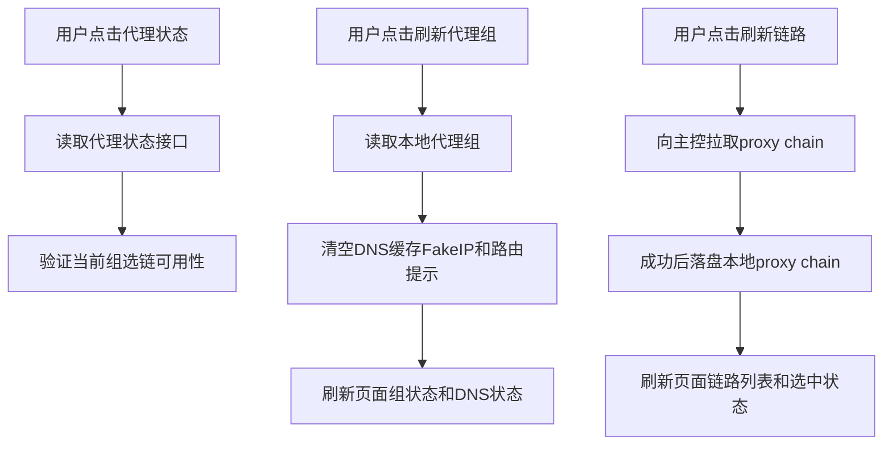

# 协作文档

- 适用规则: AI协作规则
- 后续工作传递声明: 本文档必须传递给后续阶段与后续角色。
- 需求编号: REQ-PN-LOCAL-PANEL-PROXY-REFRESH-001
- 需求前缀: REQ-PN-LOCAL-PANEL-PROXY-REFRESH-001
- 当前角色: Architect
- 工作依据文档: [`doc/ai-coding-collaboration.md`](doc/ai-coding-collaboration.md:1)、[`probe_node/local_pages/panel.html`](probe_node/local_pages/panel.html:204)、[`probeLocalProxyStatusHandler()`](probe_node/local_console.go:2463)、[`probeLocalProxyChainsHandler()`](probe_node/local_console.go:2523)、[`probeLocalProxyGroupsHandler()`](probe_node/local_console.go:2539)、[`probeLocalProxyStateHandler()`](probe_node/local_console.go:2637)、[`persistProbeProxyChainCache()`](probe_node/probe_link_chains_sync.go:957)、[`resetProbeLocalDNSServiceForTest()`](probe_node/local_dns_service.go:1291)
- 状态: 进行中

## 第1章 Architect章节
- 章节责任角色: Architect
- 状态: 进行中

### 1.1 需求定义
- 状态: 已完成

#### 1.1.1 需求目标
- 将本地控制台代理页的刷新动作从现有“代理状态 + 代理组与链路混合刷新”拆分为三个明确入口。
- “刷新代理状态”仅验证当前代理运行可用性，读取当前组选链运行态、连通性、延迟、错误与更新时间，不执行代理组或链路列表加载。
- “刷新代理组”仅重新读取本地 [`proxy_group.json`](probe_node/local_console.go:41) 与本地 [`proxy_state.json`](probe_node/local_console.go:40) 相关选择状态，并清空本地 DNS 真实 IP 缓存、Fake IP 映射与路由提示，让后续 DNS 查询按最新代理组重新生成。
- “刷新链路”从远方主控拉取最新 [`proxy_chain.json`](probe_node/probe_link_chains_sync.go:33) 并本地落盘，随后刷新页面链路列表与选中状态。

#### 1.1.2 需求范围
- 前端范围: 修改 [`probe_node/local_pages/panel.html`](probe_node/local_pages/panel.html:204) 中代理区按钮、点击处理与数据加载函数拆分。
- 后端范围: 在 [`probe_node/local_console.go`](probe_node/local_console.go:1796) 增加代理组刷新与链路刷新接口，复用现有代理状态、代理组、链路、状态读取接口。
- 链路同步范围: 在 [`probe_node/probe_link_chains_sync.go`](probe_node/probe_link_chains_sync.go:128) 提供可被本地控制台同步调用的“仅刷新 proxy chain cache”能力。
- DNS/Fake IP 范围: 在 [`probe_node/local_dns_service.go`](probe_node/local_dns_service.go:1291) 增加运行时缓存清空 helper，保留 DNS 监听服务本身不重启。
- 测试范围: 更新 [`probe_node/local_pages_routes_test.go`](probe_node/local_pages_routes_test.go:94)、[`probe_node/local_console_methods_test.go`](probe_node/local_console_methods_test.go:35)、[`probe_node/local_console_test.go`](probe_node/local_console_test.go:1504) 相关断言与接口用例。

#### 1.1.3 非范围
- 不改变代理启用、关闭、直连、拒绝、选链保存语义。
- 不改变 [`probe link chain`](probe_node/probe_link_chains_sync.go:97) 的后台定时同步周期与运行态维护策略。
- 不从主控拉取或覆盖本地 [`proxy_group.json`](probe_node/local_console.go:41)。
- 不修改 DNS 上游解析策略与 Fake IP 分配规则，仅清空缓存并等待后续查询重建。
- 不引入新的远端主控管理页面能力。

#### 1.1.4 验收标准
- 点击“刷新代理状态”只调用代理状态读取链路，不调用 [`loadProxySelections()`](probe_node/local_pages/panel.html:794)，不读取代理组列表与链路列表。
- 点击“刷新代理组”重新读取本地代理组与本地状态，并清空 DNS 缓存、Fake IP 映射与 route hint，页面 DNS 与 Fake IP 展示刷新为空或最新状态。
- 点击“刷新链路”触发后端向远方主控拉取最新链路数据，仅筛选并落盘 [`proxy_chain.json`](probe_node/probe_link_chains_sync.go:33)，之后页面链路列表与选中状态更新。
- 未配置主控地址、主控认证失败、拉取失败时，“刷新链路”返回明确错误且不破坏已有本地链路缓存。
- 现有启动定时同步与页面初始化不回归。

#### 1.1.5 风险
- 现有 [`loadProxySelections()`](probe_node/local_pages/panel.html:794) 同时读取代理组、链路和状态，拆分不彻底会导致按钮语义继续混杂。
- [`probeLocalProxyStateHandler()`](probe_node/local_console.go:2637) 当前会在构造状态时解析组选 runtime 和延迟，刷新代理组若调用它可能仍触发部分运行态探测。
- 清空 DNS/Fake IP 缓存会影响正在依赖旧 Fake IP 映射的短期连接，需要明确这是用户手动刷新代理组时的预期行为。
- “刷新链路”需要复用主控认证与 websocket 获取链路逻辑，错误处理需避免覆盖已有 [`proxy_chain.json`](probe_node/probe_link_chains_sync.go:33)。

#### 1.1.6 遗留事项
- 无。

#### 1.1.7 结论
- 需求可实施，建议按“前端动作拆分 + 后端两个显式刷新接口 + DNS 缓存清空 helper + 链路手动同步 helper + 测试与文档同步”推进。

### 1.2 总体架构
- 状态: 已完成

#### 1.2.1 架构目标
- 让三个按钮的动作边界稳定、可测试、可解释。
- 将“本地读组”、“远端拉链路”、“运行态验证”分离，避免单个按钮执行过宽刷新。
- 保证链路远端刷新失败不影响本地已有链路缓存。
- 保证代理组刷新后的 DNS/Fake IP 运行态与本地组文件一致。

#### 1.2.2 总体设计
- 前端新增三个独立加载函数:
  - [`loadProxyStatus()`](probe_node/local_pages/panel.html:681): 只读 [`/local/api/proxy/status`](probe_node/local_console.go:1796)。
  - `loadProxyGroupsOnly`: 读取本地组、状态，并刷新 DNS 状态与 DNS 映射列表。
  - `refreshProxyChainsFromController`: 调用新增后端手动同步接口，再读取链路与状态。
- 后端新增两个显式接口:
  - `POST /local/api/proxy/groups/refresh`: 校验会话，读取本地代理组文件，清空 DNS 缓存、Fake IP 映射与 route hint，返回最新本地组、状态和 DNS 快照。
  - `POST /local/api/proxy/chains/refresh`: 校验会话，使用当前主控上下文拉取链路，成功后落盘 [`proxy_chain.json`](probe_node/probe_link_chains_sync.go:33)，返回最新链路项与状态。
- 保留原有只读接口:
  - [`probeLocalProxyStatusHandler()`](probe_node/local_console.go:2463) 继续用于运行态验证。
  - [`probeLocalProxyGroupsHandler()`](probe_node/local_console.go:2539) 继续用于读取本地组。
  - [`probeLocalProxyChainsHandler()`](probe_node/local_console.go:2523) 继续用于读取本地链路缓存。

#### 1.2.3 关键模块
| 模块编号 | 模块名称 | 职责 | 输入 | 输出 |
|---|---|---|---|---|
| M1 | Panel Refresh UI | 提供三个独立按钮与加载函数 | 用户点击 | 页面状态更新 |
| M2 | Proxy Status Validator | 验证当前代理运行态与组选链可用性 | 当前 [`proxy_state.json`](probe_node/local_console.go:40) 与 runtime | keepalive latency error |
| M3 | Local Proxy Group Refresher | 读取本地代理组并触发 DNS/Fake IP 清空 | 本地 [`proxy_group.json`](probe_node/local_console.go:41) | group payload DNS snapshot |
| M4 | Remote Proxy Chain Refresher | 从主控拉取 [`proxy_chain.json`](probe_node/probe_link_chains_sync.go:33) 并落盘 | 主控地址 认证凭据 | chain items |
| M5 | DNS Runtime Cache Reset | 清空 DNS cache Fake IP route hint | 手动刷新代理组事件 | 空缓存状态 |

#### 1.2.4 关键流程
- 代理状态刷新流程:
  1. 前端显示“验证代理状态”。
  2. 调用 [`loadProxyStatus()`](probe_node/local_pages/panel.html:681)。
  3. 后端 [`probeLocalProxyStatusHandler()`](probe_node/local_console.go:2463) 返回当前 runtime 可用性。
  4. 不调用组、链路、状态组合加载。
- 代理组刷新流程:
  1. 前端调用 `POST /local/api/proxy/groups/refresh`。
  2. 后端重新读取 [`loadProbeLocalProxyGroupFile()`](probe_node/local_console.go:1239)。
  3. 后端调用新增 DNS 清空 helper。
  4. 前端刷新本地组行、状态、DNS 状态与 DNS 列表。
- 链路刷新流程:
  1. 前端调用 `POST /local/api/proxy/chains/refresh`。
  2. 后端读取当前 [`currentProbeLocalProxyRuntimeContext()`](probe_node/local_console.go:1657) 的主控配置。
  3. 后端调用手动链路拉取 helper。
  4. 成功后调用 [`persistProbeProxyChainCache()`](probe_node/probe_link_chains_sync.go:957)。
  5. 前端刷新链路列表和选中状态。

#### 1.2.5 结论
- 当前代码已有代理状态、组、链路、DNS/Fake IP 基础能力，实施重点是拆分前端调用与补充两个后端显式刷新接口。

### 1.3 单元设计
- 状态: 已完成

#### 1.3.1 U1 前端刷新按钮拆分单元
- 目标: 将现有“刷新代理状态”和“刷新组与链路”调整为三个按钮。
- 变更点:
  - 修改 [`proxyRefreshBtn`](probe_node/local_pages/panel.html:1063) 点击逻辑，只调用 [`loadProxyStatus()`](probe_node/local_pages/panel.html:681)。
  - 将旧 [`proxySelectionRefreshBtn`](probe_node/local_pages/panel.html:1074) 拆为“刷新代理组”和“刷新链路”。
  - 新增 `loadProxyGroupsOnly` 与 `loadProxyChainsOnly` 前端函数，避免继续复用大而全的 [`loadProxySelections()`](probe_node/local_pages/panel.html:794)。
- 验收: 页面按钮文案、行为、错误提示分别对应三个动作。

#### 1.3.2 U2 代理状态验证单元
- 目标: 保证“刷新代理状态”只验证当前运行态。
- 变更点:
  - 前端点击只调用 [`loadProxyStatus()`](probe_node/local_pages/panel.html:681)。
  - 不新增后端接口，继续复用 [`probeLocalProxyStatusHandler()`](probe_node/local_console.go:2463)。
- 验收: 前端测试或页面断言中不再出现“代理状态刷新后同步加载组与链路”的行为。

#### 1.3.3 U3 本地代理组刷新单元
- 目标: 重新读取本地代理组并清空 DNS/Fake IP 运行态缓存。
- 变更点:
  - 新增 `probeLocalProxyGroupsRefreshHandler`，路径为 `POST /local/api/proxy/groups/refresh`。
  - Handler 读取 [`loadProbeLocalProxyGroupFile()`](probe_node/local_console.go:1239) 与 [`loadProbeLocalProxyStateFile()`](probe_node/local_console.go:2479)。
  - Handler 调用新增 `resetProbeLocalDNSRuntimeCachesForProxyGroupRefresh`。
  - 返回本地 groups、state、dns status、fake ip list、real ip list 或让前端继续调用现有 DNS 接口刷新。
- 验收: 刷新后 DNS cache、Fake IP entries、route hint count 均为清空后的状态。

#### 1.3.4 U4 DNS/Fake IP 缓存清空单元
- 目标: 提供生产可用的 DNS 运行时缓存清空 helper，不能复用测试专用 [`resetProbeLocalDNSServiceForTest()`](probe_node/local_dns_service.go:1291)。
- 变更点:
  - 在 [`probe_node/local_dns_service.go`](probe_node/local_dns_service.go:1291) 新增 helper，仅清空 `cache`、`fakeCIDR`、`fakeNetwork`、`fakeCursor`、`fakeDomainToIP`、`fakeIPToEntry`、`routeHints`。
  - 不关闭监听连接，不重置 hooks，不改变服务启停状态。
  - 更新时间戳，便于状态页可观测。
- 验收: DNS 服务仍在运行，缓存已清空，下一次 DNS 查询按最新 [`proxy_group.json`](probe_node/local_console.go:41) 重建。

#### 1.3.5 U5 远端链路刷新单元
- 目标: 支持手动从主控刷新 [`proxy_chain.json`](probe_node/probe_link_chains_sync.go:33)。
- 变更点:
  - 新增 `probeLocalProxyChainsRefreshHandler`，路径为 `POST /local/api/proxy/chains/refresh`。
  - 在 [`probe_node/probe_link_chains_sync.go`](probe_node/probe_link_chains_sync.go:128) 提取 `refreshProbeProxyChainCacheFromController` helper。
  - Helper 使用 [`fetchProbeLinkChains()`](probe_node/probe_link_chains_sync.go:186) 拉取数据，仅在成功后调用 [`persistProbeProxyChainCache()`](probe_node/probe_link_chains_sync.go:957)。
  - 失败返回错误，不覆盖现有缓存。
- 验收: 成功时返回最新 proxy chain 列表；失败时旧文件不变。

#### 1.3.6 U6 测试与文档单元
- 目标: 覆盖方法守卫、页面文案、接口行为与缓存清空。
- 变更点:
  - 更新 [`probe_node/local_console_methods_test.go`](probe_node/local_console_methods_test.go:35) 新增两个 POST 接口的 method guard。
  - 更新 [`probe_node/local_pages_routes_test.go`](probe_node/local_pages_routes_test.go:94) 按三个按钮文案断言。
  - 更新 [`probe_node/local_console_test.go`](probe_node/local_console_test.go:1504) 增加本地代理组刷新与链路刷新用例。
- 验收: [`go test ./...`](probe_node/go.mod:1) 通过。

### 1.4 Code任务执行包
- 状态: 已完成

| 任务编号 | 需求编号 | 单元编号 | 目标文件 | 操作类型 | 任务说明 |
|---|---|---|---|---|---|
| T-001 | REQ-PN-LOCAL-PANEL-PROXY-REFRESH-001 | U1 U2 | [`probe_node/local_pages/panel.html`](probe_node/local_pages/panel.html:204) | 修改 | 拆分三个刷新按钮与前端调用，代理状态只调用 [`loadProxyStatus()`](probe_node/local_pages/panel.html:681) |
| T-002 | REQ-PN-LOCAL-PANEL-PROXY-REFRESH-001 | U3 | [`probe_node/local_console.go`](probe_node/local_console.go:1796) | 修改 | 新增 `POST /local/api/proxy/groups/refresh` 并返回本地代理组刷新结果 |
| T-003 | REQ-PN-LOCAL-PANEL-PROXY-REFRESH-001 | U4 | [`probe_node/local_dns_service.go`](probe_node/local_dns_service.go:1291) | 修改 | 新增生产用 DNS cache、Fake IP、route hint 清空 helper |
| T-004 | REQ-PN-LOCAL-PANEL-PROXY-REFRESH-001 | U5 | [`probe_node/local_console.go`](probe_node/local_console.go:1796)、[`probe_node/probe_link_chains_sync.go`](probe_node/probe_link_chains_sync.go:128) | 修改 | 新增 `POST /local/api/proxy/chains/refresh` 与手动远端拉取落盘 helper |
| T-005 | REQ-PN-LOCAL-PANEL-PROXY-REFRESH-001 | U6 | [`probe_node/local_console_methods_test.go`](probe_node/local_console_methods_test.go:35)、[`probe_node/local_pages_routes_test.go`](probe_node/local_pages_routes_test.go:94)、[`probe_node/local_console_test.go`](probe_node/local_console_test.go:1504) | 修改 | 补充方法守卫、页面按钮文案、组刷新清缓存、链路刷新落盘测试 |
| T-006 | REQ-PN-LOCAL-PANEL-PROXY-REFRESH-001 | U6 | [`doc/REQ-PN-LOCAL-PANEL-PROXY-REFRESH-001-collaboration.md`](doc/REQ-PN-LOCAL-PANEL-PROXY-REFRESH-001-collaboration.md) | 修改 | Code 阶段回填执行证据、测试结果与接口矩阵 |

### 1.5 Architect需求跟踪矩阵
- 状态: 已完成

| 需求编号 | 需求说明 | 架构单元 | Code任务 | 状态 | 验收口径 |
|---|---|---|---|---|---|
| REQ-PN-LOCAL-PANEL-PROXY-REFRESH-001-R1 | 代理状态刷新仅验证当前代理可用性 | U1 U2 | T-001 | 进行中 | 不执行组或链路 load |
| REQ-PN-LOCAL-PANEL-PROXY-REFRESH-001-R2 | 代理组刷新读取本地组并清空 DNS/Fake IP/route hint | U3 U4 | T-002 T-003 | 进行中 | 缓存清空且 DNS 服务不重启 |
| REQ-PN-LOCAL-PANEL-PROXY-REFRESH-001-R3 | 链路刷新从主控拉取 [`proxy_chain.json`](probe_node/probe_link_chains_sync.go:33) 并本地落盘 | U5 | T-004 | 进行中 | 成功落盘，失败不覆盖旧缓存 |
| REQ-PN-LOCAL-PANEL-PROXY-REFRESH-001-R4 | 页面和测试反映三个独立刷新动作 | U1 U6 | T-001 T-005 | 进行中 | 页面文案与接口测试通过 |

### 1.6 Architect关键接口跟踪矩阵
- 状态: 已完成

| 接口编号 | 需求编号 | 接口 | 所属文件 | 输入 | 输出 | 状态 | 说明 |
|---|---|---|---|---|---|---|---|
| IF-001 | REQ-PN-LOCAL-PANEL-PROXY-REFRESH-001-R1 | `GET /local/api/proxy/status` | [`probe_node/local_console.go`](probe_node/local_console.go:2463) | session | proxy status latency error | 既有 | 保持只读运行态验证 |
| IF-002 | REQ-PN-LOCAL-PANEL-PROXY-REFRESH-001-R2 | `POST /local/api/proxy/groups/refresh` | [`probe_node/local_console.go`](probe_node/local_console.go:1796) | session | groups state dns snapshot | 待新增 | 本地代理组刷新与 DNS/Fake IP 清空 |
| IF-003 | REQ-PN-LOCAL-PANEL-PROXY-REFRESH-001-R3 | `POST /local/api/proxy/chains/refresh` | [`probe_node/local_console.go`](probe_node/local_console.go:1796) | session | chain items state | 待新增 | 远端拉取并落盘 [`proxy_chain.json`](probe_node/probe_link_chains_sync.go:33) |
| IF-004 | REQ-PN-LOCAL-PANEL-PROXY-REFRESH-001-R2 | `resetProbeLocalDNSRuntimeCachesForProxyGroupRefresh` | [`probe_node/local_dns_service.go`](probe_node/local_dns_service.go:1291) | manual refresh event | cleared runtime caches | 待新增 | 不关闭 DNS 监听 |
| IF-005 | REQ-PN-LOCAL-PANEL-PROXY-REFRESH-001-R3 | `refreshProbeProxyChainCacheFromController` | [`probe_node/probe_link_chains_sync.go`](probe_node/probe_link_chains_sync.go:128) | identity controllerBaseURL | persisted proxy chain cache | 待新增 | 成功后落盘，失败不覆盖 |

### 1.7 门禁裁判
- 状态: 已完成

#### 1.7.1 阶段性裁判输入
- Architect 已完成需求边界澄清:
  - “刷新链路”仅从远方主控拉取 [`proxy_chain.json`](probe_node/probe_link_chains_sync.go:33) 并本地落盘。
  - “刷新代理组”重新读取本地代理组文件，并清空 DNS 缓存、Fake IP 映射与 route hint。
- Architect 已给出 Code 任务执行包。

#### 1.7.2 门禁结论
- 结论: 通过。
- 放行状态: 放行进入 Code 实施。
- 条件: Code 必须只按第1.4节任务执行包实施，不得额外改变代理启停、选链、DNS 上游策略或后台定时同步语义。

## 第2章 Code章节
- 章节责任角色: Code
- 状态: 已完成

### 2.1 Code需求跟踪矩阵
- 状态: 已完成

| 需求编号 | Code任务 | 影响文件 | 实现状态 | 测试状态 | 证据 | 备注 |
|---|---|---|---|---|---|---|
| REQ-PN-LOCAL-PANEL-PROXY-REFRESH-001-R1 | T-001 | [`probe_node/local_pages/panel.html`](probe_node/local_pages/panel.html:204) | 已完成 | 已通过 | [`loadProxyStatus()`](probe_node/local_pages/panel.html:681) 与按钮拆分 | 代理状态按钮只验证状态 |
| REQ-PN-LOCAL-PANEL-PROXY-REFRESH-001-R2 | T-002 T-003 | [`probe_node/local_console.go`](probe_node/local_console.go:1796)、[`probe_node/local_dns_service.go`](probe_node/local_dns_service.go:1291) | 已完成 | 已通过 | `POST /local/api/proxy/groups/refresh`、`resetProbeLocalDNSRuntimeCachesForProxyGroupRefresh` | 代理组刷新清空 DNS/Fake IP/route hint |
| REQ-PN-LOCAL-PANEL-PROXY-REFRESH-001-R3 | T-004 | [`probe_node/local_console.go`](probe_node/local_console.go:1796)、[`probe_node/probe_link_chains_sync.go`](probe_node/probe_link_chains_sync.go:128) | 已完成 | 已通过 | `POST /local/api/proxy/chains/refresh`、`refreshProbeProxyChainCacheFromController` | 链路刷新成功后落盘 proxy chain cache |
| REQ-PN-LOCAL-PANEL-PROXY-REFRESH-001-R4 | T-005 T-006 | [`probe_node/local_console_methods_test.go`](probe_node/local_console_methods_test.go:35)、[`probe_node/local_pages_routes_test.go`](probe_node/local_pages_routes_test.go:94)、[`probe_node/local_console_test.go`](probe_node/local_console_test.go:1504)、[`doc/REQ-PN-LOCAL-PANEL-PROXY-REFRESH-001-collaboration.md`](doc/REQ-PN-LOCAL-PANEL-PROXY-REFRESH-001-collaboration.md) | 已完成 | 已通过 | [`go test ./...`](probe_node/go.mod:1) | 测试和文档已回填 |

### 2.2 Code关键接口跟踪矩阵
- 状态: 已完成

| 接口编号 | 需求编号 | 实现位置 | 接口说明 | 实现状态 | 测试证据 | 备注 |
|---|---|---|---|---|---|---|
| IF-001 | REQ-PN-LOCAL-PANEL-PROXY-REFRESH-001-R1 | [`probe_node/local_console.go`](probe_node/local_console.go:2466) | `GET /local/api/proxy/status` | 已完成 | [`go test ./...`](probe_node/go.mod:1) | 既有接口保持，用于状态验证 |
| IF-002 | REQ-PN-LOCAL-PANEL-PROXY-REFRESH-001-R2 | [`probe_node/local_console.go`](probe_node/local_console.go:2591) | `POST /local/api/proxy/groups/refresh` | 已完成 | `TestProbeLocalProxyGroupsRefreshClearsDNSRuntimeCaches` | 读取本地组并清空 DNS/Fake IP/route hint |
| IF-003 | REQ-PN-LOCAL-PANEL-PROXY-REFRESH-001-R3 | [`probe_node/local_console.go`](probe_node/local_console.go:2542) | `POST /local/api/proxy/chains/refresh` | 已完成 | `TestProbeLocalProxyChainsRefreshEndpointUsesHook` | 从主控拉取并落盘 proxy chain cache |
| IF-004 | REQ-PN-LOCAL-PANEL-PROXY-REFRESH-001-R2 | [`probe_node/local_dns_service.go`](probe_node/local_dns_service.go:1234) | DNS 缓存清空 helper | 已完成 | `TestProbeLocalProxyGroupsRefreshClearsDNSRuntimeCaches` | 不关闭 DNS 监听 |
| IF-005 | REQ-PN-LOCAL-PANEL-PROXY-REFRESH-001-R3 | [`probe_node/probe_link_chains_sync.go`](probe_node/probe_link_chains_sync.go:186) | 手动刷新 proxy chain cache helper | 已完成 | `TestProbeLocalProxyChainsRefreshEndpointUsesHook` | 成功后落盘，失败不覆盖 |

### 2.3 Code测试项跟踪矩阵
- 状态: 已完成

| 测试项编号 | 需求编号 | Code任务 | 测试说明 | 状态 | 证据 | 备注 |
|---|---|---|---|---|---|---|
| TC-001 | REQ-PN-LOCAL-PANEL-PROXY-REFRESH-001-R1 | T-001 | 页面代理状态按钮不再调用组链路加载 | 已通过 | [`TestProbeLocalPanelServedAfterLogin`](probe_node/local_pages_routes_test.go:37) | 页面断言新增分离按钮和接口 |
| TC-002 | REQ-PN-LOCAL-PANEL-PROXY-REFRESH-001-R2 | T-002 T-003 | 代理组刷新后 DNS cache、Fake IP、route hint 清空 | 已通过 | `TestProbeLocalProxyGroupsRefreshClearsDNSRuntimeCaches` | 覆盖缓存清空 |
| TC-003 | REQ-PN-LOCAL-PANEL-PROXY-REFRESH-001-R3 | T-004 | 链路刷新成功落盘或返回最新 items | 已通过 | `TestProbeLocalProxyChainsRefreshEndpointUsesHook` | 通过 hook 覆盖本地控制台接口 |
| TC-004 | REQ-PN-LOCAL-PANEL-PROXY-REFRESH-001-R4 | T-005 | 新增接口方法守卫 | 已通过 | [`TestProbeLocalAPIMethodGuards`](probe_node/local_console_methods_test.go:8) | 覆盖两个新增 POST 接口 |
| TC-005 | REQ-PN-LOCAL-PANEL-PROXY-REFRESH-001-R4 | T-005 | [`go test ./...`](probe_node/go.mod:1) 回归通过 | 已通过 | `ok github.com/cloudhelper/probe_node 10.061s` | 在 [`probe_node`](probe_node/go.mod:1) 执行 |

### 2.4 Code缺陷跟踪矩阵
- 状态: 已完成

| 缺陷编号 | 需求编号 | 关联测试 | 缺陷说明 | 严重级别 | 状态 | 修复证据 | 备注 |
|---|---|---|---|---|---|---|---|
| 无 | 无 | 无 | 无 | 无 | 已完成 | 无 | 本轮未发现新增缺陷 |

### 2.5 Code执行证据
- 状态: 已完成

#### 2.5.1 修改接口
- 保持既有 `GET /local/api/proxy/status` 作为代理状态验证接口。
- 新增 `POST /local/api/proxy/groups/refresh`，实现于 [`probeLocalProxyGroupsRefreshHandler()`](probe_node/local_console.go:2591)。
- 新增 `POST /local/api/proxy/chains/refresh`，实现于 [`probeLocalProxyChainsRefreshHandler()`](probe_node/local_console.go:2542)。
- 新增 `resetProbeLocalDNSRuntimeCachesForProxyGroupRefresh`，实现于 [`probe_node/local_dns_service.go`](probe_node/local_dns_service.go:1234)。
- 新增 `refreshProbeProxyChainCacheFromController`，实现于 [`probe_node/probe_link_chains_sync.go`](probe_node/probe_link_chains_sync.go:186)。

#### 2.5.2 配置文件
- 无配置文件变更。

#### 2.5.3 执行报告
- 已完成前端刷新按钮拆分。
- 已完成代理组刷新接口与 DNS/Fake IP/route hint 清空逻辑。
- 已完成链路刷新接口与主控拉取落盘 helper。
- 已完成新增接口方法守卫、页面断言和行为单测。

#### 2.5.4 影响文件
- [`probe_node/local_pages/panel.html`](probe_node/local_pages/panel.html:204)
- [`probe_node/local_console.go`](probe_node/local_console.go:1796)
- [`probe_node/local_dns_service.go`](probe_node/local_dns_service.go:1234)
- [`probe_node/probe_link_chains_sync.go`](probe_node/probe_link_chains_sync.go:186)
- [`probe_node/local_console_methods_test.go`](probe_node/local_console_methods_test.go:35)
- [`probe_node/local_pages_routes_test.go`](probe_node/local_pages_routes_test.go:94)
- [`probe_node/local_console_test.go`](probe_node/local_console_test.go:1583)
- [`doc/REQ-PN-LOCAL-PANEL-PROXY-REFRESH-001-collaboration.md`](doc/REQ-PN-LOCAL-PANEL-PROXY-REFRESH-001-collaboration.md:220)

#### 2.5.5 自测结果
- [`go test ./...`](probe_node/go.mod:1) 通过。
- 输出: `ok github.com/cloudhelper/probe_node 10.061s`。
