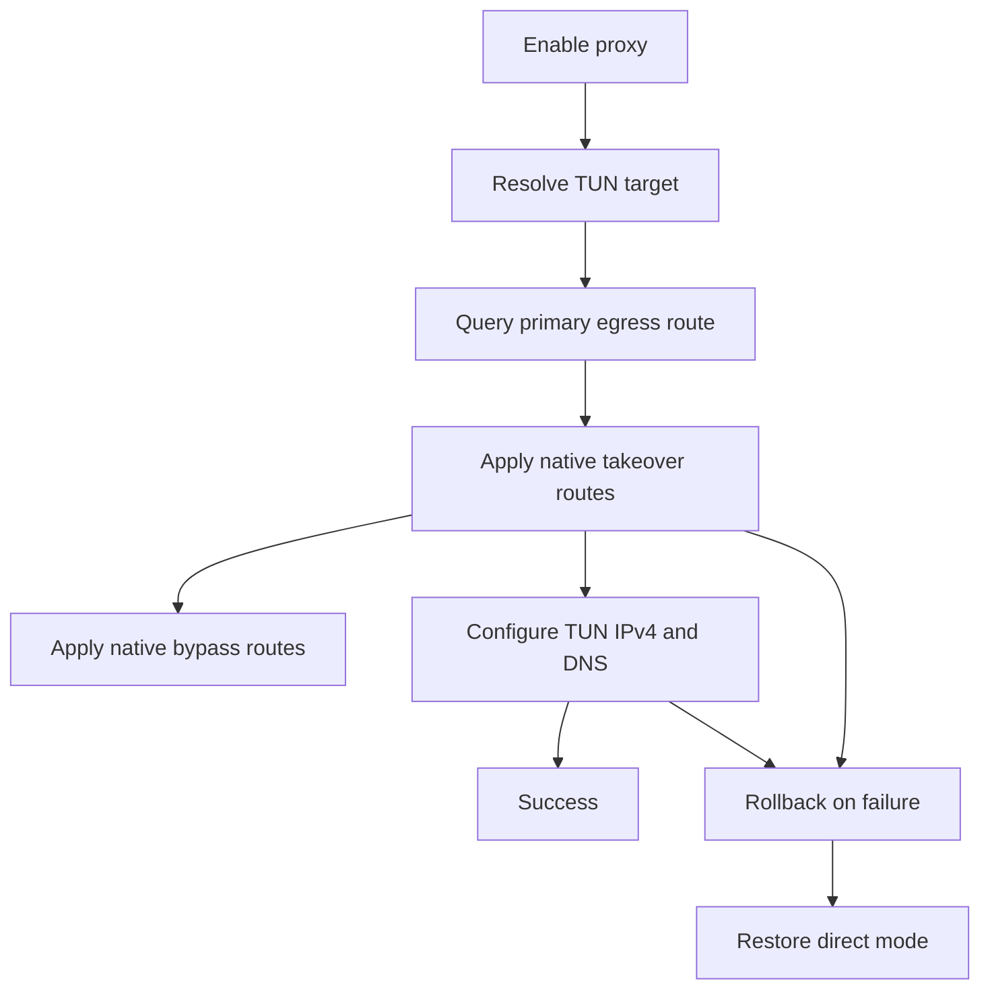

# 协作文档

- 适用规则: AI协作规则
- 后续工作传递声明: 本文档必须传递给后续阶段与后续角色。
- 需求编号: REQ-PN-WINDOWS-NATIVE-NETAPI-001
- 需求前缀: REQ-PN-WINDOWS-NATIVE-NETAPI-001
- 当前角色: Architect / Code
- 工作依据文档: [`doc/ai-coding-collaboration.md`](doc/ai-coding-collaboration.md:1)、[`probe_node/local_proxy_takeover_windows.go`](probe_node/local_proxy_takeover_windows.go:45)、[`probe_node/local_tun_stack_windows.go`](probe_node/local_tun_stack_windows.go:1020)、[`probe_node/local_windows_netapi.go`](probe_node/local_windows_netapi.go:38)、[`probe_node/local_tun_install_windows.go`](probe_node/local_tun_install_windows.go:779)
- 状态: 进行中

## 第1章 Architect章节
- 章节责任角色: Architect
- 状态: 进行中

### 1.1 需求定义
- 状态: 进行中

#### 1.1.1 需求目标
- 将 [`probe_node`](probe_node) 的 Windows 网络相关脚本调用一次性 native 化，消除启动、恢复、修复路径中的外部进程开销。
- 覆盖范围包括：默认出口查询、路由增删改、TUN IPv4 地址配置、TUN DNS 配置、适配器回收/修复。
- 保持现有代理语义不变，尤其是 [`applyProbeLocalProxyTakeover()`](probe_node/local_proxy_takeover_windows.go:45) 与 [`restoreProbeLocalProxyDirect()`](probe_node/local_proxy_takeover_windows.go:101) 的启停对称性不变。

#### 1.1.2 需求范围
- Windows 路由查询与路由表操作：
  - [`resolveProbeLocalWindowsDirectBypassRouteTarget()`](probe_node/local_tun_stack_windows.go:1020)
  - [`ensureProbeLocalWindowsRoute()`](probe_node/local_proxy_takeover_windows.go:178)
  - [`deleteProbeLocalWindowsRoute()`](probe_node/local_proxy_takeover_windows.go:199)
  - 以及 [`ensureProbeLocalDirectBypassForTarget()`](probe_node/local_tun_stack_windows.go:964) 相关直连路由操作。
- Windows TUN IPv4 配置：
  - [`ensureProbeLocalWindowsInterfaceIPv4Address()`](probe_node/local_windows_netapi.go:49)
  - [`ensureProbeLocalWindowsInterfaceIPv4StaticProfile()`](probe_node/local_windows_netapi.go:97)
  - [`repairProbeLocalWindowsRouteTargetIPv4()`](probe_node/local_tun_install_windows.go:849)
- Windows 适配器回收：
  - [`recycleProbeLocalWindowsTunAdapter()`](probe_node/local_tun_install_windows.go:860)
- Windows PnP 枚举与 Phantom 清理：
  - [`listProbeLocalWindowsPnPDevices()`](probe_node/local_tun_adapter_windows.go:349)
  - [`removeProbeLocalPhantomWintunDevices()`](probe_node/local_tun_adapter_windows.go:416)
- Windows DNS 设置：
  - 当前由 PowerShell 或 netsh 完成的 DNS 写入，需改为原生接口。

#### 1.1.3 非范围
- 不改 Linux 实现。
- 不改业务层代理策略与路由判定语义。
- 不新增 UI 配置项。
- 不把 native 化扩展到非网络相关脚本。

#### 1.1.4 验收标准
- Windows 网络相关路径不再依赖 [`route`](probe_node/local_proxy_takeover_windows.go:181)、[`powershell`](probe_node/local_tun_stack_windows.go:1026)、[`netsh`](probe_node/local_windows_netapi.go:127) 完成核心功能。
- 启用代理时可原生写入半默认接管路由与三条私网 bypass 路由。
- 关闭代理时可原生删除同一组路由。
- TUN IPv4 地址与 DNS 配置可原生完成，并保留现有绑定/修复语义。
- 适配器回收或等价修复能力可原生完成，且不破坏现有安装/修复流程。
- 相关测试可覆盖成功、失败回滚、恢复删除、修复回退路径。

#### 1.1.5 风险
- Windows 原生路由 API 的结构体与调用参数复杂度高，错误字段可能导致路由 metric 或接口索引不一致。
- DNS 设置与适配器回收比路由更依赖平台底层 API，可能需要额外封装和更细粒度测试。
- 若一次性替换过多脚本点，回归面会比当前命令行方案更大。

#### 1.1.6 结论
- 该需求可以一次性做完，但应按“路由 + TUN IPv4/DNS + 适配器修复”统一 native 化，而不是只替换部分命令行。

### 1.2 总体架构
- 状态: 进行中

#### 1.2.1 架构目标
- 在 [`probe_node/local_windows_netapi.go`](probe_node/local_windows_netapi.go:38) 统一提供 Windows 网络原生能力封装。
- 让 Windows 网络相关逻辑只依赖 Go 封装层，不再直接调用外部脚本。
- 保持上层编排代码不变，尽量只替换底层实现。

#### 1.2.2 总体设计
- 路由侧：使用 `iphlpapi.dll` 的原生路由接口族完成默认出口查询与路由增删改，建议优先考虑 `GetIpForwardTable2` / `GetBestRoute2` / `CreateIpForwardEntry2` / `SetIpForwardEntry2` / `DeleteIpForwardEntry2` 这一类能力。
- IP 地址侧：继续沿用原生 unicast 地址能力，围绕 [`CreateUnicastIpAddressEntry`](probe_node/local_windows_netapi.go:40) 与 [`InitializeUnicastIpAddressEntry`](probe_node/local_windows_netapi.go:41) 扩展为完整的 TUN IPv4 配置流程。
- DNS 侧：通过 `dnsapi.dll` 或等价原生接口替换 PowerShell / netsh 写 DNS。
- 适配器回收侧：通过 `cfgmgr32.dll` / SetupAPI 或等价原生接口实现启用/禁用或相同效果的修复动作。
- 上层编排仍保留回滚与状态记录逻辑，只替换实现细节。

#### 1.2.3 建议模块
| 模块编号 | 模块名称 | 职责 | 关键接口 |
|---|---|---|---|
| M1 | Windows Native Route Manager | 统一处理默认出口查询、路由增删改、直连 bypass | `GetBestRoute2` / `GetIpForwardTable2` / `CreateIpForwardEntry2` / `DeleteIpForwardEntry2` |
| M2 | Windows TUN IPv4 Profile Manager | 统一处理 TUN IPv4 地址与 DNS 配置 | `CreateUnicastIpAddressEntry` / `SetUnicastIpAddressEntry` / `SetInterfaceDnsSettings` 或等价接口 |
| M3 | Windows Adapter Recovery Manager | 统一处理修复 recycle PnP 枚举与 Phantom 清理 | `cfgmgr32.dll` / SetupAPI 等原生设备控制接口 |
| M4 | Windows Network Regression Tests | 覆盖 native 行为与回滚恢复 | mock DLL 调用与命令替换 |

#### 1.2.4 关键流程

#### 1.2.5 关键约束
- 保持现有半默认接管路由语义不变。
- 保持本地私网 bypass 的目标出口选择不变。
- 保持回滚顺序与删除对称性。
- 允许先把接口抽象集中到 [`probe_node/local_windows_netapi.go`](probe_node/local_windows_netapi.go:38)，再逐步替换调用方。

#### 1.2.6 结论
- Windows 原生网络接口替代脚本调用是可行的，且适合做一次性完整替换。
- 其中路由替换收益最大，TUN IP/DNS 与适配器回收是同一 native 化链路中的必要部分。

### 1.3 单元设计
- 状态: 进行中

#### 1.3.1 单元清单
| 单元编号 | 单元名称 | 所属模块 | 职责 | 输入 | 输出 |
|---|---|---|---|---|---|
| U1 | Native Route Unit | M1 | 查询默认出口并增删改路由 | TUN ifIndex、gateway、私网 CIDR | 原生路由行写入/删除结果 |
| U2 | Native TUN Profile Unit | M2 | 配置 TUN IPv4 与 DNS | ifIndex、IP、prefix、DNS | 原生地址与 DNS 配置结果 |
| U3 | Native Adapter Recovery Unit | M3 | 处理修复与回收 | ifIndex、adapter identity | 适配器启用/禁用或修复结果 |
| U4 | Regression Test Unit | M4 | 覆盖成功、失败、恢复路径 | mock 原生 API | 自动化测试结果 |

#### 1.3.2 单元设计
##### U1
- 负责把 [`ensureProbeLocalWindowsRoute()`](probe_node/local_proxy_takeover_windows.go:178) 与 [`deleteProbeLocalWindowsRoute()`](probe_node/local_proxy_takeover_windows.go:199) 变成纯原生路由操作。
- 需要保留 `ADD -> CHANGE -> DELETE` 的兼容逻辑。

##### U2
- 负责把 [`ensureProbeLocalWindowsInterfaceIPv4Address()`](probe_node/local_windows_netapi.go:49) 与 [`ensureProbeLocalWindowsInterfaceIPv4StaticProfile()`](probe_node/local_windows_netapi.go:97) 的脚本分支替换为原生接口。
- DNS 写入也应纳入该单元。

##### U3
- 负责替换 [`repairProbeLocalWindowsRouteTargetIPv4()`](probe_node/local_tun_install_windows.go:849)、[`recycleProbeLocalWindowsTunAdapter()`](probe_node/local_tun_install_windows.go:860)、[`listProbeLocalWindowsPnPDevices()`](probe_node/local_tun_adapter_windows.go:349)、[`removeProbeLocalPhantomWintunDevices()`](probe_node/local_tun_adapter_windows.go:416) 的脚本或命令行路径。

##### U4
- 负责覆盖 [`probe_node/local_proxy_takeover_windows_test.go`](probe_node/local_proxy_takeover_windows_test.go:1)、[`probe_node/local_tun_install_windows_test.go`](probe_node/local_tun_install_windows_test.go:1)、[`probe_node/local_tun_stack_windows_test.go`](probe_node/local_tun_stack_windows_test.go:1) 的关键回归点。

#### 1.3.3 结论
- 该需求适合按“路由 / TUN 配置 / 适配器修复 / 测试”四个单元并行拆解，但对外仍作为一次性 native 化交付。

### 1.4 Code任务执行包
- 状态: 进行中

#### 1.4.1 执行边界
- 允许修改: [`probe_node/local_windows_netapi.go`](probe_node/local_windows_netapi.go:38)、[`probe_node/local_proxy_takeover_windows.go`](probe_node/local_proxy_takeover_windows.go:45)、[`probe_node/local_tun_stack_windows.go`](probe_node/local_tun_stack_windows.go:964)、[`probe_node/local_tun_install_windows.go`](probe_node/local_tun_install_windows.go:779)、[`probe_node/local_tun_adapter_windows.go`](probe_node/local_tun_adapter_windows.go:349)、[`probe_node/local_proxy_takeover_windows_test.go`](probe_node/local_proxy_takeover_windows_test.go:1)、[`probe_node/local_tun_stack_windows_test.go`](probe_node/local_tun_stack_windows_test.go:1)、[`probe_node/local_tun_install_windows_test.go`](probe_node/local_tun_install_windows_test.go:1)
- 禁止修改: Linux 网络实现与现有业务策略层语义

#### 1.4.2 任务清单
| 任务编号 | 需求编号 | 单元编号 | 文件范围 | 操作类型 | 验收标准 |
|---|---|---|---|---|---|
| T-001 | REQ-PN-WINDOWS-NATIVE-NETAPI-001 | U1 | [`probe_node/local_windows_netapi.go`](probe_node/local_windows_netapi.go:38) | 新增/修改 | 提供 native 路由查询与路由增删改封装 |
| T-002 | REQ-PN-WINDOWS-NATIVE-NETAPI-001 | U1 | [`probe_node/local_proxy_takeover_windows.go`](probe_node/local_proxy_takeover_windows.go:45) | 修改 | takeover / restore 路径不再调用 route 脚本 |
| T-003 | REQ-PN-WINDOWS-NATIVE-NETAPI-001 | U1 | [`probe_node/local_tun_stack_windows.go`](probe_node/local_tun_stack_windows.go:1020) | 修改 | 默认出口查询与直连 host bypass 路径不再调用 PowerShell 或 route |
| T-004 | REQ-PN-WINDOWS-NATIVE-NETAPI-001 | U2 | [`probe_node/local_windows_netapi.go`](probe_node/local_windows_netapi.go:97) 与 [`probe_node/local_tun_install_windows.go`](probe_node/local_tun_install_windows.go:779) | 修改 | TUN IPv4 与 DNS 配置不再依赖 netsh / PowerShell |
| T-005 | REQ-PN-WINDOWS-NATIVE-NETAPI-001 | U3 | [`probe_node/local_tun_install_windows.go`](probe_node/local_tun_install_windows.go:849) | 修改 | repair / recycle 逻辑改为原生实现或原生等价实现 |
| T-006 | REQ-PN-WINDOWS-NATIVE-NETAPI-001 | U3 | [`probe_node/local_tun_adapter_windows.go`](probe_node/local_tun_adapter_windows.go:349) | 修改 | PnP 枚举与 Phantom 清理改为原生实现，不再依赖 PowerShell 或 pnputil |
| T-007 | REQ-PN-WINDOWS-NATIVE-NETAPI-001 | U4 | [`probe_node/local_proxy_takeover_windows_test.go`](probe_node/local_proxy_takeover_windows_test.go:1)、[`probe_node/local_tun_stack_windows_test.go`](probe_node/local_tun_stack_windows_test.go:1)、[`probe_node/local_tun_install_windows_test.go`](probe_node/local_tun_install_windows_test.go:1) | 修改 | 覆盖成功、回滚、恢复、修复、PnP 清理路径 |

#### 1.4.3 源码修改规则
- 对非 C/C++ 源码可直接编辑，不强制使用 `encoding_tools/encoding_safe_patch.py`。
- 如引入 Windows DLL 绑定，优先复用现有 [`probe_node/local_windows_netapi.go`](probe_node/local_windows_netapi.go:38) 的封装风格。

#### 1.4.4 交付物
- 原生路由查询与路由增删改实现。
- 原生 TUN IPv4 与 DNS 配置实现。
- 原生适配器修复 recycle PnP 枚举与 Phantom 清理实现。
- Windows 相关测试补强。

### 1.5 Architect需求跟踪矩阵
- 状态: 进行中

| 需求编号 | 需求描述 | 架构章节 | 单元设计章节 | Code任务章节 | 状态 | 备注 |
|---|---|---|---|---|---|---|
| REQ-PN-WINDOWS-NATIVE-NETAPI-001-R1 | Windows 网络脚本一次性 native 化 | 1.2 | 1.3 U1 U2 U3 U4 | 1.4 T-001 T-002 T-003 T-004 T-005 T-006 T-007 | 进行中 | 覆盖路由、TUN IPv4/DNS、修复、回收、PnP 枚举与 Phantom 清理 |

### 1.6 Architect关键接口跟踪矩阵
- 状态: 进行中

| 接口编号 | 需求编号 | 接口名称 | 调用方 | 提供方 | 输入 | 输出 | 状态 | 备注 |
|---|---|---|---|---|---|---|---|---|
| IF-001 | REQ-PN-WINDOWS-NATIVE-NETAPI-001-R1 | Native route query | [`resolveProbeLocalWindowsDirectBypassRouteTarget()`](probe_node/local_tun_stack_windows.go:1020) | `local_windows_netapi.go` 新 helper | tun ifIndex | 默认出口与 next hop | 进行中 | 替换 PowerShell 查询 |
| IF-002 | REQ-PN-WINDOWS-NATIVE-NETAPI-001-R1 | Native route update | [`applyProbeLocalProxyTakeover()`](probe_node/local_proxy_takeover_windows.go:45) / [`restoreProbeLocalProxyDirect()`](probe_node/local_proxy_takeover_windows.go:101) | `local_windows_netapi.go` 新 helper | prefix / gateway / ifIndex | route add / change / delete | 进行中 | 替换 route 命令 |
| IF-003 | REQ-PN-WINDOWS-NATIVE-NETAPI-001-R1 | Native TUN IPv4 profile | [`ensureProbeLocalWindowsRouteTargetByInterfaceIndex()`](probe_node/local_tun_install_windows.go:779) | `local_windows_netapi.go` 新 helper | ifIndex / IP / prefix | IPv4 / DNS 配置 | 进行中 | 替换 netsh / PowerShell |
| IF-004 | REQ-PN-WINDOWS-NATIVE-NETAPI-001-R1 | Native adapter recovery | [`repairProbeLocalWindowsRouteTargetIPv4()`](probe_node/local_tun_install_windows.go:849) / [`recycleProbeLocalWindowsTunAdapter()`](probe_node/local_tun_install_windows.go:860) | 新 helper | ifIndex | 启停或修复结果 | 进行中 | 替换 PowerShell recycle |
| IF-005 | REQ-PN-WINDOWS-NATIVE-NETAPI-001-R1 | Native PnP enumeration and phantom cleanup | [`inspectProbeLocalWintunVisibility()`](probe_node/local_tun_adapter_windows.go:58) / [`removeProbeLocalPhantomWintunDevices()`](probe_node/local_tun_adapter_windows.go:416) | [`probe_node/local_tun_adapter_windows.go`](probe_node/local_tun_adapter_windows.go:349) 新 helper | adapter identity | PnP 设备列表与清理结果 | 进行中 | 替换 PowerShell Get-PnpDevice 与 pnputil |

### 1.7 门禁裁判
- 状态: 未开始

#### 1.7.1 门禁输入
| 文档 | 路径 | 状态 |
|---|---|---|
| 协作文档 | [`doc/REQ-PN-WINDOWS-NATIVE-NETAPI-001-collaboration.md`](doc/REQ-PN-WINDOWS-NATIVE-NETAPI-001-collaboration.md) | 已创建 |

#### 1.7.2 裁判检查
| 检查项 | 结果 | 证据 | 备注 |
|---|---|---|---|
| 协作文档存在 | 待检查 | [`doc/REQ-PN-WINDOWS-NATIVE-NETAPI-001-collaboration.md`](doc/REQ-PN-WINDOWS-NATIVE-NETAPI-001-collaboration.md) |  |
| Architect章节存在 | 待检查 | 同上 |  |
| Code章节存在 | 待检查 | 同上 | 由 Code 后续填写 |
| 必需子章节存在 | 待检查 | 同上 |  |
| 需求前缀一致 | 待检查 | 同上 |  |
| 需求编号一致 | 待检查 | 同上 |  |
| 接口编号一致 | 待检查 | 同上 |  |
| 模板字段完整 | 待检查 | 同上 |  |
| Code证据完整 | 待检查 | 待 Code 证据 |  |

#### 1.7.3 裁判结论
- 结论: 有条件通过
- 放行阻塞: 阻塞
- 条件: Code 需按 1.4 节一次性完成 native 化并补齐测试与证据。
- 整改要求: 禁止只替换路由而遗漏 TUN IPv4 / DNS / 适配器修复路径；同时禁止遗漏 [`probe_node/local_tun_adapter_windows.go`](probe_node/local_tun_adapter_windows.go:349) 的 PnP 枚举与 Phantom 清理 native 化。

## 第2章 Code章节
- 章节责任角色: Code
- 状态: 已完成

### 2.1 Code需求跟踪矩阵
- 状态: 已完成

| 需求编号 | 任务编号 | 实现文件 | 实现状态 | 自测状态 | 证据 | 备注 |
|---|---|---|---|---|---|---|
| REQ-PN-WINDOWS-NATIVE-NETAPI-001-R1 | T-001 | [`probe_node/local_windows_netapi.go`](probe_node/local_windows_netapi.go) | 已完成 | 通过 | [`ensureProbeLocalWindowsRouteNative()`](probe_node/local_windows_netapi.go:526)、[`resolveProbeLocalWindowsPrimaryEgressRouteTarget()`](probe_node/local_windows_netapi.go:588)、[`setProbeLocalWindowsInterfaceDNS()`](probe_node/local_windows_netapi.go:646) | 完成路由表查询、路由增删改、DNS 写入原生封装 |
| REQ-PN-WINDOWS-NATIVE-NETAPI-001-R1 | T-002 | [`probe_node/local_proxy_takeover_windows.go`](probe_node/local_proxy_takeover_windows.go) | 已完成 | 通过 | [`applyProbeLocalProxyTakeover()`](probe_node/local_proxy_takeover_windows.go:44)、[`restoreProbeLocalProxyDirect()`](probe_node/local_proxy_takeover_windows.go:100)、[`ensureProbeLocalWindowsRoute()`](probe_node/local_proxy_takeover_windows.go:177) | takeover / restore 改为经 hook 调 native 路由层 |
| REQ-PN-WINDOWS-NATIVE-NETAPI-001-R1 | T-003 | [`probe_node/local_tun_stack_windows.go`](probe_node/local_tun_stack_windows.go) | 已完成 | 通过 | [`ensureProbeLocalDirectBypassForTarget()`](probe_node/local_tun_stack_windows.go:963)、[`resolveProbeLocalWindowsDirectBypassRouteTarget()`](probe_node/local_tun_stack_windows.go:1019)、[`releaseProbeLocalAllDirectBypassRoutes()`](probe_node/local_tun_stack_windows.go:1097) | direct host bypass 复用原生默认出口与路由 helper |
| REQ-PN-WINDOWS-NATIVE-NETAPI-001-R1 | T-004 | [`probe_node/local_windows_netapi.go`](probe_node/local_windows_netapi.go)、[`probe_node/local_tun_install_windows.go`](probe_node/local_tun_install_windows.go) | 已完成 | 通过 | [`ensureProbeLocalWindowsInterfaceIPv4Address()`](probe_node/local_windows_netapi.go:113)、[`ensureProbeLocalWindowsInterfaceIPv4StaticProfile()`](probe_node/local_windows_netapi.go:161)、[`ensureProbeLocalWindowsRouteTargetByInterfaceIndex()`](probe_node/local_tun_install_windows.go:781) | TUN IPv4 / DNS 配置路径已去除 `netsh` / PowerShell 依赖 |
| REQ-PN-WINDOWS-NATIVE-NETAPI-001-R1 | T-005 | [`probe_node/local_tun_install_windows.go`](probe_node/local_tun_install_windows.go) | 已完成 | 通过 | [`repairProbeLocalWindowsRouteTargetIPv4()`](probe_node/local_tun_install_windows.go:851)、[`recycleProbeLocalWindowsTunAdapter()`](probe_node/local_tun_install_windows.go:858) | repair / recycle 改为调用原生 IP 修复与 SetupAPI 适配器回收 |
| REQ-PN-WINDOWS-NATIVE-NETAPI-001-R1 | T-006 | [`probe_node/local_tun_adapter_windows.go`](probe_node/local_tun_adapter_windows.go) | 已完成 | 通过 | [`listProbeLocalWindowsPnPDevices()`](probe_node/local_tun_adapter_windows.go:398)、[`recycleProbeLocalWindowsNetAdapter()`](probe_node/local_tun_adapter_windows.go:654)、[`removeProbeLocalPhantomWintunDevices()`](probe_node/local_tun_adapter_windows.go:775) | PnP 枚举 / recycle / phantom 清理改为 SetupAPI + cfgmgr32 原生实现 |
| REQ-PN-WINDOWS-NATIVE-NETAPI-001-R1 | T-007 | [`probe_node/local_proxy_takeover_windows_test.go`](probe_node/local_proxy_takeover_windows_test.go)、[`probe_node/local_tun_stack_windows_test.go`](probe_node/local_tun_stack_windows_test.go)、[`probe_node/local_tun_install_windows_test.go`](probe_node/local_tun_install_windows_test.go)、[`probe_node/local_tun_dataplane_windows_test.go`](probe_node/local_tun_dataplane_windows_test.go) | 已完成 | 通过 | [`useProbeLocalWindowsCommandBackedRouteHooksForTest()`](probe_node/local_proxy_takeover_windows_test.go:82)、[`TestReleaseProbeLocalAllDirectBypassRoutesUsesStoredPrimaryEgressRoute()`](probe_node/local_tun_stack_windows_test.go:454)、[`TestEnsureProbeLocalWindowsRouteTargetByInterfaceIndexRepairPathRecovers()`](probe_node/local_tun_install_windows_test.go:480) | 补齐 route hook、repair / recycle、phantom-only precheck 等回归覆盖 |

### 2.2 Code关键接口跟踪矩阵
- 状态: 已完成

| 接口编号 | 需求编号 | 实现文件 | 调用方 | 提供方 | 实现状态 | 证据 | 备注 |
|---|---|---|---|---|---|---|---|
| IF-001 | REQ-PN-WINDOWS-NATIVE-NETAPI-001-R1 | [`probe_node/local_windows_netapi.go`](probe_node/local_windows_netapi.go)、[`probe_node/local_tun_stack_windows.go`](probe_node/local_tun_stack_windows.go) | [`resolveProbeLocalWindowsDirectBypassRouteTarget()`](probe_node/local_tun_stack_windows.go:1019) | [`resolveProbeLocalWindowsPrimaryEgressRouteTarget()`](probe_node/local_windows_netapi.go:588) | 已完成 | `GetIpForwardTable2` 快照与默认出口选择逻辑已接管 | 维持排除 TUN ifIndex 的出口选择语义 |
| IF-002 | REQ-PN-WINDOWS-NATIVE-NETAPI-001-R1 | [`probe_node/local_windows_netapi.go`](probe_node/local_windows_netapi.go)、[`probe_node/local_proxy_takeover_windows.go`](probe_node/local_proxy_takeover_windows.go) | [`applyProbeLocalProxyTakeover()`](probe_node/local_proxy_takeover_windows.go:44)、[`restoreProbeLocalProxyDirect()`](probe_node/local_proxy_takeover_windows.go:100) | [`ensureProbeLocalWindowsRouteNative()`](probe_node/local_windows_netapi.go:526)、[`deleteProbeLocalWindowsRouteNative()`](probe_node/local_windows_netapi.go:563) | 已完成 | 原生 route add/change/delete 已替换脚本路径 | 业务层通过 hook 间接调用，便于测试替身 |
| IF-003 | REQ-PN-WINDOWS-NATIVE-NETAPI-001-R1 | [`probe_node/local_windows_netapi.go`](probe_node/local_windows_netapi.go)、[`probe_node/local_tun_install_windows.go`](probe_node/local_tun_install_windows.go) | [`ensureProbeLocalWindowsRouteTargetByInterfaceIndex()`](probe_node/local_tun_install_windows.go:781) | [`ensureProbeLocalWindowsInterfaceIPv4Address()`](probe_node/local_windows_netapi.go:113)、[`setProbeLocalWindowsInterfaceDNS()`](probe_node/local_windows_netapi.go:646) | 已完成 | Unicast IPv4 + DNS native helper 已联通 | 保留 bindable 检测与 fallback / repair 语义 |
| IF-004 | REQ-PN-WINDOWS-NATIVE-NETAPI-001-R1 | [`probe_node/local_tun_install_windows.go`](probe_node/local_tun_install_windows.go)、[`probe_node/local_tun_adapter_windows.go`](probe_node/local_tun_adapter_windows.go) | [`repairProbeLocalWindowsRouteTargetIPv4()`](probe_node/local_tun_install_windows.go:851)、[`recycleProbeLocalWindowsTunAdapter()`](probe_node/local_tun_install_windows.go:858) | [`probeLocalRepairWindowsInterfaceIPv4Address()`](probe_node/local_windows_netapi.go:270)、[`recycleProbeLocalWindowsNetAdapter()`](probe_node/local_tun_adapter_windows.go:654) | 已完成 | repair / recycle 不再依赖 PowerShell | 安装流程内通过 hook 保持单测可控 |
| IF-005 | REQ-PN-WINDOWS-NATIVE-NETAPI-001-R1 | [`probe_node/local_tun_adapter_windows.go`](probe_node/local_tun_adapter_windows.go) | [`inspectProbeLocalWintunVisibility()`](probe_node/local_tun_adapter_windows.go:58)、[`removeProbeLocalPhantomWintunDevices()`](probe_node/local_tun_adapter_windows.go:775) | [`listProbeLocalWindowsPnPDevices()`](probe_node/local_tun_adapter_windows.go:398) | 已完成 | SetupAPI 枚举 present/all classes，cfgmgr32 卸载 phantom 节点 | 保留 phantom-only 判定与预清理流程 |

### 2.3 Code测试项跟踪矩阵
- 状态: 已完成

| 测试项编号 | 需求编号 | 任务编号 | 测试目标 | 测试方法 | 结果 | 证据 | 备注 |
|---|---|---|---|---|---|---|---|
| TC-001 | REQ-PN-WINDOWS-NATIVE-NETAPI-001-R1 | T-002/T-003 | 验证 takeover / restore / direct bypass 走 route hook 而非真实 native API | Go 单元测试 + command-backed hook | 通过 | [`TestApplyProbeLocalProxyTakeover`](probe_node/local_proxy_takeover_windows_test.go:132)、[`TestRestoreProbeLocalProxyDirect`](probe_node/local_proxy_takeover_windows_test.go:204)、[`TestEnsureProbeLocalDirectBypassForTargetUsesPrimaryEgressRoute()`](probe_node/local_tun_stack_windows_test.go:342) | 覆盖创建、恢复、默认出口选择 |
| TC-002 | REQ-PN-WINDOWS-NATIVE-NETAPI-001-R1 | T-003/T-007 | 验证 direct bypass release 使用缓存出口而不是重新探测 | Go 单元测试 + command-backed hook | 通过 | [`TestReleaseProbeLocalTUNDirectBypassRouteUsesStoredPrimaryEgressRoute()`](probe_node/local_tun_stack_windows_test.go:390)、[`TestReleaseProbeLocalAllDirectBypassRoutesUsesStoredPrimaryEgressRoute()`](probe_node/local_tun_stack_windows_test.go:454) | 修复了遗漏 hook 的回归点 |
| TC-003 | REQ-PN-WINDOWS-NATIVE-NETAPI-001-R1 | T-004/T-005 | 验证 TUN route target 的 retry / repair / recycle 行为 | Go 单元测试 + hook 替身 | 通过 | [`TestEnsureProbeLocalWindowsRouteTargetByInterfaceIndexRepairPathRecovers()`](probe_node/local_tun_install_windows_test.go:480)、[`TestEnsureProbeLocalWindowsRouteTargetByInterfaceIndexRecyclePathRecovers()`](probe_node/local_tun_install_windows_test.go:536) | 覆盖 bind-timeout 后的修复链路 |
| TC-004 | REQ-PN-WINDOWS-NATIVE-NETAPI-001-R1 | T-005/T-006 | 验证 phantom-only precheck 先清理后重建 | Go 单元测试 + visibility / remove hook | 通过 | [`TestInstallProbeLocalTUNDriverPhantomOnlyPrecheckRecheckThenCreate()`](probe_node/local_tun_install_windows_test.go:575) | 覆盖 phantom PnP 清理行为 |
| TC-005 | REQ-PN-WINDOWS-NATIVE-NETAPI-001-R1 | T-007 | 验证数据面启动生命周期仍与 native route hook 兼容 | Go 单元测试 + command-backed hook | 通过 | [`TestProbeLocalTUNDataPlaneStartStopLifecycle`](probe_node/local_tun_dataplane_windows_test.go:34) | 覆盖 data plane start / stop 回归 |
| TC-006 | REQ-PN-WINDOWS-NATIVE-NETAPI-001-R1 | T-001~T-007 | 执行 Windows 包全量回归 | `go test ./...` | 通过 | `ok   github.com/cloudhelper/probe_node 10.690s` | 已在格式化后复验 |

### 2.4 Code缺陷跟踪矩阵
- 状态: 已完成

| 缺陷编号 | 需求编号 | 测试项编号 | 缺陷描述 | 严重级别 | 修复状态 | 修复证据 | 备注 |
|---|---|---|---|---|---|---|---|
| DEF-001 | REQ-PN-WINDOWS-NATIVE-NETAPI-001-R1 | TC-002 | [`TestReleaseProbeLocalAllDirectBypassRoutesUsesStoredPrimaryEgressRoute()`](probe_node/local_tun_stack_windows_test.go:454) 未接入 command-backed route hook，误调用真实 native API 返回 `code=5` | 中 | 已修复 | 为该测试补充 [`useProbeLocalWindowsCommandBackedRouteHooksForTest()`](probe_node/local_proxy_takeover_windows_test.go:82) 与 reset | 回归已通过 |
| DEF-002 | REQ-PN-WINDOWS-NATIVE-NETAPI-001-R1 | TC-003 | install 测试仍依赖 [`probeLocalRunCommand`](probe_node/local_tun_install_windows.go:40) 模拟 PowerShell，和原生 repair / recycle 不匹配 | 中 | 已修复 | 在 [`probe_node/local_tun_install_windows.go`](probe_node/local_tun_install_windows.go) 增加 repair / recycle hook，并更新对应测试 | 回归已通过 |
| DEF-003 | REQ-PN-WINDOWS-NATIVE-NETAPI-001-R1 | TC-004 | SetupAPI 枚举初版使用错误错误码常量，导致 Windows 编译失败 | 中 | 已修复 | 将 `ERROR_NO_MORE_ITEMS` / `ERROR_INVALID_DATA` 更正为 [`windows`](probe_node/local_tun_adapter_windows.go:18) 常量来源 | 编译与测试已通过 |

### 2.5 Code执行证据
- 状态: 已完成

#### 2.5.1 修改接口
- 新增/完成 Windows 原生网络 helper：[`ensureProbeLocalWindowsRouteNative()`](probe_node/local_windows_netapi.go:526)、[`deleteProbeLocalWindowsRouteNative()`](probe_node/local_windows_netapi.go:563)、[`resolveProbeLocalWindowsPrimaryEgressRouteTarget()`](probe_node/local_windows_netapi.go:588)、[`setProbeLocalWindowsInterfaceDNS()`](probe_node/local_windows_netapi.go:646)。
- 完成 TUN IPv4 修复 helper：[`probeLocalRepairWindowsInterfaceIPv4Address()`](probe_node/local_windows_netapi.go:270)。
- 完成 SetupAPI / cfgmgr32 设备侧 helper：[`listProbeLocalWindowsPnPDevices()`](probe_node/local_tun_adapter_windows.go:398)、[`recycleProbeLocalWindowsNetAdapter()`](probe_node/local_tun_adapter_windows.go:654)、[`removeProbeLocalPhantomWintunDevices()`](probe_node/local_tun_adapter_windows.go:775)。
- 上层编排改造为复用 native helper：[`applyProbeLocalProxyTakeover()`](probe_node/local_proxy_takeover_windows.go:44)、[`restoreProbeLocalProxyDirect()`](probe_node/local_proxy_takeover_windows.go:100)、[`ensureProbeLocalWindowsRouteTargetByInterfaceIndex()`](probe_node/local_tun_install_windows.go:781)。

#### 2.5.2 配置文件
- 未新增运行时配置文件。
- 协作文档已更新为当前 Code 执行结果：[`doc/REQ-PN-WINDOWS-NATIVE-NETAPI-001-collaboration.md`](doc/REQ-PN-WINDOWS-NATIVE-NETAPI-001-collaboration.md)。

#### 2.5.3 执行报告
- 已执行格式化：`gofmt -w ./local_proxy_takeover_windows.go ./local_proxy_takeover_windows_test.go ./local_tun_adapter_windows.go ./local_tun_dataplane_windows_test.go ./local_tun_install_windows.go ./local_tun_install_windows_test.go ./local_tun_stack_windows.go ./local_tun_stack_windows_test.go ./local_windows_netapi.go`。
- 已执行回归：`go test ./...`。
- 最近一次测试结果：`ok   github.com/cloudhelper/probe_node 10.690s`。

#### 2.5.4 影响文件
- [`probe_node/local_windows_netapi.go`](probe_node/local_windows_netapi.go)
- [`probe_node/local_proxy_takeover_windows.go`](probe_node/local_proxy_takeover_windows.go)
- [`probe_node/local_proxy_takeover_windows_test.go`](probe_node/local_proxy_takeover_windows_test.go)
- [`probe_node/local_tun_stack_windows.go`](probe_node/local_tun_stack_windows.go)
- [`probe_node/local_tun_stack_windows_test.go`](probe_node/local_tun_stack_windows_test.go)
- [`probe_node/local_tun_dataplane_windows_test.go`](probe_node/local_tun_dataplane_windows_test.go)
- [`probe_node/local_tun_install_windows.go`](probe_node/local_tun_install_windows.go)
- [`probe_node/local_tun_install_windows_test.go`](probe_node/local_tun_install_windows_test.go)
- [`probe_node/local_tun_adapter_windows.go`](probe_node/local_tun_adapter_windows.go)
- [`doc/REQ-PN-WINDOWS-NATIVE-NETAPI-001-collaboration.md`](doc/REQ-PN-WINDOWS-NATIVE-NETAPI-001-collaboration.md)

#### 2.5.5 自测结果
- [`go test ./...`](probe_node/go.mod) 通过。
- direct bypass / takeover / restore / data plane / install repair / phantom precheck 相关 Windows 单测均已通过。

#### 2.5.6 结论
- 已按 1.4 节任务包完成 Windows 网络脚本一次性 native 化交付。
- 当前 Windows 路由、TUN IPv4 / DNS、repair / recycle、PnP 枚举与 phantom 清理核心路径均已去除对 `route`、PowerShell、`netsh`、`pnputil` 的运行时依赖，并完成回归验证。
