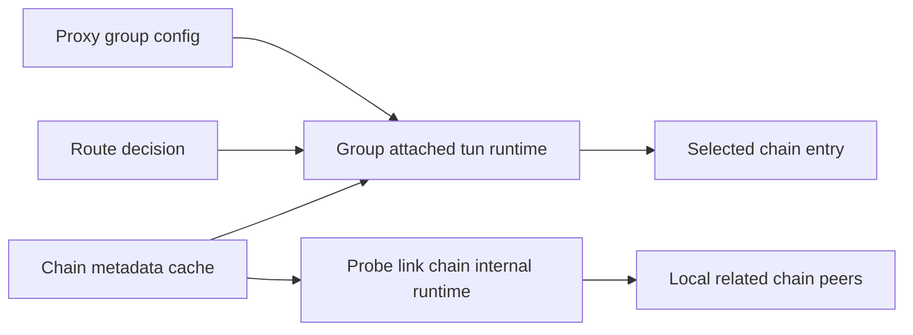

# 总体架构文档

- 适用规则: AI协作规则
- 后续工作传递声明: 本文档必须传递给后续阶段与后续角色。
- 需求编号: REQ-PN-TUN-PROXY-REFAC-001
- 需求后缀: REQ-PN-TUN-PROXY-REFAC-001
- 当前角色: Architect
- 工作依据文档: [doc/architect/requirements-REQ-PN-TUN-PROXY-REFAC-001.md](doc/architect/requirements-REQ-PN-TUN-PROXY-REFAC-001.md:1)、[resolveProbeLocalProxyRouteDecisionByDomain()](probe_node/local_route_decision.go:5)、[decideProbeLocalRouteForTarget()](probe_node/local_tun_route.go:39)、[openProbeLocalTunnelConnWithAssociation()](probe_node/local_tun_route.go:117)、[getProbeChainRuntime()](probe_node/link_chain_runtime.go:2512)、[startProbeLinkChainsSyncLoop()](probe_node/probe_link_chains_sync.go:97)
- 状态: 进行中

## 架构目标
- 建立“每个代理组挂接一个 `tun proxy` 专属链路 runtime”的唯一运行态模型。
- 让 route 决策在命中组后，直接消费组 runtime 指针进入后续代理行为。
- 将 [`tun proxy`](probe_node/local_tun_route.go:117) 的组选链客户端 runtime，与 [`probe link chain`](probe_node/probe_link_chains_sync.go:97) 的内部互联 runtime 完全分离。
- 保持选中链路不可用时直接失败并显示不可用，不允许自动回退到直连。

## 总体设计
- 设计采用“组选链配置态 + 组挂接客户端 runtime + 链路内部互联 runtime”三层分工。
- 控制面为每个组保存 `selected_chain_id`，并驱动该组挂接的 `tun proxy` runtime 创建、更新、销毁。
- route 决策先按域名规则命中组，再直接读取该组挂接的 runtime 指针，决定后续 `tunnel` 行为。
- `tun proxy` runtime 负责维护与该组选中链路有关的入口连接、socket 或 session、状态、错误与更新时间。
- [`probe link chain`](probe_node/probe_link_chains_sync.go:97) 继续仅负责与本节点有关的 chain 内部互联，不为 `tun proxy` 提供组选链客户端运行态。

## 术语澄清
- [`getProbeChainRuntime()`](probe_node/link_chain_runtime.go:2512) 返回的是 [`probeChainRuntime`](probe_node/link_chain_runtime.go:81) 指针，即当前节点内部链路互联运行态句柄。
- `group attached tun runtime` 指的是挂在某个 [`proxy group`](probe_node/local_console.go:106) 上的客户端运行态，服务于该组选择的 chain。
- 两者可能引用同一条 chain 的元数据，但它们的职责、生命周期、状态源、错误语义都不同。

## 关系示意

## 关键模块
| 模块编号 | 模块名称 | 职责 | 输入 | 输出 |
|---|---|---|---|---|
| M1 | Group Selection Store | 管理每个组的 `selected_chain_id` 与策略动作 | group action selected_chain_id | normalized group selection |
| M2 | Group Attached TUN Runtime Registry | 为每个组维护唯一的 `tun proxy` 客户端 runtime | group selection chain metadata connect events | group runtime pointer and snapshot |
| M3 | Route Decision Adapter | 域名命中组后直接绑定组 runtime 指针 | target domain group selection group runtime | route decision with runtime reference |
| M4 | TUN Entry Client | 使用组 runtime 建立和维护到链路入口的连接 | group runtime target network | tunnel stream or error |
| M5 | Probe Link Chain Internal Runtime | 维护本节点相关的 chain 内部互联 | chain topology hop config lifecycle events | internal chain connectivity |
| M6 | Status Projection | 把组 runtime 状态投影为控制面可观测字段 | group runtime snapshot connect result | unavailable or reachable status |

## 关键接口
| 接口编号 | 接口名称 | 调用方 | 提供方 | 说明 |
|---|---|---|---|---|
| IF-001 | PersistGroupSelection | 控制面保存流程 | M1 | 保存组动作与 `selected_chain_id` |
| IF-002 | GetOrRefreshGroupTunRuntime | 控制面与运行态同步流程 | M2 | 为组创建或刷新挂接 runtime |
| IF-003 | ResolveRouteWithGroupRuntime | TUN route 层 | M3 | 直接把命中的组绑定到其 runtime 指针 |
| IF-004 | OpenTunnelByGroupRuntime | TUN TCP UDP 出站 | M4 | 使用组 runtime 与链路入口交互 |
| IF-005 | MaintainLocalChainInternals | chain 同步循环 | M5 | 维护与本节点有关的链路内部互联 |
| IF-006 | BuildGroupRuntimeStatus | 状态接口 | M6 | 输出该组客户端 runtime 的可用性与错误状态 |

## 关键约束
- 单组单 runtime 约束: 每个组同一时刻只能挂接一个 `tun proxy` runtime。
- 直接指针消费约束: route 命中组后，后续代理行为必须直接消费该组 runtime 指针。
- 禁耦合约束: `tun proxy` 主路径不得再把 [getProbeChainRuntime()](probe_node/link_chain_runtime.go:2512) 作为组选链 runtime 来源。
- 业务隔离约束: M2 M3 M4 M6 属于 `tun proxy` 业务域，M5 属于 [`probe link chain`](probe_node/probe_link_chains_sync.go:97) 业务域。
- 任意 chain 消费约束: `tun proxy` 可消费任意 chain，不要求本节点属于该 chain。
- 无回退约束: 链路入口不可用时禁止自动降级为 `direct`。

## 风险
- 若组切换 chain 后旧 runtime 未及时回收，可能发生组配置与实际代理连接不一致。
- 若状态投影仍引用内部链路 runtime，控制面会错误显示可用性。
- 若链路入口元数据解析路径与组 runtime 刷新路径不同步，可能出现空指针或陈旧连接。

## 结论
- 架构已经收敛为“双 runtime 分离”模型：组上挂接 [`tun proxy`](probe_node/local_tun_route.go:117) 客户端 runtime，节点上维护 [`probe link chain`](probe_node/probe_link_chains_sync.go:97) 内部互联 runtime。
- 后续 Code 阶段应围绕“按组挂 runtime、按组 runtime 走代理、内部互联独立维护”实施。
