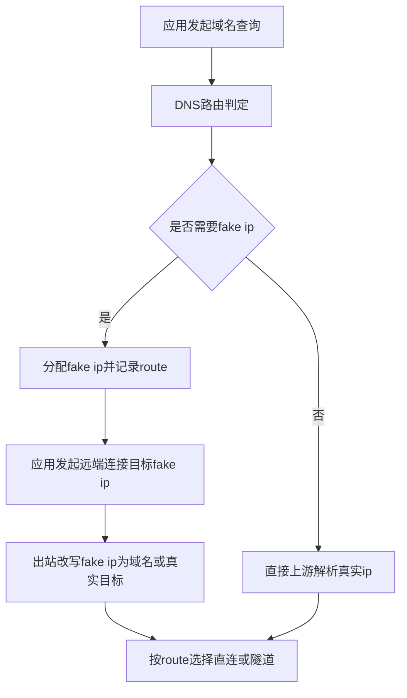

# Architect阶段文档 manager 与 node 在 fake IP DNS 与远端通讯差异对比

## 工作依据与规则传递声明
- 当前角色: Architect 架构师
- 工作依据文档: `doc/ai-coding-unified-rules.md`
- 适用规则:
  - 统一规则 S2 架构设计输出要求
  - 文档最小字段要求
  - 架构阶段增量输出要求

## 日期
- 2026-04-30

## 备注
- 本文档聚焦对比 `probe_manager` 与 `probe_node` 在 fake IP DNS 分配与远端通讯链路上的实现差异。
- 输出目标为后续 Code 模式提供可执行对齐改造输入，不直接包含代码实现。

## 风险
- node 当前 TUN 数据面仅体现路由判定与旁路管理，未体现与 manager 同等级的 fake-IP 到 domain 出站改写，存在策略漂移风险。
- manager 与 node 的 fake IP TTL、缓存回填、预热策略不一致，可能导致行为差异与排障复杂度上升。
- UDP association 元数据口径跨端不统一，可能影响跨组件关联排障。

## 遗留事项
- U2（fake IP TTL 与缓存回填跨端对齐）尚未实施。
- U3（UDP association 元数据与调试口径统一）尚未实施。
- 尚未产出 Debug 阶段 G4 证据。

## 进度状态
- 已完成

## 完成情况
- 已完成 manager 与 node 的关键链路对比。
- 已形成可执行对齐建议清单。
- 已完成本次范围内代码实现：保持 DNS 解析策略不变，补齐 node fake IP 出站改写并覆盖 TCP/UDP 路径。
- 已完成本次范围内单测验证：`go test ./...`（`probe_node`）通过。

## 检查表
- [x] 已声明工作依据与规则传递
- [x] 已包含日期
- [x] 已包含备注
- [x] 已包含风险
- [x] 已包含遗留事项
- [x] 已包含进度状态
- [x] 已包含完成情况
- [x] 已包含检查表
- [x] 已包含跟踪表状态
- [x] 已包含结论记录

## 跟踪表状态
- 当前状态: 实现中
- 当前责任角色: Code
- 最近更新时间: 2026-04-30

## 结论记录
1. manager 在 fake IP 分配时，先绑定路由并写入映射池，再在出站阶段执行 fake IP 目标改写，确保远端拨号不直接命中 fake IP。
2. manager 的内部 DNS 解析会按路由决策在系统 DNS 与隧道 DNS 间切换，并写入 route hint 与缓存。
3. manager 的 TUN TCP 与 UDP 出站链路均包含 fake IP 重写入口，路径一致性较高。
4. node 的本地 DNS 已具备 fake IP 分配与白名单绕过能力，但当前可见 TUN 数据面仅处理路由/旁路记录，尚未体现与 manager 对齐的 fake-IP 到 domain 出站改写层。
5. node 的 UDP association 重点在链路转发复用；manager 的本机 TUN UDP relay 重点在本地会话生命周期与回注，关注点不同。

## 关键证据索引
- manager fake IP 分配与改写:
  - `probe_manager/backend/network_assistant_fake_ip.go`
- manager 内部 DNS 路由解析:
  - `probe_manager/backend/network_assistant_internal_dns.go`
- manager TUN 出站 TCP UDP:
  - `probe_manager/backend/network_assistant_tun_stack_windows.go`
  - `probe_manager/backend/network_assistant_tun_udp.go`
- node 本地 DNS 与 fake IP:
  - `probe_node/local_dns_service.go`
  - `probe_node/local_route_decision.go`
- node TUN 数据面与链路 UDP association:
  - `probe_node/local_tun_stack_windows.go`
  - `probe_node/link_chain_udp_assoc.go`

## 关键差异对比
| 维度 | manager | node | 差异结论 |
|---|---|---|---|
| fake IP 启用判定 | 依据路由决策，仅隧道路径分配 fake IP | 依据 `UseTunnelDNS` 与白名单判定 | 判定口径接近，但实现入口不同 |
| fake IP 分配后语义 | 写入 fakeIP 池并附带 route | 写入本地 fake 映射并写 route hint | 均记录路由语义，数据结构命名不同 |
| 出站目标改写 | 存在 fake-IP 到 domain 统一改写层 | 当前可见路径未体现同级改写层 | node 缺口 |
| DNS 上游选择 | 按 route 选系统 DNS 或隧道 DNS | 按候选上游顺序查询 | manager 路由耦合更强 |
| UDP 会话治理 | 本机 TUN relay 生命周期与回注 | 链路 association 复用与回收 | 两端职责焦点不同 |

## 关键流程示意

## 关键选型与取舍
- 选型一: 以 manager 的 fake-IP 出站改写链路作为对齐基线。
  - 取舍: 提高行为一致性，代价是 node 需要新增一层出站改写与状态读取。
- 选型二: 保持 node 当前 DNS 入口判定，但补齐出站改写与缓存回填。
  - 取舍: 兼容现有 node 配置结构，避免大规模重构。

## 设计基线与执行单元包
- 范围冻结
  - DNS 解析策略保持不变，不调整上游候选与顺序策略。
  - 仅补齐 fake IP 出入站改写与 TCP/UDP 一致处理。

- 执行单元包 U1
  - 目标: 在 node 增加 fake-IP 到 domain 出站改写层，TCP/UDP 共用改写入口。
  - 主要文件: `probe_node/local_tun_stack_windows.go`、`probe_node/local_tun_route.go`、`probe_node/local_dns_service.go`
  - 设计要点:
    - 新增统一改写函数，输入 `targetAddr` 输出 `rewrittenTargetAddr` 与 `routeHintDecision`。
    - 命中 fake IP 时从 fake 映射表反查 domain，并以 domain 参与既有路由决策。
    - 未命中 fake IP 时保持现状，确保非 fake 流量零行为变化。

- 执行单元包 U2
  - 目标: 补齐 fake IP 入站回写语义，TCP/UDP 共用同一映射语义。
  - 主要文件: `probe_node/local_dns_service.go`、`probe_node/local_tun_route.go`
  - 设计要点:
    - 复用现有 `fakeIPToEntry` 与 `routeHints`，不改 DNS 解析流程。
    - 对 fake 命中流量统一回写 `Group`、`Action`、`TunnelNodeID`，减少 TCP/UDP 分歧。

- 执行单元包 U3
  - 目标: 在 TUN 数据面补齐 TCP/UDP 出入站处理一致性。
  - 主要文件: `probe_node/local_tun_stack_windows.go`、`probe_node/local_tun_stack_windows_test.go`、`probe_node/local_tun_route_test.go`
  - 设计要点:
    - TCP: fake 目标先改写再分流 direct/tunnel。
    - UDP: fake 目标先改写再分流 direct/tunnel。
    - reject 语义保持不变，仍由既有 route reject 链路阻断。

## Code模式实施步骤
1. 在 `probe_node/local_dns_service.go` 增加只读查找函数，提供 fakeIP 到 domain 与 route 决策结构化读取。
2. 在 `probe_node/local_tun_route.go` 增加统一改写入口，封装 fake 命中判定与改写后路由决策。
3. 在 `probe_node/local_tun_stack_windows.go` 的 TCP 路径接入统一改写入口。
4. 在 `probe_node/local_tun_stack_windows.go` 的 UDP 路径接入统一改写入口。
5. 保持 DNS 解析策略代码不变，仅调整 TUN 出入站目标处理。
6. 补充测试:
   - fake IP TCP 直连
   - fake IP TCP 隧道
   - fake IP UDP 直连
   - fake IP UDP 隧道
   - reject 目标阻断
   - fake 白名单绕过

## 兼容性约束
- 不改 `resolveProbeLocalDNSResponse` 的上游选择逻辑。
- 不改 fake IP 分配判定条件 `UseTunnelDNS` 与白名单判断。
- 不改运行时 `group action` 写入流程。

## 编码策略口径增量
- policy变更点: 无
- lint执行参数: 后续 Code 阶段按仓库默认策略执行
- ci_gate执行参数: 后续 Code 阶段按仓库默认策略执行
- 豁免审批口径: 暂无豁免需求

## 映射关系与跟踪表更新说明
| 需求编号 | 需求描述 | 执行单元包 | 编码状态 | 测试状态 | 当前责任角色 | 风险与遗留 | 最新更新时间 |
|---|---|---|---|---|---|---|---|
| NA-FAKEIP-ALIGN-001 | node 补齐 fake-IP 出站改写 | U1 | 已实现 | 已测试 | Code | 已按“DNS策略不变”约束落地；覆盖 TCP/UDP fake 目标改写 | 2026-04-30 |
| NA-FAKEIP-ALIGN-002 | manager node fake IP TTL 与缓存回填对齐 | U2 | 待实现 | 待测试 | Code | 跨模块回归范围较大 | 2026-04-30 |
| NA-UDP-ASSOC-ALIGN-003 | UDP association 元数据与调试口径统一 | U3 | 待实现 | 待测试 | Code | 需要联动 debug 输出与测试 | 2026-04-30 |
