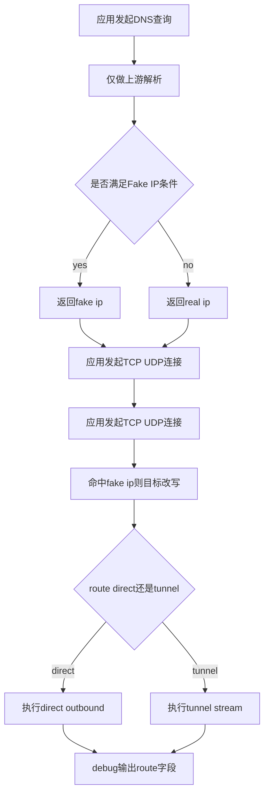

# Architect阶段文档 manager基线下 node代理能力设计缺陷全量核查

## 工作依据与规则传递声明
- 当前角色: Architect 架构师
- 工作依据文档: `doc/ai-coding-unified-rules.md`
- 适用规则:
  - 统一规则 S2 架构设计输出要求
  - 文档最小字段要求
  - 证据链与缺陷分级要求

## 日期
- 2026-04-30

## 备注
- 本文档以 manager 作为功能基线，对 node 代理链路做全量核查。
- 覆盖范围: DNS 决策、Fake IP 双向映射、TCP/UDP 出站、UDP association 生命周期、Debug 可观测性。
- 口径补充: `FakeIPWhitelist` 在目标方案中定义为删除项，配置字段与运行时判定逻辑均不保留。
- 本文档只给出架构结论与整改优先级，不包含代码实现。

## 风险
- node 当前 TUN 数据面未执行真实远端连接或隧道流建立，仅做策略判定与日志，存在功能空洞风险。
- node DNS 当前仍承载路由决策耦合语义，与目标策略 DNS 纯解析职责不一致，容易造成实现与认知偏差。
- node TCP Debug 未携带 route 维度字段，跨端联调时难以定位 direct/tunnel 偏差。

## 遗留事项
- R1: node TUN 数据面需要从策略判定升级为真实转发执行路径。
- R2: node DNS 职责需要收敛为纯上游解析，并下线 route 决策耦合语义。
- R3: node TCP Debug 需要补齐 NodeID Group Direct 等字段口径。

## 进度状态
- 已完成

## 完成情况
- 已完成 manager 与 node 全量能力映射。
- 已完成缺陷识别与 P0 P1 P2 风险分级。
- 已形成可直接交付 Code 模式执行的整改清单。

## 检查表
- [x] 已声明工作依据与规则传递
- [x] 已包含日期
- [x] 已包含备注
- [x] 已包含风险
- [x] 已包含遗留事项
- [x] 已包含进度状态
- [x] 已包含完成情况
- [x] 已包含检查表
- [x] 已包含跟踪表状态
- [x] 已包含结论记录

## 跟踪表状态
- 当前状态: 待实施
- 当前责任角色: Code
- 最近更新时间: 2026-04-30

## 关键证据索引
- manager 路由决策与 route hint:
  - `probe_manager/backend/network_assistant.go`
  - `probe_manager/backend/network_assistant_internal_dns.go`
- manager Fake IP 分配与出站改写:
  - `probe_manager/backend/network_assistant_fake_ip.go`
- manager TCP UDP 出站执行:
  - `probe_manager/backend/network_assistant_tun_stack_windows.go`
  - `probe_manager/backend/network_assistant_tun_udp.go`
- manager Debug 口径:
  - `probe_manager/backend/network_assistant_tcp_debug.go`
  - `probe_manager/backend/ai_debug_udp_assoc.go`
- node 路由与 Fake IP 映射:
  - `probe_node/local_tun_route.go`
  - `probe_node/local_dns_service.go`
  - `probe_node/local_route_decision.go`
- node TUN 数据面:
  - `probe_node/local_tun_stack_windows.go`
  - `probe_node/local_tun_dataplane_windows.go`
- node UDP association 与 Debug:
  - `probe_node/link_chain_udp_assoc.go`
  - `probe_node/link_chain_runtime.go`
  - `probe_node/udp_assoc_debug.go`
  - `probe_node/tcp_debug.go`

## 核查结论总览
| 维度 | manager 基线 | node 现状 | 结论 |
|---|---|---|---|
| DNS 职责边界 | 纯解析上游选择 不承担 direct tunnel 路由决策 | `resolveProbeLocalDNSRouteDecision` 与 `shouldUseProbeLocalDNSFakeIP` 仍消费 route 字段 | 设计偏差 |
| Fake IP 双向映射 | fakeIP池含 route 语义 + 出站改写 | 已有 `lookupProbeLocalDNSFakeIPEntry` + 改写入口 | 基本对齐 |
| TCP 出站执行 | 真正 dial 或 openTunnelStream | TUN `Write` 仅记录 routed to tunnel | 关键缺口 |
| UDP 出站执行 | 真正 direct conn 或 tunnel stream association | TUN `Write` 仅记录策略 未建立 UDP 会话 | 关键缺口 |
| UDP association 生命周期 | manager 本机 relay 生命周期完整 | node 主要在链路层 association 可复用可回收 | 层次不同 需桥接 |
| Debug 可观测性 | TCP/UDP 均含 route 字段 direct node group | node UDP 较完整 TCP 缺 route 维度 | 部分缺口 |

## 设计缺陷矩阵与风险分级
| 编号 | 缺陷描述 | 证据 | 影响 | 等级 | 整改方向 |
|---|---|---|---|---|---|
| D-P0-01 | node TUN 数据面未执行真实 TCP UDP 转发 | `probe_node/local_tun_stack_windows.go` 中 `Write` 对 tunnel 分支仅日志返回 | TUN 模式代理能力不完整 数据面与控制面语义脱节 | P0 | 在 node TUN 栈增加 open outbound direct 与 open tunnel stream 执行路径 |
| D-P1-01 | node DNS 职责与路由决策耦合未清理 | `resolveProbeLocalDNSRouteDecision` 与 `shouldUseProbeLocalDNSFakeIP` 仍依赖路由字段 | 职责边界不清 规则理解与实现容易偏离 | P1 | 下线 `UseTunnelDNS`，DNS 仅保留上游解析与 Fake IP 分配入口 |
| D-P1-02 | node TCP Debug 缺失 route 字段 | `probe_node/tcp_debug.go` 的 payload 未含 NodeID Group Direct | 跨端排障无法快速定位路由偏差 | P1 | 补齐 TCP debug payload 字段并在 relay begin 时记录 route 元数据 |
| D-P1-03 | Fake IP 白名单语义与目标策略冲突 | `probe_node/local_console.go` 与 `probe_node/local_dns_service.go` 仍存在 `FakeIPWhitelist` 路径 | 配置理解与运行时行为不一致 | P1 | 删除 `FakeIPWhitelist` 配置字段 默认值 归一化 校验与 DNS 白名单判定逻辑 |
| D-P2-01 | node routeHints 仅计数可见 不参与 IP 目标回推 | `storeProbeLocalDNSRouteHintLocked` 存储后无读取路径 | 可观测性与可复用性不足 | P2 | 增加 route hint 查询接口或在路由阶段引入 hint 回退 |

## 关键流程示意

## 结论记录
1. node 在 Fake IP 映射与改写语义上已接近 manager 基线，但核心缺口已转移到 TUN 数据面执行层。
2. 当前最大设计缺陷是 node TUN `Write` 仅做策略判定不做实际转发，属于 P0。
3. DNS 与 Debug 仍有两项 P1 缺口，会放大跨端行为偏差与排障成本。
4. 建议先封堵 P0，再并行完成 P1，最后处理 P2 可观测性增强。

## Code模式整改清单
1. P0: 在 `probe_node/local_tun_stack_windows.go` 引入真实 TCP UDP 出站执行路径，保持 reject 语义不变。
2. P1: 在 `probe_node/local_dns_service.go` 清理 DNS 路由耦合，DNS 仅保留上游解析与 Fake IP 判定。
3. P1: 在 `probe_node/tcp_debug.go` 补齐 route 字段并与 manager payload 结构对齐。
4. P1: 在 `probe_node/local_console.go` 与 `probe_node/local_dns_service.go` 删除 `FakeIPWhitelist` 相关配置与运行时逻辑。
5. P2: 在 `probe_node/local_dns_service.go` 增加 route hint 可读接口与回退使用点。
6. 回归: 增加 TUN TCP/UDP direct/tunnel/reject 与 DNS 职责边界单测，并覆盖白名单删除后的行为断言。

## 映射关系与跟踪表
| 需求编号 | 需求描述 | 状态 | 风险等级 | 当前责任角色 | 最新更新时间 |
|---|---|---|---|---|---|
| NA-NODE-PROXY-GAP-001 | node TUN 数据面执行能力补齐 | 待实施 | P0 | Code | 2026-04-30 |
| NA-NODE-PROXY-GAP-002 | node DNS 纯解析职责收敛与路由耦合清理 | 待实施 | P1 | Code | 2026-04-30 |
| NA-NODE-PROXY-GAP-003 | node TCP Debug route 字段对齐 | 待实施 | P1 | Code | 2026-04-30 |
| NA-NODE-PROXY-GAP-004 | 删除 FakeIPWhitelist 配置与运行时逻辑 | 待实施 | P1 | Code | 2026-04-30 |
| NA-NODE-PROXY-GAP-005 | node route hint 可复用增强 | 待实施 | P2 | Code | 2026-04-30 |
