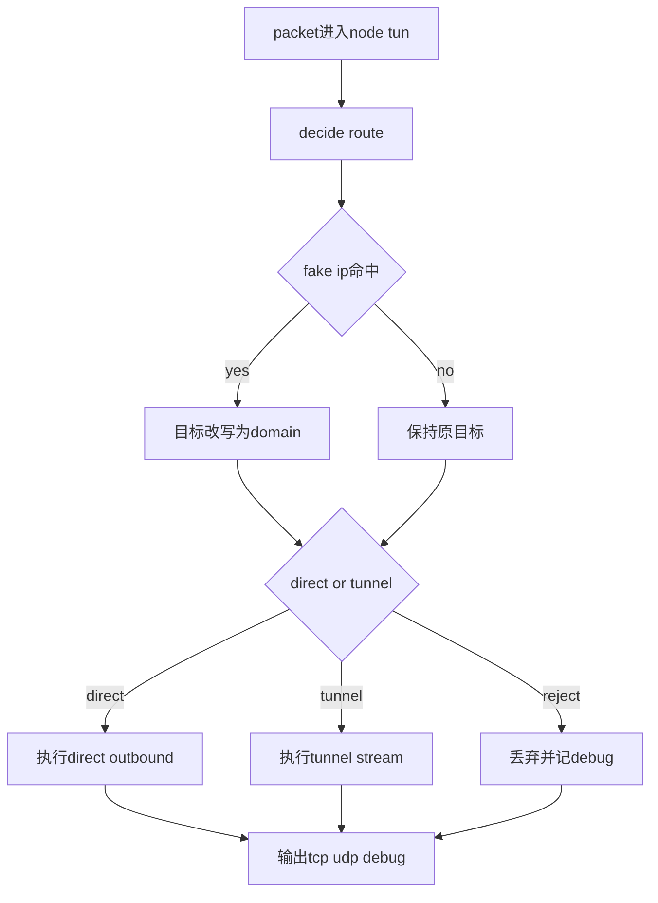

# Architect阶段文档 manager基线下 node代理能力整改实施蓝图

## 工作依据与规则传递声明
- 当前角色: Architect 架构师
- 工作依据文档: `doc/ai-coding-unified-rules.md`
- 适用规则:
  - 统一规则 S2 架构输出
  - 最小字段完整性
  - 缺陷分级与执行包可落地要求

## 日期
- 2026-04-30

## 备注
- 本文档为新增文档，用于承接核查结论并形成可直接执行的整改蓝图。
- 基线系统: manager
- 对齐目标: node
- 覆盖范围: DNS 决策、Fake IP 双向映射、TCP/UDP 出站、UDP association 生命周期、Debug 可观测性。

## 风险
- 若不补齐 node TUN 数据面真实执行链路，TUN 模式在高并发或复杂策略场景下会出现功能缺口。
- 若 DNS 职责边界不收敛，解析层与路由层耦合会持续放大行为歧义。
- 若 TCP Debug 不携带 route 维度，跨端联调将缺少关键证据。

## 遗留事项
- L1: P0 能力补齐尚未进入代码实施。
- L2: P1 DNS 职责收敛与 TCP Debug 字段对齐尚未实施。
- L3: P2 route hint 复用能力尚未实施。

## 进度状态
- 已完成架构设计

## 完成情况
- 已完成 manager 与 node 全量链路核查。
- 已完成 P0 P1 P2 风险分级。
- 已输出本次整改实施蓝图与验收标准。

## 检查表
- [x] 已声明工作依据与规则传递
- [x] 已包含日期
- [x] 已包含备注
- [x] 已包含风险
- [x] 已包含遗留事项
- [x] 已包含进度状态
- [x] 已包含完成情况
- [x] 已包含检查表
- [x] 已包含跟踪表状态
- [x] 已包含结论记录

## 跟踪表状态
- 当前状态: 待实施
- 当前责任角色: Code
- 最近更新时间: 2026-04-30

## 目标与非目标
### 目标
1. node TUN 数据面具备与 manager 等价的真实 TCP/UDP 出站执行能力。
2. node DNS 职责收敛为纯解析上游选择，不参与 direct tunnel 路由决策。
3. node TCP Debug 输出口径对齐 manager 关键 route 字段。

### 非目标
1. 不改现有策略文件结构。
2. 不改 fake IP 判定基本原则。
3. 不扩展新的外部协议能力。

## 设计基线
- manager 路由决策基线: `probe_manager/backend/network_assistant.go`
- manager DNS 分流基线: `probe_manager/backend/network_assistant_internal_dns.go`
- manager fake IP 改写基线: `probe_manager/backend/network_assistant_fake_ip.go`
- manager TUN TCP/UDP 执行基线: `probe_manager/backend/network_assistant_tun_stack_windows.go`
- manager 调试口径基线: `probe_manager/backend/network_assistant_tcp_debug.go` 与 `probe_manager/backend/ai_debug_udp_assoc.go`

## node 当前实现映射
- route 与 fake 改写入口: `probe_node/local_tun_route.go`
- DNS 服务与 fake 映射: `probe_node/local_dns_service.go`
- TUN 数据面写入入口: `probe_node/local_tun_stack_windows.go`
- UDP association 生命周期: `probe_node/link_chain_udp_assoc.go` 与 `probe_node/link_chain_runtime.go`
- debug 输出: `probe_node/tcp_debug.go` 与 `probe_node/udp_assoc_debug.go`

## 缺陷矩阵与分级
| 编号 | 缺陷 | 现状 | 等级 | 处置策略 |
|---|---|---|---|---|
| GAP-P0-01 | TUN 数据面仅判定未执行真实转发 | `Write` 对 tunnel 分支仅日志返回 | P0 | 引入真实 direct dial 与 tunnel stream 执行链路 |
| GAP-P1-01 | DNS 职责与路由决策耦合未清理 | fake 判定与决策结构仍依赖 route 字段 | P1 | 下线 `UseTunnelDNS` 并收敛为 DNS 纯解析职责 |
| GAP-P1-02 | TCP Debug 缺 route 元数据 | payload 无 NodeID Group Direct | P1 | 扩展 payload 与 relay 元数据采集 |
| GAP-P2-01 | route hint 可复用能力不足 | 仅统计计数 | P2 | 新增 route hint 查询与回退使用点 |

## 执行单元包
### U1 P0 node TUN 数据面真实执行链路
- 目标: 让 `probe_node/local_tun_stack_windows.go` 在 direct 与 tunnel 分支执行真实出站。
- 变更文件:
  - `probe_node/local_tun_stack_windows.go`
  - `probe_node/local_tun_route.go`
  - `probe_node/local_tun_stack_windows_test.go`
- 工作事项:
  1. 在 `probe_node/local_tun_stack_windows.go` 梳理 `Write` 的 direct tunnel reject 三分支，补齐 direct 与 tunnel 的真实执行调用。
  2. direct 分支落地 TCP `net.DialTimeout` 与 UDP 可写连接路径，确保目标地址来源于 `probeLocalTunnelRouteDecision.TargetAddr`。
  3. tunnel 分支统一走 `openProbeLocalTunnelConn`，并在失败时返回可诊断错误而不是静默吞掉。
  4. reject 分支保持拒绝语义不变，仅补充必要 debug 字段与错误透传。
  5. 在 `probe_node/local_tun_route.go` 校对 fake 命中改写后的目标地址，确保 direct tunnel 在同一目标口径下执行。
  6. 在 `probe_node/local_tun_stack_windows_test.go` 新增或调整 direct tunnel reject 的 TCP UDP 覆盖用例。
- 完成判定:
  - direct tunnel reject 三路径都可执行且返回符合预期。
  - `Write` 不再出现 tunnel 仅日志不执行的空洞行为。

### U2 P1 DNS 职责收敛与耦合清理
- 目标: 让 DNS 仅承担上游解析与 Fake IP 分配，不参与 direct tunnel 路由决策。
- 变更文件:
  - `probe_node/local_dns_service.go`
  - `probe_node/local_route_decision.go`
  - `probe_node/local_console.go`
  - `probe_node/local_route_decision_test.go`
- 工作事项:
  1. 在 `probe_node/local_dns_service.go` 的 `probeLocalDNSRouteDecision` 删除 `UseTunnelDNS` 字段。
  2. 在 `probe_node/local_route_decision.go` 删除 tunnel action 下对 `UseTunnelDNS=true` 的赋值。
  3. 在 `probe_node/local_dns_service.go` 重写 `shouldUseProbeLocalDNSFakeIP` 规则为 `qType=A` 且 `Group!=fallback` 且 `Action!=reject`。
  4. 在 `probe_node/local_dns_service.go` 明确 `AAAA` 与其他非 A 查询直接返回不分配 fake 的分支。
  5. 在 `probe_node/local_console.go` 删除 `FakeIPWhitelist` 配置字段 默认值 归一化 校验相关代码块。
  6. 在 `probe_node/local_dns_service.go` 删除白名单循环判定，避免保留隐式兼容路径。
  7. 在 `probe_node/local_route_decision_test.go` 删除 `UseTunnelDNS` 断言，改为 `Group` 与 `Action` 主断言。
- 完成判定:
  - 代码中不存在 `UseTunnelDNS` 与 `FakeIPWhitelist` 运行时判定路径。
  - DNS 假地址分配仅受 `qType` `Group` `Action` 新规则控制。

### U3 P1 TCP Debug 口径对齐
- 目标: 对齐 manager 的 route 元数据输出。
- 变更文件:
  - `probe_node/tcp_debug.go`
  - `probe_node/link_chain_runtime.go`
- 工作事项:
  1. 在 `probe_node/tcp_debug.go` 对 active 与 failure payload 补齐 `NodeID` `Group` `Direct` 字段。
  2. 在 `probe_node/link_chain_runtime.go` relay begin 位置注入 route 元数据，保证成功失败链路都可追踪。
  3. 对齐字段命名和空值语义，避免与 manager 端 debug schema 出现口径偏差。
  4. 增加至少一条 tunnel 与一条 direct 的 TCP debug 断言样例。
- 完成判定:
  - TCP debug 事件可直接用于区分 direct tunnel reject。
  - manager 与 node 的核心 route 字段可一一映射。

### U4 P2 route hint 可复用增强
- 目标: 让 route hint 不仅可计数，还可用于观测与回退。
- 变更文件:
  - `probe_node/local_dns_service.go`
  - `probe_node/local_console.go`
- 工作事项:
  1. 在 `probe_node/local_dns_service.go` 暴露 route hint 读取能力，定义查询键与过期策略。
  2. 在 `probe_node/local_console.go` 增加必要观测输出字段，便于验证 hint 命中与过期。
  3. 在目标为 IP 且 fake 未命中时，设计可控开关的 hint 回退路径，默认保持保守行为。
  4. 增加回退命中与未命中的测试样例，避免引入错误路由放大。
- 完成判定:
  - hint 能被观测且可控使用。
  - 不影响 direct tunnel reject 既有主路径行为。

## Code执行工作事项总表
| 执行包 | 工作项编号 | 工作事项 | 主要文件 | 完成信号 |
|---|---|---|---|---|
| U1 | U1-W1 | 补齐 TUN direct tunnel 真实执行 | `probe_node/local_tun_stack_windows.go` | direct tunnel 均真实出站 |
| U1 | U1-W2 | 保持 reject 语义并补齐测试 | `probe_node/local_tun_stack_windows_test.go` | reject 行为与断言稳定 |
| U2 | U2-W1 | 删除 `UseTunnelDNS` 字段与赋值 | `probe_node/local_dns_service.go` `probe_node/local_route_decision.go` | 全仓无 `UseTunnelDNS` 运行时依赖 |
| U2 | U2-W2 | 删除 `FakeIPWhitelist` 全链路 | `probe_node/local_console.go` `probe_node/local_dns_service.go` | 配置与判定路径均移除 |
| U2 | U2-W3 | 重写 fake 判定为 qType Group Action 规则 | `probe_node/local_dns_service.go` | A 可分配 其他类型不可分配 |
| U3 | U3-W1 | 对齐 TCP debug route 字段 | `probe_node/tcp_debug.go` `probe_node/link_chain_runtime.go` | 事件字段可映射 manager |
| U4 | U4-W1 | 增强 route hint 观测与回退 | `probe_node/local_dns_service.go` `probe_node/local_console.go` | hint 可查询 回退可控 |

## 验收标准
### 功能验收
1. TUN TCP direct/tunnel/reject 三路径可执行且行为正确。
2. TUN UDP direct/tunnel/reject 三路径可执行且行为正确。
3. DNS 在 direct tunnel reject 场景下保持一致解析策略可被验证。
4. TCP Debug 输出包含 route_target node_id group direct。

### 回归验收
1. 既有 fake IP 改写测试全部通过。
2. 既有 UDP association 生命周期测试通过。
3. 新增 DNS 职责边界用例通过。

## 测试矩阵
| 测试项 | direct | tunnel | reject |
|---|---|---|---|
| TCP TUN 出站 | 必测 | 必测 | 必测 |
| UDP TUN 出站 | 必测 | 必测 | 必测 |
| DNS 职责边界 | 必测 | 必测 | 必测 |
| TCP Debug 字段 | 必测 | 必测 | 必测 |

## 流程示意

## 结论记录
1. 本轮新增文档将核查结论转换为可执行整改蓝图。
2. 实施顺序应严格按 P0 到 P1 再到 P2，先确保数据面真实能力。
3. 文档已满足统一规则最小字段要求，可直接用于 Code 模式执行。

## 映射关系与跟踪表
| 需求编号 | 需求描述 | 执行包 | 状态 | 风险等级 | 当前责任角色 | 最新更新时间 |
|---|---|---|---|---|---|---|
| NA-NODE-REMEDIATION-001 | node TUN 数据面真实执行链路 | U1 | 待实施 | P0 | Code | 2026-04-30 |
| NA-NODE-REMEDIATION-002 | DNS 纯解析职责收敛与路由耦合清理 | U2 | 待实施 | P1 | Code | 2026-04-30 |
| NA-NODE-REMEDIATION-003 | TCP Debug route 字段对齐 | U3 | 待实施 | P1 | Code | 2026-04-30 |
| NA-NODE-REMEDIATION-004 | route hint 可复用增强 | U4 | 待实施 | P2 | Code | 2026-04-30 |
