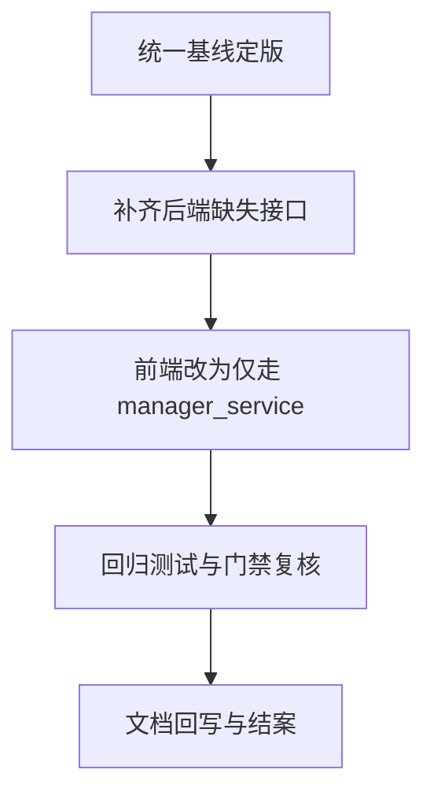

# `manager_service` 编码实现与架构基线一致性核查报告

- 日期: 2026-04-12
- 核查角色: 架构评审
- 核查范围:
  - 架构基线文档
  - 编码阶段 W1 W2 W3 文档
  - `manager_service` 后端与前端关键实现文件
- 结论: **部分一致，存在核心偏离，当前不满足完全架构符合性**

---

## 1. 核查基线

### 1.1 主要设计基线
- 基线文档: `doc/architect/manager_service_final_architect_doc.md`
- 重点约束:
  - 新建独立 `manager_service`
  - 仅监听 `127.0.0.1:16033`
  - 前端仅通过 `manager_service` 通信
  - 主控与探针交互能力迁移并保持行为等价
  - 鉴权采用单账户用户名密码并支持登录后改密改名
  - 默认不改 `probe_manager`、`probe_controller`、`probe_node`

### 1.2 编码交付文档
- `doc/coder/manager_service_coding_phase_w1.md`
- `doc/coder/manager_service_coding_phase_w2.md`
- `doc/coder/manager_service_coding_phase_w3.md`

---

## 2. 总体评审结论

- 已实现并对齐的内容主要集中在 W1 基础能力。
- 偏离主要集中在 W2/W3 的接口契约完整性与边界治理。
- 偏离等级分布:
  - 严重: 2 项
  - 高: 2 项
  - 中: 1 项

> 判定: **编程者工作未完全偏离，但已在关键设计约束上发生偏离，需整改后再进入“符合设计”结论。**

---

## 3. 对齐项

### 3.1 RQ-001 新建独立 `manager_service`
- 证据:
  - `manager_service/go.mod`
  - `manager_service/main.go`
- 结论: 对齐

### 3.2 RQ-002 固定监听 `127.0.0.1:16033`
- 证据:
  - `manager_service/internal/config/config.go`
  - `manager_service/main.go`
- 结论: 对齐

### 3.3 RQ-005 RQ-006 单账户鉴权与改密改名
- 证据:
  - `manager_service/internal/auth/auth.go`
  - `manager_service/internal/api/handler/auth_handler.go`
  - `manager_service/internal/auth/auth_test.go`
- 结论: 对齐

### 3.4 统一响应信封
- 证据:
  - `manager_service/internal/api/response/response.go`
- 结论: 对齐

---

## 4. 偏离项清单

| 编号 | 偏离项 | 严重度 | 影响范围 | 证据文件 | 说明 |
|---|---|---|---|---|---|
| D-01 | 后端框架与架构定版不一致 | 高 | 架构一致性、后续治理 | `doc/architect/manager_service_final_architect_doc.md` `manager_service/internal/api/router.go` `manager_service/go.mod` | 架构文档锁定 `gin`，实现使用 `net/http` + `ServeMux`，依赖中无 `gin` |
| D-02 | 架构定义的关键迁移接口未完整落地 | 严重 | RQ-004、前后端联调、门禁通过 | `doc/architect/manager_service_final_architect_doc.md` `manager_service/internal/api/router.go` | 缺失 `POST /api/controller/session/login`、`GET /api/network-assistant/status`、`POST /api/network-assistant/mode`、`POST /api/upgrade/manager` |
| D-03 | 前端仍直连 controller，违反单入口原则 | 严重 | RQ-003、安全与审计边界 | `manager_service/frontend/src/modules/app/hooks/useLocalSettings.ts` `manager_service/frontend/src/modules/app/services/admin-ws-rpc.ts` `manager_service/frontend/src/modules/app/services/controller-api.ts` | 前端保留 controller base URL 与 admin WS RPC 直连路径，未完全经 `manager_service` |
| D-04 | W3 文档声称彻底去 IPC，但代码仍有桥接依赖 | 中 | 文档可信度、运行一致性 | `doc/coder/manager_service_coding_phase_w3.md` `manager_service/frontend/src/modules/app/services/controller-api.ts` | 仍存在 `window.go.main.App` 分支调用 |
| D-05 | W3 完成度声明偏乐观，与实现成熟度不一致 | 高 | 发布风险、验收偏差 | `doc/coder/manager_service_coding_phase_w3.md` `manager_service/frontend/src/modules/app/hooks/useNetworkAssistant.ts` | 多处 `not implemented` 或降级回退逻辑，后端对应路由未完整提供 |

---

## 5. 需求编号一致性判定

| 需求 | 判定 | 说明 |
|---|---|---|
| RQ-001 | 通过 | 独立工程已建立 |
| RQ-002 | 通过 | 监听地址已硬约束 |
| RQ-003 | 不通过 | 前端仍存在绕过 `manager_service` 的直连路径 |
| RQ-004 | 不通过 | 主控与网络助手相关迁移接口缺失 |
| RQ-005 | 通过 | 单账户登录已实现 |
| RQ-006 | 通过 | 登录后改密改名已实现 |
| RQ-007 | 基本通过 | 文档分阶段执行，但 W3 声明超前于能力落地 |
| RQ-008 | 待审计 | 需基于 Git 历史做零变更审计 |
| RQ-009 | 待审计 | 需确认是否存在未评审的跨项目改动 |

---

## 6. 风险评估

- R-01 接口契约不完整导致前端联调失败
- R-02 边界被绕开导致安全与审计链断裂
- R-03 文档与实现不一致导致验收失真
- R-04 架构选型与代码现实冲突导致后续改造成本上升

---

## 7. 修正建议

### 7.1 架构与实现一致性收敛
- 已定版方向: 后端统一切换到 `gin`，并与架构文档保持一致。
- 执行动作:
  - 在后端路由与中间件层落地 `gin`，替换当前 `net/http` + `ServeMux` 实现。
  - 在依赖清单中引入 `gin` 并完成编译与回归验证。
- 要求: 形成单一真实基线，禁止文档与代码双轨运行。

### 7.2 补齐关键接口契约
- 在 `manager_service` 后端补齐并接入:
  - `POST /api/controller/session/login`
  - `GET /api/network-assistant/status`
  - `POST /api/network-assistant/mode`
  - `POST /api/upgrade/manager`
- 所有新增接口纳入统一错误码与审计字段策略

### 7.3 前端边界收口
- 禁止业务流直连 controller
- 将前端核心业务调用统一改为 `manager_service` API
- 对保留的 controller 直连路径设为临时兼容并标记清退计划

### 7.4 W3 文档回写
- 将“已完成”改为“部分完成 + 遗留列表”
- 明确每个遗留项对应后端接口状态与验收条件

### 7.5 审计补充
- 增补 RQ-008 RQ-009 的 Git 差异审计记录
- 输出冻结对象零变更证据

---

## 8. 建议执行顺序

---

## 9. 复核门禁建议

- G-01 架构文档与代码选型一致
- G-02 架构定义接口 100% 可用且通过联调
- G-03 前端核心业务链路无 controller 直连
- G-04 W3 文档与代码状态一致
- G-05 RQ-008 RQ-009 审计证据补齐

---

## 10. 最终判定

当前交付为“**可运行但未达架构符合**”状态。建议先完成偏离整改，再进行下一轮门禁验收。