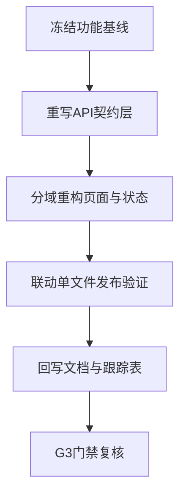

# 编程者下一步工作计划 `manager_service` 前端重构约束版

- 日期: 2026-04-12
- 备注: 本计划依据 [`AI协作统一规则`](doc/ai-coding-unified-rules.md) 与 [`manager_service` 架构最终版](doc/architect/manager_service_final_architect_doc.md) 制定，强调前端重构实现而非移植复用。
- 风险:
  - 现有前端仍保留大量主控直连兼容路径，破坏单入口约束。
  - 多处 `not implemented` 与降级分支掩盖真实能力缺口。
  - 旧实现迁移惯性导致重构边界失控，功能语义与代码结构难以维护。
  - 单文件发布场景下前后端版本不一致会触发运行期故障。
- 遗留事项:
  - 需按域拆分并重写 `controller-api.ts` 的直连逻辑。
  - 网络助手与升级流仍需按白名单补齐 API 对应能力。
  - 需求跟踪表需在每轮提交同步回写。
- 进度状态: 待执行
- 完成情况: 已完成代码核查、约束固化与下一步计划编排。
- 检查表:
  - [x] 代码现状核查
  - [x] 偏离项归类
  - [x] 编码功能约束落盘
  - [ ] 重构实施
  - [ ] 回归验证
  - [ ] G3 门禁复核
- 跟踪表状态: 实现中
- 结论记录: 前端必须按现有技术架构重构并保留原功能需求，不得以简单引用移植方式推进。

## 现状核查结论 代码证据

1. 直连主控路径仍大量存在
   - [`controller-api.ts`](manager_service/frontend/src/modules/app/services/controller-api.ts:29) 持续依赖 [`callAdminWSRpc()`](manager_service/frontend/src/modules/app/services/admin-ws-rpc.ts:12)
   - 该文件虽然标注 `deprecated`，但业务函数仍为主路径实现。

2. 前端存在功能占位与降级分支
   - 网络助手仍有 `not implemented` 逻辑，见 [`useNetworkAssistant.ts`](manager_service/frontend/src/modules/app/hooks/useNetworkAssistant.ts:206)
   - 升级流仍耦合 controller 直连服务，见 [`useUpgradeFlow.ts`](manager_service/frontend/src/modules/app/hooks/useUpgradeFlow.ts:3)

3. 单文件发布基础已具备但需工程化闭环
   - 内嵌资源已接入 [`embed.FS`](manager_service/web/embed.go:8)
   - SPA 回退路由已在 [`router.go`](manager_service/internal/api/router.go:81) 落地
   - 仍需前端重构后完成端到端发布链路验证

## 编码功能约束 执行时强制遵守

- C-FE-01 保留原有功能需求与业务语义，不允许以删功能替代重构。
- C-FE-02 前端仅可在 `React` `Vite` `TypeScript` 现有技术架构内重构。
- C-FE-03 禁止简单引用或批量移植旧前端代码，必须按模块重写。
- C-FE-04 页面层不得直接调用主控 WS-RPC，统一改为 `manager_service` API。
- C-FE-05 `services` 层先定义契约再实现，`hooks` 只负责编排状态。
- C-FE-06 任何临时兼容代码必须标记 `deprecated` 并附清退任务号。
- C-FE-07 单可执行文件场景下，前端资源版本必须与后端接口版本同批发布。
- C-FE-08 每个重构任务必须映射到 RQ 编号并回写跟踪表。

## 编码者下一步执行计划

### PKG-FE-R01 功能基线冻结与重构边界定义 对应 RQ-003 RQ-007
- 输出前端功能清单，按业务域分组
- 明确保留功能、暂缓功能、禁用功能三类清单
- 建立旧实现到新模块的映射表，禁止直接复制文件迁移

### PKG-FE-R02 API 契约层重写 对应 RQ-003 RQ-004
- 将直连主控调用改写为 `manager_service` API 调用
- 重构 [`controller-api.ts`](manager_service/frontend/src/modules/app/services/controller-api.ts:1) 为纯网关契约客户端
- 清理 [`admin-ws-rpc.ts`](manager_service/frontend/src/modules/app/services/admin-ws-rpc.ts:12) 的可执行调用路径

### PKG-FE-R03 业务域模块化重构 对应 RQ-003 RQ-004 RQ-010
- 网络助手域重构: 移除 `not implemented` 隐式降级，改为明确能力态
- 升级域重构: 去除 controller 直连依赖，统一走后端代理契约
- 节点与链路域重构: 保留原功能语义，按 `components hooks services` 分层实现

### PKG-FE-R04 单文件发布联动收敛 对应 RQ-010
- 将前端构建产物内嵌流程纳入发布流水线
- 校验 `NoRoute` SPA 回退与静态资源命中策略
- 验证单可执行文件启动后全功能可访问

### PKG-GOV-R01 文档与跟踪表回写 对应统一规则
- 回写编码阶段文档 W3 当前状态
- 更新 [`需求跟踪表`](doc/architect/manager_service_final_requirement_tracking.md) 的编码状态与风险
- 提交约束执行证据与差异摘要

### PKG-TEST-R01 G3 门禁前自测包
- 执行前端构建与静态检查
- 执行后端编译与接口联调
- 完成核心链路回归: 登录 节点 网络助手 升级 日志

## 需求映射

| 需求编号 | 下一步执行包 | 验证口径 |
|---|---|---|
| RQ-003 | PKG-FE-R01 R02 R03 | 前端仅经 `manager_service` 通信 |
| RQ-004 | PKG-FE-R02 R03 | 主控探针交互功能语义保留 |
| RQ-007 | PKG-FE-R01 GOV-R01 | 阶段顺序与文档回写一致 |
| RQ-010 | PKG-FE-R03 R04 | 单可执行文件内嵌页面可用 |

## 执行顺序

## 门禁判定

- 存在主控直连可执行路径: 不通过
- 存在移植式大段复制改造且无模块化重写证据: 不通过
- 需求映射与跟踪表未更新: 不通过
- 单可执行文件启动后前端不可用: 不通过
