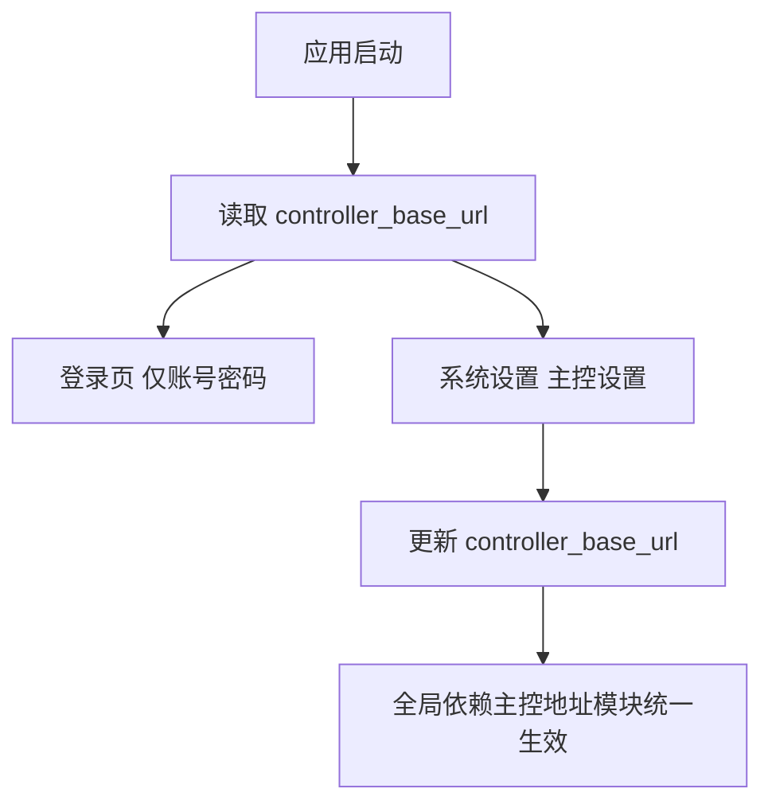

# 架构阶段增量文档 `manager_service` 主控地址迁移至系统设置与登录页去主控信息

## 工作依据与规则传递声明
- 当前角色: 架构师
- 工作依据文档: `doc/ai-coding-unified-rules.md`
- 适用规则: AI协作统一规则 单一规范
- 规则遵循声明: 必须遵守本规则。
- 协作传递要求: 后续接手者与协作者必须遵守同一规则。

- 日期: 2026-04-18
- 备注: 用户已确认统一口径 登录页完全移除主控地址 系统设置主控子页提供唯一主控地址输入 探针管理页移除单独主控地址输入。
- 风险:
  - 探针管理页移除临时地址输入后，用户需先在系统设置完成主控地址配置。
  - 若主控地址为空或格式错误，会影响依赖主控的功能链路。
  - 首次注册阶段与登录阶段 UI 切换时，需避免状态抖动与提示不一致。
- 遗留事项:
  - 编码阶段补充地址合法性校验与错误提示统一文案。
  - 测试阶段补充旧本地存储值兼容回归。
- 进度状态: 已完成
- 完成情况: 已完成影响面分析、方案拆分、接口与状态流设计、测试验收定义。
- 检查表:
  - [x] 已显式记录工作依据与规则传递声明
  - [x] 已完成改造边界确认
  - [x] 已完成前端单元改造方案
  - [x] 已完成兼容策略定义
  - [x] 已完成测试验收清单
- 跟踪表状态: 待实现
- 结论记录: 采用 单一主控地址配置源 `controller_base_url`，入口位于系统设置，登录页不再展示主控信息。

## 字符集编码基线
- 字符集类型: 保持原格式，不做统一改写；新增与修改文件沿用各自文件当前字符集。
- BOM策略: 保持原格式，不额外新增或移除 BOM。
- 换行符规则: 保持原格式，不做全量 CRLF 或 LF 迁移。
- 跨平台兼容: 在不改变现有文件编码与换行的前提下，确保现有工具链可读可编辑。
- 历史文件迁移策略: 本需求不做批量迁移，仅在必要变更文件内延续原有编码与换行。

## 关键选型与取舍

### 选型1 登录页主控地址展示
- 方案A 保留登录页主控地址输入
- 方案B 登录页不展示主控信息
- 结论 选择方案B
- 依据 登录页职责聚焦认证，避免配置入口分散。

### 选型2 主控地址配置入口
- 方案A 多处入口并行 登录页 探针管理页 系统设置
- 方案B 系统设置唯一入口
- 结论 选择方案B
- 依据 降低认知负担，保证配置来源单一。

### 选型3 探针管理页主控地址行为
- 方案A 保留临时覆盖输入
- 方案B 统一读取全局配置并移除本页输入
- 结论 选择方案B
- 依据 避免局部覆盖导致行为不一致和排障困难。

## 总体设计
- 全局主控地址来源保持为本地存储键 `controller_base_url`，默认值保持 `http://127.0.0.1:15030`。
- 登录页移除主控地址输入，仅保留用户名与密码登录。
- 系统设置 主控设置 子页新增 `controller_url` 配置区，负责读取与保存 `controller_base_url`。
- 探针管理页移除页面级 `controllerAddress` 输入和状态，统一使用传入的全局 `controllerBaseUrl`。

## 单元设计

### U-FE-CTL-01 登录页去主控信息
- 目标文件: `manager_service/frontend/src/modules/app/components/LoginPanel.tsx`
- 设计要点:
  - 删除 `baseUrl` 与 `onBaseUrlChange` 属性。
  - 移除 `Controller URL` 输入区。
  - 保持登录按钮和状态提示逻辑不变。

### U-FE-CTL-02 应用入口参数收敛
- 目标文件: `manager_service/frontend/src/App.tsx`
- 设计要点:
  - 渲染 `LoginPanel` 时不再传主控地址相关属性。
  - 保持各业务模块对 `settings.baseUrl` 的统一引用。

### U-FE-CTL-03 系统设置新增唯一主控地址配置
- 目标文件: `manager_service/frontend/src/modules/app/components/SystemSettingsTab.tsx`
- 设计要点:
  - 在 主控设置 子页新增 `controller_url` 输入与 读取设置 保存设置 按钮。
  - 与现有 `controller_ip` 并存，分别承担 URL 与 IP 覆盖职责。
  - 保存后给出统一状态提示。

### U-FE-CTL-04 本地设置 Hook 暴露状态与操作
- 目标文件: `manager_service/frontend/src/modules/app/hooks/useLocalSettings.ts`
- 设计要点:
  - 保持 `controller_base_url` 键不变。
  - 新增 `baseUrlStatus`、`isSavingBaseUrl`、`refreshBaseUrl`、`saveBaseUrl` 供系统设置使用。
  - 默认值与回退策略不变。

### U-FE-CTL-05 探针管理页移除局部主控地址输入
- 目标文件: `manager_service/frontend/src/modules/app/components/ProbeManageTab.tsx`
- 设计要点:
  - 删除 `controllerAddress` 本地状态与页面输入框。
  - 将所有主控调用统一切换为 `props.controllerBaseUrl`。
  - 安装命令构建函数统一使用全局主控地址。

### U-FE-CTL-06 透传类型与属性对齐
- 目标文件: `manager_service/frontend/src/modules/app/components/TabContent.tsx`
- 设计要点:
  - 为系统设置补充主控地址相关属性透传。
  - 保持既有子模块参数兼容。

## 接口与状态约束
- 不新增后端接口。
- 本次改造仅调整前端配置入口与状态流。
- `controller_base_url` 作为唯一主控地址配置源保持不变。

## 执行单元包拆分
- PKG-FE-CTL-01: 登录页去主控地址输入
- PKG-FE-CTL-02: 系统设置新增主控地址配置能力
- PKG-FE-CTL-03: 探针管理页移除局部主控地址输入并统一全局地址
- PKG-FE-CTL-04: 本地设置 Hook 状态与方法扩展
- PKG-QA-CTL-01: 回归验证与兼容测试

## 编码测试映射
| 需求编号 | 执行单元包 | 验证口径 |
|---|---|---|
| RQ-CTL-UI-001 | PKG-FE-CTL-01 | 登录页不再出现主控地址相关输入或文案 |
| RQ-CTL-UI-002 | PKG-FE-CTL-02 PKG-FE-CTL-04 | 系统设置主控子页可读取 保存 `controller_base_url` |
| RQ-CTL-UI-003 | PKG-FE-CTL-03 | 探针管理页不再提供单独主控地址输入，所有请求使用统一配置 |
| RQ-CTL-UI-004 | PKG-QA-CTL-01 | 旧本地存储主控地址升级后仍可生效 |

## 测试与验收清单
- 登录页验收
  - 仅显示认证相关字段
  - 不出现 Controller URL 或主控地址输入
- 系统设置验收
  - 主控设置页可读取当前主控地址
  - 修改并保存后刷新页面仍持久化
  - 非法地址输入提示合理
- 探针管理验收
  - 页面不再显示主控地址输入框
  - 刷新列表 日志 Shell 等依赖主控调用正常
  - 安装命令中的地址来源为全局主控地址
- 兼容回归
  - 本地已有 `controller_base_url` 时升级后自动沿用
  - 未配置时使用默认值 `http://127.0.0.1:15030`

## 需求跟踪表更新说明
- 新增 RQ-CTL-UI-001 到 RQ-CTL-UI-004。
- 当前阶段状态统一为 待实现。
