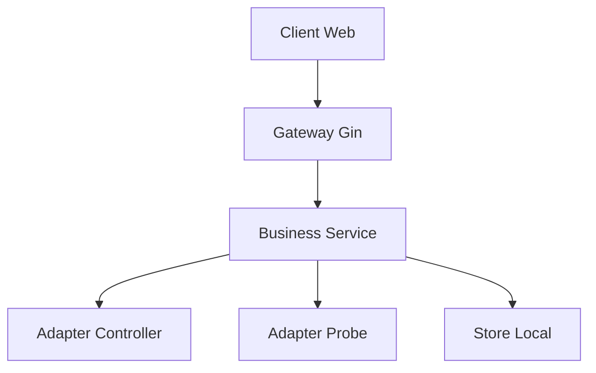
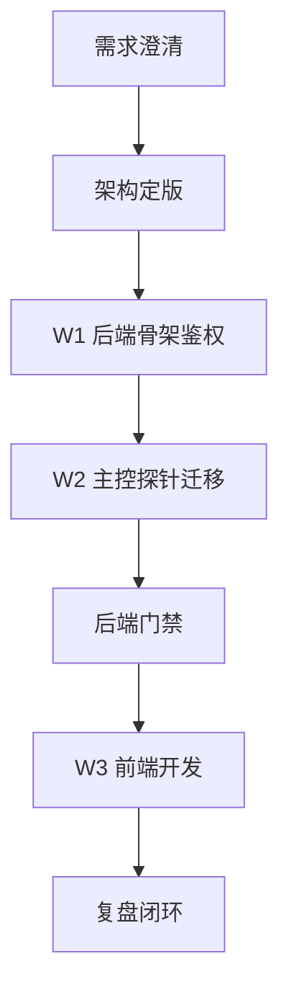

# 架构师阶段文档 `manager_service` 最终版
- 日期: 2026-04-12
- 备注: 已按最新 [`AI协作统一规则`](doc/ai-coding-unified-rules.md) 重新对齐，本文为唯一架构执行基线。
- 风险:
  - API 语义与原实现不一致，导致后续前端对接失败。
  - 主控与探针交互迁移出现行为漂移。
  - 单账户用户名密码初始化或重置失败导致登录阻塞。
  - 原 `probe_manager` 冻结约束被破坏。
- 遗留事项:
  - 首次账户初始化与本机重置流程在后端实现阶段固化。
  - 后端 API 字段字典与错误码字典在后端门禁前冻结。
  - 前端阶段在后端门禁通过后单独立项。
- 进度状态: 已完成
- 完成情况: 已完成需求收敛、关键选型、总体设计、单元设计、接口定义、执行拆分与门禁口径。
- 检查表:
  - [x] 统一需求主文档
  - [x] 关键选型决策记录
  - [x] 总体设计说明
  - [x] 单元设计说明
  - [x] 接口定义清单
  - [x] 执行单元包清单
  - [x] 编码与测试映射关系
  - [x] 需求跟踪表更新说明
- 跟踪表状态: 待实现
- 结论记录: 采用 新建独立 `manager_service` + 后端先行迁移 + 前端后置接入 的执行路线，默认不修改 `probe_controller` 与 `probe_node`，若阻断再走最小变更评审。

## 统一需求主文档

### 目标
- 新建独立项目 `manager_service`，承载纯服务后端能力。
- 服务监听固定为 `127.0.0.1:16033`。
- 迁移原管理能力中与主控、探针交互的能力到新项目。
- 登录改为单账户用户名密码模型，支持登录后修改用户名密码。
- 执行顺序固定为 后端迁移完成后 再开展前端开发。

### 范围
- In Scope
  - 新建 `manager_service` 项目结构、启动入口、配置与日志。
  - 使用 `gin` 实现后端 API 与中间件。
  - 迁移主控探针交互能力并保持行为等价。
  - 落地单账户鉴权与会话管理。
  - 输出后端 API 契约作为后续前端唯一输入。
- Out of Scope
  - 改动 `probe_manager` 实现代码。
  - 改动 `probe_controller` 与 `probe_node` 协议和实现。
  - 前端开发与后端并行推进。

### 需求编号
- RQ-001 新建独立 `manager_service` 项目作为迁移载体
- RQ-002 服务仅监听 `127.0.0.1:16033`
- RQ-003 前端仅通过 `manager_service` 后端通信
- RQ-004 迁移并兼容原有主控探针交互能力
- RQ-005 单账户用户名密码登录
- RQ-006 登录后允许修改用户名密码
- RQ-007 执行顺序 后端迁移先完成 再进入前端开发
- RQ-008 原 `probe_manager` 冻结不改动
- RQ-009 默认不修改主控与探针 若阻断则单独评审最小改动

### 验收标准
- AC-001 `manager_service` 独立启动成功并可提供健康检查。
- AC-002 仅本机可访问 `127.0.0.1:16033`。
- AC-003 主控探针关键交互链路行为与基线一致。
- AC-004 登录 改密 改名 再登录全链路可通过。
- AC-005 后端 API 契约冻结并通过评审。
- AC-006 `probe_manager` 目录保持零变更。

## 关键选型与取舍

### 选型一 项目承载
- 结论: 新建独立 `manager_service`。
- 取舍: 放弃在 `probe_manager` 内增量改造，换取边界清晰与冻结可审计。

### 选型二 后端框架
- 结论: 使用 `gin`。
- 取舍: 相比纯 `net/http` 手写中间件，`gin` 在路由分组、鉴权中间件、统一错误处理落地更快。
- 约束: 仅在新项目引入，不反向影响现有项目。

### 选型三 鉴权与存储
- 结论: `bcrypt` + 本地凭据文件 + 内存会话 Token。
- 取舍: 先满足单账户安全与实现成本平衡，后续可升级口令算法策略。

### 选型四 迁移方式
- 结论: 分波次迁移，W1 后端骨架与鉴权，W2 业务能力迁移，W3 前端接入。
- 取舍: 放弃一次性迁移，降低回归面。

### 选型五 主控探针边界
- 结论: 默认不修改 `probe_controller` 与 `probe_node`。
- 例外: 若出现阻断，单独提变更单，评审后最小改动。

## 总体设计

### 设计原则
- 单一后端入口，所有前端请求仅访问 `manager_service`。
- 与主控探针交互保持协议兼容，先迁移再优化。
- 分阶段门禁，后端门禁通过后才启动前端阶段。

### 分层结构
- 接入层: `gin` 路由、中间件、鉴权门面。
- 业务层: 管理域服务、网络助手域服务、节点域服务、升级日志域服务。
- 适配层: 主控适配器、探针适配器、本地系统适配器。
- 存储层: 本地配置与凭据存储、会话状态内存存储。

### 生命周期
- 启动阶段: 加载配置与凭据、初始化路由与服务、绑定本机监听。
- 运行阶段: 提供 API 服务、执行业务任务与回写日志。
- 关闭阶段: 优雅停止请求接入、完成必要清理与状态落盘。

## 单元设计

### 单元一 网关与中间件单元
- 职责: 路由注册、鉴权校验、统一错误响应、审计日志。
- 输入: HTTP 请求与会话 Token。
- 输出: 统一结构响应与错误码。

### 单元二 身份认证单元
- 职责: 单账户登录、会话签发、改密改名、重置入口。
- 输入: 用户名密码与会话上下文。
- 输出: 登录结果、会话状态、凭据变更结果。

### 单元三 主控交互单元
- 职责: 对接主控鉴权、代理查询、链路相关管理接口。
- 输入: 业务命令与参数。
- 输出: 主控返回结果与标准化错误。

### 单元四 探针交互单元
- 职责: 节点操作、链路探测、状态查询。
- 输入: 节点标识与操作参数。
- 输出: 探针结果与标准化错误。

### 单元五 网络助手单元
- 职责: 网络助手状态、策略、缓存、路由同步等能力迁移。
- 输入: 配置与控制指令。
- 输出: 状态快照与执行结果。

### 单元六 升级日志单元
- 职责: 版本查询、升级任务执行、日志读取。
- 输入: 升级请求与日志查询参数。
- 输出: 升级进度、结果与日志内容。

## 接口定义

### 公共接口
- `GET /healthz` 健康检查。
- `GET /api/system/version` 服务版本信息。

### 认证接口
- `POST /api/auth/login` 用户名密码登录。
- `POST /api/auth/logout` 会话注销。
- `POST /api/auth/password/change` 登录后修改用户名密码。
- `POST /api/auth/password/reset-local` 本机重置入口。

### 主控探针迁移接口
- `POST /api/controller/session/login` 主控会话建立。
- `GET /api/probe/nodes` 节点列表查询。
- `POST /api/probe/link/test` 链路探测。
- `GET /api/network-assistant/status` 网络助手状态。
- `POST /api/network-assistant/mode` 网络助手模式切换。
- `POST /api/upgrade/manager` 管理端升级任务。
- `GET /api/logs/manager` 管理日志查询。

### 接口治理要求
- 响应结构统一为 `code` `message` `data` `request_id`。
- 业务错误统一映射错误码字典。
- 关键接口保留审计字段 `operator` `action` `result`。

## 执行单元包拆分

### W1 后端骨架与鉴权
- PKG-W1-01 创建 `manager_service` 项目结构与启动入口
- PKG-W1-02 监听与配置治理 固定 `127.0.0.1:16033`
- PKG-W1-03 单账户登录 会话 鉴权中间件
- PKG-W1-04 用户名密码修改与本机重置入口

### W2 主控探针交互迁移
- PKG-W2-01 主控鉴权登录代理能力迁移
- PKG-W2-02 节点管理与链路探测能力迁移
- PKG-W2-03 网络助手核心接口迁移
- PKG-W2-04 升级与日志相关能力迁移

### W3 前端阶段 仅后端完成后启动
- PKG-W3-01 前端骨架与 API SDK
- PKG-W3-02 登录与会话管理
- PKG-W3-03 业务页接入与联调

## 编码测试映射

| 需求编号 | 编码执行单元 | 测试单元 |
|---|---|---|
| RQ-001 | PKG-W1-01 | TST-W1-01 独立项目启动验证 |
| RQ-002 | PKG-W1-02 | TST-W1-02 本机监听验证 |
| RQ-003 | PKG-W3-01 W3-03 | TST-W3-01 前后端联调 |
| RQ-004 | PKG-W2-01 W2-04 | TST-W2-01 主控探针交互等价回归 |
| RQ-005 | PKG-W1-03 | TST-AUTH-01 登录矩阵 |
| RQ-006 | PKG-W1-04 | TST-AUTH-02 改密改名后重登 |
| RQ-007 | W1 W2 W3 | TST-REL-01 分阶段门禁 |
| RQ-008 | 全部包执行约束 | TST-GOV-01 原项目零变更审计 |
| RQ-009 | W2 迁移期约束 | TST-GOV-02 阻断变更单审计 |

## 门禁检查表

### G1 需求门
- G1-01 需求编号覆盖完整
- G1-02 后端先行前端后置边界明确
- G1-03 跟踪表已建立

### G2 架构门
- G2-01 关键选型与取舍依据完整
- G2-02 总体设计完整
- G2-03 单元设计完整
- G2-04 接口定义完整
- G2-05 执行单元包与映射关系完整

### G2-TECH 技术门
- T-01 端口 鉴权 迁移一致性 冻结约束风险均覆盖
- T-02 技术选型定版为 `gin`
- T-03 W1 前置 POC 全部通过后才进入大规模迁移

## 需求跟踪表更新说明
- 需求跟踪表以 [`manager_service_final_requirement_tracking.md`](doc/architect/manager_service_final_requirement_tracking.md) 为唯一有效版本。
- 增加 RQ-009 记录 主控探针阻断例外变更治理。
- 当前责任角色为架构师，进入编码阶段后切换为编码者持续更新。

