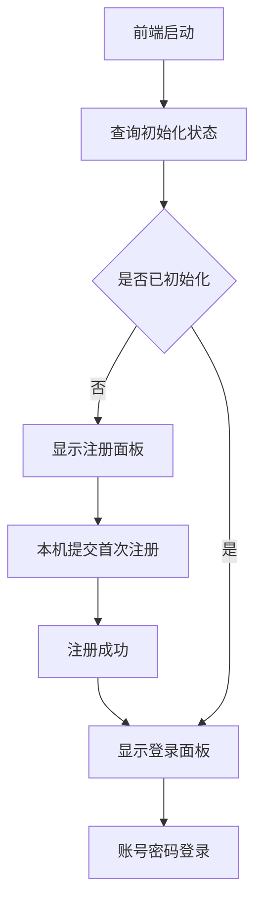

# 架构师阶段文档 manager_service 首次登录改为本机注册管理员

## 工作依据与规则传递声明
- 当前角色: 架构师
- 工作依据文档: [`doc/ai-coding-unified-rules.md`](doc/ai-coding-unified-rules.md)
- 适用规则: AI协作统一规则 单一规范
- 规则遵循声明: 必须遵守本规则。
- 协作传递要求: 后续接手者与协作者必须遵守同一规则。

- 日期: 2026-04-18
- 备注: 用户已确认 首次打开先注册管理员账号 不再使用固定默认密码。
- 风险:
  - 旧版本存在默认凭据兼容路径，迁移判定不当会导致已有实例无法登录。
  - 当前前端存在硬编码自动重登逻辑，会与无默认密码策略冲突。
  - 首次注册接口若并发控制不足，可能出现重复初始化。
- 遗留事项:
  - 需编码阶段补齐后端并发与幂等测试。
  - 需测试阶段补齐升级兼容回归。
- 进度状态: 已完成
- 完成情况: 已完成需求口径确认、设计拆分、执行单元包、验收口径。
- 检查表:
  - [x] 已显式记录工作依据与规则传递声明
  - [x] 已显式询问并确认编码格式基线
  - [x] 已完成后端与前端改造方案
  - [x] 已完成迁移兼容策略
  - [x] 已完成测试验收清单
- 跟踪表状态: 待实现
- 结论记录: 采用 首次本机注册 + 永久关闭注册接口 + reset-local 回到未初始化态 的统一方案。

## 编码格式基线
- Go: 使用 [`gofmt`](manager_service/main.go:1) 与 [`go vet`](manager_service/main.go:1) 作为基线。
- TypeScript: 沿用现有 ESLint 与 Prettier 规范，保持 [`manager_service/frontend/src`](manager_service/frontend/src) 既有风格。
- PowerShell: 保持 [`scripts`](scripts) 目录既有脚本风格。

## 关键选型与取舍

### 选型1 首次认证入口
- 方案A 保留固定默认账号密码登录
- 方案B 首次访问先注册管理员账号
- 结论 选择方案B
- 依据 固定默认密码存在安全风险，且与用户预期不一致。

### 选型2 首次注册接口访问范围
- 方案A 任意来源可访问
- 方案B 仅 localhost 可访问
- 结论 选择方案B
- 依据 用户明确要求 本机初始化，最小暴露面。

### 选型3 注册后接口生命周期
- 方案A 可重复调用覆盖凭据
- 方案B 首次成功后永久关闭
- 结论 选择方案B
- 依据 防止被误调用重置，初始化语义清晰。

### 选型4 reset-local 行为
- 方案A 重置为固定默认账号密码
- 方案B 重置为未初始化状态，要求重新注册
- 结论 选择方案B
- 依据 与 无固定默认密码 目标一致。

## 总体设计

- 认证状态新增两态
  - 未初始化: 未完成管理员账号注册
  - 已初始化: 已存在可登录管理员凭据
- 后端新增初始化状态查询与首次注册接口
- 前端在未登录状态下先查询初始化状态
  - 未初始化显示注册面板
  - 已初始化显示登录面板
- 兼容升级
  - 旧数据若存在凭据文件并包含有效用户名与密码哈希，视为已初始化
  - 避免升级后老用户被迫重新注册

## 单元设计

### U-BE-BOOT-01 认证服务状态模型
- 目标: 在 [`manager_service/internal/auth/auth.go`](manager_service/internal/auth/auth.go) 引入初始化状态语义。
- 设计:
  - 删除固定默认密码初始化逻辑。
  - 新增 `IsInitialized` 判定。
  - 新增 `RegisterInitialAdmin` 一次性注册方法，内部加锁保证并发安全。
  - `ResetLocal` 调整为清空到未初始化态。

### U-BE-BOOT-02 HTTP 接口扩展
- 目标: 在 [`manager_service/internal/api/handler/auth_handler.go`](manager_service/internal/api/handler/auth_handler.go) 增加初始化相关接口。
- 新增接口:
  - `GET /api/auth/bootstrap/status` 无鉴权，返回初始化状态。
  - `POST /api/auth/bootstrap/register` 仅 localhost，首次注册管理员。
- 路由接入点: [`manager_service/internal/api/router.go`](manager_service/internal/api/router.go)
- 本机限制: 复用 [`LocalhostOnly`](manager_service/internal/api/middleware/audit.go:57)

### U-FE-BOOT-01 前端登录前状态机
- 目标: 在 [`manager_service/frontend/src/App.tsx`](manager_service/frontend/src/App.tsx) 增加未初始化分支。
- 设计:
  - 未登录态先拉取 bootstrap status。
  - `initialized=false` 显示 RegisterPanel。
  - `initialized=true` 显示 LoginPanel。

### U-FE-BOOT-02 认证 Hook 扩展
- 目标: 在 [`manager_service/frontend/src/modules/app/hooks/useAuthFlow.ts`](manager_service/frontend/src/modules/app/hooks/useAuthFlow.ts) 支持注册与状态查询。
- 设计:
  - 新增 `loadBootstrapStatus` 与 `registerInitialAdmin`。
  - 移除固定账号自动重登依赖，避免 [`reauthenticateSession`](manager_service/frontend/src/App.tsx:77) 使用硬编码凭据。

### U-FE-BOOT-03 API 契约扩展
- 目标: 在 [`manager_service/frontend/src/modules/app/manager-api.ts`](manager_service/frontend/src/modules/app/manager-api.ts) 新增 bootstrap API。
- 新增函数:
  - `apiGetBootstrapStatus`
  - `apiRegisterInitialAdmin`

### U-DOC-BOOT-01 运维与使用说明更新
- 目标: 更新 [`README.md`](README.md) 与 [`scripts/manager_service_windows_service_usage.md`](scripts/manager_service_windows_service_usage.md) 首次登录章节。
- 口径:
  - 首次必须本机注册。
  - 注册后使用自定义管理员账号登录。
  - [`reset-local`](manager_service/internal/api/router.go:53) 仅本机可调用，调用后回到未初始化态。

## 接口定义

### GET /api/auth/bootstrap/status
- 鉴权: 无
- 返回:
  - `initialized` 布尔
  - `localhost_only` 布尔 固定为真

### POST /api/auth/bootstrap/register
- 鉴权: 无
- 访问限制: localhost only
- 请求:
  - `username`
  - `password`
- 行为:
  - 未初始化时成功注册并落盘
  - 已初始化时返回冲突错误
- 返回:
  - `message`

### POST /api/auth/password/reset-local
- 鉴权: 无
- 访问限制: localhost only
- 新语义:
  - 清空管理员凭据并回到未初始化态

## 执行单元包拆分
- PKG-BE-BOOT-01: 认证状态模型与落盘结构改造
- PKG-BE-BOOT-02: bootstrap status/register 接口与路由接入
- PKG-FE-BOOT-01: 登录页状态机改造 注册面板接入
- PKG-FE-BOOT-02: 前端认证 API 与 Hook 改造 移除硬编码自动重登
- PKG-DOC-BOOT-01: 首次注册与重置运维文档更新
- PKG-QA-BOOT-01: 单测 集成回归 验收用例

## 编码测试映射

| 需求编号 | 执行单元包 | 验证口径 |
|---|---|---|
| RQ-BOOT-001 | PKG-BE-BOOT-01 | 新安装实例启动后不生成固定默认密码 |
| RQ-BOOT-002 | PKG-BE-BOOT-02 | 仅 localhost 可调用首次注册接口 |
| RQ-BOOT-003 | PKG-BE-BOOT-02 PKG-FE-BOOT-01 | 首次访问展示注册面板 注册成功后切登录面板 |
| RQ-BOOT-004 | PKG-FE-BOOT-02 | 不再依赖硬编码凭据自动重登 |
| RQ-BOOT-005 | PKG-BE-BOOT-01 PKG-QA-BOOT-01 | reset-local 后回到未初始化态并需重新注册 |
| RQ-BOOT-006 | PKG-BE-BOOT-01 PKG-QA-BOOT-01 | 旧版本凭据文件升级后仍可登录 |

## 测试与验收清单
- 首次安装
  - 启动后查询 bootstrap status 为未初始化
  - 登录页显示注册面板
- 首次注册
  - localhost 注册成功
  - 非 localhost 返回禁止
  - 并发注册仅一条成功
- 登录与会话
  - 注册后可正常登录
  - 会话过期后回到登录界面
  - 不出现硬编码账号自动登录
- 重置与恢复
  - reset-local 成功后状态回到未初始化
  - 再次访问显示注册面板
- 升级兼容
  - 已存在凭据文件升级后状态保持已初始化
  - 旧账号密码仍可登录

## 门禁判定建议
- G2 架构门
  - 通过条件: 本文档与跟踪表完整，编码格式基线已记录，接口与迁移方案明确。
- G3 编码核查门
  - 重点核验: 不再落地固定默认密码、localhost 限制生效、自动重登硬编码已移除。
- G4 测试核查门
  - 重点核验: 首次注册路径、reset-local 回退路径、升级兼容路径。

## 需求跟踪表更新说明
- 新增 RQ-BOOT-001 到 RQ-BOOT-006。
- 当前阶段状态统一为 待实现。
