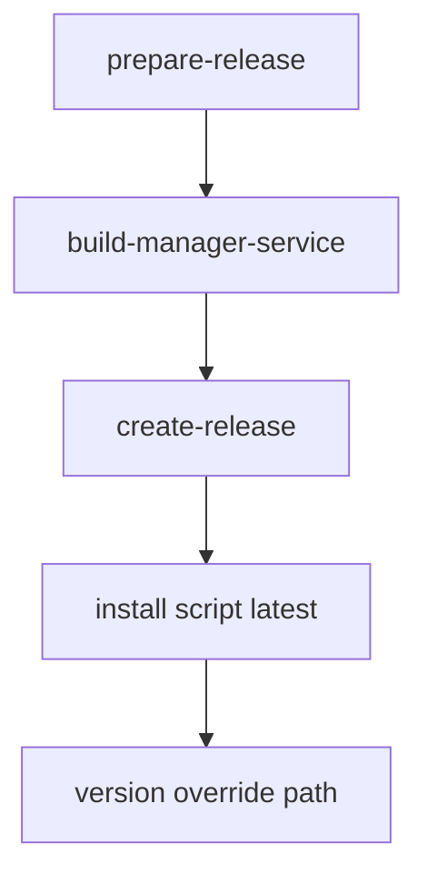

# 架构阶段增量文档 `manager_service` GitHub 自动发布与安装源切换
- 日期: 2026-04-13
- 备注: 在既有 `manager_service` 架构基线上新增发布链路与安装源头约束，安装脚本从 GitHub Release 下载资产。
- 风险:
  - Release 资产命名不一致会导致安装脚本下载失败。
  - Workflow 未纳入 `manager_service` 构建会造成“latest 无资产”。
  - 安装脚本网络失败或 API 限流会导致部署中断。
- 遗留事项:
  - 需在编码阶段补充下载失败重试与错误提示分级。
  - 需在测试阶段补充 latest 与指定 version 双路径回归。
- 进度状态: 已完成
- 完成情况: 已完成方案定版、执行单元包拆分、接口定义与门禁口径。
- 检查表:
  - [x] 发布链路方案定义
  - [x] 安装脚本下载策略定义
  - [x] 资产命名与版本策略冻结
  - [x] 编码测试映射定义
- 跟踪表状态: 待实现
- 结论记录: 采用 `release.yml` 新增 `manager_service` 构建发布，安装脚本默认按 latest 下载 `cloudhelper-manager-service-windows-amd64.exe`，并支持 `-Version` 覆盖指定 tag。

## 关键选型与取舍

### 选型1 安装下载源
- 方案A 本地二进制复制
- 方案B GitHub Release 下载
- 结论 选择方案B
- 依据 满足统一安装源、简化现场部署、降低人工传包错误。

### 选型2 版本策略
- 方案A 仅 latest
- 方案B latest 默认 + version 覆盖
- 结论 选择方案B
- 依据 兼顾默认易用与可追溯回滚。

### 选型3 资产命名
- 冻结名称 `cloudhelper-manager-service-windows-amd64.exe`
- 依据 安装脚本与发布链路一致性最小复杂度。

## 总体设计

- CI/CD 层
  - 在 [`release.yml`](.github/workflows/release.yml) 增加 `build-manager-service` job
  - 在 `create-release` job 增加该 artifact 下载与发布
- 安装脚本层
  - 安装脚本新增 GitHub API 查询 release
  - 默认走 latest，`-Version` 指定时走 `tags/<version>`
  - 下载资产后安装到 `C:\Tools\CloudManager\manager_service.exe`
- 升级脚本层
  - 升级脚本与安装脚本共用下载策略
  - 支持无本地包直接在线升级

## 单元设计

### U-CI-01 发布流水线单元
- 目标: 产出并发布 `manager_service` Windows 资产
- 文件: `.github/workflows/release.yml`

### U-SCRIPT-01 安装脚本下载单元
- 目标: 从 GitHub Release 下载资产并完成服务安装
- 文件: `scripts/install_manager_service_windows.ps1`

### U-SCRIPT-02 升级脚本下载单元
- 目标: 从 GitHub Release 下载并替换服务二进制
- 文件: `scripts/update_manager_service_windows.ps1`

### U-DOC-01 使用文档单元
- 目标: 补充 latest 与 version 覆盖示例
- 文件: `scripts/manager_service_windows_service_usage.md`

## 接口定义

### PowerShell 参数扩展
- 安装脚本新增
  - `-GitHubRepo` 默认 `fengzhanhuaer/CloudHelper`
  - `-AssetName` 默认 `cloudhelper-manager-service-windows-amd64.exe`
  - `-Version` 可选，支持 `v1.2.3` 或 `1.2.3`
- 升级脚本新增同名参数，保持一致。

### GitHub API 路径
- latest: `https://api.github.com/repos/<repo>/releases/latest`
- 指定版本: `https://api.github.com/repos/<repo>/releases/tags/<tag>`

## 执行单元包拆分
- PKG-CI-20: `release.yml` 增加 `manager_service` 构建发布
- PKG-OPS-20: 安装脚本改为 GitHub 下载 + `-Version` 覆盖
- PKG-OPS-21: 升级脚本改为 GitHub 下载 + `-Version` 覆盖
- PKG-DOC-20: 使用文档更新
- PKG-QA-20: 工作流与脚本回归验证

## 编码测试映射

| 需求编号 | 执行单元包 | 验证口径 |
|---|---|---|
| RQ-013 | PKG-CI-20 | release 产物包含 manager_service 资产 |
| RQ-014 | PKG-OPS-20 | install 默认 latest 下载成功 |
| RQ-015 | PKG-OPS-20 PKG-OPS-21 | `-Version` 指定 tag 下载成功 |
| RQ-016 | PKG-DOC-20 | 文档与实际参数一致 |

## 需求跟踪表更新说明
- 新增 RQ-013 `manager_service` 自动编译发布。
- 新增 RQ-014 安装脚本默认 latest 下载。
- 新增 RQ-015 安装与升级脚本支持 `-Version` 覆盖。
- 新增 RQ-016 发布资产命名固定并与脚本一致。

