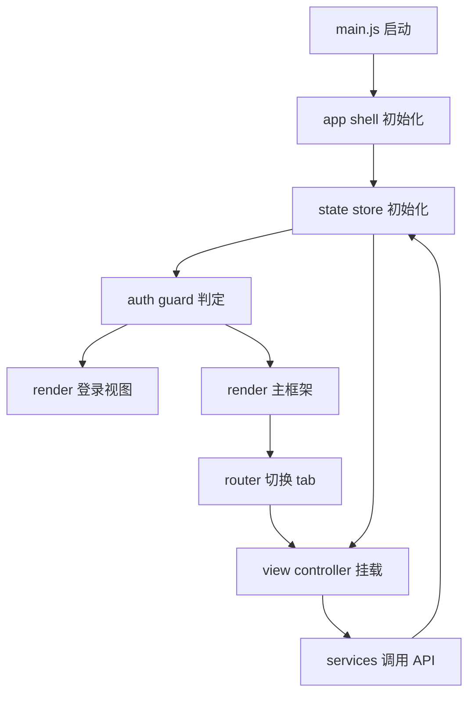

# 架构师阶段文档 `manager_service` 前端一次性重构为 JavaScript + Vite

## 工作依据与规则传递声明
- 当前角色: 架构师
- 工作依据文档: `doc/ai-coding-unified-rules.md`
- 适用规则: AI协作统一规则 单一规范
- 规则遵循声明: 必须遵守本规则。
- 协作传递要求: 后续接手者与协作者必须遵守同一规则。

- 日期: 2026-04-19
- 备注: 用户已确认一次性切换，不保留 React 过渡层，功能与接口契约保持不变，界面风格可参考 NetHelper。
- 风险:
  - 一次性替换涉及模块多，若缺少统一事件模型，容易出现状态不一致。
  - React Hook 语义迁移到无框架状态机后，异步竞态风险上升。
  - 复杂页面如 Network Assistant 与 TG Assistant 的交互密集，回归覆盖不足会导致隐性退化。
- 遗留事项:
  - 编码阶段需要落实运行时参数校验工具与错误边界策略。
  - 测试阶段需要补齐高频路径与失败路径回归矩阵。
- 进度状态: 进行中
- 完成情况: 已完成选型决策、目标架构、迁移单元拆分与门禁口径定义。
- 检查表:
  - [x] 已显式记录工作依据与规则传递声明
  - [x] 已完成字符集编码首次显式询问与确认
  - [x] 已完成关键选型与取舍依据
  - [x] 已完成总体设计与单元设计
  - [x] 已完成接口定义与执行单元包拆分
  - [x] 已完成编码测试映射
- 跟踪表状态: 待实现
- 结论记录: 采用一次性切换方案，重写 `manager_service/frontend` 为原生 JavaScript + Vite 架构。

## 字符集编码基线
- 字符集类型: UTF-8 无 BOM
- BOM策略: 禁止 BOM
- 换行符规则: CRLF
- 跨平台兼容要求: Windows 优先，保证在 Linux 与 macOS 环境可构建与运行
- 历史文件迁移策略: 历史文件保持原样，仅对本次改动文件按基线执行

## 统一需求主文档
- RQ-JS-001: 保持现有功能集合不变，前端技术栈由 React + TypeScript 切换为原生 JavaScript + Vite。
- RQ-JS-002: 保持现有后端 API 契约与鉴权行为不变，禁止新增后端适配接口。
- RQ-JS-003: 页面入口与导航结构保持现有业务语义不变。
- RQ-JS-004: 状态管理从 Hook 迁移为统一状态仓库与事件总线。
- RQ-JS-005: UI 采用暗色风格，参考 NetHelper 的布局层次和视觉变量，但不强制逐像素复刻。
- RQ-JS-006: 删除 React 与 TypeScript 依赖，保留 Vite 构建链路。
- RQ-JS-007: 全量回归通过后才允许切换发布。

## 关键选型与取舍

### 选型1 迁移策略
- 方案A 分阶段过渡 React 与 JS 并存
- 方案B 一次性切换整体替换
- 结论 选择方案B
- 依据 用户明确要求一次性切换，不保留过渡层。

### 选型2 状态组织
- 方案A 按页面各自维护局部状态
- 方案B 单一全局状态仓库 + 事件驱动更新
- 结论 选择方案B
- 依据 便于替代 Hook 依赖，统一异步流程与可观测性。

### 选型3 视图渲染
- 方案A 模板字符串直拼
- 方案B 视图控制器 + 可复用渲染函数
- 结论 选择方案B
- 依据 降低复杂视图重复代码，提升后续维护性。

### 选型4 类型保障
- 方案A 完全放弃类型约束
- 方案B 运行时校验 + 数据标准化
- 结论 选择方案B
- 依据 TypeScript 移除后仍需保证契约稳定。

## 总体设计

- 分层结构
  - `src/app`: 启动与应用壳层
  - `src/state`: 全局状态仓库、action、selector
  - `src/services`: API 调用与运行时校验
  - `src/views`: 页面控制器与视图装配
  - `src/components`: 可复用 UI 片段
  - `src/styles`: 主题变量与布局样式
  - `src/utils`: 通用工具

## 单元设计

### U-JS-01 启动与壳层重写
- 替换 `main.tsx` 与 `App.tsx` 为 `main.js` + `app-shell.js`
- 提供登录态守卫与主布局挂载点

### U-JS-02 状态仓库与事件总线
- 将 `useAuthFlow`、`useConnectionFlow`、`useLocalSettings`、`useUpgradeFlow`、`useLogViewer`、`useNetworkAssistant` 映射为 store actions
- 提供订阅与派发机制

### U-JS-03 API 与服务重写
- 将 `manager-api.ts`、`api.ts`、`services/*.ts` 改为 `.js`
- 加入统一请求包装、错误标准化、数据兜底

### U-JS-04 路由与主导航重写
- 将 `Sidebar` 与 `TabContent` 组合逻辑迁移为无框架 router controller
- 保持 `overview`、`probe-manage`、`network-assistant`、`cloudflare-assistant`、`tg-assistant`、`log-viewer`、`system-settings` 入口语义不变

### U-JS-05 业务页面重写
- 登录、概要、探针、链路、系统设置、升级、日志、网络助手、TG助手全量重写为 JS 控制器

### U-JS-06 视觉系统重写
- 参考 NetHelper 暗色风格变量
- 保留 manager_service 的信息结构与功能控件布局

### U-JS-07 构建链路去 React TS
- 移除 React 与 TypeScript 依赖
- Vite 配置改为 JS 形式

### U-JS-08 回归与门禁
- 构建检查
- 功能回归
- 门禁裁判结论

## 接口定义清单
- 不变接口
  - `/api/auth/*`
  - `/api/system/*`
  - `/api/probe/*`
  - `/api/link/*`
  - `/api/network-assistant/*`
  - `/api/tg-assistant/*`
  - `/api/logs/*`
- 前端内部接口
  - `store.dispatch action`
  - `store.subscribe listener`
  - `view.mount el`
  - `view.unmount`

## 执行单元包拆分
- PKG-JS-01: 启动壳层与路由框架
- PKG-JS-02: 状态仓库与事件总线
- PKG-JS-03: API 服务与运行时校验
- PKG-JS-04: 登录与概要模块
- PKG-JS-05: 探针与链路模块
- PKG-JS-06: 系统设置与升级模块
- PKG-JS-07: 日志与网络助手模块
- PKG-JS-08: TG 与 Cloudflare 模块
- PKG-JS-09: 样式系统与视觉统一
- PKG-JS-10: 去 React TS 与构建收口
- PKG-QA-01: 全量回归与门禁核查

## 编码测试映射
| 需求编号 | 执行单元包 | 验证口径 |
|---|---|---|
| RQ-JS-001 | PKG-JS-01 到 PKG-JS-10 | 前端不再包含 React 与 TypeScript 运行依赖 |
| RQ-JS-002 | PKG-JS-03 | API 请求路径、鉴权头、返回处理行为一致 |
| RQ-JS-003 | PKG-JS-01 PKG-JS-04 到 PKG-JS-08 | 导航入口、页面切换、功能可达性一致 |
| RQ-JS-004 | PKG-JS-02 | 状态流转与事件触发可追踪且稳定 |
| RQ-JS-005 | PKG-JS-09 | 暗色风格统一，信息密度与交互层级可用 |
| RQ-JS-006 | PKG-JS-10 | 构建脚本与配置完成去 React TS 化 |
| RQ-JS-007 | PKG-QA-01 | 回归清单全部通过后才可发布 |

## 门禁判定
- G1 需求门: 通过
- G2 架构门: 通过
- 判定理由: 已完成选型、架构、单元包、映射、字符集基线与规则声明。

## 需求跟踪表更新说明
- 已建立本需求专用跟踪表文档。
- 当前状态全部置为 待实现，责任角色进入编码阶段后切换。
