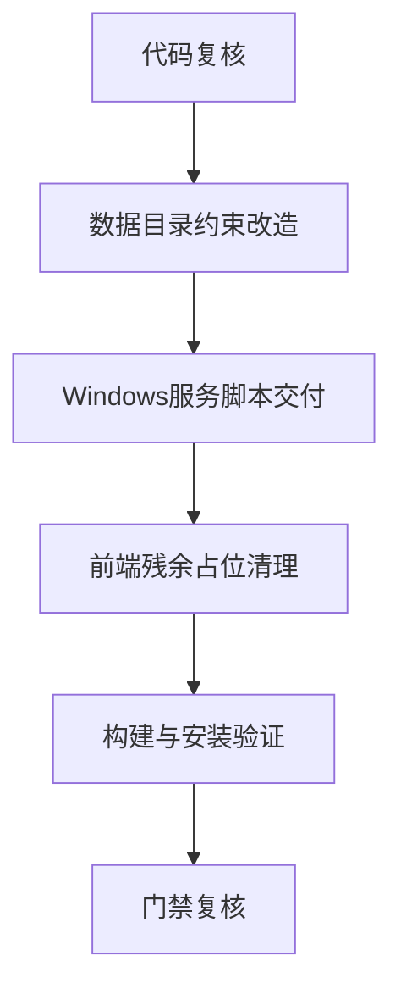

# 架构核查与编码计划文档 `manager_service` Tab 子Tab 对照版

- 日期: 2026-04-12
- 备注: 按 [`AI协作统一规则`](doc/ai-coding-unified-rules.md) 执行；本次基于代码实况复核，并新增 Windows 服务安装与安装目录内存储约束。
- 风险:
  - 文档结论与源码实际状态不一致会导致门禁误判。
  - 数据目录允许外部路径会违反新约束并带来运维漂移。
  - 缺失 `manager_service` Windows 服务安装脚本会阻断交付。
- 遗留事项:
  - 需在编码阶段清理残余占位实现并补齐联调证据。
  - 需补充服务安装 卸载 升级脚本与说明文档。
- 进度状态: 进行中
- 完成情况: 已完成代码复核与下一步编码计划，待编码落地。
- 检查表:
  - [x] 代码对照核查
  - [x] 偏差识别与分级
  - [x] 下一步编码计划拆分
  - [ ] 数据目录约束改造落地
  - [ ] Windows 服务脚本落地
  - [ ] 构建与门禁复核
- 跟踪表状态: 实现中
- 结论记录: 当前整体能力已大幅接近目标，但仍存在约束偏差，需先完成后端约束修正与 Windows 服务脚本交付。

---

## 1 代码审核结论

### 1.1 已对齐项
- `gin` 网关已落地，见 [`NewRouter()`](manager_service/internal/api/router.go:26)。
- 关键后端代理接口已覆盖，见 [`router.go`](manager_service/internal/api/router.go:47)。
- 单入口约束整体收敛，前端源码未发现活动的 controller-api 直连导入。

### 1.2 发现的偏差
1. Tab 子Tab文档“零 PENDING”与源码不完全一致
   - [`LinkManageTab.tsx`](manager_service/frontend/src/modules/app/components/LinkManageTab.tsx:17) 仍存在 `Not implemented` 占位函数。
   - [`LinkManageTab.tsx`](manager_service/frontend/src/modules/app/components/LinkManageTab.tsx:105) 仍存在 `R4-CF-PENDING` 显式占位。

2. 数据存储策略不满足新约束
   - [`resolveDataDir()`](manager_service/internal/config/config.go:99) 仍允许 `MANAGER_SERVICE_DATA_DIR` 外部路径。
   - [`resolveDataDir()`](manager_service/internal/config/config.go:111) 仍允许 `./data` 回退路径。
   - 新约束要求数据仅存储在安装目录，不可外置。

3. Windows 服务安装脚本缺失
   - 现有 `scripts` 下仅有探针相关脚本，未见 `manager_service` 安装脚本。

---

## 2 关键选型与取舍

### 2.1 数据目录策略
- 结论: 强制使用可执行文件目录下 `data`，禁用环境变量覆盖与当前工作目录回退。
- 取舍: 牺牲灵活性，换取部署一致性与可运维审计。

### 2.2 Windows 服务实现方式
- 结论: 首版采用 `sc.exe` + `New-Service` 兼容方案，脚本默认安装根目录 `C:\Tools\CloudManager\`。
- 取舍: 先保证可安装可维护，后续再评估 WinSW 扩展能力。

### 2.3 脚本交付范围
- 结论: 同时交付安装 卸载 升级脚本与使用说明。
- 取舍: 增加一次性交付成本，降低后续运维分叉成本。

---

## 3 总体设计

### 3.1 后端约束层
- 在配置层收口数据路径策略。
- 在启动层提供“安装目录可写性”自检日志。

### 3.2 Windows 服务运维层
- 安装脚本负责目录准备 二进制放置 服务创建与启动。
- 卸载脚本负责停止服务 删除服务与清理安装目录可选项。
- 升级脚本负责停服务 替换二进制 启服务 回滚保护。

### 3.3 文档与门禁层
- 回写 Tab 子Tab执行状态与偏差清零证据。
- 回写需求跟踪表新增约束条目。

---

## 4 单元设计

### U-01 配置单元
- 文件: [`config.go`](manager_service/internal/config/config.go)
- 目标: `DataDir` 仅为 `exe_dir/data`。
- 验证: 启动后配置文件与凭据文件均落在安装目录。

### U-02 服务安装单元
- 文件: `scripts/install_manager_service_windows.ps1`
- 目标: 默认安装至 `C:\Tools\CloudManager\` 并注册系统服务。
- 验证: 服务创建成功、开机自启、手动重启可用。

### U-03 服务卸载与升级单元
- 文件: `scripts/uninstall_manager_service_windows.ps1` `scripts/update_manager_service_windows.ps1`
- 目标: 卸载与升级流程可重复执行。
- 验证: 升级后服务状态与版本可核验。

### U-04 前端残余占位清理单元
- 文件: [`LinkManageTab.tsx`](manager_service/frontend/src/modules/app/components/LinkManageTab.tsx)
- 目标: 清理无效占位分支或改为显式架构内可用行为。
- 验证: 不再出现误导性“已完成但含占位”状态。

---

## 5 接口定义

### 5.1 脚本接口
- `install_manager_service_windows.ps1`
  - 参数: `InstallRoot` 默认 `C:\Tools\CloudManager\` `ServiceName` `BinaryPath` 可选覆盖
- `uninstall_manager_service_windows.ps1`
  - 参数: `ServiceName` `PurgeInstallDir` 可选
- `update_manager_service_windows.ps1`
  - 参数: `InstallRoot` `ServiceName` `NewBinaryPath`

### 5.2 服务约束接口
- 启动日志必须输出最终 `DataDir`。
- 启动失败时返回明确错误 `install_dir_not_writable` 或 `data_dir_init_failed`。

---

## 6 执行单元包拆分

- PKG-BE-10 数据目录约束改造
- PKG-OPS-10 Windows 安装脚本
- PKG-OPS-11 Windows 卸载与升级脚本
- PKG-FE-10 子Tab残余占位清理与状态回写
- PKG-QA-10 最小构建与服务安装验证

---

## 7 编码测试映射

| 需求编号 | 执行单元包 | 验证口径 |
|---|---|---|
| RQ-004 | PKG-BE-10 PKG-FE-10 | 代码路径与文档执行状态一致 |
| RQ-007 | PKG-QA-10 | 后端完成后再进入前端增量 |
| RQ-008 | PKG-QA-10 | 原项目零改动审计持续通过 |
| RQ-011 | PKG-BE-10 | 数据仅在安装目录落盘 |
| RQ-012 | PKG-OPS-10 PKG-OPS-11 | Windows 服务安装 卸载 升级可执行 |

---

## 8 需求跟踪表更新说明
- 新增 RQ-011 数据仅存储在安装目录。
- 新增 RQ-012 提供 `manager_service` Windows 服务脚本能力。
- RQ-004 从“通过”调整为“待修正后通过”，等待占位清理证据。

