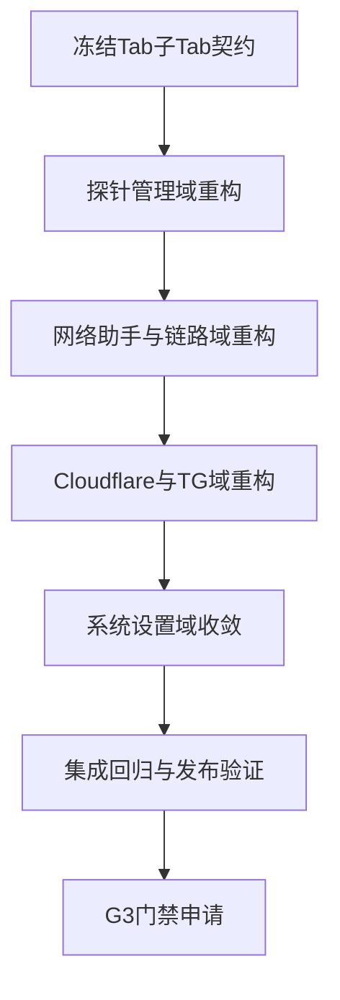

# 架构核查与编码计划文档 `manager_service` Tab 子Tab 对照版

- 日期: 2026-04-12
- 备注: 按 `AI协作统一规则` 与 `manager_service` 架构最终版执行；本文件用于“逐 Tab 子Tab 对照核查 + 下一步编码排程”。
- 风险:
  - 前端仍有大面积旧调用路径，导致运行期功能不可用或被禁用。
  - 后端 API 覆盖面不足，无法承接管理程序完整功能。
  - 若继续移植式修补，会破坏前端重构约束并增加维护成本。
- 遗留事项:
  - 需冻结 Tab 子Tab 级 API 白名单并回写接口字典。
  - 需为每个子Tab补齐“后端契约 + 前端重构 + 联调证据”。
- 进度状态: 进行中
- 完成情况: 已完成代码符合性核查与逐 Tab 子Tab 跟踪表，已排定下一步编码计划。
- 检查表:
  - [x] 架构基线核查
  - [x] 管理程序对照核查
  - [x] 逐 Tab 子Tab 跟踪建表
  - [x] 分阶段编码计划
  - [ ] 编码实施
  - [ ] G3 门禁复核
- 跟踪表状态: 实现中
- 结论记录: 当前代码“部分符合要求”，但仍不满足“前端仅经 manager_service + 按子Tab可用”的门禁标准，需按本计划分波次修复。

---

## 1 核查口径

- 架构基线: `doc/architect/manager_service_final_architect_doc.md`
- 对照对象: `probe_manager/frontend/src/modules/app/components`
- 核查对象: `manager_service/frontend/src/modules/app/components` 与 `manager_service/internal/api`

重点检查:
1. 是否符合 FC-FE-01 到 FC-FE-08
2. 是否满足 RQ-003 RQ-004 RQ-010
3. 是否实现“逐 Tab 子Tab 可运行且仅经 manager_service”

---

## 2 代码符合性结论

- 符合项:
  - 已完成 Gin 网关与基础后端骨架
  - 已接入前端内嵌与 SPA 回退
  - 已提供基础管理端 API: auth system probe基础 network-status-mode upgrade-release logs

- 不符合项:
  - 多个业务域仍走旧服务层路径，功能未真正切到 manager_service
  - 旧服务文件仍包含大量不可执行或已禁用调用
  - 子Tab级能力与后端契约不一致，存在显式不可用与隐式降级

结论: **部分符合，不通过当前门禁**

---

## 3 逐 Tab 子Tab 功能跟踪表

| 主Tab | 子Tab | 管理程序基线 | manager_service 现状 | 后端覆盖 | 判定 | 下一步包 |
|---|---|---|---|---|---|---|
| 概要状态 | 概要状态 | 展示身份与连接状态 | 可用，私钥状态能力已裁剪 | `/api/system/version` `/healthz` | 部分通过 | FE-R1 |
| 探针管理 | 列表 | 节点CRUD | UI在，仍存在旧调用路径 | `/api/probe/nodes` `PUT /api/probe/nodes/:node_no` | 部分通过 | FE-R2 BE-R2 |
| 探针管理 | 状态 | 节点运行状态 | UI在，状态来源混杂 | 缺少完整状态聚合端点 | 不通过 | BE-R2 FE-R2 |
| 探针管理 | 日志 | 节点日志查看 | UI在，依赖旧服务路径 | 缺少探针日志专用端点 | 不通过 | BE-R2 FE-R2 |
| 探针管理 | Shell | 远程终端与快捷命令 | UI在，旧路径依赖重 | 缺少 shell 会话端点 | 不通过 | BE-R2 FE-R2 |
| 网络助手 | 模式切换 | direct tun 切换 | 基本可用 | `/api/network-assistant/status` `/api/network-assistant/mode` | 部分通过 | FE-R3 BE-R3 |
| 网络助手 | DNS缓存 | 查询与明细 | UI在，接口未完备 | 缺少 `/dns/cache` | 不通过 | BE-R3 FE-R3 |
| 网络助手 | 网络监视 | 进程监视与事件 | UI在，接口未完备 | 缺少 `/processes` `/monitor/*` | 不通过 | BE-R3 FE-R3 |
| 网络助手 | 链路管理 | 复用链路管理页 | 复用后仍走旧服务 | 需链路域代理端点 | 不通过 | BE-R4 FE-R4 |
| 网络助手 | 端口转发 | 复用链路子页 | 同上 | 需链路域代理端点 | 不通过 | BE-R4 FE-R4 |
| 网络助手 | 驱动设置 | tun 安装启用关闭 | UI在，端点未完备 | 缺少 `/tun/install` `/tun/enable` `/direct/restore` | 不通过 | BE-R3 FE-R3 |
| 网络助手 | 状态 | 实时状态视图 | 可显示基础状态 | 已有 status | 部分通过 | FE-R3 |
| 网络助手 | 日志 | 网络助手日志 | UI在，接口未完备 | 缺少 `/network-assistant/logs` | 不通过 | BE-R3 FE-R3 |
| Cloudflare助手 | 基础设置 | API Key Zone | UI在，调用路径待重构 | 缺少 cloudflare 管理端点 | 不通过 | BE-R5 FE-R5 |
| Cloudflare助手 | DDNS | 记录查询与应用 | UI在，后端未承接 | 缺少 ddns 端点 | 不通过 | BE-R5 FE-R5 |
| Cloudflare助手 | ZeroTrust | 白名单策略 | UI在，后端未承接 | 缺少 zerotrust 端点 | 不通过 | BE-R5 FE-R5 |
| Cloudflare助手 | IP优选 | speedtest | UI在 | 缺少 `/cloudflare/speedtest` | 不通过 | BE-R5 FE-R5 |
| TG助手 | 账号列表 | 账号与登录流程 | UI在，依赖旧调用 | 缺少 TG 代理端点 | 不通过 | BE-R6 FE-R6 |
| TG助手 | 基础信息 | 账号详情 | 同上 | 缺少 TG 端点 | 不通过 | BE-R6 FE-R6 |
| TG助手 | 定时发送 | 任务配置执行 | 同上 | 缺少 TG 端点 | 不通过 | BE-R6 FE-R6 |
| TG助手 | TG Bot | bot key 与测试 | 同上 | 缺少 TG bot 端点 | 不通过 | BE-R6 FE-R6 |
| 日志查看 | 日志查看 | 本地与服务端日志 | 基本可用 | `/api/logs/manager` | 通过 | FE-R7 |
| 系统设置 | 升级设置 | 版本 检查 升级 | 部分可用，主控升级待后续 | `/api/system/version` `/api/upgrade/release` `/api/upgrade/manager` | 部分通过 | BE-R8 FE-R8 |
| 系统设置 | 主控设置 | controller_ip 备份等 | UI在，部分本地占位 | 缺少备份与主控配置端点 | 不通过 | BE-R8 FE-R8 |
| 系统设置 | AI调试 | AI调试开关 | 当前明确不支持 | 缺少 ai-debug 端点 | 不通过 | BE-R8 FE-R8 |

---

## 4 编码者下一步分阶段计划

### 阶段 R1 治理冻结
- 冻结 Tab 子Tab 功能白名单
- 冻结每个子Tab所需 API 契约
- 输出功能保留清单与非目标清单

### 阶段 R2 探针管理域
- 后端补齐探针状态 日志 shell 会话接口
- 前端将探针管理页全部切到 `manager-api.ts`
- 清除子Tab中的旧服务依赖

### 阶段 R3 网络助手域
- 后端补齐 logs dns cache monitor tun driver 相关端点
- 前端移除隐式降级和 not implemented 分支
- 子Tab逐一联调留证

### 阶段 R4 链路管理域
- 后端提供链路列表 端口转发 测试统一代理端点
- LinkManage 子Tab不再走旧控制面调用

### 阶段 R5 Cloudflare域
- 后端新增 cloudflare settings ddns zerotrust speedtest 端点
- 前端Cloudflare四个子Tab统一改造为 manager-api 调用

### 阶段 R6 TG域
- 后端新增 tg 账号 任务 bot 代理端点
- 前端TG账号子Tab与详情子Tab全部迁移

### 阶段 R7 日志与公共能力收敛
- 稳定日志查看与公共状态页
- 统一错误语义与状态提示

### 阶段 R8 系统设置域
- 主控设置与备份能力按契约落地
- 升级策略与 AI 调试能力按架构边界明确实现或显式禁用

### 阶段 R9 集成与门禁
- 子Tab逐项回归
- 单可执行文件发布验证
- 文档与跟踪表回写

---

## 5 编码计划排程表

| 阶段 | 目标域 | 主要产物 | 门禁条件 |
|---|---|---|---|
| R1 | 治理冻结 | 子Tab契约表 功能白名单 | 契约评审通过 |
| R2 | 探针管理 | BE接口 FE重构 联调记录 | 探针4子Tab可用 |
| R3 | 网络助手 | BE接口 FE重构 联调记录 | 网络助手8子Tab可用 |
| R4 | 链路管理 | 链路代理接口 前端迁移 | link forward test可用 |
| R5 | Cloudflare | 4子Tab端到端能力 | Cloudflare四子Tab可用 |
| R6 | TG助手 | 账号任务bot全链路 | TG子Tab可用 |
| R7 | 公共能力 | 日志与状态收敛 | 统一错误语义 |
| R8 | 系统设置 | 升级主控设置AI调试 | 系统设置3子Tab可用 |
| R9 | 集成门禁 | 回归报告 发布验证 | G3申请条件满足 |

---

## 6 Mermaid 执行流

---

## 7 本轮判定

- 当前代码满足“可启动 可展示部分页面”，但不满足“逐 Tab 子Tab 功能可用且符合单入口架构”。
- 建议立即按 R1 到 R9 执行，不建议继续以临时兼容修补推进。
