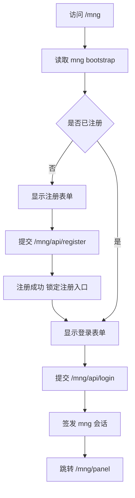

# 架构师阶段文档 `probe_controller` 新增 `/mng` 独立注册登录域

## 工作依据与规则传递声明
- 当前角色: 架构师
- 工作依据文档: [`doc/ai-coding-unified-rules.md`](doc/ai-coding-unified-rules.md)
- 适用规则: AI协作统一规则 单一规范
- 规则遵循声明: 必须遵守本规则。
- 协作传递要求: 后续接手者与协作者必须遵守同一规则。

- 日期: 2026-04-19
- 备注: 用户已确认改为 `/mng` 路由，登录成功进入 `/mng/panel`，仅访问新增管理功能，不接入现有 `/dashboard` 与旧 API；首版 `/mng/panel` 功能限定为系统状态与版本信息。
- 风险:
  - 新增认证域若误复用旧会话字段，可能造成权限串扰。
  - 首次注册并发时若无互斥，可能出现重复初始化。
  - 若页面或接口命名与现有 `/api/auth/*` 混用，维护成本上升。
- 遗留事项:
  - 编码阶段需补齐并发注册与限流场景测试。
  - 测试阶段需验证旧链路完全无回归。
- 进度状态: 已完成
- 完成情况: 已完成需求边界、路由设计、接口设计、执行包拆分与验收口径。
- 检查表:
  - [x] 已显式记录工作依据与规则传递声明
  - [x] 已完成字符集编码首次显式询问与确认
  - [x] 已完成关键选型与取舍依据
  - [x] 已完成总体设计与单元设计
  - [x] 已完成接口定义与执行包拆分
  - [x] 已完成编码测试映射
- 跟踪表状态: 待实现
- 结论记录: 采用 `/mng` 独立认证域方案，与现有 `nonce+signature` 认证体系完全隔离并并行存在。

## 字符集编码基线
- 字符集类型: 沿用现有文件各自编码
- BOM策略: 沿用现有文件，不做统一迁移
- 换行符规则: 沿用现有文件，不做统一迁移
- 跨平台兼容要求: 在不批量改写历史文件的前提下，保证 Go 源码与页面文件可在现有工具链构建运行
- 历史文件迁移策略: 不做统一基线迁移，仅对新增或修改内容延续目标文件当前编码与换行

## 统一需求主文档
- RQ-MNG-001: 新增浏览器入口 `/mng`，提供独立注册登录流程。
- RQ-MNG-002: 首次登录必须先注册单账号，无默认账号。
- RQ-MNG-003: 注册成功后永久关闭注册入口，禁止二次注册。
- RQ-MNG-004: 登录成功进入 `/mng/panel`，仅访问新增管理功能。
- RQ-MNG-005: `/mng` 认证域与现有 `/api/auth/*` 与 `nonce+signature` 链路完全隔离。
- RQ-MNG-006: 域名主路径 `/` 行为保持不变，继续跳转 `/dashboard`。
- RQ-MNG-007: `/mng/panel` 首版仅展示系统状态与版本信息，不引入其他管理操作。

## 关键选型与取舍

### 选型1 路由前缀
- 方案A 使用 `/admin`
- 方案B 使用 `/mng`
- 结论 选择方案B
- 依据 用户明确要求改为 `/mng`，并与旧语义隔离。

### 选型2 首登机制
- 方案A 预置默认账号
- 方案B 首次注册单账号
- 结论 选择方案B
- 依据 消除默认凭据风险，符合用户安全诉求。

### 选型3 注册生命周期
- 方案A 允许重复注册覆盖
- 方案B 注册成功后永久关闭
- 结论 选择方案B
- 依据 保证初始化语义唯一，避免误覆盖。

### 选型4 与旧链路关系
- 方案A 接管旧 `/api/auth/*`
- 方案B 独立 `/mng/*` 新链路
- 结论 选择方案B
- 依据 用户明确要求与原有功能无关系，降低回归风险。

## 总体设计

- 存储域
  - 持久化: `./data/cloudhelper.json` 内新增 `mng_auth` 键空间
  - 会话: 进程内 `mng_sessions`，不写盘
- 隔离域
  - `/mng/*` 不复用旧 `authManager.sessions`
  - `/dashboard/*` 与旧 `/api/*` 路由保持现状

## 单元设计

### U-MNG-01 存储模型与初始化状态
- 文件: `probe_controller/internal/core/store.go`
- 内容:
  - 新增 `mng_auth` 读写结构
  - 定义 `registered` 状态判定

### U-MNG-02 认证核心逻辑
- 文件: `probe_controller/internal/core/mng_auth.go`
- 内容:
  - 注册 登录 登出 会话校验
  - 注册互斥控制与登录失败计数

### U-MNG-03 路由与中间件
- 文件: `probe_controller/internal/core/server.go` 与 `probe_controller/internal/core/middleware.go`
- 内容:
  - 接入 `/mng` `/mng/panel` `/mng/api/*`
  - 新增 `mngAuthRequiredMiddleware`
  - 新增 `/mng/api/panel/summary` 仅返回状态与版本概要

### U-MNG-04 页面与交互
- 文件: `probe_controller/internal/core/mng_handlers.go`
- 内容:
  - `/mng` 动态显示注册或登录
  - `/mng/panel` 受保护页面
  - 首版面板仅展示 `uptime` 与 `version` 信息卡片

### U-MNG-05 兼容与回归验证
- 文件: `probe_controller/tests/*`
- 内容:
  - 新增 `/mng` 流程测试
  - 验证旧链路零回归

## 接口定义清单
- `GET /mng/api/bootstrap`
  - 返回: `registered`
- `POST /mng/api/register`
  - 请求: `username password confirm_password`
  - 约束: 仅未注册可调用
- `POST /mng/api/login`
  - 请求: `username password`
  - 返回: 会话建立结果
- `POST /mng/api/logout`
  - 行为: 失效当前 `mng` 会话
- `GET /mng/api/session`
  - 返回: 当前会话状态
- `GET /mng/api/panel/summary`
  - 返回: `uptime` `version`
  - 约束: 仅 `mng` 已登录会话可访问

## 执行单元包拆分
- PKG-MNG-01: `mng_auth` 持久化结构与状态判定
- PKG-MNG-02: 注册 登录 登出 会话核心逻辑
- PKG-MNG-03: `/mng` 路由与鉴权中间件
- PKG-MNG-04: `/mng` 与 `/mng/panel` 页面渲染
- PKG-MNG-05: 测试用例与回归验证
- PKG-MNG-06: `/mng/panel` 首版状态与版本信息实现

## 编码测试映射
| 需求编号 | 执行单元包 | 验证口径 |
|---|---|---|
| RQ-MNG-001 | PKG-MNG-03 PKG-MNG-04 | `/mng` 可访问并按状态显示页面 |
| RQ-MNG-002 | PKG-MNG-01 PKG-MNG-02 | 首次必须注册 无默认账号 |
| RQ-MNG-003 | PKG-MNG-02 | 注册成功后二次注册返回禁止 |
| RQ-MNG-004 | PKG-MNG-03 PKG-MNG-04 | 登录成功跳转 `/mng/panel` 且受保护 |
| RQ-MNG-005 | PKG-MNG-02 PKG-MNG-05 | 与旧认证会话与接口完全隔离 |
| RQ-MNG-006 | PKG-MNG-05 | `/` 仍跳转 `/dashboard` |
| RQ-MNG-007 | PKG-MNG-06 | `/mng/panel` 首版仅显示系统状态与版本信息 |

## 需求跟踪表更新说明
- 已新增本需求专用跟踪文档 [`doc/architect/probe_controller_mng_auth_requirement_tracking.md`](doc/architect/probe_controller_mng_auth_requirement_tracking.md)
- 初始状态已设为 待实现，责任角色为架构师，待切换编码阶段后更新
