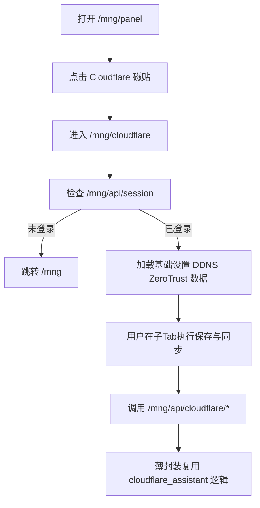

# 架构师阶段文档 `probe_controller` `/mng` 新增 Cloudflare 磁贴与管理页面

## 工作依据与规则传递声明
- 当前角色: 架构师
- 工作依据文档: `doc/ai-coding-unified-rules.md`
- 适用规则: AI协作统一规则 单一规范
- 规则遵循声明: 必须遵守本规则。
- 协作传递要求: 后续接手者与协作者必须遵守同一规则。

- 日期: 2026-04-21
- 备注: 用户要求在 `/mng` 增加 Cloudflare 磁贴，点击进入新页面，并提供基础设置 DDNS ZeroTrust 三个子Tab。用户确认后端能力已具备，允许新增 `/mng/api/cloudflare/*` 薄封装接口复用现有逻辑。
- 风险:
  - 现有 Cloudflare 能力主要通过 admin websocket action 暴露，若 HTTP 薄封装参数映射不一致会出现前后端字段漂移。
  - Cloudflare 操作为外部网络依赖，前端需清晰展示失败状态，避免误判为页面故障。
  - 新增页面若未统一复用 `/mng/api/session` 鉴权跳转逻辑，可能出现未登录状态下空白页。
- 遗留事项:
  - 后续可评估将 Cloudflare 页面脚本拆为模块化资源，降低单文件复杂度。
  - 可补充 Cloudflare 真实联调用例与失败注入测试。
- 进度状态: 已完成
- 完成情况: 已完成需求拆解 路由与接口方案 子Tab 信息架构 验收与测试口径定义。
- 检查表:
  - [x] 已显式记录工作依据与规则传递声明
  - [x] 已完成字符集编码基线确认
  - [x] 已完成关键选型与取舍
  - [x] 已完成总体设计 单元设计 接口定义
  - [x] 已完成执行单元包拆分与编码测试映射
- 跟踪表状态: 待实现
- 结论记录: 采用 `/mng` 独立 Cloudflare 页面方案，前端使用 `/mng/api/cloudflare/*`，后端仅做薄封装并复用既有 Cloudflare 逻辑。

## 字符集编码基线
- 字符集类型: 新文件 UTF-8 无 BOM
- BOM策略: 新文件不使用 BOM
- 换行符规则: 沿用目标文件现有风格，不做历史文件统一迁移
- 跨平台兼容要求: 保持现有 Go 与 HTML 资源在当前工具链可构建可运行
- 历史文件迁移策略: 原文件不强制改编码，仅在变更时延续原文件风格

## 统一需求主文档
- RQ-MNG-013: `/mng/panel` 新增 Cloudflare 磁贴。
- RQ-MNG-014: 点击 Cloudflare 磁贴进入 `/mng/cloudflare` 新页面。
- RQ-MNG-015: `/mng/cloudflare` 页面包含三个子Tab，基础设置 DDNS ZeroTrust。
- RQ-MNG-016: 新增 `/mng/api/cloudflare/*` 薄封装接口并复用既有 Cloudflare 逻辑。
- RQ-MNG-017: 新增路由 页面与接口需纳入 `/mng` 会话鉴权与测试覆盖。

## 关键选型与取舍

### 选型1 Cloudflare 页面入口形态
- 方案A 在现有 `/mng/settings` 内扩展 Cloudflare 区域
- 方案B 新增独立页面 `/mng/cloudflare`
- 结论: 选择方案B
- 依据: 用户明确要求点击磁贴后切换新页面，同时可与系统设置职责解耦。

### 选型2 前端与后端通信方式
- 方案A 在 `/mng` 页面直接接入 `/api/admin/ws` action
- 方案B 新增 `/mng/api/cloudflare/*` HTTP 薄封装
- 结论: 选择方案B
- 依据: 用户已确认可新增薄封装接口，且更符合 `/mng` 页面现有 fetch + cookie 鉴权模式。

### 选型3 子Tab范围
- 方案A 复用 `probe_manager` Cloudflare 助手全部能力
- 方案B 严格只保留基础设置 DDNS ZeroTrust 三个子Tab
- 结论: 选择方案B
- 依据: 与用户明确需求一致，控制改动范围并降低回归风险。

## 总体设计

## 单元设计

### U-MNG-CF-01 磁贴与页面资源接入
- 文件:
  - `probe_controller/internal/core/mng_pages/panel.html`
  - `probe_controller/internal/core/mng_pages/cloudflare.html` 新增
  - `probe_controller/internal/core/mng_pages.go`
- 内容:
  - 在磁贴页新增 Cloudflare 磁贴
  - 新增 Cloudflare 页面 HTML 并 embed

### U-MNG-CF-02 路由与鉴权接入
- 文件:
  - `probe_controller/internal/core/server.go`
  - `probe_controller/internal/core/mng_handlers.go` 或新增 `mng_cloudflare_handlers.go`
- 内容:
  - 新增 `/mng/cloudflare` 页面路由，受 `mngAuthRequiredMiddleware` 保护
  - 新增 `/mng/api/cloudflare/*` 路由，统一受 `mngAuthRequiredMiddleware` 保护

### U-MNG-CF-03 Cloudflare HTTP 薄封装接口
- 文件:
  - `probe_controller/internal/core/mng_cloudflare_handlers.go` 新增
- 内容:
  - `GET /mng/api/cloudflare/api`
  - `POST /mng/api/cloudflare/api`
  - `GET /mng/api/cloudflare/zone`
  - `POST /mng/api/cloudflare/zone`
  - `GET /mng/api/cloudflare/ddns/records`
  - `POST /mng/api/cloudflare/ddns/apply`
  - `GET /mng/api/cloudflare/zerotrust/whitelist`
  - `POST /mng/api/cloudflare/zerotrust/whitelist`
  - `POST /mng/api/cloudflare/zerotrust/whitelist/run`
  - 以上接口仅做参数解析 权限校验 结果透传，核心逻辑复用 `cloudflare_assistant.go`。

### U-MNG-CF-04 Cloudflare 页面三子Tab交互
- 文件:
  - `probe_controller/internal/core/mng_pages/cloudflare.html` 新增
- 内容:
  - 子Tab 基础设置: API Key Zone 配置
  - 子Tab DDNS: 记录读取与 apply
  - 子Tab ZeroTrust: 白名单配置保存与立即同步
  - 统一状态框与错误提示

### U-MNG-CF-05 测试与回归
- 文件:
  - `probe_controller/tests/mng_auth_test.go`
- 内容:
  - 未登录访问 `/mng/cloudflare` 重定向验证
  - 未登录访问 `/mng/api/cloudflare/*` 返回 401 验证
  - 已登录访问 `/mng/panel` 包含 Cloudflare 磁贴文案验证
  - 已登录访问 `/mng/cloudflare` 包含三个子Tab文案验证

## 接口定义

### 页面接口
- `GET /mng/cloudflare`
  - 说明: Cloudflare 管理页面
  - 鉴权: `mngAuthRequiredMiddleware`

### Cloudflare 薄封装接口
- `GET /mng/api/cloudflare/api`
  - 返回: `api_key zone_name configured`
- `POST /mng/api/cloudflare/api`
  - 请求: `api_key`
  - 返回: `api_key zone_name configured`
- `GET /mng/api/cloudflare/zone`
  - 返回: `zone_name`
- `POST /mng/api/cloudflare/zone`
  - 请求: `zone_name`
  - 返回: `zone_name`
- `GET /mng/api/cloudflare/ddns/records`
  - 返回: `records`
- `POST /mng/api/cloudflare/ddns/apply`
  - 请求: `zone_name`
  - 返回: `zone_name applied skipped items records`
- `GET /mng/api/cloudflare/zerotrust/whitelist`
  - 返回: ZeroTrust 白名单状态对象
- `POST /mng/api/cloudflare/zerotrust/whitelist`
  - 请求: `enabled policy_name whitelist_raw sync_interval_sec`
  - 返回: ZeroTrust 白名单状态对象
- `POST /mng/api/cloudflare/zerotrust/whitelist/run`
  - 请求: `force`
  - 返回: ZeroTrust 白名单状态对象

## 执行单元包拆分
- PKG-MNG-CF-01: 新增 Cloudflare 磁贴与页面 embed
- PKG-MNG-CF-02: 新增 `/mng/cloudflare` 页面路由与鉴权
- PKG-MNG-CF-03: 新增 `/mng/api/cloudflare/*` 薄封装接口
- PKG-MNG-CF-04: 实现 Cloudflare 页面三子Tab前端交互
- PKG-MNG-CF-05: 更新 mng 相关测试覆盖与回归

## 编码测试映射
| 需求编号 | 执行单元包 | 验证口径 |
|---|---|---|
| RQ-MNG-013 | PKG-MNG-CF-01 | `/mng/panel` 出现 Cloudflare 磁贴 |
| RQ-MNG-014 | PKG-MNG-CF-01 PKG-MNG-CF-02 | 磁贴可跳转并打开 `/mng/cloudflare` |
| RQ-MNG-015 | PKG-MNG-CF-04 | 新页面显示基础设置 DDNS ZeroTrust 三个子Tab |
| RQ-MNG-016 | PKG-MNG-CF-03 PKG-MNG-CF-04 | 前端可通过 `/mng/api/cloudflare/*` 完成读写与同步 |
| RQ-MNG-017 | PKG-MNG-CF-02 PKG-MNG-CF-05 | 路由鉴权与接口鉴权测试通过 且旧链路无回归 |

## 需求跟踪表更新说明
- 本次新增需求编号 RQ-MNG-013 到 RQ-MNG-017。
- 状态初始化为 待实现，责任角色为编码工程师。
- 编码完成后需同步更新 `doc/architect/probe_controller_mng_auth_requirement_tracking.md` 对应状态。
