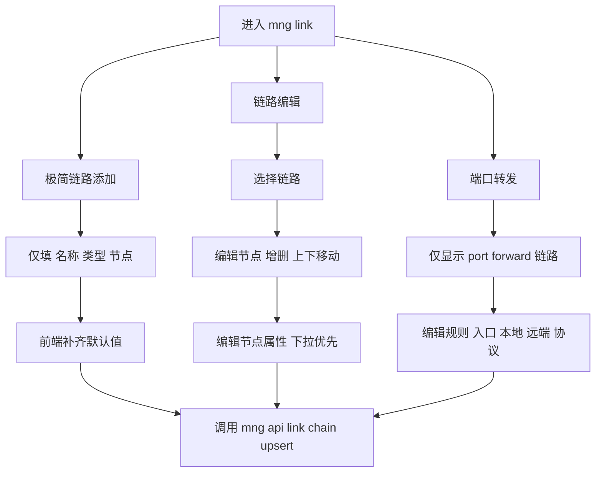

# 架构师阶段文档 `probe_controller` `/mng/link` 链路管理改造

## 工作依据与规则传递声明
- 当前角色: 架构师
- 工作依据文档: `doc/ai-coding-unified-rules.md`
- 适用规则: AI协作统一规则 单一规范
- 规则遵循声明: 必须遵守本规则
- 协作传递要求: 后续接手者与协作者必须遵守同一规则

- 日期: 2026-04-23
- 备注: 本次目标是将 `/mng/link` 对齐 manager 端可用能力，并补齐链路类型与 relay 域名下拉能力
- 风险:
  - 前端单页脚本体量增大，若结构不重整，后续维护成本高
  - 旧链路数据可能缺失 hop 或 relay_host，编辑态需兼容回填
  - 端口转发必须只允许对端口转发链路编辑，避免链路类型与行为错配
- 遗留事项:
  - 后续可将 `/mng/link` 页面脚本拆分为模块化静态资源
  - 后续补充端到端 UI 自动化测试
- 进度状态: 已完成规划 待实现
- 完成情况: 已完成需求拆解 交互方案 默认策略 数据结构改造清单 验收口径
- 检查表:
  - [x] 已显式记录工作依据与规则传递声明
  - [x] 已显式确认字符集编码基线
  - [x] 已完成执行单元包与映射
  - [x] 已完成验收口径
- 跟踪表状态: 待实现
- 结论记录: 采用 manager 默认值基线并扩展 `/mng/link` 三段式能力 同时新增 `chain_type` 与 `relay_host` 域名下拉

## 字符集编码基线
- 字符集类型: UTF-8 无 BOM
- BOM策略: 不使用 BOM
- 换行符规则: LF
- 跨平台兼容要求: 保持现有构建链路兼容
- 历史文件迁移策略: 现有文件保持原状 不做批量转码

## 统一需求主文档
- RQ-MNG-LINK-023: 链路添加改为极简表单 仅填写链路名称 链路类型 选择一个节点 其余参数自动补齐默认值
- RQ-MNG-LINK-024: 链路查看改为链路编辑入口 可选择链路并进行节点增删 顺序调整 节点属性编辑
- RQ-MNG-LINK-025: 端口转发区可选择端口转发链路并维护规则 规则字段包含入口侧 本地地址端口 远端地址端口 协议 启用状态
- RQ-MNG-LINK-026: `/mng/link` 对齐 manager 默认值 `listen_host=0.0.0.0` `listen_port=16030` `link_layer=http` `dial_mode=forward` `egress=127.0.0.1:1080`
- RQ-MNG-LINK-027: `/mng/link` 新增 `chain_type` 下拉与 `relay_host` 域名下拉 每个 hop 的 `relay_host` 来源于对应节点所有域名

## 关键选型与取舍

### 选型1 交互形态
- 方案A 继续保留旧的 链路添加 链路查看 分散表单
- 方案B 重构为 三段式  极简添加 链路编辑 端口转发
- 结论: 选择方案B
- 依据: 用户目标与 manager 现有交互一致 且降低误操作

### 选型2 默认策略来源
- 方案A 使用后端旧默认值
- 方案B 对齐 manager 默认值
- 结论: 选择方案B
- 依据: 用户明确要求按 manager 默认值对齐

### 选型3 relay_host 配置方式
- 方案A 手工输入域名
- 方案B 下拉选择节点域名列表
- 结论: 选择方案B
- 依据: 用户明确要求可下拉 且后端已提供节点域名查询接口

## 总体设计

## 单元设计

### U-MNG-LINK-01 页面结构重构
- 文件:
  - `probe_controller/internal/core/mng_pages/link.html`
- 内容:
  - 将旧页面重构为三段式区域
  - 极简添加区只保留 `name` `chain_type` `node`
  - 链路编辑区支持选择链路后进行节点增删 上下移动 属性编辑
  - 端口转发区支持按链路选择并编辑规则

### U-MNG-LINK-02 默认值自动补齐与表单标准化
- 文件:
  - `probe_controller/internal/core/mng_pages/link.html`
- 内容:
  - 前端统一默认模板
    - `listen_host=0.0.0.0`
    - `listen_port=16030`
    - `link_layer=http`
    - `dial_mode=forward`
    - `egress_host=127.0.0.1`
    - `egress_port=1080`
  - 保存时将极简输入映射为完整 upsert payload

### U-MNG-LINK-03 节点属性下拉化
- 文件:
  - `probe_controller/internal/core/mng_pages/link.html`
  - `probe_controller/internal/core/mng_link_handlers.go`
- 内容:
  - hop 可枚举字段改为下拉
    - 节点号
    - 链路层 `http/http2/http3`
    - 拨号方向 `forward/reverse`
    - `relay_host` 从 `/mng/api/link/node/domains` 拉取
  - 节点切换时刷新对应域名下拉项

### U-MNG-LINK-04 链路与端口转发类型约束
- 文件:
  - `probe_controller/internal/core/mng_pages/link.html`
  - `probe_controller/internal/core/ws_admin.go`
  - `probe_controller/internal/core/probe_link_chains.go`
- 内容:
  - `chain_type` 下拉支持 `port_forward` `proxy_chain`
  - 端口转发区只允许选择 `chain_type=port_forward` 的链路
  - 后端继续做最终校验与兼容回填

### U-MNG-LINK-05 API 兼容与持久化一致性
- 文件:
  - `probe_controller/internal/core/ws_admin.go`
  - `probe_controller/internal/core/probe_link_chains.go`
- 内容:
  - upsert 解析确保 `chain_type` 与 hop `relay_host` 全链路透传
  - 兼容旧字段与旧数据
  - 保证 `admin.probe.link.chains.get` 返回数据可直接回显编辑

## 接口定义清单
- 复用接口:
  - `GET /mng/api/link/users`
  - `GET /mng/api/link/user/public_key`
  - `GET /mng/api/link/chains`
  - `GET /mng/api/link/node/domains`
  - `POST /mng/api/link/chain/upsert`
  - `POST /mng/api/link/chain/delete`
- 说明:
  - 本次不新增路由 优先在现有接口基础上扩展字段与校验

## 执行单元包拆分
- PKG-MNG-LINK-01: 页面三段式重构与状态管理重写
- PKG-MNG-LINK-02: 极简添加映射完整 payload 与默认值补齐
- PKG-MNG-LINK-03: 链路编辑 节点增删 上下移动 属性下拉
- PKG-MNG-LINK-04: relay_host 域名下拉联动
- PKG-MNG-LINK-05: 端口转发链路筛选与规则编辑
- PKG-MNG-LINK-06: 后端 upsert 兼容与校验加固
- PKG-MNG-LINK-07: 回归测试与联调验证

## 编码测试映射
| 需求编号 | 执行单元包 | 验证口径 |
|---|---|---|
| RQ-MNG-LINK-023 | PKG-MNG-LINK-01 PKG-MNG-LINK-02 | 极简添加仅填三项即可保存成功 |
| RQ-MNG-LINK-024 | PKG-MNG-LINK-01 PKG-MNG-LINK-03 | 选中链路可编辑节点并调整前后顺序 |
| RQ-MNG-LINK-025 | PKG-MNG-LINK-05 | 可按链路维护转发规则并正确保存 |
| RQ-MNG-LINK-026 | PKG-MNG-LINK-02 PKG-MNG-LINK-06 | 默认值与 manager 保持一致 |
| RQ-MNG-LINK-027 | PKG-MNG-LINK-03 PKG-MNG-LINK-04 PKG-MNG-LINK-06 | `chain_type` 与 `relay_host` 下拉可用并正确落库 |

## 需求跟踪表
| 需求编号 | 需求描述 | 状态 | 责任角色 | 更新时间 |
|---|---|---|---|---|
| RQ-MNG-LINK-023 | 极简链路添加 | 待实现 | 编码者 | 2026-04-23 |
| RQ-MNG-LINK-024 | 链路查看改编辑 | 待实现 | 编码者 | 2026-04-23 |
| RQ-MNG-LINK-025 | 端口转发规则编辑 | 待实现 | 编码者 | 2026-04-23 |
| RQ-MNG-LINK-026 | 默认值对齐 manager | 待实现 | 编码者 | 2026-04-23 |
| RQ-MNG-LINK-027 | chain_type 与 relay_host 下拉 | 待实现 | 编码者 | 2026-04-23 |

## 实施顺序与验收点
1. 先改页面状态模型与布局骨架
2. 落极简添加与默认值补齐
3. 落链路编辑与节点顺序调整
4. 落 relay_host 节点域名下拉
5. 落端口转发链路筛选与规则编辑
6. 落后端字段兼容与校验加固
7. 运行主控侧编译与定向测试 回归 `/mng/link` 核心流程

验收点
- G2 架构门: 本文档满足统一模板字段并完成映射
- G3 编码核查门 预期关注项:
  - 字符集编码基线不偏离
  - `/mng/link` 三段式交互可用
  - 默认值与 manager 一致
  - `chain_type` 和 `relay_host` 下拉功能完整
