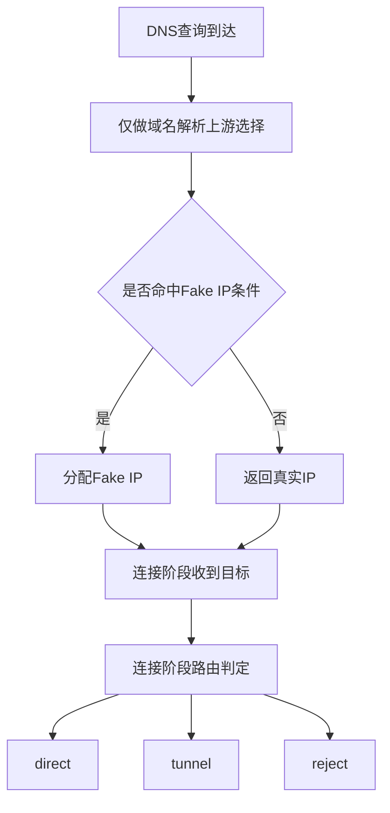

# Architect阶段文档 node DNS解耦路由与Fake IP非兜底组生效改造方案

## 工作依据与规则传递声明
- 当前角色: Architect 架构师
- 工作依据文档: `doc/ai-coding-unified-rules.md`
- 适用规则:
  - 统一规则 S2 架构输出要求
  - 最小字段完整性
  - 可执行清单与验收口径

## 日期
- 2026-04-30

## 备注
- 目标策略由你确认:
  - DNS 仅负责上游解析，不参与 direct 或 tunnel 路由决策
  - 路由仅在连接阶段执行
  - Fake IP 仅对非 fallback 且非 reject 代理组域名生效
- 本文档为新增架构改造文档，用于指导后续 Code 实施。
- 白名单策略声明: `FakeIPWhitelist` 已定为删除项，配置字段 默认值 归一化 校验与 DNS 运行时判定全部下线，不保留兼容开关。

## 风险
- 现有 `UseTunnelDNS` 语义被移除后，相关测试与字段依赖需要同步清理，避免残留分支造成行为歧义。
- Fake IP 生效条件从 `UseTunnelDNS` 改为 `Group!=fallback 且 Action!=reject` 后，命中面会变化，需重点回归 fallback 与 reject 行为。
- 当前实现仅 A 记录可分配 Fake IP，需在文档与测试中显式固化 AAAA 与其他类型不分配。
- DNS 与路由完全解耦后，若连接阶段路由实现不完整，会更容易暴露数据面缺口。

## 遗留事项
- L1: `UseTunnelDNS` 字段仍存在于 node 决策结构，需在实施阶段统一下线。
- L2: 现有测试多处断言 `UseTunnelDNS`，需重写为新口径断言。
- L3: 文档口径需与既有核查文档同步更新，避免前后冲突。

## 遗留事项处理方式
### L1 `UseTunnelDNS` 下线处理
- 处理范围:
  - `probe_node/local_route_decision.go` 的决策结构与赋值分支
  - `probe_node/local_dns_service.go` 的 fake 判定入口
- 处理动作:
  1. 从 `probeLocalDNSRouteDecision` 删除 `UseTunnelDNS` 字段。
  2. 删除 action 为 tunnel 时对 `UseTunnelDNS=true` 的赋值。
  3. DNS fake 判定从字段依赖切换为 `Group!=fallback 且 Action!=reject`。
  4. 显式约束仅 `qType=A` 允许 Fake IP，`AAAA` 与其他类型不允许。
- 验收口径:
  - 代码中不存在 `UseTunnelDNS` 字段定义与运行时读取。
  - DNS 对 direct 与 tunnel 组均不再因 `UseTunnelDNS` 分叉。

### L2 测试口径重写处理
- 处理范围:
  - `probe_node/local_route_decision_test.go`
  - `probe_node/local_tun_route_test.go`
  - `probe_node/local_tun_stack_windows_test.go`
- 处理动作:
  1. 删除全部 `UseTunnelDNS` 断言。
  2. 以 `Action` 与 `Group` 作为路由断言主轴。
  3. 增加 fake 分配断言矩阵:
     - fallback 组不分配 fake
     - 非 fallback 组可分配 fake
- 验收口径:
  - 测试语义仅反映新规则，不再引用废弃字段。
  - fake 分配行为与矩阵一致。

### L3 文档口径同步处理
- 处理范围:
  - `doc/architect/manager_node_proxy_full_chain_design_gap_review_2026-04-30.md`
  - `doc/architect/manager_node_proxy_full_chain_remediation_blueprint_2026-04-30.md`
  - `doc/architect/probe_node_dns_decouple_route_fakeip_nonfallback_architect_2026-04-30.md`
- 处理动作:
  1. 明确 DNS 仅解析 不参与路由决策。
  2. 明确 fake 条件为 `Group!=fallback 且 Action!=reject`。
  3. 明确 `FakeIPWhitelist` 已进入删除清单 不再保留兼容分支。
  4. 明确删除范围含配置字段 默认值 归一化 校验与 DNS 判定逻辑。
- 验收口径:
  - 三份文档术语一致 无相互冲突条目。
  - Code 执行清单与需求编号映射一致。

## 进度状态
- 已完成架构设计

## 完成情况
- 已完成受影响代码点核对。
- 已形成目标行为矩阵与兼容性约束。
- 已形成可直接执行的实施清单与验收标准。

## 检查表
- [x] 已声明工作依据与规则传递
- [x] 已包含日期
- [x] 已包含备注
- [x] 已包含风险
- [x] 已包含遗留事项
- [x] 已包含进度状态
- [x] 已包含完成情况
- [x] 已包含检查表
- [x] 已包含跟踪表状态
- [x] 已包含结论记录

## 跟踪表状态
- 当前状态: 待实施
- 当前责任角色: Code
- 最近更新时间: 2026-04-30

## 受影响实现点
- DNS 路由决策入口:
  - `probe_node/local_dns_service.go`
  - `probe_node/local_route_decision.go`
- 连接阶段路由决策:
  - `probe_node/local_tun_route.go`
- 相关测试:
  - `probe_node/local_route_decision_test.go`
  - `probe_node/local_tun_route_test.go`
  - `probe_node/local_tun_stack_windows_test.go`

## 目标行为矩阵
| 维度 | 改造前 | 改造后 |
|---|---|---|
| DNS 是否参与路由 | 参与，含 `UseTunnelDNS` 语义 | 不参与，仅解析上游 |
| DNS fake 生效条件 | 依赖 `UseTunnelDNS` | 仅 `Group != fallback` 且 `Action != reject` |
| 连接路由判定 | 连接阶段判定 | 保持连接阶段唯一判定点 |
| 路由出口语义 | action 映射 direct tunnel reject | 保持不变，仅不再被 DNS 消费 |
| fallback 组域名 | 可能因 `UseTunnelDNS` 不同而变化 | 明确不分配 Fake IP |

## 兼容性约束
1. 不改变 `probeLocalProxyState` 与用户代理组配置结构。
2. 不改变连接阶段 `direct` `tunnel` `reject` 的出口语义。
3. 移除 Fake IP 白名单配置与兼容分支。
4. 保留 fake IP 反查到 domain 的连接改写路径。

## 执行单元包
### U1 DNS职责收敛
- 目标: DNS 不再消费 route action。
- 主要变更:
  - `resolveProbeLocalDNSRouteDecision` 下线或改为仅返回组匹配语义
  - `currentProbeLocalDNSUpstreamCandidatesForDecision` 改为无决策依赖的纯上游构建

### U2 Fake IP条件重定义
- 目标: Fake IP 仅对非 fallback 且非 reject 组域名生效。
- 主要变更:
  - `shouldUseProbeLocalDNSFakeIP` 判定改为 `qType=A` 且 `Group!=fallback` 且 `Action!=reject`
  - 显式固化 `AAAA` 与其他类型不分配 Fake IP
  - 去除 `UseTunnelDNS` 依赖

### U3 路由字段清理与测试重写
- 目标: 清理 DNS 路由耦合残留。
- 主要变更:
  - `probeLocalDNSRouteDecision` 结构去除 `UseTunnelDNS`
  - 重写 `local_route_decision_test` 中相关断言
  - 更新 `local_tun_route_test` 与 `local_tun_stack_windows_test` 的 fake 分配前置

## 验收标准
1. DNS 请求路径在 direct/tunnel/reject 场景下使用同一上游候选策略。
2. fallback 组域名不分配 Fake IP。
3. reject 组域名不分配 Fake IP。
4. 非 fallback 且非 reject 组域名可分配 Fake IP，连接阶段仍按路由决策 direct/tunnel/reject。
5. `AAAA` 与其他非 A 记录类型不分配 Fake IP。
6. 既有连接阶段路由测试全部通过。

## 测试矩阵
| 测试项 | fallback组 | 非fallback组 direct出口 | 非fallback组 tunnel出口 | reject出口 |
|---|---|---|---|---|
| DNS真实解析 | 通过 | 通过 | 通过 | 通过 |
| Fake IP分配 | 不分配 | 分配 | 分配 | 不分配 |
| AAAA与其他类型 | 不分配 | 不分配 | 不分配 | 不分配 |
| 连接阶段路由 | direct | direct | tunnel | reject |

## 流程示意

## 结论记录
1. 该方案满足你提出的稳定形态，职责边界清晰。
2. DNS 与路由解耦后，行为更可预测，配置理解成本更低。
3. Fake IP 条件以代理组与 action 组合为核心，不再依赖 `UseTunnelDNS` 字段，符合用户配置导向。
4. Fake IP 对 DNS 记录类型的边界已显式化，仅 A 记录可分配，避免隐式行为。

## Code模式执行清单
1. 在 `probe_node/local_dns_service.go` 去除 `UseTunnelDNS` 依赖并改写 fake 判定。
2. 在 `probe_node/local_route_decision.go` 清理 `UseTunnelDNS` 设置逻辑。
3. 在 `probe_node/local_console.go` 删除 `FakeIPWhitelist` 配置字段 默认值 归一化与校验逻辑。
4. 在 `probe_node/local_route_decision_test.go` 删除 `UseTunnelDNS` 断言并改为组与 action 断言。
5. 在 `probe_node/local_tun_route_test.go` 与 `probe_node/local_tun_stack_windows_test.go` 调整 fake 分配前置与预期。
6. 执行 `go test ./...` 重点核对上述测试文件。

## 映射关系与跟踪表
| 需求编号 | 需求描述 | 执行单元包 | 状态 | 当前责任角色 | 最新更新时间 |
|---|---|---|---|---|---|
| NA-NODE-DNS-ROLE-001 | DNS仅负责上游解析不参与路由 | U1 | 待实施 | Code | 2026-04-30 |
| NA-NODE-FAKEIP-GROUP-002 | Fake IP仅非fallback且非reject组生效 | U2 | 待实施 | Code | 2026-04-30 |
| NA-NODE-FAKEIP-WHITELIST-REMOVE-003 | 彻底删除FakeIPWhitelist字段与逻辑 | U2 | 待实施 | Code | 2026-04-30 |
| NA-NODE-COUPLING-CLEAN-004 | 清理UseTunnelDNS与测试重写 | U3 | 待实施 | Code | 2026-04-30 |
