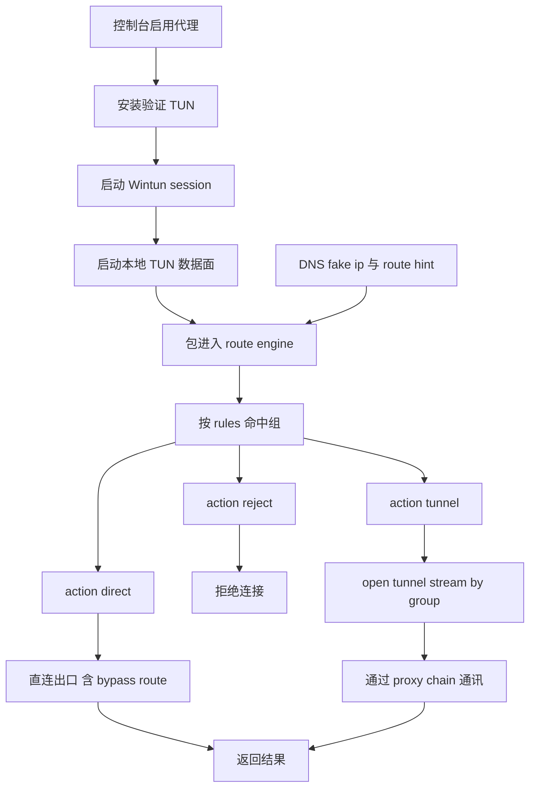

# 架构师阶段文档 `probe_node` Windows 先行完整代理能力对齐方案

## 工作依据与规则传递声明
- 当前角色: 架构师
- 工作依据文档: `doc/ai-coding-unified-rules.md`
- 适用规则: AI协作统一规则 单一规范
- 规则遵循声明: 必须遵守本规则。
- 协作传递要求: 后续接手者与协作者必须遵守同一规则，不得降级或替换执行口径。

- 日期: 2026-04-25
- 备注: 目标为 Windows 先行完整对齐 manager 的 TUN 代理能力，包含 TCP UDP 数据面分流与按组走代理链路。Linux 仅保持现状不回归。
- 风险:
  - `probe_node` 当前缺少 manager 的完整 TUN 数据面与按组连接决策闭环。
  - Windows 路由与绕行出口维护实现复杂，错误处理不完整会导致回滚不彻底。
  - fake ip 与连接面策略不一致会出现 DNS 命中正确但连接走错路径。
- 遗留事项:
  - Linux 全量数据面对齐不在本期。
  - manager 与 probe_node 的配置字段语义仍有历史差异，需要兼容口径。
- 进度状态: 已完成架构设计，待编码实施
- 完成情况: 已完成需求拆分、关键选型、执行单元包与测试映射。
- 检查表:
  - [x] 已确认 Windows 先行范围
  - [x] 已确认 TCP UDP 数据面必须纳入本期
  - [x] 已确认代理组按 `rules` + `proxy_state` 决策作为唯一口径
  - [x] 已确认 Linux 不回归边界
- 跟踪表状态: 待实现
- 结论记录: 本期采用 manager 同源能力迁移策略，优先构建 route engine + tun dataplane + netstack egress 三段闭环。

## 字符集编码基线
- 字符集类型: UTF-8
- BOM 策略: 无 BOM
- 换行符规则: LF
- 跨平台兼容要求: 本期新增与改造文件统一按该基线落盘。
- 历史文件迁移策略: 仅改动触达文件按基线对齐。

## 统一需求主文档
- RQ-PN-FULLPROXY-001: Windows 启用 TUN 后，接管流量进入本地 TUN 数据面处理。
- RQ-PN-FULLPROXY-002: 数据面支持 TCP UDP，按代理组策略进行 direct reject tunnel 分流。
- RQ-PN-FULLPROXY-003: 代理组命中规则统一使用 `proxy_group.rules`，不再依赖 `rules_text`。
- RQ-PN-FULLPROXY-004: `action=tunnel` 时，连接通过 `proxy_chain` 代理链路通讯。
- RQ-PN-FULLPROXY-005: `action=direct` 时，连接走直连并支持 Windows 绕行出口维护。
- RQ-PN-FULLPROXY-006: `action=reject` 时，DNS 与连接面均拒绝，行为一致。
- RQ-PN-FULLPROXY-007: fake ip 映射 route hint 与连接决策一致，避免 DNS 与连接面分裂。
- RQ-PN-FULLPROXY-008: 状态接口输出 TUN 数据面运行状态、分流统计与失败原因。
- RQ-PN-FULLPROXY-009: 失败时支持 direct 回退与清理，保证可恢复。
- RQ-PN-FULLPROXY-010: Linux 不引入新数据面，现有行为与测试不回归。

## 关键选型与取舍
- 选型A 复用 manager 设计骨架
  - 方案: 迁移并裁剪 manager 的 route decision dataplane netstack egress 模块。
  - 取舍: 风险最低，语义一致性最好。
- 选型B 仅增强 DNS 决策
  - 方案: 保持当前仅 DNS 分流，不建设连接数据面。
  - 取舍: 无法满足本期目标，不采用。
- 选型C 全新自研数据面
  - 方案: 从零实现 TUN netstack 与分流。
  - 取舍: 变更面与风险过大，不采用。

## 总体设计

## 单元设计

### U-PN-FULLPROXY-01 路由决策引擎统一化
- 目标: 构建连接层可复用决策函数，输入 target 输出 direct reject tunnel 与 group node。
- 主要改造建议:
  - `probe_node/local_dns_service.go`
  - 新增 `probe_node/local_tun_route_windows.go`
- 规则:
  - 命中规则来源统一 `proxy_group.rules`。
  - `proxy_state` 为动作与 `tunnel_node_id` 唯一来源。

### U-PN-FULLPROXY-02 Windows TUN 数据面与会话
- 目标: 建立 Wintun adapter session packet io 生命周期。
- 主要改造建议:
  - 新增 `probe_node/local_tun_dataplane_windows.go`
  - `probe_node/local_tun_adapter_windows.go`
- 规则:
  - 启停可重入。
  - 错误可观测可回滚。

### U-PN-FULLPROXY-03 TUN Netstack TCP UDP 出口
- 目标: 处理入站包并按决策分流到直连或代理链路。
- 主要改造建议:
  - 新增 `probe_node/local_tun_stack_windows.go`
  - 复用 `probe_node/link_chain_runtime.go` 的链路开流能力。
- 规则:
  - TCP UDP 均覆盖。
  - tunnel 分支必须携带 group 语义打开链路。

### U-PN-FULLPROXY-04 Windows 直连绕行路由维护
- 目标: direct 分支在 TUN 模式下可正确绕行。
- 主要改造建议:
  - `probe_node/local_proxy_takeover_windows.go`
  - 新增 `probe_node/local_tun_routing_windows.go`
- 规则:
  - acquire release 成对。
  - 模式切换时清理动态绕行路由。

### U-PN-FULLPROXY-05 DNS fake ip 与连接决策一致性
- 目标: fake ip 反查后连接决策与 DNS 决策一致。
- 主要改造建议:
  - `probe_node/local_dns_service.go`
  - 新增 `probe_node/local_tun_fakeip_bridge_windows.go`
- 规则:
  - fake ip 到 domain 到 route 决策链必须闭环。

### U-PN-FULLPROXY-06 控制台与状态接口扩展
- 目标: 输出数据面运行状态与分流统计。
- 主要改造建议:
  - `probe_node/local_console.go`
  - `probe_node/local_pages/panel.html`
- 接口:
  - 扩展 `GET /local/api/tun/status`
  - 扩展 `GET /local/api/dns/status`
  - 新增 debug 统计接口可选

### U-PN-FULLPROXY-07 回归测试与门禁
- 目标: 覆盖 Windows 主路径失败回退与 Linux 不回归。
- 主要改造建议:
  - `probe_node/local_console_test.go`
  - `probe_node/local_proxy_takeover_windows_test.go`
  - 新增 `probe_node/local_tun_dataplane_windows_test.go`
  - 新增 `probe_node/local_tun_stack_windows_test.go`
  - 新增 `probe_node/local_tun_route_windows_test.go`

## 接口定义清单
- 扩展:
  - `GET /local/api/tun/status`
  - `GET /local/api/dns/status`
- 复用:
  - `POST /local/api/proxy/enable`
  - `POST /local/api/proxy/direct`
  - `POST /local/api/proxy/reject`
  - `GET /local/api/proxy/groups`
  - `GET /local/api/proxy/state`
  - `GET /local/api/proxy/chains`

## 执行单元包拆分
- PKG-PN-FULLPROXY-01: 路由决策引擎
- PKG-PN-FULLPROXY-02: Wintun 适配器与 session 数据面
- PKG-PN-FULLPROXY-03: TUN netstack TCP UDP 分流
- PKG-PN-FULLPROXY-04: Windows direct bypass 路由维护
- PKG-PN-FULLPROXY-05: fake ip 与 route hint 连接桥接
- PKG-PN-FULLPROXY-06: 控制台状态与可观测
- PKG-PN-FULLPROXY-07: 回归测试与 Linux 不回归验证

## 编码测试映射
| 需求编号 | 执行单元包 | 验证口径 |
|---|---|---|
| RQ-PN-FULLPROXY-001 RQ-PN-FULLPROXY-002 | PKG-PN-FULLPROXY-02 PKG-PN-FULLPROXY-03 | TUN 数据面可处理 TCP UDP |
| RQ-PN-FULLPROXY-003 RQ-PN-FULLPROXY-004 | PKG-PN-FULLPROXY-01 PKG-PN-FULLPROXY-03 | 按组命中后 tunnel 走 proxy chain |
| RQ-PN-FULLPROXY-005 RQ-PN-FULLPROXY-009 | PKG-PN-FULLPROXY-04 | direct 分支绕行正确且失败可回退 |
| RQ-PN-FULLPROXY-006 RQ-PN-FULLPROXY-007 | PKG-PN-FULLPROXY-01 PKG-PN-FULLPROXY-05 | reject 与 fake ip 决策在 DNS 和连接面一致 |
| RQ-PN-FULLPROXY-008 | PKG-PN-FULLPROXY-06 | 状态接口展示数据面与错误统计 |
| RQ-PN-FULLPROXY-010 | PKG-PN-FULLPROXY-07 | Linux 行为不变测试通过 |

## 开发步骤
1. 落地 PKG-PN-FULLPROXY-01，先统一 route engine 口径并补测试。
2. 落地 PKG-PN-FULLPROXY-02，打通 Wintun session 启停生命周期。
3. 落地 PKG-PN-FULLPROXY-03，完成 TCP UDP 分流到 direct reject tunnel。
4. 落地 PKG-PN-FULLPROXY-04，补齐 direct bypass 动态路由维护。
5. 落地 PKG-PN-FULLPROXY-05，打通 fake ip route hint 到连接决策桥接。
6. 落地 PKG-PN-FULLPROXY-06，完善状态接口与控制台可观测。
7. 落地 PKG-PN-FULLPROXY-07，执行回归并更新门禁记录。

## 门禁判定
- G1 需求门: 通过
- G2 架构门: 通过
- G3 编码核查门: 待执行
- G4 测试核查门: 待执行
- G5 复盘门: 待执行
