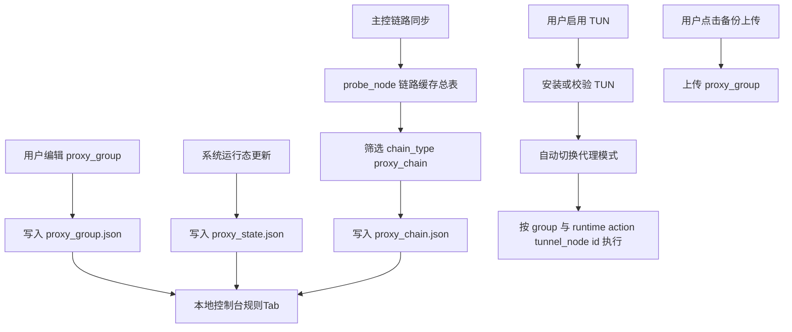

# 架构师阶段文档 `probe_node` 本地控制台代理组与链路缓存升级

## 工作依据与规则传递声明
- 当前角色: 架构师
- 工作依据文档: `doc/ai-coding-unified-rules.md`
- 适用规则: AI协作统一规则 单一规范
- 规则遵循声明: 必须遵守本规则。
- 协作传递要求: 后续接手者与协作者必须遵守同一规则，不得降级或替换执行口径。

- 日期: 2026-04-24
- 备注: 本次为 `probe_node` 本地控制台演进，目标是将 TUN 模式与代理链路选择能力收敛到本地控制台，并将行为语义对齐 `probe_manager`；文件收敛为 `proxy_group.json` `proxy_state.json` 与 `proxy_host.txt`。
- 风险:
  - 主控备份上传接口若在联调期发生协议变更，可能导致手动备份联调延迟。
  - 不同平台网络权限策略差异，可能影响 TUN 相关系统路由生效稳定性。
- 技术定版项:
  - `proxy_chain` 过滤口径、`proxy_group` 与 `proxy_state` 拆分、TUN 启动后代理切换流程、双 Tab API 契约均已定版，归入实现项，不再归类为风险。
- 遗留事项:
  - 本期不引入历史版本与回滚设计，先聚焦当前需求落地。
  - `proxy_chain.json` 签名校验与来源追踪不在本期范围。
- 进度状态: 进行中
- 完成情况: 已完成需求边界收敛、关键口径确认与实施方案设计。
- 检查表:
  - [x] 已显式记录工作依据与规则传递声明
  - [x] 已确认字符集编码基线
  - [x] 已确认链路缓存与代理组来源口径
  - [x] 已形成执行单元包与测试映射
- 跟踪表状态: 待实现
- 结论记录: 采用 `probe_node` 本地控制台双 Tab 改造，链路缓存仅保留 `proxy_chain`；行为语义按本期口径收敛为动态通道决策，`action` 与 `tunnel_node_id` 仅写入 `proxy_state.json` 运行态，`proxy_group.json` 仅保留分组匹配静态规则，备份上传仅手动触发且仅上传 `proxy_group.json`。

## 字符集编码基线
- 字符集类型: UTF-8
- BOM 策略: 启用 BOM
- 换行符规则: CRLF
- 跨平台兼容要求: 新增与改造文件统一按此基线保存。
- 历史文件迁移策略: 本次改动涉及文件按新基线落地，不做全仓批量迁移。

## 统一需求主文档
- RQ-PN-UPG-001: 本地控制台会话过期时间改为 30 天。
- RQ-PN-UPG-002: 删除当前会话面板。
- RQ-PN-UPG-003: TUN 状态与代理状态改为两个独立 Tab，并调整展示顺序。
- RQ-PN-UPG-004: 增加 `proxy_chain.json` 缓存，仅缓存可用于代理模式的 `proxy_chain` 链路。
- RQ-PN-UPG-005: 参照 manager 行为，启动 TUN 后进入代理模式。
- RQ-PN-UPG-006: 增加 JSON 模式规则配置 `proxy_group.json`，分组规则采用 `rules_text` 行式文本 每行一条规则 不使用数组；动作 `direct` `reject` `tunnel` 与 `tunnel_node_id` 仅写入 `proxy_state.json` 运行态。
- RQ-PN-UPG-007: `proxy_group.json` 仅手动点击上传备份，不做自动上传。
- RQ-PN-UPG-008: 增加 `proxy_host.txt` 静态路由主机映射文件，格式为每行 `dns,ip`，支持空行与 `#` 注释。

## 关键口径确认
- 链路来源: 由后台服务从主控拉取后缓存。
- 链路筛选: 仅 `chain_type=proxy_chain` 可选；`port_forward` 不缓存不可选。
- 规则来源: `proxy_group.json` 由用户维护。
- 动作归属: `action` 仅属于运行态字段，落到 `proxy_state.json`。
- 通道归属: `tunnel_node_id` 仅属于运行态字段，落到 `proxy_state.json`。
- 动态边界: `proxy_state.json` 回写 `action` `tunnel_node_id` `runtime_status` 与时间戳。
- 备份策略: 手动触发上传，禁止自动上传；上传对象仅包含 `proxy_group.json`。
- 数据拆分: `proxy_group.json` 仅存静态分组匹配规则，规则字段为 `rules_text` 行式文本，不存通道与动作；通道选择结果与健康状态统一落到 `proxy_state.json`。
- fallback 归属: `fallback` 为内置组，不要求在 `proxy_group.json` 中显式配置；未命中任何分组时按内置组策略执行。
- `proxy_host` 归属: 使用独立文件 `proxy_host.txt`，用于维护静态路由 `dns,ip` 对。
- `proxy_host` 格式: 每行一条 `dns,ip`；支持空行与 `#` 注释；非法行在校验阶段返回明确行号错误。
- 缺省文件策略: 若 `proxy_group.json` 或 `proxy_state.json` 或 `proxy_host.txt` 不存在，系统自动生成默认配置文件后再继续读写。

## 总体设计

## 单元设计
### U-PN-UPG-01 会话与认证时效调整
- 目标: 将会话 TTL 从 8 小时调整为 30 天。
- 主要改造: `probe_node/local_console.go`。
- 兼容要求: cookie 机制保持不变，仅时效变更。

### U-PN-UPG-02 控制台 UI 双 Tab 重构
- 目标: 删除会话面板，改为 `代理状态` 与 `TUN 状态` 两个独立 Tab。
- 主要改造: `probe_node/local_pages/panel.html` 与页面脚本。
- 兼容要求: 现有 `/local/api/*` 能力保持可用。

### U-PN-UPG-03 proxy_chain 缓存模型
- 目标: 新增 `proxy_chain.json`，仅持久化 `proxy_chain` 链路。
- 数据来源: 复用 `probe_link_chains_sync` 拉取结果。
- 主要改造: `probe_node/probe_link_chains_sync.go` 新增筛选与落盘逻辑。

### U-PN-UPG-04 规则配置与接口
- 目标: 新增 `proxy_group.json` 静态规则读写，并将 `action` 与 `tunnel_node_id` 动态状态写入 `proxy_state.json`。
- 主要改造: `probe_node/local_console.go` 增加规则查询、保存、校验接口；新增动态状态读取与系统写入接口。
- 校验规则: `proxy_group` 仅允许分组匹配规则与必要元数据；`rules_text` 必须为字符串并按换行分割规则，空行与注释行可忽略；禁止写入 `action` `tunnel_node_id` 与运行态字段。
- 运行规则: 运行期按组命中结果在 `proxy_state.json` 写入当前 `action` 与 `tunnel_node_id`，当 `action=tunnel` 时 `tunnel_node_id` 必须引用 `proxy_chain.json` 可用链路。
- fallback 规则: `fallback` 为系统内置组，不依赖 `proxy_group.json` 显式声明。
- 初始化规则: 当 `proxy_group.json` 或 `proxy_state.json` 缺失时自动生成默认文件，保证接口首读可用。
- 写入边界: `proxy_group.json` 仅允许用户静态规则字段；`proxy_state.json` 仅允许系统运行态字段。

### U-PN-UPG-05 TUN 启动后代理模式切换
- 目标: 启动 TUN 成功后自动进入代理模式并绑定当前组选择链路。
- 主要改造: `probe_node/local_console.go` 控制流程与状态字段。
- 失败策略: 任一步骤失败即返回错误并保持可恢复状态。

### U-PN-UPG-06 手动备份上传
- 目标: 增加手动上传 `proxy_group.json` 到主控备份接口。
- 主要改造: `probe_node` 新增上传客户端；`probe_controller` 新增接收动作或 HTTP 接口。
- 约束: 仅手动触发，不做自动任务；`proxy_state.json` 与 `proxy_host.txt` 不参与上传。

### U-PN-UPG-07 `proxy_host.txt` 静态路由映射
- 目标: 增加 `proxy_host.txt` 读写与校验，支持静态 `dns,ip` 对。
- 主要改造: `probe_node/local_console.go` 增加 `proxy_host` 查询与保存接口，并在路由决策前加载映射。
- 校验规则: 每行必须为 `dns,ip` 两段，`dns` 规范化为小写域名，`ip` 必须为合法 IPv4 或 IPv6。
- 兼容策略: 忽略空行与 `#` 注释；重复 `dns` 以最后一行为准并记录告警日志。

## 接口定义清单
- 现有复用:
  - `GET /local/api/proxy/status`
  - `GET /local/api/tun/status`
  - `POST /local/api/tun/install`
  - `POST /local/api/proxy/enable`
  - `POST /local/api/proxy/direct`
- 新增建议:
  - `GET /local/api/proxy/chains` 获取 `proxy_chain` 列表
  - `GET /local/api/proxy/groups` 获取 `proxy_group.json`
  - `POST /local/api/proxy/groups/save` 保存 `proxy_group.json`
  - `GET /local/api/proxy/state` 获取 `proxy_state.json` 动态状态
  - `GET /local/api/proxy/hosts` 获取 `proxy_host.txt`
  - `POST /local/api/proxy/hosts/save` 保存 `proxy_host.txt`
  - `POST /local/api/proxy/groups/backup` 手动上传 `proxy_group.json` 备份

## 执行单元包拆分
- PKG-PN-UPG-01: 会话 TTL 调整为 30 天
- PKG-PN-UPG-02: 控制台改为双 Tab 并移除会话面板
- PKG-PN-UPG-03: `proxy_chain.json` 筛选缓存
- PKG-PN-UPG-04: `proxy_group.json` 静态规则与 `proxy_state.json` 动态动作通道拆分模型及 API
- PKG-PN-UPG-05: TUN 启动后自动代理模式流程
- PKG-PN-UPG-06: 手动备份上传链路
- PKG-PN-UPG-07: `proxy_host.txt` 静态路由映射读写与校验
- PKG-PN-UPG-08: 回归测试与兼容验证

## 编码测试映射
| 需求编号 | 执行单元包 | 验证口径 |
|---|---|---|
| RQ-PN-UPG-001 | PKG-PN-UPG-01 | 登录后会话过期时间为 30 天 |
| RQ-PN-UPG-002 RQ-PN-UPG-003 | PKG-PN-UPG-02 | 页面无会话面板，Tab 可独立切换与刷新 |
| RQ-PN-UPG-004 | PKG-PN-UPG-03 | `proxy_chain.json` 仅含 `proxy_chain` |
| RQ-PN-UPG-006 | PKG-PN-UPG-04 | 行为语义按本期口径收敛为 `proxy_group` `proxy_state` 双文件，`proxy_group` 仅保留静态分组规则，`action` 与 `tunnel_node_id` 仅写入 `proxy_state` 运行态，`fallback` 为内置组且缺失文件自动生成默认配置 |
| RQ-PN-UPG-005 | PKG-PN-UPG-05 | TUN 启动后代理模式自动生效 |
| RQ-PN-UPG-007 | PKG-PN-UPG-06 | 仅手动触发上传，无自动上传 |
| RQ-PN-UPG-008 | PKG-PN-UPG-07 | `proxy_host.txt` 支持 `dns,ip` 每行一条，支持空行与 `#` 注释，并在缺失时自动生成默认文件 |

## 门禁判定
- G1 需求门: 通过
- G2 架构门: 通过
- G3 编码核查门: 待执行
- G4 测试核查门: 待执行
- G5 复盘门: 待执行
