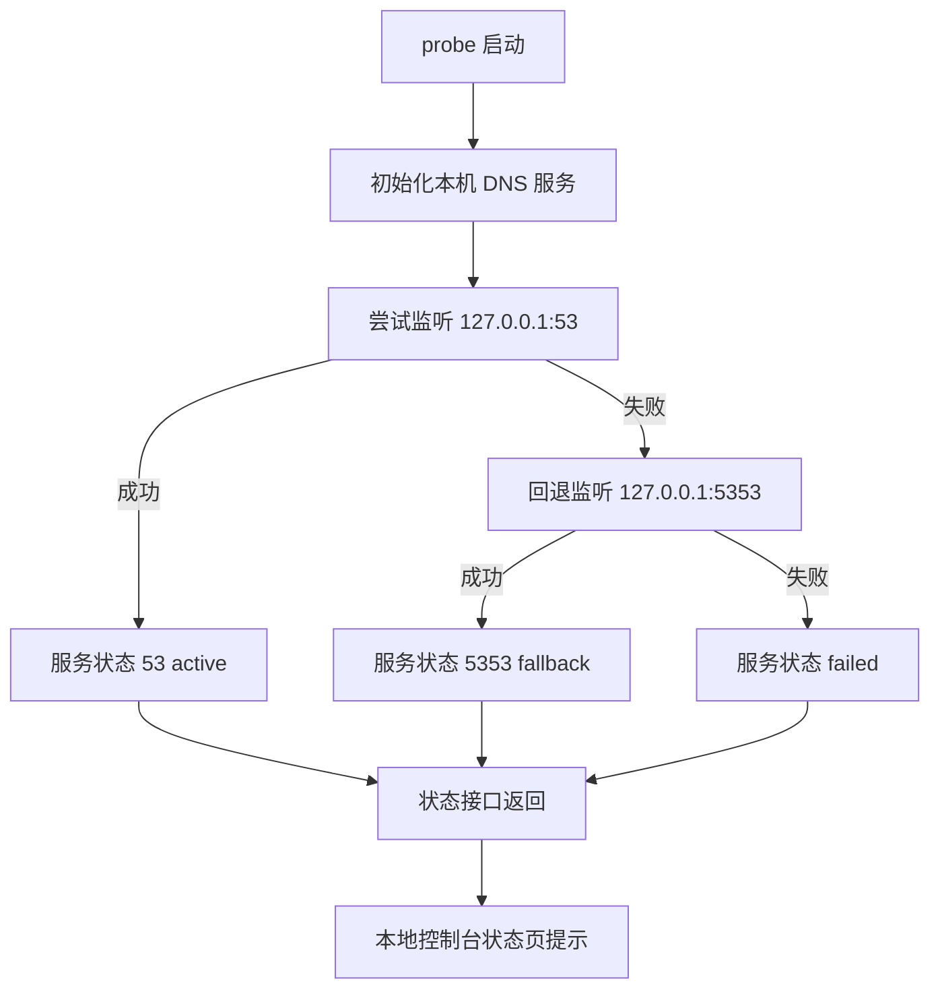

# 架构师阶段文档 `probe_node` 本机 DNS 服务独立启用方案

## 工作依据与规则传递声明
- 当前角色: 架构师
- 工作依据文档: `doc/ai-coding-unified-rules.md`
- 适用规则: AI协作统一规则 单一规范
- 规则遵循声明: 必须遵守本规则。
- 协作传递要求: 后续接手者与协作者必须遵守同一规则，不得降级或替换执行口径。

- 日期: 2026-04-25
- 备注: 新增 `probe_node` 本机 DNS 服务能力，要求不依赖 TUN，默认启用，监听 `127.0.0.1`，端口优先 `53`，失败回退 `5353`，并在本地控制台状态页提示；DNS 缓存 TTL 固定为 15 天。
- 风险:
  - 非管理员权限下监听 `53` 可能失败，需要可靠回退到 `5353`。
  - 若系统 DNS 未指向本机回环地址，功能存在可用性偏差。
- 遗留事项:
  - 本期不做系统 DNS 自动改写策略，仅提供服务与状态可视。
  - 本期不引入 manager 级完整 TUN DNS 数据面，仅实现独立本机 DNS 服务。
- 进度状态: 已完成设计 待编码实施
- 完成情况: 已完成边界确认 生命周期设计 配置与状态接口方案。
- 检查表:
  - [x] 已显式记录工作依据与规则传递声明
  - [x] 已确认字符集编码基线 UTF-8 无 BOM LF
  - [x] 已明确不依赖 TUN 与默认启用策略
  - [x] 已明确监听地址与端口回退规则
- 跟踪表状态: 待实现
- 结论记录: 采用独立 DNS 服务组件实现，启动时默认启用，监听 `127.0.0.1:53`，失败自动回退 `127.0.0.1:5353`，状态通过本地控制台接口与页面提示暴露。

## 字符集编码基线
- 字符集类型: UTF-8
- BOM 策略: 无 BOM
- 换行符规则: LF
- 跨平台兼容要求: 本次新增与改造文件统一按该基线落盘。
- 历史文件迁移策略: 仅改动触达文件执行基线对齐，不做全仓迁移。

## 统一需求主文档
- RQ-PN-DNS-SVC-001: `probe_node` 新增本机 DNS 服务，不依赖 TUN。
- RQ-PN-DNS-SVC-002: 服务默认启用。
- RQ-PN-DNS-SVC-003: 监听地址固定 `127.0.0.1`。
- RQ-PN-DNS-SVC-004: 端口优先 `53`，失败回退 `5353`。
- RQ-PN-DNS-SVC-005: 状态接口返回监听地址 端口 回退信息 最近错误。
- RQ-PN-DNS-SVC-006: 本地控制台页面展示 DNS 状态提示。
- RQ-PN-DNS-SVC-007: DNS 上游来源接入 `proxy_group.json` 顶层字段 `dns_servers` `dot_servers` `doh_servers` `doh_proxy_servers`。
- RQ-PN-DNS-SVC-008: 远方 DNS 来源优先级固定为 `doh_proxy_servers` > `doh_servers` > `dot_servers` > `dns_servers`。
- RQ-PN-DNS-SVC-009: DNS 缓存 TTL 固定为 15 天。

## 关键选型与取舍
- 选型A 回环监听
  - 方案: 固定监听 `127.0.0.1`
  - 取舍: 跨平台稳定 不依赖网卡发现 与你当前决策一致。
- 选型B 代理网卡绑定
  - 方案: 动态绑定代理网卡 IP
  - 取舍: 与当前决策冲突 且跨平台差异大 本期不采用。
- 选型C 端口策略
  - 方案: `53` 优先 `5353` 回退
  - 取舍: 兼容管理员与非管理员场景 可维护性高。

## 总体设计

## 单元设计
### U-PN-DNS-SVC-01 DNS 服务生命周期
- 目标: 新增独立 DNS 服务组件，负责启动 停止 状态查询。
- 建议新增文件:
  - `probe_node/local_dns_service.go`
  - `probe_node/local_dns_service_test.go`
- 状态字段建议:
  - `enabled`
  - `listen_addr`
  - `port`
  - `fallback_used`
  - `last_error`
  - `updated_at`

### U-PN-DNS-SVC-02 启动挂载与关闭收敛
- 目标: 随 `probe_node` 启动默认拉起 DNS 服务，不依赖 TUN 开关。
- 主要改造建议:
  - `probe_node/main.go`
  - `probe_node/service_entry.go`
- 规则:
  - 启动时自动 `startLocalDNSServer()`
  - 进程退出时执行 `stopLocalDNSServer()`

### U-PN-DNS-SVC-03 上游配置接入
- 目标: 从 `proxy_group.json` 顶层读取 DNS 上游配置。
- 主要改造建议:
  - `probe_node/local_console.go` 中 `proxy_group` 结构与读写校验
- 字段:
  - `dns_servers`
  - `dot_servers`
  - `doh_servers`
  - `doh_proxy_servers`
- 上游选择顺序:
  - 第一优先 `doh_proxy_servers`
  - 第二优先 `doh_servers`
  - 第三优先 `dot_servers`
  - 第四优先 `dns_servers`

### U-PN-DNS-SVC-04 状态接口与页面提示
- 目标: 增加状态查询接口并在控制台显示。
- 建议接口:
  - `GET /local/api/dns/status`
- 主要改造建议:
  - `probe_node/local_console.go`
  - `probe_node/local_pages/panel.html`

### U-PN-DNS-SVC-05 测试与回归
- 目标: 覆盖端口回退 行为状态 接口返回 页面断言。
- 主要改造建议:
  - `probe_node/local_dns_service_test.go`
  - `probe_node/local_console_test.go`
  - `probe_node/local_console_methods_test.go`
  - `probe_node/local_pages_routes_test.go`

## 接口定义清单
- 新增:
  - `GET /local/api/dns/status`
- 复用:
  - `GET /local/api/proxy/groups`
  - `POST /local/api/proxy/groups/save`

## 执行单元包拆分
- PKG-PN-DNS-SVC-01: 本机 DNS 服务组件与状态模型
- PKG-PN-DNS-SVC-02: 启动时默认启用与退出清理
- PKG-PN-DNS-SVC-03: 端口 `53` 优先 `5353` 回退机制
- PKG-PN-DNS-SVC-04: `proxy_group` 顶层 DNS 字段读写与校验
- PKG-PN-DNS-SVC-05: 状态接口与前端提示
- PKG-PN-DNS-SVC-06: 单测回归与方法守卫

## 编码测试映射
| 需求编号 | 执行单元包 | 验证口径 |
|---|---|---|
| RQ-PN-DNS-SVC-001 | PKG-PN-DNS-SVC-01 | DNS 服务独立于 TUN 生命周期 |
| RQ-PN-DNS-SVC-002 | PKG-PN-DNS-SVC-02 | 进程启动后 DNS 状态为 enabled 或 fallback enabled |
| RQ-PN-DNS-SVC-003 RQ-PN-DNS-SVC-004 | PKG-PN-DNS-SVC-03 | 首选 `127.0.0.1:53` 失败回退 `127.0.0.1:5353` |
| RQ-PN-DNS-SVC-005 RQ-PN-DNS-SVC-006 | PKG-PN-DNS-SVC-05 | 状态接口与页面提示一致 |
| RQ-PN-DNS-SVC-007 | PKG-PN-DNS-SVC-04 | `proxy_group` 顶层字段可读可存可校验 |
| RQ-PN-DNS-SVC-008 | PKG-PN-DNS-SVC-04 | 远方 DNS 来源顺序为 `doh_proxy_servers` > `doh_servers` > `dot_servers` > `dns_servers` |
| RQ-PN-DNS-SVC-009 | PKG-PN-DNS-SVC-01 PKG-PN-DNS-SVC-04 | DNS 缓存 TTL 固定为 15 天 |

## 门禁判定
- G1 需求门: 通过
- G2 架构门: 通过
- G3 编码核查门: 待执行
- G4 测试核查门: 待执行
- G5 复盘门: 待执行
