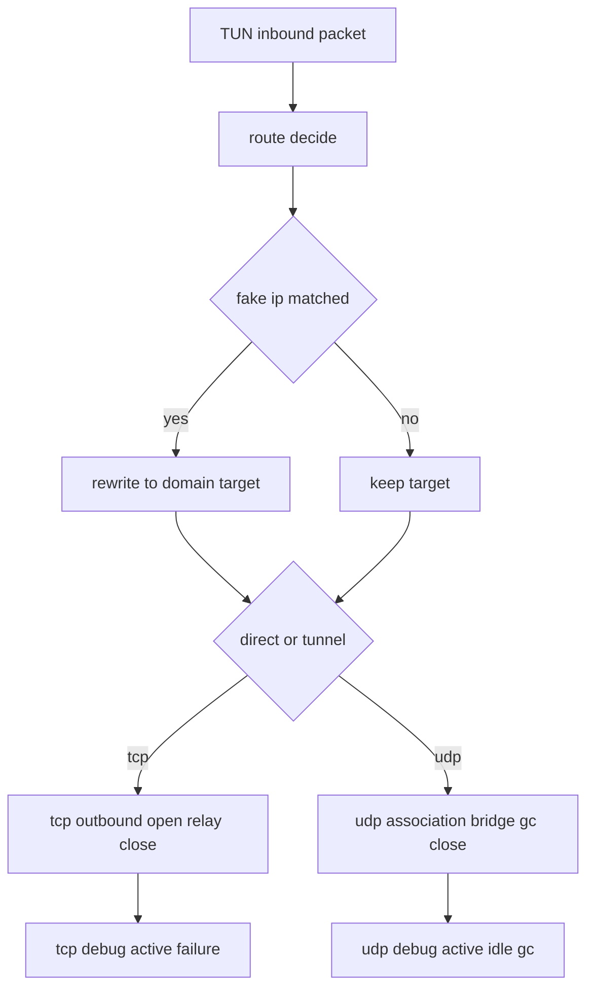

# Probe Node 出站行为与 Fake IP TCP UDP 生命周期统一规则审计文档

## 工作依据与规则传递声明

- 统一规则基线：[`doc/ai-coding-unified-rules.md`](doc/ai-coding-unified-rules.md)
- 本文档阶段定位：S2 架构审计与执行单元落盘，对应 G2 产物。
- 审计方法：以 manager 现有实现为对照基线，核查 node 在 Fake IP 出站映射、TCP 生命周期、UDP 生命周期三条链路的一致性与闭环性。
- 证据原则：每个结论都绑定代码证据位置，避免口径漂移。

## 日期

- 2026-04-30

## 备注

- 本文档仅给出审计结论与实施清单，不包含代码实现。
- 当前仓库存在未提交变更，本文不覆盖 git 整理策略。

## 审计范围

1. Fake IP 出站映射
2. TCP 代理生命周期
3. UDP 代理生命周期
4. 可观测性与调试字段一致性
5. 回归测试覆盖矩阵

---

## 一 现状对照结论

### 1 Fake IP 出站映射

- Node 侧已具备 DNS 分配与反查入口：[`allocateProbeLocalDNSFakeIP()`](probe_node/local_dns_service.go:870)、[`lookupProbeLocalDNSFakeIPEntry()`](probe_node/local_dns_service.go:1042)
- Node 侧已具备路由改写入口：[`rewriteProbeLocalRouteTargetForFakeIP()`](probe_node/local_tun_route.go:93)
- 但 Node 在 TUN 写入路径未进入真实出站执行，仅日志后返回：[`probeLocalTUNSimplePacketStack.Write()`](probe_node/local_tun_stack_windows.go:65)
- Manager 侧在真实出站前执行 Fake IP 改写并进入拨号：[`rewriteRouteTargetForFakeIP()`](probe_manager/backend/network_assistant_fake_ip.go:385)、[`openOutboundTCP()`](probe_manager/backend/network_assistant_tun_stack_windows.go:556)、[`openOutboundUDP()`](probe_manager/backend/network_assistant_tun_stack_windows.go:587)

结论：
- Node 的 Fake IP 规则策略已收敛，但“改写结果驱动真实拨号”链路未闭环。

### 2 TCP 生命周期

- Manager 具备完整链路：接入 选路 开链 双向拷贝 关闭 调试留痕
  - 接入：[`handleTCPForwarder()`](probe_manager/backend/network_assistant_tun_stack_windows.go:295)
  - 开链：[`openOutboundTCP()`](probe_manager/backend/network_assistant_tun_stack_windows.go:556)
  - 传输：[`relayTCP()`](probe_manager/backend/network_assistant_tun_stack_windows.go:623)、[`pipeAndCloseTCP()`](probe_manager/backend/network_assistant_tun_stack_windows.go:628)
  - 调试：[`beginRelay()`](probe_manager/backend/network_assistant_tcp_debug.go:80)、[`recordFailure()`](probe_manager/backend/network_assistant_tcp_debug.go:139)
- Node 在 TUN 路径仅做路由判定，无 TCP 出站执行闭环：[`probeLocalTUNSimplePacketStack.Write()`](probe_node/local_tun_stack_windows.go:65)
- Node 的 TCP Debug 当前主要绑定链路转发而非 TUN 出站路径：[`globalProbeTCPDebugState`](probe_node/tcp_debug.go:96)、[`beginRelay()`](probe_node/tcp_debug.go:113)

结论：
- Node 与 Manager 在 TUN-TCP 生命周期能力不对等。

### 3 UDP 生命周期

- Manager 具备两套 UDP 路径：
  - Forwarder 路径：[`handleUDPForwarder()`](probe_manager/backend/network_assistant_tun_stack_windows.go:386)
  - Association/Relay 路径：[`forwardInboundUDPToRelay()`](probe_manager/backend/network_assistant_tun_stack_windows.go:508)
  - 开链与策略：[`openOutboundUDP()`](probe_manager/backend/network_assistant_tun_stack_windows.go:587)
- Node 虽有 UDP association 池与 GC：[`probeChainUDPAssociationPool.collectIdle()`](probe_node/link_chain_udp_assoc.go:254)
- 但 Node TUN 写入路径未接入 UDP 出站桥接或 relay 生命周期：[`probeLocalTUNSimplePacketStack.Write()`](probe_node/local_tun_stack_windows.go:65)

结论：
- Node 的 UDP 组件存在，但未与 TUN 出站路径形成等价闭环。

### 4 调试与可观测

- Manager TCP/UDP 调试字段包含 route_target node_id group direct 等关键路由信息：[`localTUNTCPDebugFailureEvent`](probe_manager/backend/network_assistant_tcp_debug.go:15)、[`aiDebugUDPAssociationItemPayload`](probe_manager/backend/ai_debug_udp_assoc.go:13)
- Node UDP 调试字段已具备 route_target group node_id 等，但来源主要为链路 association 池：[`probeUDPAssociationDebugItemPayload`](probe_node/udp_assoc_debug.go:13)

结论：
- Node 调试结构可复用，但需绑定到 TUN 出站真实生命周期事件，当前证据链仍不完整。

---

## 二 差距分级 P0 P1 P2

### P0 核心阻断

1. Node TUN 写入路径缺失真实出站执行闭环
   - 现状：只进行路由判定与日志。
   - 证据：[`probeLocalTUNSimplePacketStack.Write()`](probe_node/local_tun_stack_windows.go:65)
   - 影响：Fake IP 改写与 TCP/UDP 生命周期无法在 TUN 出站路径落地。

2. Node TUN 路径未建立 TCP/UDP 生命周期管理
   - 现状：无等价 forwarder/bridge/relay 出站执行。
   - 对照：[`handleTCPForwarder()`](probe_manager/backend/network_assistant_tun_stack_windows.go:295)、[`handleUDPForwarder()`](probe_manager/backend/network_assistant_tun_stack_windows.go:386)

### P1 关键退化

1. Fake IP 改写链路与真实拨号目标未端到端绑定
   - 现状：规则与改写函数存在，但不驱动 TUN 出站拨号。
   - 证据：[`rewriteProbeLocalRouteTargetForFakeIP()`](probe_node/local_tun_route.go:93)

2. TCP Debug 在 node 侧未覆盖 TUN 出站主路径
   - 现状：主要覆盖链路转发，不覆盖缺失的 TUN 出站链。
   - 证据：[`probeTCPDebugState.beginRelay()`](probe_node/tcp_debug.go:113)

### P2 一般缺陷

1. 回归测试矩阵缺少 manager 等价行为校验
2. UDP 调试项需补充与 TUN 路径绑定的活跃态与异常归因

---

## 三 目标架构行为矩阵

| 维度 | Manager 基线 | Node 当前 | Node 目标 |
|---|---|---|---|
| Fake IP 分配 | 规则驱动分配并缓存 | 已具备 | 保持 |
| Fake IP 反查改写 | 出站前改写到域名目标 | 已具备函数 | 绑定到真实出站执行 |
| TUN TCP 出站 | 完整 forwarder 生命周期 | 缺失 | 对齐 manager 闭环 |
| TUN UDP 出站 | association relay bridge 完整 | 组件分散未闭环 | 对齐 manager 闭环 |
| TCP Debug | active failure 全链路 | 部分能力 | 绑定 TUN 全路径 |
| UDP Debug | route target group node 可观测 | 部分能力 | 增强归因一致性 |

---

## 四 可执行实施清单 按统一规则

### UA1 Node 引入 gVisor Netstack 作为 TUN 主执行路径

- 目标：将 node 的 TUN 包处理从仅路由判定升级为 manager 等价的 netstack forwarder 执行。
- 对照基线：[`newLocalTUNNetstack()`](probe_manager/backend/network_assistant_tun_stack_windows.go:168)、[`localTUNNetstack.Write()`](probe_manager/backend/network_assistant_tun_stack_windows.go:250)
- node 改造入口：[`startProbeLocalTUNPacketStack()`](probe_node/local_tun_stack_windows.go:41)、[`probeLocalTUNSimplePacketStack.Write()`](probe_node/local_tun_stack_windows.go:65)

实施项：
1. 在 node 新增 netstack runner 与 packet stack 实现，替换 simple stack 主路径。
2. 保留 direct bypass 现有能力，并抽象为可复用 release 生命周期。
3. 将 TUN 入站包注入 netstack 后由 forwarder 驱动 TCP/UDP 分流。

验收要点：
- TUN 入站流量可触发真实出站连接。
- 非 reject 且 tunnel 路由不再只打印日志。

### UA2 Fake IP 改写绑定到真实拨号目标

- 目标：Fake IP 反查结果必须进入 openOutbound 前置流程。
- node 复用入口：[`rewriteProbeLocalRouteTargetForFakeIP()`](probe_node/local_tun_route.go:93)
- manager 对照：[`rewriteRouteTargetForFakeIP()`](probe_manager/backend/network_assistant_fake_ip.go:385)

实施项：
1. 在 node 的 TCP/UDP openOutbound 流程统一执行 fake ip 改写。
2. route_target 记录改写后目标，避免 fake ip 被直接拨号。
3. 与路由决策字段 group node_id direct 同步更新。

验收要点：
- fake ip 目标不会直接作为远端地址拨号。
- route_target 与实际拨号目标一致。

### UA3 TCP 生命周期与 Debug 对齐

- manager 基线：[`handleTCPForwarder()`](probe_manager/backend/network_assistant_tun_stack_windows.go:295)、[`openOutboundTCP()`](probe_manager/backend/network_assistant_tun_stack_windows.go:556)、[`pipeAndCloseTCP()`](probe_manager/backend/network_assistant_tun_stack_windows.go:628)
- node 当前调试入口：[`globalProbeTCPDebugState`](probe_node/tcp_debug.go:96)

实施项：
1. 引入 node `handleTCPForwarder openOutboundTCP relayTCP pipeAndCloseTCP` 对齐单元。
2. 统一失败归因：create_failed open_failed relay_failed。
3. 对齐调试字段：target route_target node_id group direct transport。

验收要点：
- active 连接与 failures 均可观测。
- open_failed relay_failed 归因可见。

### UA4 UDP 生命周期与 Debug 对齐

- manager 策略基线：[`getOrCreateLocalTUNUDPRelay()`](probe_manager/backend/network_assistant_tun_udp.go:99)、[`localTUNUDPRelay.startReadLoop()`](probe_manager/backend/network_assistant_tun_udp.go:276)、[`localTUNUDPRelay.startIdleGCWithInterval()`](probe_manager/backend/network_assistant_tun_udp.go:384)
- node 当前可复用组件：[`probeChainUDPAssociationPool.collectIdle()`](probe_node/link_chain_udp_assoc.go:254)

实施项：
1. node 建立 source refs + relay key + route fingerprint 机制。
2. direct 与 tunnel 两种 UDP 出站统一封装 send read close 生命周期。
3. 引入 idle timeout + gc interval + bind fallback 策略。
4. 对齐调试字段：assoc_key_v2 flow_id route_target group node_id nat_mode ttl_profile refs active。

验收要点：
- UDP 会话创建 复用 回包 空闲回收 异常释放全链路可观测。

### UA5 回归测试矩阵补齐

实施项：
1. TCP 正反向回归：direct tunnel reject fakeip-rewrite open-fail relay-fail。
2. UDP 正反向回归：direct tunnel source-refs idle-gc bind-fallback fakeip-rewrite。
3. Debug 回归：TCP/UDP payload 字段一致性校验。
4. Fake IP 回归：A 记录分配反查改写到拨号目标端到端。

验收命令基线：
- `go test ./...` in [`probe_node`](probe_node/go.mod)

### UA6 Code 实施任务总清单 全量

#### C1 gVisor 主路径引入

- 在 [`probe_node/local_tun_stack_windows.go`](probe_node/local_tun_stack_windows.go) 新增 node netstack runner 与 packet stack 主实现。
- 对齐 manager 结构参考：[`newLocalTUNNetstack()`](probe_manager/backend/network_assistant_tun_stack_windows.go:168)、[`localTUNNetstack.Write()`](probe_manager/backend/network_assistant_tun_stack_windows.go:250)
- 将当前仅判定路径 [`probeLocalTUNSimplePacketStack.Write()`](probe_node/local_tun_stack_windows.go:65) 迁移为真实执行路径。

#### C2 TUN TCP Forwarder 全链路

- 新增 node 侧 TCP forwarder 入口与路由开链。
- 需要落地 `handleTCPForwarder openOutboundTCP relayTCP pipeAndCloseTCP` 等价单元。
- 对齐参考：[`handleTCPForwarder()`](probe_manager/backend/network_assistant_tun_stack_windows.go:295)、[`openOutboundTCP()`](probe_manager/backend/network_assistant_tun_stack_windows.go:556)、[`pipeAndCloseTCP()`](probe_manager/backend/network_assistant_tun_stack_windows.go:628)

#### C3 TUN UDP Forwarder 与 Relay 全链路

- 新增 node 侧 UDP forwarder 与 relay 生命周期。
- 完整覆盖 `create relay send read close idle gc`。
- 对齐参考：[`handleUDPForwarder()`](probe_manager/backend/network_assistant_tun_stack_windows.go:386)、[`getOrCreateLocalTUNUDPRelay()`](probe_manager/backend/network_assistant_tun_udp.go:99)、[`localTUNUDPRelay.startReadLoop()`](probe_manager/backend/network_assistant_tun_udp.go:276)、[`localTUNUDPRelay.startIdleGCWithInterval()`](probe_manager/backend/network_assistant_tun_udp.go:384)

#### C4 UDP Source 引用计数与 NAT 策略

- 引入 source key refs 模型并绑定 relay 生命周期。
- 对齐 direct bind 冲突 fallback 到 ephemeral。
- 对齐参考：[`acquireLocalTUNUDPSource()`](probe_manager/backend/network_assistant_tun_udp.go:417)、[`releaseLocalTUNUDPSource()`](probe_manager/backend/network_assistant_tun_udp.go:446)、[`shouldFallbackLocalTUNUDPBind()`](probe_manager/backend/network_assistant_tun_udp.go:518)

#### C5 Fake IP 改写绑定 openOutbound

- 在 node TCP/UDP 出站 open 前统一调用 [`rewriteProbeLocalRouteTargetForFakeIP()`](probe_node/local_tun_route.go:93)
- 确保 route_target 与实际拨号目标一致。
- 避免 fake ip 作为最终远端地址。

#### C6 Direct Bypass 路由生命周期托管

- 将 direct bypass 的 acquire 与 release 从一次性动作改造为连接级托管。
- 对齐 manager `directBypassManagedConn` 释放时机。
- 对齐参考：[`directBypassManagedConn.Close()`](probe_manager/backend/network_assistant_tun_stack_windows.go:112)

#### C7 TCP Debug 对齐改造

- 扩展 node TCP debug 事件覆盖 TUN 主路径。
- 对齐字段 `target route_target node_id group direct transport`。
- 对齐参考：[`localTUNTCPDebugState.recordFailure()`](probe_manager/backend/network_assistant_tcp_debug.go:139)、[`probeTCPDebugState`](probe_node/tcp_debug.go:83)

#### C8 UDP Debug 对齐改造

- 扩展 node UDP debug 绑定 TUN relay 生命周期。
- 对齐字段 `assoc_key_v2 flow_id route_target route_fingerprint node_id group nat_mode ttl_profile refs active last_active idle_ms`。
- 对齐参考：[`aiDebugUDPAssociationItemPayload`](probe_manager/backend/ai_debug_udp_assoc.go:13)、[`probeUDPAssociationDebugItemPayload`](probe_node/udp_assoc_debug.go:13)

#### C9 异常归因与日志口径统一

- 统一 create_failed open_failed relay_failed udp_send_failed 等错误分类。
- 统一 direct tunnel group node route_target 输出字段。

#### C10 回归测试新增与改写

- 重点新增文件：[`probe_node/local_tun_stack_windows_test.go`](probe_node/local_tun_stack_windows_test.go)、[`probe_node/local_tun_route_test.go`](probe_node/local_tun_route_test.go)
- 新增 UDP 生命周期专项测试建议文件：[`probe_node/local_tun_udp_lifecycle_test.go`](probe_node/local_tun_udp_lifecycle_test.go)
- 新增 TCP 调试专项测试建议文件：[`probe_node/tcp_debug_tun_path_test.go`](probe_node/tcp_debug_tun_path_test.go)
- 新增 UDP 调试专项测试建议文件：[`probe_node/udp_assoc_debug_tun_path_test.go`](probe_node/udp_assoc_debug_tun_path_test.go)

#### C11 验证与收口

- 执行单测：`go test ./...` in [`probe_node`](probe_node/go.mod)
- 失败项按 P0 P1 P2 回写本架构文档与实施记录。
- 通过后进入 Code 阶段 G3 证据归档。

---

## 五 风险

1. P0 风险：TUN 出站链路改造会触达网络数据面，若并发与关闭序列处理不当，可能引入连接泄漏。
2. P1 风险：Fake IP 改写时机不一致会导致调试口径与实际拨号不一致。
3. P2 风险：仅补功能不补测试会导致后续回归复发。

---

## 六 决策固化与遗留事项

### 已确认决策

1. Node 引入 gVisor netstack，作为 TUN 主执行路径。
2. Node UDP 生命周期策略参照 manager 执行，采用 source refs + relay + idle gc + bind fallback 模型。

### 保留遗留事项

1. 调试事件命名与 manager 是否完全同名对齐。

---

## 七 进度状态

- 当前阶段：已完成 S2 架构审计落盘，待进入 S3 代码实施。
- 门禁判断：G2 可过，G3 未开始。

## 八 完成情况

- 已完成：统一规则下的 node manager 对照审计、P0/P1/P2 分级、执行单元包与验收口径。
- 未完成：代码改造与测试执行。

## 九 检查表

- [x] 已落盘到 doc 目录
- [x] 包含最小字段
- [x] 包含证据锚点
- [x] 包含 P0 P1 P2 分级
- [x] 包含可执行实施清单
- [x] 包含验收命令基线

## 十 跟踪表状态

| 条目 | 状态 |
|---|---|
| Fake IP 出站映射统一核查 | 已完成 |
| TCP 生命周期统一核查 | 已完成 |
| UDP 生命周期统一核查 | 已完成 |
| 差距分级与证据落盘 | 已完成 |
| 代码实施 | 待开始 |
| 回归测试 | 待开始 |

## 十一 结论记录

- 结论编号：G2-2026-04-30-node-outbound-audit
- 结论：Node 当前在策略层已接近统一口径，但在数据面执行层存在 P0 阻断，必须先完成 TUN 出站真实执行闭环，之后再推进 P1 P2 的调试与测试一致性补齐。
- 建议流转：按 UA1 到 UA5 顺序进入 Code 阶段实施。
