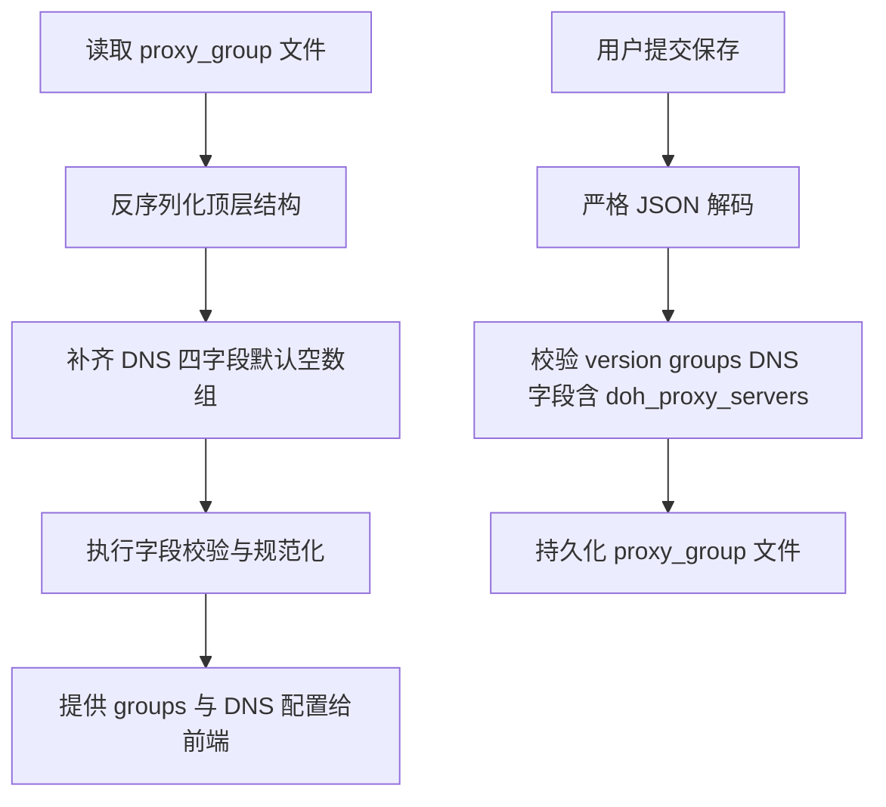

# 架构师阶段文档 `probe_node` proxy_group 顶层 DNS 服务器配置扩展

## 工作依据与规则传递声明
- 当前角色: 架构师
- 工作依据文档: `doc/ai-coding-unified-rules.md`
- 适用规则: AI协作统一规则 单一规范
- 规则遵循声明: 必须遵守本规则。
- 协作传递要求: 后续接手者与协作者必须遵守同一规则，不得降级或替换执行口径。

- 日期: 2026-04-25
- 备注: 在不改变 `groups` 结构的前提下，为 `proxy_group.json` 顶层新增 `dns_servers` `dot_servers` `doh_servers` `doh_proxy_servers` 四个全局配置字段，位置语义位于 `version` 与 `groups` 之间，其中 `doh_proxy_servers` 用于代理组 DNS 解析。
- 风险:
  - 配置字段新增后，旧文件兼容读取需保持无感，避免启动失败。
  - 若地址格式校验过严，可能造成用户已有配置迁移阻塞。
- 遗留事项:
  - 本期仅定义与落地配置读写和校验，不引入 manager 级完整 DNS 运行栈。
  - `doh_servers` 深层高级参数如证书校验开关暂不纳入本期。
- 进度状态: 已完成设计，待编码实施
- 完成情况: 已完成需求收敛、数据模型方案、接口行为约束、测试映射。
- 检查表:
  - [x] 已显式记录工作依据与规则传递声明
  - [x] 已显式确认字符集基线为 UTF-8 无 BOM LF
  - [x] 已给出兼容策略和门禁判定
  - [x] 已形成可执行单元包与测试映射
- 跟踪表状态: 待实现
- 结论记录: 采用顶层全局 DNS 配置扩展，保持 `groups` 结构不变，实施采用向后兼容读写与渐进校验。

## 字符集编码基线
- 字符集类型: UTF-8
- BOM 策略: 无 BOM
- 换行符规则: LF
- 跨平台兼容要求: 新增与改造文件统一按该基线落盘。
- 历史文件迁移策略: 仅对本次修改触达文件执行基线对齐，不做全仓迁移。

## 统一需求主文档
- RQ-PN-DNSCFG-001: `proxy_group.json` 顶层新增 `dns_servers` `dot_servers` `doh_servers` `doh_proxy_servers`。
- RQ-PN-DNSCFG-002: 新字段为全局配置，`groups` 结构保持不变。
- RQ-PN-DNSCFG-003: `doh_proxy_servers` 供代理组 DNS 解析使用。
- RQ-PN-DNSCFG-004: 兼容旧版文件，缺失字段自动按空数组处理并可持久化回写。
- RQ-PN-DNSCFG-005: 保存接口执行严格 JSON 校验，拒绝未知字段。
- RQ-PN-DNSCFG-006: 补充默认文件、读写校验、API 行为、回归测试与示例文档。

## 关键选型与取舍
- 选型A 顶层数组字段
  - 方案: `dns_servers []string` `dot_servers []string` `doh_servers []string` `doh_proxy_servers []string`
  - 取舍: 实施成本低，兼容现有 `probeLocalProxyGroupFile` 结构扩展。
- 选型B 复杂对象字段
  - 方案: `doh_servers` 使用对象数组
  - 取舍: 灵活但改动面更大，本期不采用。

## 总体设计

## 单元设计
### U-PN-DNSCFG-01 数据结构扩展
- 目标: 扩展 [probeLocalProxyGroupFile](probe_node/local_console.go:105) 增加 DNS 四字段。
- 主要改造:
  - [probeLocalProxyGroupFile](probe_node/local_console.go:105)
  - [defaultProbeLocalProxyGroupFile()](probe_node/local_console.go:540)

### U-PN-DNSCFG-02 读写与校验规则
- 目标: 在读取和保存阶段统一校验并兼容旧文件。
- 主要改造:
  - [validateProbeLocalProxyGroupFile()](probe_node/local_console.go:614)
  - [loadProbeLocalProxyGroupFile()](probe_node/local_console.go:657)
  - [persistProbeLocalProxyGroupFile()](probe_node/local_console.go:690)
- 校验建议:
  - 字段均允许为空数组。
  - `dns_servers` 元素按 `host:port` 规则校验。
  - `dot_servers` 元素按 `host:port` 规则校验。
  - `doh_servers` 元素需为 `http` 或 `https` URL。
  - `doh_proxy_servers` 元素需为 `http` 或 `https` URL，语义为代理组 DNS 解析上游。
  - 去空格 去重 保留顺序。

### U-PN-DNSCFG-03 API 与默认行为
- 目标: 维持接口路径不变，通过现有 group 读取和保存接口透传新字段。
- 主要改造:
  - [probeLocalProxyGroupsHandler()](probe_node/local_console.go:1554)
  - [probeLocalProxyGroupsSaveHandler()](probe_node/local_console.go:1570)

### U-PN-DNSCFG-04 文档与示例
- 目标: 更新示例文件，明确新字段放置位置和示例值。
- 主要改造:
  - [doc/architect/probe_group_example_2026-04-24.md](doc/architect/probe_group_example_2026-04-24.md)

### U-PN-DNSCFG-05 测试回归
- 目标: 补充结构扩展与校验用例，保证旧行为不回归。
- 主要改造:
  - [probe_node/local_console_test.go](probe_node/local_console_test.go)
  - [probe_node/local_console_methods_test.go](probe_node/local_console_methods_test.go)

## 接口定义清单
- 复用现有接口，不新增路径:
  - `GET /local/api/proxy/groups`
  - `POST /local/api/proxy/groups/save`
- 新增字段契约:
  - 顶层 `dns_servers`
  - 顶层 `dot_servers`
  - 顶层 `doh_servers`
  - 顶层 `doh_proxy_servers`

## 执行单元包拆分
- PKG-PN-DNSCFG-01: `proxy_group` 顶层结构扩展
- PKG-PN-DNSCFG-02: 读取与保存校验实现
- PKG-PN-DNSCFG-03: 默认文件与兼容迁移逻辑
- PKG-PN-DNSCFG-04: API 行为与错误语义回归
- PKG-PN-DNSCFG-05: 示例文档与测试更新

## 编码测试映射
| 需求编号 | 执行单元包 | 验证口径 |
|---|---|---|
| RQ-PN-DNSCFG-001 | PKG-PN-DNSCFG-01 | `proxy_group` 顶层含 DNS 四字段 |
| RQ-PN-DNSCFG-002 | PKG-PN-DNSCFG-01 | `groups` 结构与语义保持不变 |
| RQ-PN-DNSCFG-003 | PKG-PN-DNSCFG-02 | `doh_proxy_servers` 用于代理组 DNS 解析 |
| RQ-PN-DNSCFG-004 | PKG-PN-DNSCFG-03 | 旧文件可读 新字段缺失时默认空数组 |
| RQ-PN-DNSCFG-005 | PKG-PN-DNSCFG-02 PKG-PN-DNSCFG-04 | 非法地址与未知字段返回明确错误 |
| RQ-PN-DNSCFG-006 | PKG-PN-DNSCFG-05 | 测试通过 文档示例对齐 |

## 门禁判定
- G1 需求门: 通过
- G2 架构门: 通过
- G3 编码核查门: 待执行
- G4 测试核查门: 待执行
- G5 复盘门: 待执行
