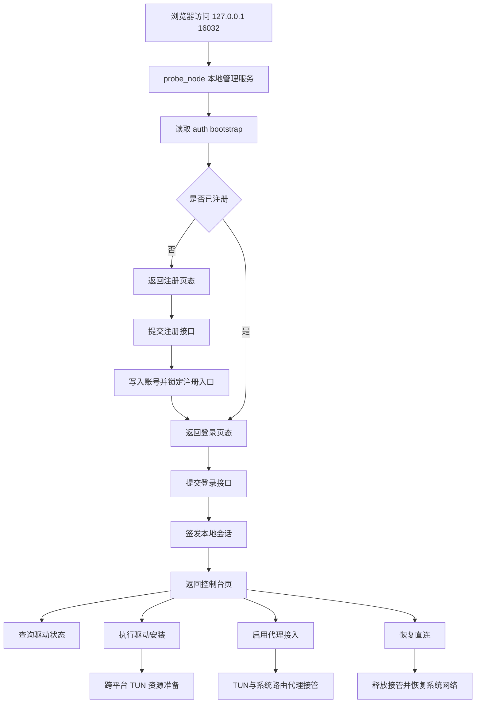

# 架构师阶段文档 `probe_node` 独立承载登录页与代理接入能力

## 工作依据与规则传递声明
- 当前角色: 架构师
- 工作依据文档: `doc/ai-coding-unified-rules.md`
- 适用规则: AI协作统一规则 单一规范
- 规则遵循声明: 必须遵守本规则。
- 协作传递要求: 后续接手者与协作者必须遵守同一规则，不得降级或替换执行口径。

- 日期: 2026-04-23
- 备注: 本文用于将 manager 现有驱动安装与代理接入能力收敛到 probe_node，后续 manager 计划下线，且 Linux 侧需完整支持 TUN 代理接管。新增本地管理界面监听 `127.0.0.1:16032` 仅用于本地控制面，与探针链路监听端口完全解耦，链路监听端口继续由服务端下发。
- 风险:
  - 本地管理界面端口 `16032` 仅用于本地控制面；若本地端口被占用或访问配置错误会导致管理界面不可达，但不影响由服务端下发的链路监听端口。
  - 将系统代理与 TUN 接管从 manager 迁移到 probe_node，权限与回滚链路若处理不完整会影响本机网络。
  - Linux 侧 `CAP_NET_ADMIN` 与路由规则回滚若不完整，可能导致机器网络状态污染。
  - 首次注册与永久关闭注册入口若并发控制不严格，可能出现重复注册漏洞。
  - 登录页引入本地认证状态后，若会话边界不清可能造成未授权访问代理控制接口。
- 遗留事项:
  - 编码阶段补齐 Windows 管理员权限缺失场景的提示与回退路径。
  - 编码阶段补齐 Linux `/dev/net/tun` 能力探测与路由回滚失败保护。
  - 测试阶段补齐端口冲突 恢复直连 异常重启三类回归用例。
  - 联调阶段验证 manager 退场后 probe_node 单进程可独立完成驱动安装与代理接管。
- 进度状态: 已完成规划与实现并通过测试回归
- 完成情况: 已完成需求边界 端口策略 架构拆分 接口定义 执行单元包与验收口径，并已在 `probe_node` 完成本地控制台、认证、TUN/代理接口及平台钩子骨架落地。
- 检查表:
  - [x] 已显式记录工作依据与规则传递声明
  - [x] 已完成字符集编码基线确认
  - [x] 已完成需求拆分与执行单元包映射
  - [x] 已完成接口与门禁口径定义
- 跟踪表状态: 已完成（可持续演进）
- 结论记录: 采用 probe_node 新增本地管理监听 `127.0.0.1:16032` 默认可配置方案，内嵌登录页，驱动安装与代理接入由 probe_node 独立承载。管理界面端口与探针链路监听端口完全解耦，链路监听端口由服务端下发；Windows 与 Linux 均需提供完整 TUN 代理接管能力。

## 字符集编码基线
- 字符集类型: 保持现状，已有文件沿用原编码
- BOM策略: 保持现状，已有文件沿用原策略
- 换行符规则: 保持现状，已有文件沿用原换行
- 新文件策略: UTF-8 无 BOM + LF
- 跨平台兼容要求: 不批量迁移历史文件前提下，保证 Go 构建链路可用
- 历史文件迁移策略: 不做批量迁移，仅对新增文件执行 UTF-8 无 BOM + LF

## 统一需求主文档
- RQ-PN-LOCAL-001: probe_node 新增本地管理监听，默认 `127.0.0.1:16032`，支持配置覆盖。
- RQ-PN-LOCAL-002: probe_node 使用内嵌 HTML 提供登录页与登录后控制台页。
- RQ-PN-LOCAL-003: probe_node 提供本地认证与会话机制，未登录禁止访问代理控制接口。
- RQ-PN-LOCAL-009: 控制台页首次登录必须先注册账号密码，且仅允许注册一次，注册成功后永久关闭注册入口。
- RQ-PN-LOCAL-004: probe_node 前置准备平台 TUN 资源并提供安装状态查询，Windows 使用 Wintun，Linux 使用 `/dev/net/tun` 能力探测。
- RQ-PN-LOCAL-005: probe_node 实现平台化安装与初始化能力，Windows 行为与 manager 现有安装能力对齐，Linux 提供 TUN 设备创建与基础初始化。
- RQ-PN-LOCAL-006: probe_node 实现代理接入能力，包含启用代理与恢复直连，且在 Windows 与 Linux 行为一致。
- RQ-PN-LOCAL-007: manager 下线后，probe_node 仍可独立完成登录 驱动安装 代理接入全链路。
- RQ-PN-LOCAL-008: Linux 完整支持 TUN 代理接管，基于 `/dev/net/tun` 与路由规则实现，并具备失败回滚。

## 关键选型与取舍

### 选型1 本地管理端口 仅用于管理界面
- 方案A: 继续使用 16031 作为管理界面端口
- 方案B: 使用 16032 作为管理界面端口
- 结论: 选择方案B
- 依据: 用户明确要求新增 `16032` 作为本地管理界面监听端口；该端口与探针链路监听端口无隶属关系，链路监听端口继续由服务端下发。

### 选型2 本地管理绑定地址
- 方案A: 默认 0.0.0.0
- 方案B: 默认 127.0.0.1 可配置
- 结论: 选择方案B
- 依据: 本地控制面应最小暴露面，默认仅允许本机访问。

### 选型3 登录页资源组织
- 方案A: 外部静态文件部署
- 方案B: `go:embed` 内嵌页面
- 结论: 选择方案B
- 依据: 用户明确要求内嵌 html，且可减少部署遗漏。

### 选型4 代理能力迁移策略
- 方案A: 继续复用 manager 提供代理能力
- 方案B: 将能力迁移到 probe_node 并独立承载
- 结论: 选择方案B
- 依据: 用户明确说明不是复用，后续 manager 要删除。

### 选型5 Linux 侧能力目标
- 方案A: Linux 仅展示状态，不承载代理接管
- 方案B: Linux 完整承载 TUN 代理接管，与 Windows 对齐
- 结论: 选择方案B
- 依据: 用户已明确 Linux 也要完整支持 TUN 代理接管，基于 `/dev/net/tun` 与路由规则实现。

## 总体设计

## 单元设计

### U-PN-LOCAL-01 本地管理服务入口与监听配置
- 目标文件:
  - `probe_node/main.go`
  - `probe_node/service_entry.go`
- 设计要点:
  - 新增本地管理监听配置项，默认 `127.0.0.1:16032`。
  - 支持命令行与环境变量覆盖，空值回退默认值。
  - 本地管理服务与现有探针业务循环并行运行，且管理界面端口与链路监听端口保持解耦。

### U-PN-LOCAL-02 内嵌页面与路由
- 目标文件:
  - `probe_node/local_pages.go`
  - `probe_node/local_pages/login.html`
  - `probe_node/local_pages/panel.html`
- 设计要点:
  - 采用 `go:embed` 内嵌登录页与控制台页。
  - 路由分为页面路由与 API 路由。
  - 页面响应统一 `text/html; charset=utf-8`。

### U-PN-LOCAL-03 本地认证与会话中间件
- 目标文件:
  - `probe_node/local_auth.go`
  - `probe_node/local_handlers.go`
- 设计要点:
  - 建立本地账号配置与会话状态。
  - 增加 `bootstrap` 与 `register` 流程，首次启动必须先注册。
  - `register` 仅在未注册状态可调用，注册成功后永久关闭注册入口。
  - 控制 API 要求有效会话，未登录返回 401 或跳转登录页。
  - 会话失效与登出能力可用。

### U-PN-LOCAL-04 跨平台 TUN 前置与安装能力迁移
- 目标文件:
  - `probe_node/wintun_embed_windows.go`
  - `probe_node/local_tun_install_windows.go`
  - `probe_node/local_tun_install_linux.go`
  - `probe_node/local_tun_install_other.go`
- 设计要点:
  - Windows 复用 probe_node 已有内嵌 Wintun 资源准备能力。
  - Linux 增加 `/dev/net/tun` 能力探测 设备创建 权限校验。
  - 提供统一安装状态检测与安装动作接口。
  - 语义对齐 manager 现有安装路径与幂等策略。

### U-PN-LOCAL-05 跨平台代理接入与恢复直连
- 目标文件:
  - `probe_node/local_proxy_runtime.go`
  - `probe_node/local_proxy_api.go`
  - `probe_node/local_tun_routing_windows.go`
  - `probe_node/local_tun_routing_linux.go`
- 设计要点:
  - 在 probe_node 内实现代理模式切换最小闭环。
  - 支持启用代理接入与恢复直连。
  - Linux 侧基于路由规则实现接管与回滚，失败时必须恢复原网络策略。
  - 出错时保留可回滚路径，避免网络长时间不可用。

### U-PN-LOCAL-06 manager 退场兼容适配
- 目标文件:
  - `probe_node/local_manager_compat.go`
  - `probe_node/local_status.go`
- 设计要点:
  - 对齐 manager 关键状态模型字段，减少前端适配成本。
  - 为后续移除 manager 提供迁移基线。

## 接口定义清单
- 页面路由:
  - `GET /local/login` 返回登录页
  - `GET /local/panel` 返回控制台页 已登录可访问
- 认证接口:
  - `GET /local/api/auth/bootstrap`
  - `POST /local/api/auth/register`
  - `POST /local/api/auth/login`
  - `POST /local/api/auth/logout`
  - `GET /local/api/auth/session`
- 驱动接口:
  - `GET /local/api/tun/status`
  - `POST /local/api/tun/install`
- 代理接口:
  - `POST /local/api/proxy/enable`
  - `POST /local/api/proxy/direct`
  - `GET /local/api/proxy/status`

说明:
- 命名采用本地控制域前缀，避免与现有 `probe_node` 对外探针接口混淆。
- 具体字段在编码阶段按执行单元包细化，不在本阶段引入未确认实现细节。

## 执行单元包拆分
- PKG-PN-LOCAL-01: 本地管理监听与配置接入
- PKG-PN-LOCAL-02: 内嵌登录页与控制台页面路由
- PKG-PN-LOCAL-03: 本地认证 会话 中间件
- PKG-PN-LOCAL-04: 跨平台 TUN 状态检测与安装能力
- PKG-PN-LOCAL-05: 跨平台代理接入启停与直连恢复
- PKG-PN-LOCAL-06: manager 退场兼容与状态模型收敛
- PKG-PN-LOCAL-07: 测试用例与回归验证
- PKG-PN-LOCAL-08: Linux `/dev/net/tun` 与路由规则接管实现

## 编码测试映射
| 需求编号 | 执行单元包 | 验证口径 |
|---|---|---|
| RQ-PN-LOCAL-001 | PKG-PN-LOCAL-01 | 默认监听 `127.0.0.1:16032` 且可配置覆盖 |
| RQ-PN-LOCAL-002 | PKG-PN-LOCAL-02 | 登录页与控制台页由内嵌资源返回 |
| RQ-PN-LOCAL-003 | PKG-PN-LOCAL-03 | 未登录无法访问控制接口 已登录可访问 |
| RQ-PN-LOCAL-009 | PKG-PN-LOCAL-03 | 首次必须注册 仅允许注册一次 注册成功后入口关闭 |
| RQ-PN-LOCAL-004 | PKG-PN-LOCAL-04 | 可查询 Windows 与 Linux 平台 TUN 准备与安装状态 |
| RQ-PN-LOCAL-005 | PKG-PN-LOCAL-04 PKG-PN-LOCAL-08 | 安装动作幂等 重复执行不破坏状态 |
| RQ-PN-LOCAL-006 | PKG-PN-LOCAL-05 PKG-PN-LOCAL-08 | 可启用代理并可恢复直连 且跨平台行为一致 |
| RQ-PN-LOCAL-007 | PKG-PN-LOCAL-06 PKG-PN-LOCAL-07 | manager 下线后 probe_node 单进程可独立完成业务闭环 |
| RQ-PN-LOCAL-008 | PKG-PN-LOCAL-08 PKG-PN-LOCAL-07 | Linux 基于 `/dev/net/tun` 与路由规则可完成接管与失败回滚 |

## 需求跟踪表更新说明
- 本需求专用跟踪文档: `doc/architect/probe_node_standalone_proxy_wintun_requirement_tracking_2026-04-23.md`
- 当前阶段状态: 已完成编码与测试回归，进入持续演进

## 门禁判定
- G1 需求门: 通过
- G2 架构门: 通过
- G3 编码核查门: 通过
- G4 测试核查门: 通过
- G5 复盘门: 待执行
