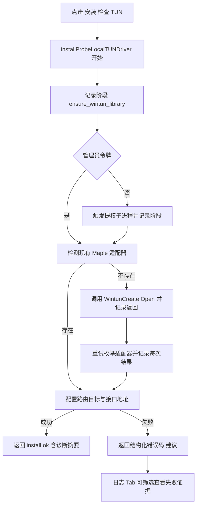

# 架构师阶段文档 `probe_node` TUN 网卡失败诊断与日志 Tab 修复方案

## 工作依据与规则传递声明
- 当前角色: 架构师
- 工作依据文档: `doc/ai-coding-unified-rules.md`
- 适用规则: AI协作统一规则 单一规范
- 规则遵循声明: 必须遵守本规则。
- 协作传递要求: 后续接手者与协作者必须遵守同一规则，不得降级或替换执行口径。

- 日期: 2026-04-26
- 备注: 目标为彻底解决“安装 检查完成但实际没有 TUN 网卡”的可观测性与判定准确性问题，并新增本地控制台日志 Tab 支撑在线排障。
- 风险:
  - 当前运行上下文可能并非 Windows 服务进程，权限令牌与预期不一致会导致安装链路分叉。
  - Wintun 创建后适配器枚举存在延迟，若判定窗口过短会出现误判。
  - 日志量增长后若无分页与过滤约束，前端可能出现性能下降。
- 遗留事项:
  - 本期先提供轮询式自动刷新，不引入 SSE 或 WebSocket 推日志。
  - 本期不改动 manager 侧页面，仅覆盖 probe_node 本地控制台。
- 进度状态: 已完成设计 待编码实施
- 完成情况: 已完成根因分类 诊断模型 接口设计 前端日志 Tab 方案与测试验收口径。
- 检查表:
  - [x] 已显式记录工作依据与规则传递声明
  - [x] 已按统一规则补充字符集编码基线
  - [x] 已输出统一需求主文档与执行单元包
  - [x] 已给出接口定义与测试映射
- 跟踪表状态: 待实现
- 结论记录: 采用“结构化诊断 + 全量运行日志可筛选 + 自动刷新”的组合方案，先保证 TUN 安装判定真实可靠，再把失败证据在控制台可视化。

## 字符集编码基线
- 文档文件: UTF-8 无 BOM LF
- 代码文件: 保持现状 不做统一迁移
- 跨平台兼容要求: 新增文档严格按 UTF-8 无 BOM LF 落盘
- 历史文件迁移策略: 不做全仓迁移，仅按实际改动保持原文件风格

## 统一需求主文档
- RQ-PN-TUN-LOG-001: TUN 安装流程必须输出可追踪的分阶段诊断信息，覆盖权限检查 提权 适配器创建 适配器枚举 路由目标配置。
- RQ-PN-TUN-LOG-002: TUN 安装成功判定必须满足“目标网卡可检测 + 路由目标可配置”，禁止句柄创建成功即判定成功。
- RQ-PN-TUN-LOG-003: TUN 失败原因需标准化错误码与可读建议，便于页面直接展示与排障。
- RQ-PN-TUN-LOG-004: 新增本地日志查询 API，支持级别筛选 关键词过滤 行数窗口 时间窗口。
- RQ-PN-TUN-LOG-005: 本地控制台新增日志 Tab，支持全量运行日志查看 级别筛选 关键词过滤 自动刷新。
- RQ-PN-TUN-LOG-006: 保持既有认证模型，新增日志与诊断接口必须走本地会话校验。
- RQ-PN-TUN-LOG-007: 补齐后端单测与页面断言，覆盖方法守卫 过滤语义 与关键 UI 元素。

## 关键选型与取舍
- 选型A 诊断输出位置
  - 方案: 在安装函数内按阶段记录结构化步骤，并在接口响应中返回诊断摘要
  - 取舍: 选择该方案，变更集中且最贴近失败现场。
- 选型B 日志拉取机制
  - 方案: 先用轮询拉取，后续可扩展推送
  - 取舍: 选择轮询，复杂度低，便于快速稳定上线。
- 选型C 成功判定策略
  - 方案1 句柄成功即成功
  - 方案2 必须检测到适配器且路由目标完成
  - 取舍: 选择方案2，杜绝假阳性。

## 总体设计

## 单元设计
### U-PN-TUN-LOG-01 TUN 安装诊断模型
- 目标: 定义安装诊断结构与错误码枚举。
- 主要改造建议:
  - `probe_node/local_tun_install_windows.go`
  - `probe_node/local_console.go`
- 关键字段建议:
  - `code`
  - `stage`
  - `hint`
  - `details`
  - `steps`
  - `updated_at`
- 失败码建议:
  - `TUN_ELEVATION_REQUIRED`
  - `TUN_ELEVATION_TIMEOUT`
  - `TUN_WINTUN_LIBRARY_MISSING`
  - `TUN_ADAPTER_CREATE_FAILED`
  - `TUN_ADAPTER_NOT_DETECTED`
  - `TUN_ROUTE_TARGET_FAILED`
  - `TUN_IFINDEX_INVALID`

### U-PN-TUN-LOG-02 安装成功判定与重试口径
- 目标: 统一成功条件与重试策略，消除假成功。
- 主要改造建议:
  - `probe_node/local_tun_install_windows.go`
- 规则:
  - 成功必须同时满足 适配器可检测 与路由目标配置成功。
  - 重试期间记录每次检测结果，最终失败返回最后一次可用错误。

### U-PN-TUN-LOG-03 本地日志查询 API
- 目标: 面向本地控制台提供运行日志读取能力。
- 主要改造建议:
  - `probe_node/local_console.go`
  - `probe_node/log_buffer.go`
- 新增接口建议:
  - `GET /local/api/logs?lines=&since_minutes=&min_level=&keyword=`
- 过滤规则:
  - 先按 `since_minutes` 与 `min_level` 过滤，再按 `keyword` 过滤。
  - `keyword` 大小写不敏感，空值表示不过滤。

### U-PN-TUN-LOG-04 本地控制台日志 Tab
- 目标: 新增全量日志页签，支持级别筛选 关键词过滤 自动刷新。
- 主要改造建议:
  - `probe_node/local_pages/panel.html`
- 前端能力:
  - Tab 按钮 `tabLogs`
  - 面板 `panelLogs`
  - 过滤控件 `min_level` `keyword` `lines` `since_minutes`
  - 自动刷新开关与间隔输入
  - 手动刷新按钮

### U-PN-TUN-LOG-05 测试回归
- 目标: 覆盖后端方法守卫 过滤语义 页面元素断言。
- 主要改造建议:
  - `probe_node/local_console_test.go`
  - `probe_node/local_console_methods_test.go`
  - `probe_node/local_pages_routes_test.go`
  - `probe_node/local_tun_install_windows_test.go`

## 接口定义清单
- 新增:
  - `GET /local/api/logs`
    - Query:
      - `lines` 可选 默认 200 上限 2000
      - `since_minutes` 可选 默认 0
      - `min_level` 可选 支持 realtime normal warning error
      - `keyword` 可选 大小写不敏感
    - Response:
      - `ok`
      - `source`
      - `lines`
      - `since_minutes`
      - `min_level`
      - `keyword`
      - `content`
      - `entries`
- 增强:
  - `POST /local/api/tun/install`
    - 在失败响应中附带结构化诊断摘要字段

## 执行单元包拆分
- PKG-PN-TUN-LOG-01: TUN 诊断结构与错误码
- PKG-PN-TUN-LOG-02: TUN 安装判定与重试口径收敛
- PKG-PN-TUN-LOG-03: 本地日志查询 API 与关键字过滤
- PKG-PN-TUN-LOG-04: 控制台日志 Tab 与自动刷新
- PKG-PN-TUN-LOG-05: 后端与页面回归测试

## 编码测试映射
| 需求编号 | 执行单元包 | 验证口径 |
|---|---|---|
| RQ-PN-TUN-LOG-001 RQ-PN-TUN-LOG-003 | PKG-PN-TUN-LOG-01 | 失败返回带 `code stage hint details` |
| RQ-PN-TUN-LOG-002 | PKG-PN-TUN-LOG-02 | 不再出现句柄成功但无网卡仍返回成功 |
| RQ-PN-TUN-LOG-004 | PKG-PN-TUN-LOG-03 | 日志 API 支持级别 关键词 行数 时间窗口过滤 |
| RQ-PN-TUN-LOG-005 RQ-PN-TUN-LOG-006 | PKG-PN-TUN-LOG-04 | 日志 Tab 可用 且走本地会话认证 |
| RQ-PN-TUN-LOG-007 | PKG-PN-TUN-LOG-05 | `go test ./...` 通过并新增断言有效 |

## 门禁判定
- G1 需求门: 通过
- G2 架构门: 通过
- G3 编码核查门: 待执行
- G4 测试核查门: 待执行
- G5 复盘门: 待执行
