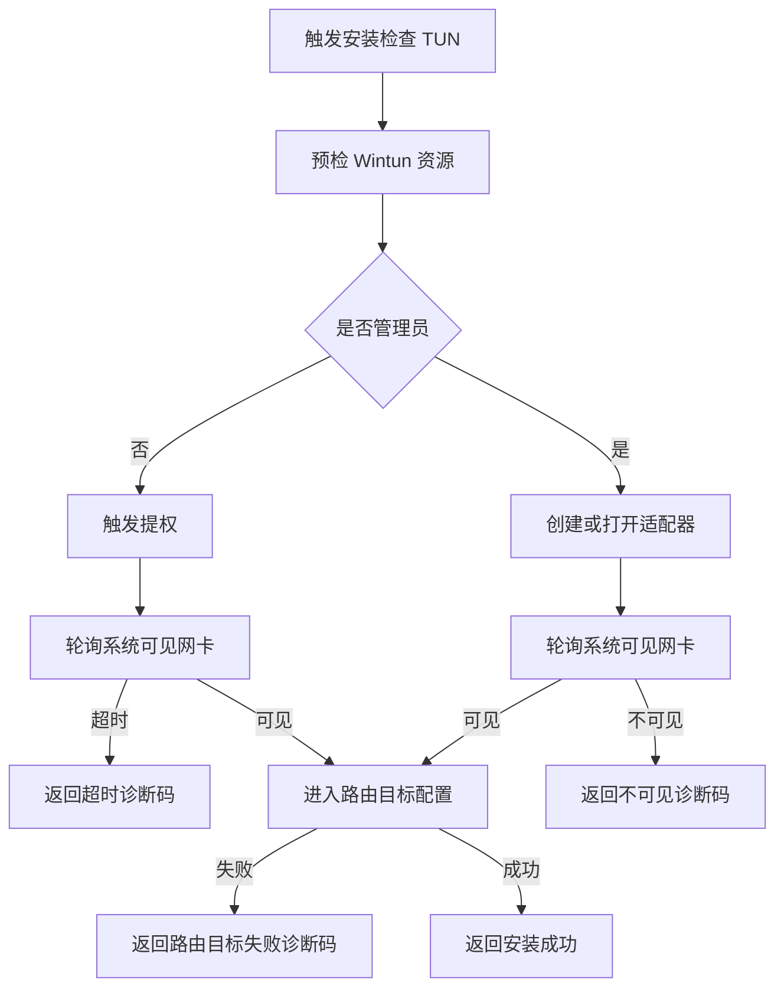

# 架构师阶段文档 `probe_node` Windows TUN 安装可见性与假成功收敛方案

## 工作依据与规则传递声明
- 当前角色: 架构师
- 工作依据文档: `doc/ai-coding-unified-rules.md`
- 适用规则: AI协作统一规则 单一规范
- 规则遵循声明: 必须遵守本规则。
- 协作传递要求: 后续接手者与协作者必须遵守同一规则，不得降级或替换执行口径。

- 日期: 2026-04-27
- 备注: 本文在原文档基础上按最小改动策略修订，仅覆盖 `probe_node` 在 Windows 场景下的 TUN 安装后系统不可见与流程假成功问题；不扩展到无关需求，不涉及 `.go` 代码与测试改动。
- 风险:
  - Windows 提权子进程与父进程可见性状态不同步，可能导致误判安装结果。
  - 适配器创建后系统枚举存在延迟，若轮询窗口配置不当会出现假失败或假成功。
  - 仅依赖句柄或 LUID 侧信息进行成功判定会放大误报风险。
- 遗留事项:
  - 编码阶段需补齐成功判定收敛与提权后轮询口径的实现落地。
  - 测试阶段需补齐成功 失败 超时三类场景的断言矩阵。
  - 联调阶段需确认页面端对诊断码与步骤日志的呈现一致性。
- 进度状态: 已完成设计 待编码实施
- 完成情况: 已完成问题复盘、根因链路收敛、目标与非目标界定、方案分解、验证策略、风险回滚与观测口径定义。
- 检查表:
  - [x] 已显式记录工作依据与规则传递声明
  - [x] 已限定为 Windows TUN 可见性与假成功问题
  - [x] 已给出安装成功判定收敛策略
  - [x] 已给出提权后可见性轮询与超时策略
  - [x] 已给出诊断码与验证策略映射
- 跟踪表状态: 待实现
- 结论记录: 本期采用“成功判定双条件 + 提权后可见性轮询 + 结构化诊断码”组合方案，确保 Windows 安装流程仅在系统可见网卡且路由目标可配置时返回成功，避免流程假成功。

## 字符集编码基线
- 文档文件: UTF-8 无 BOM LF
- 代码文件: 本任务不涉及代码改动
- 跨平台兼容要求: 新增或更新文档按 UTF-8 无 BOM LF 落盘
- 历史文件迁移策略: 不做全仓迁移，仅对本次触达文档执行统一基线

## 问题背景与复现表征
- 现象:
  - 用户在 Windows 控制台触发安装后收到“安装 检查完成”或等价成功反馈。
  - 但系统层面看不到对应 TUN 网卡，设备管理器与接口枚举不可见。
- 复现表征:
  - 安装流程返回成功，后续依赖网卡可见性的路径失败。
  - 日志中可能存在“提权已接受”或“句柄创建成功”类记录，但缺少“系统可见网卡确认”闭环证据。

## 根因链路
1. 提权后过早成功
   - 非管理员分支触发提权后，若仅以提权请求被接受作为阶段成功，容易在子进程未完成安装或枚举未稳定时提前返回成功。
2. 可见性判定过宽
   - 将句柄创建成功或 LUID 到 ifIndex 的诊断性信息视为安装成功替代条件，会导致“系统不可见但流程成功”。
3. 成功判定缺少闭环
   - 未强制要求“系统枚举可见 + 路由目标可配置”同时满足，成功语义不收敛。

## 目标与非目标
### 目标
- 目标1: 收敛安装成功判定，仅在系统可见网卡且路由目标配置成功时返回成功。
- 目标2: 在提权路径引入可见性轮询与超时机制，避免过早成功。
- 目标3: 统一失败诊断码与阶段信息，确保失败原因可定位可观测。
- 目标4: 验证策略覆盖成功 失败 超时三类场景，并映射需求条目。

### 非目标
- 不进行跨平台泛化重构，仅覆盖 Windows 当前问题。
- 不引入与本问题无关的控制台功能扩展。
- 不在本阶段修改 `.go` 代码与测试实现。

## 统一需求主文档
- RQ-PN-TUN-VIS-001: Windows TUN 安装成功判定必须同时满足“系统可见网卡 + 路由目标可配置成功”。
- RQ-PN-TUN-VIS-002: 非管理员提权路径必须执行可见性轮询，超时后返回明确失败，不得提前成功。
- RQ-PN-TUN-VIS-003: 句柄创建成功与 LUID 到 ifIndex 信息仅可作为诊断证据，不可单独作为成功判定。
- RQ-PN-TUN-VIS-004: 失败结果必须输出结构化诊断码、阶段、提示与步骤链路。
- RQ-PN-TUN-VIS-005: 安装验证必须覆盖成功 失败 超时三类场景，并形成需求到测试映射。

## 方案设计

### U-PN-TUN-VIS-01 安装成功判定收敛
- 目标: 统一成功语义，消除“系统不可见但流程成功”。
- 判定规则:
  - 必须满足条件A: 目标适配器可被系统枚举检测到。
  - 必须满足条件B: 路由目标配置成功。
  - A 或 B 任一不满足即失败。

### U-PN-TUN-VIS-02 提权后可见性轮询
- 目标: 防止提权后过早返回成功。
- 规则:
  - 提权请求被接受仅表示流程进入等待阶段，不表示安装成功。
  - 在可配置轮询窗口内持续检测系统可见性。
  - 轮询超时返回专用超时诊断码并附步骤证据。

### U-PN-TUN-VIS-03 可见性判定收敛
- 目标: 收窄成功条件，避免诊断信息误用。
- 规则:
  - 句柄创建成功仅表示驱动调用成功，不可作为最终成功条件。
  - LUID 到 ifIndex 转换结果仅用于诊断辅助，不可作为最终成功条件。
  - 系统枚举不可见时统一归类为适配器不可见失败。

### U-PN-TUN-VIS-04 结构化诊断码
- 目标: 提供可观测可定位失败信息。
- 诊断输出最小字段:
  - `code`
  - `stage`
  - `hint`
  - `details`
  - `steps`
- 诊断码建议集合:
  - `TUN_WINTUN_LIBRARY_MISSING`
  - `TUN_ELEVATION_REQUIRED`
  - `TUN_ELEVATION_TIMEOUT`
  - `TUN_ADAPTER_CREATE_FAILED`
  - `TUN_ADAPTER_NOT_DETECTED`
  - `TUN_ROUTE_TARGET_FAILED`

## 验证策略
| 场景 | 触发条件 | 预期结果 | 需求映射 |
|---|---|---|---|
| 成功场景 | 管理员或提权完成后，适配器可见且路由目标配置成功 | 返回成功，诊断步骤包含可见性确认与路由配置完成 | RQ-PN-TUN-VIS-001 RQ-PN-TUN-VIS-002 |
| 失败场景 | 适配器创建失败或创建后系统枚举不可见 | 返回失败，输出对应失败码与阶段，禁止成功返回 | RQ-PN-TUN-VIS-001 RQ-PN-TUN-VIS-003 RQ-PN-TUN-VIS-004 |
| 超时场景 | 提权已接受但在轮询窗口内始终不可见 | 返回超时失败码，步骤记录完整轮询轨迹 | RQ-PN-TUN-VIS-002 RQ-PN-TUN-VIS-004 |

## 风险 回滚与观测项
### 风险
- 提权链路在不同 Windows 版本下时序差异导致轮询窗口敏感。
- 枚举 API 偶发错误可能引入短时误判。

### 回滚策略
- 若收敛策略导致异常阻塞，回滚到上一个稳定判定版本。
- 回滚前保留完整诊断步骤，确保可比较回归。
- 回滚后将本次失败样本纳入后续重放验证。

### 观测项
- 安装请求总数 成功数 失败数 超时数。
- 失败码分布与阶段分布。
- 提权到可见的耗时分位值。
- 可见性轮询次数分布与最终状态。

## 执行单元包拆分
- PKG-PN-TUN-VIS-01: 成功判定双条件收敛
- PKG-PN-TUN-VIS-02: 提权后可见性轮询与超时处理
- PKG-PN-TUN-VIS-03: 可见性判定收敛与诊断性信号降级
- PKG-PN-TUN-VIS-04: 结构化诊断码与步骤链路
- PKG-PN-TUN-VIS-05: 成功 失败 超时验证矩阵

## 需求跟踪表更新说明
- 本问题专用跟踪文档: `doc/architect/probe_node_tun_failure_diagnostic_log_tab_requirement_tracking_2026-04-27.md`
- 当前阶段状态: 已完成架构补齐，待编码与测试阶段执行

## 门禁判定
- G1 需求门: 通过
- G2 架构门: 通过
- G3 编码核查门: 待执行
- G4 测试核查门: 待执行
- G5 复盘门: 待执行
