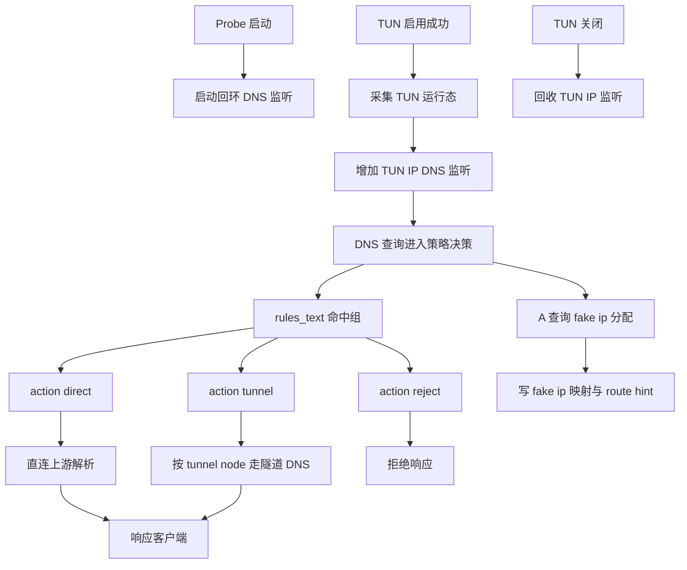

# 架构师阶段文档 `probe_node` Windows TUN Fake IP 对齐方案

## 工作依据与规则传递声明
- 当前角色: 架构师
- 工作依据文档: `doc/ai-coding-unified-rules.md`
- 适用规则: AI协作统一规则 单一规范
- 规则遵循声明: 必须遵守本规则。
- 协作传递要求: 后续接手者与协作者必须遵守同一规则，不得降级或替换执行口径。

- 日期: 2026-04-25
- 备注: 本期仅 Windows 侧完整对齐 manager 行为。启用 TUN 后启用 fake ip，DNS 同时监听回环与 TUN 网卡 IP，代理组按选择链路进行分流。Linux 保持当前实现，不引入 fake ip 数据面。
- 风险:
  - `probe_node` 当前无 manager 级完整 netstack，连接阶段全量一致分流需通过 DNS 路由提示与现有代理执行链路协同。
  - 双监听下端口占用与地址绑定失败需具备降级与可观测。
- 遗留事项:
  - Linux fake ip 数据面与双监听对齐不在本期。
- 进度状态: 已完成设计 待编码实施
- 完成情况: 已完成边界确认 方案拆分 测试矩阵与实施清单。
- 检查表:
  - [x] 已确认 Windows 先行范围
  - [x] 已确认 fake ip 与双监听口径
  - [x] 已确认代理组分流闭环设计
  - [x] 已形成执行单元包与测试映射
- 跟踪表状态: 待实现
- 结论记录: Windows 侧采用 internal dns + fake ip + 按组分流方案，回环监听常驻，TUN 启用时附加 TUN IP 监听并回收。

## 字符集编码基线
- 字符集类型: UTF-8
- BOM 策略: 无 BOM
- 换行符规则: LF
- 跨平台兼容要求: 本次新增与改造文件统一按该基线落盘。
- 历史文件迁移策略: 仅改动触达文件按基线对齐。

## 统一需求主文档
- RQ-PN-WIN-TUN-DNS-001: Windows 启用 TUN 后，DNS 同时监听 `127.0.0.1` 与 TUN 网卡 IPv4。
- RQ-PN-WIN-TUN-DNS-002: Windows 启用 TUN 后，A 查询按策略启用 fake ip，AAAA 保持真实解析。
- RQ-PN-WIN-TUN-DNS-003: fake ip 支持 CIDR 池分配 双向反查 TTL 与过期清理。
- RQ-PN-WIN-TUN-DNS-004: 代理组分流按 `rules_text` 命中组，再按 `proxy_state` 的 `action` 与 `tunnel_node_id` 决策。
- RQ-PN-WIN-TUN-DNS-005: `action=reject` 返回拒绝响应，`action=direct` 走直连 DNS，`action=tunnel` 走隧道链路 DNS。
- RQ-PN-WIN-TUN-DNS-006: 新增并扩展状态接口，输出双监听状态 fake ip 统计 route hint 统计。
- RQ-PN-WIN-TUN-DNS-007: `proxy_group` 扩展 `fake_ip_cidr` `fake_ip_whitelist` `tun.doh_servers`。
- RQ-PN-WIN-TUN-DNS-008: Linux 维持当前行为，不引入 fake ip 数据面。

## 总体设计

## 单元设计

### U-PN-WIN-TUN-DNS-01 Windows TUN 运行态统一状态源
- 目标: 在 Windows TUN 接管流程中输出 DNS 需要的 `if_index` `gateway` `tun_ipv4`。
- 主要改造建议:
  - `probe_node/local_proxy_takeover_windows.go`
  - `probe_node/local_console.go`
- 规则:
  - TUN 启用后写入运行态。
  - TUN 关闭后清空并触发 DNS 监听重编排。

### U-PN-WIN-TUN-DNS-02 DNS 双监听生命周期
- 目标: 实现回环常驻 + TUN IP 动态监听。
- 主要改造建议:
  - `probe_node/local_dns_service.go`
- 规则:
  - 回环监听失败按既有 53 到 5353 回退。
  - TUN 监听仅在 Windows 且 TUN 启用时生效。
  - 任一监听失败不影响另一监听可用。

### U-PN-WIN-TUN-DNS-03 Fake IP 池与反查
- 目标: 迁移最小必要 fake ip 数据面能力。
- 主要改造建议:
  - `probe_node/local_dns_service.go`
- 规则:
  - 默认网段 `198.18.0.0/15`。
  - 跳过保留地址 `198.18.0.1`。
  - TTL 与 DNS 缓存统一。

### U-PN-WIN-TUN-DNS-04 代理组分流决策闭环
- 目标: 用 `rules_text` + `proxy_state` 完成 DNS 路由决策。
- 主要改造建议:
  - `probe_node/local_console.go`
  - `probe_node/local_dns_service.go`
- 决策顺序:
  - 先命中组
  - 再读取组动作
  - direct/reject/tunnel 分支执行

### U-PN-WIN-TUN-DNS-05 配置与状态接口扩展
- 目标: 扩展配置模型与可观测状态。
- 主要改造建议:
  - `probe_node/local_console.go`
  - `probe_node/local_pages/panel.html`
- 接口:
  - 扩展 `GET /local/api/dns/status`
  - 新增 debug 查询接口

### U-PN-WIN-TUN-DNS-06 回归测试
- 目标: 覆盖 Windows 主路径 降级路径 与 Linux 不回归。
- 主要改造建议:
  - `probe_node/local_console_test.go`
  - `probe_node/local_console_methods_test.go`
  - `probe_node/local_pages_routes_test.go`
  - `probe_node/local_dns_service_test.go`
  - 新增 fake ip 与分流决策专项测试文件

## 接口定义清单
- 扩展:
  - `GET /local/api/dns/status`
- 新增:
  - `GET /local/api/dns/fake_ip/list`
  - `GET /local/api/dns/fake_ip/lookup`
- 复用:
  - `GET /local/api/proxy/groups`
  - `GET /local/api/proxy/state`
  - `POST /local/api/proxy/groups/save`

## 执行单元包拆分
- PKG-PN-WIN-TUN-DNS-01: Windows TUN 运行态采集与状态源
- PKG-PN-WIN-TUN-DNS-02: DNS 双监听生命周期
- PKG-PN-WIN-TUN-DNS-03: Fake IP 池与反查
- PKG-PN-WIN-TUN-DNS-04: 代理组分流决策闭环
- PKG-PN-WIN-TUN-DNS-05: 配置模型与 API 状态扩展
- PKG-PN-WIN-TUN-DNS-06: 回归测试与 Linux 不回归验证

## 编码测试映射
| 需求编号 | 执行单元包 | 验证口径 |
|---|---|---|
| RQ-PN-WIN-TUN-DNS-001 | PKG-PN-WIN-TUN-DNS-01 PKG-PN-WIN-TUN-DNS-02 | TUN 启用后双监听可用 |
| RQ-PN-WIN-TUN-DNS-002 RQ-PN-WIN-TUN-DNS-003 | PKG-PN-WIN-TUN-DNS-03 | A 查询返回 fake ip AAAA 走真实解析 |
| RQ-PN-WIN-TUN-DNS-004 RQ-PN-WIN-TUN-DNS-005 | PKG-PN-WIN-TUN-DNS-04 | 按组动作 direct reject tunnel 分流一致 |
| RQ-PN-WIN-TUN-DNS-006 RQ-PN-WIN-TUN-DNS-007 | PKG-PN-WIN-TUN-DNS-05 | 状态接口与配置读写对齐 |
| RQ-PN-WIN-TUN-DNS-008 | PKG-PN-WIN-TUN-DNS-06 | Linux 行为不变且测试通过 |

## 门禁判定
- G1 需求门: 通过
- G2 架构门: 通过
- G3 编码核查门: 待执行
- G4 测试核查门: 待执行
- G5 复盘门: 待执行
