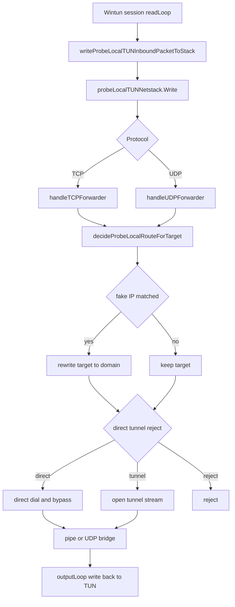

# 需求文档

- 适用规则: AI协作规则
- 后续工作传递声明: 本文档必须传递给后续阶段与后续角色。
- 需求编号: REQ-PN-TUN-PROXY-REFAC-001
- 需求后缀: REQ-PN-TUN-PROXY-REFAC-001
- 当前角色: Architect
- 工作依据文档: [doc/ai-coding-collaboration.md](doc/ai-coding-collaboration.md:1)、[probe_node/local_tun_dataplane_windows.go](probe_node/local_tun_dataplane_windows.go:42)、[probe_node/local_tun_stack_windows.go](probe_node/local_tun_stack_windows.go:131)、[probe_node/local_tun_route.go](probe_node/local_tun_route.go:39)、[probe_node/local_tun_dataplane_types.go](probe_node/local_tun_dataplane_types.go:9)
- 状态: 进行中

## 现状摘要
- 当前 `probe_node` 已形成 Wintun 数据面、gVisor netstack、TCP/UDP forwarder 与回写链路的闭环。
- 关键启动链路是 [`startProbeLocalTUNDataPlane()`](probe_node/local_tun_dataplane_windows.go:42) -> [`startProbeLocalTUNPacketStack()`](probe_node/local_tun_stack_windows.go:131) -> [`newProbeLocalTUNNetstack()`](probe_node/local_tun_stack_windows.go:170)。
- 入站包经 [`handleProbeLocalTUNInboundPacket()`](probe_node/local_tun_dataplane_windows.go:163) 写入 packet stack，再由 [`probeLocalTUNNetstack.Write()`](probe_node/local_tun_stack_windows.go:238) 注入 gVisor。
- 路由决策集中在 [`decideProbeLocalRouteForTarget()`](probe_node/local_tun_route.go:39)，fake IP 改写入口是 [`rewriteProbeLocalRouteTargetForFakeIP()`](probe_node/local_tun_route.go:93)。
- TCP 出站由 [`openProbeLocalTUNOutboundTCP()`](probe_node/local_tun_stack_windows.go:335) 处理，UDP 出站由 [`openProbeLocalTUNOutboundUDP()`](probe_node/local_tun_stack_windows.go:414) 处理。
- direct 分支依赖 Windows 绕行路由维护，tunnel 分支依赖链路 runtime 开流，UDP 额外叠加 source refs 与 NAT fallback。

## 需求目标
- 形成一份可作为后续重构展开基线的参考需求文档，明确当前 TUN 代理数据结构、执行流程与重构边界。
- 以 Windows TUN 代理链路为主，聚焦 TCP/UDP direct、tunnel、reject 三分支的真实出站语义。
- 参考 [`probe_manager/backend/network_assistant.go`](probe_manager/backend/network_assistant.go:95) 的组级运行态口径，在 `probe_node` 建立“每个代理组一个 runtime”的唯一事实来源模型。
- 同步对齐 `probe_manager` 的组级 runtime 快照字段与调试输出字段，确保 `probe_node` 与 `probe_manager` 在可观测口径上一致。
- 为后续架构、单元设计、任务包与测试矩阵提供统一编号、统一口径与统一范围。
- 修复 `local/panel` 链路状态中“最近测试延迟”长期显示 `-` 的问题，失败时明确显示 `不可达`，成功时显示毫秒值。
- 为 `local/panel` 增加 60 秒周期自动刷新 `loadProxyStatus` 的机制，确保链路状态可持续更新。

## 需求范围
- 覆盖 [`probe_node/local_tun_dataplane_windows.go`](probe_node/local_tun_dataplane_windows.go:42)、[`probe_node/local_tun_stack_windows.go`](probe_node/local_tun_stack_windows.go:131)、[`probe_node/local_tun_route.go`](probe_node/local_tun_route.go:39)、[`probe_node/local_tun_dataplane_types.go`](probe_node/local_tun_dataplane_types.go:9) 的主链路。
- 覆盖 fake IP 改写、Wintun 会话、gVisor 注入与回写、TCP/UDP 出站、direct bypass、UDP association 与 source refs。
- 覆盖 `probe_node` 的组级运行态模型重构，目标是每个代理组仅维护一个 runtime 状态对象，并以该对象承载连接状态、重试状态、失败信息与快照输出。
- 覆盖 `probe_node` 调试输出口径对齐，至少包含与 [`probe_manager/backend/network_assistant.go`](probe_manager/backend/network_assistant.go:95)、[`probe_node/tcp_debug.go`](probe_node/tcp_debug.go:17)、[`probe_node/udp_assoc_debug.go`](probe_node/udp_assoc_debug.go:13) 对应的关键字段语义一致性。
- 改造范围限定在 `probe_node`，但对齐基线参考 `probe_manager` 的语义与字段，不直接修改 `probe_manager`。
- 覆盖 [`probe_node/local_console.go`](probe_node/local_console.go:2116) 的 `proxy status` 输出语义补强，区分成功延迟与不可达状态。
- 覆盖 [`probe_node/local_pages/panel.html`](probe_node/local_pages/panel.html:666) 的状态渲染与 60 秒自动刷新逻辑。
- 只描述 TUN 代理重构需求，不扩展到认证、备份、UI 的其他功能面或非代理控制面。

## 非范围
- 不调整非 TUN 路径的业务逻辑。
- 不新增协议栈或第三方依赖。
- 不直接修改源代码。
- 不在本阶段裁决实现方案优劣。

## 验收标准
- 能准确说明当前关键结构体、函数与数据流。
- 能明确 direct、tunnel、reject 的分流点与责任边界。
- `probe_node` 组级运行态模型满足“每个代理组一个 runtime”约束，不再以分散状态作为最终事实来源。
- `probe_node` 组级 runtime 快照字段可映射到 [`NetworkAssistantGroupKeepaliveItem`](probe_manager/backend/network_assistant.go:96) 的核心语义字段。
- `probe_node` TCP/UDP 调试输出字段可映射到 manager 同类字段语义，至少覆盖 `group`、`node_id`、`route_target`、`direct`、`transport`。
- 能作为后续 Architect 文档与 Code 任务包的唯一需求基线。
- `local/panel` 最近测试延迟在失败场景显示 `不可达`，在成功场景显示非负毫秒值。
- `local/panel` 至少每 60 秒自动触发一次 [`loadProxyStatus()`](probe_node/local_pages/panel.html:666) 并更新展示。
- 需求后缀与文档文件名一致，且后续输出均沿用同一后缀。

## 风险
- UDP 出站链路包含 association、source refs、bind fallback 与回收逻辑，重构时最容易引入行为偏差。
- direct 绕行依赖 Windows 路由维护，回收不完整会污染系统网络状态。
- fake IP 改写与 route 决策口径不一致会造成调试、测试与真实连接目标分裂。
- 组级 runtime 重构涉及状态单一事实来源收敛，若迁移过程不完整，可能出现控制面显示与真实连接状态不一致。
- 调试字段对齐若只做字段同名而未统一语义，可能造成跨端排障误判。
- 若前端自动刷新定时器重复注册，可能造成重复请求与状态抖动。

## 遗留事项
- 待基于本文继续输出总体架构文档。
- 待明确是否需要把 UDP 生命周期单独拆分为独立单元。
- 待明确 `probe_node` 组级 runtime 的落地载体是新增结构还是在现有 `proxy_state` 基础上扩展。
- 待定义 manager 与 node 的调试字段一一映射表与空值语义。
- 待在 Code 阶段补充 `local/panel` 延迟状态文案与自动刷新行为的回归测试。

## Tunnel 与代理链路选择过程详解

### 控制面选择入口
- 用户在控制面调用 [`probeLocalProxyEnableHandler()`](probe_node/local_console.go:1913) 时提交 `group` 与 `tunnel_node_id`。
- 入口会先调用 [`resolveProbeLocalProxyEnableSelection()`](probe_node/local_console.go:1143) 做参数收敛。
- 分组合法性由 [`validateProbeLocalRuntimeGroup()`](probe_node/local_console.go:1089) 校验，要求组名存在于 [`proxy_group.json`](probe_node/local_console.go:39) 或等于内置 `fallback`。
- `tunnel_node_id` 先经 [`normalizeProbeLocalTunnelNodeID()`](probe_node/local_console.go:1109) 归一化为 `chain:xxx` 格式，再由 [`validateProbeLocalRuntimeTunnelSelection()`](probe_node/local_console.go:1123) 校验该链路是否存在于 [`proxy_chain.json`](probe_node/local_console.go:42) 中。
- 通过校验后，控制面将运行态写入 [`proxy_state.json`](probe_node/local_console.go:40)，具体写入由 [`upsertProbeLocalRuntimeStateGroup()`](probe_node/local_console.go:1163) 完成。

### 数据面路由选择
- TUN 出站阶段在 [`decideProbeLocalRouteForTarget()`](probe_node/local_tun_route.go:39) 做最终分流。
- 若当前不是 TUN 代理模式（[`isProbeLocalProxyTunnelModeEnabled()`](probe_node/local_tun_route.go:34) 为假），直接走 `direct` 默认决策。
- 若命中 fake IP，会通过 [`rewriteProbeLocalRouteTargetForFakeIP()`](probe_node/local_tun_route.go:93) 将目标从 fake IP 改写回域名目标，再进入策略匹配。
- 域名策略选择由 [`resolveProbeLocalProxyRouteDecisionByDomain()`](probe_node/local_route_decision.go:5) 执行：
  - 先用 [`probeLocalDNSDomainMatchesRules()`](probe_node/local_dns_service.go:812) 在 [`proxy_group.json`](probe_node/local_console.go:39) 中匹配分组。
  - 再读取 [`proxy_state.json`](probe_node/local_console.go:40) 中该组的运行态 `action` 与 `tunnel_node_id`。
  - `action=direct` 输出直连，`action=reject` 输出拒绝，`action=tunnel` 输出隧道并附带节点标识。

### tunnel 分支如何选中代理链路
- 当 `action=tunnel` 时，出站打开隧道连接通过 [`openProbeLocalTunnelConnWithAssociation()`](probe_node/local_tun_route.go:117) 执行。
- 该函数先复用 [`normalizeProbeLocalTunnelNodeID()`](probe_node/local_console.go:1109) 解析出 `chainID`，再用 [`getProbeChainRuntime()`](probe_node/link_chain_runtime.go:2512) 获取已运行的链路 runtime。
- 若 runtime 不存在，立即失败并返回 `tunnel chain runtime not found`。
- runtime 存在后，通过 [`openProbeChainPortForwardStreamWithAssociation()`](probe_node/link_chain_runtime.go:1003) 真正建立代理链路流：
  - 按 runtime 角色与 entry side 选择向上游或下游开流。
  - 发送 `open` 请求，携带网络类型与目标地址。
  - 等待对端 `OK` 响应，失败则返回错误并中止该次连接。

### TCP 与 UDP 的差异点
- TCP 隧道路径由 [`openProbeLocalTUNOutboundTCP()`](probe_node/local_tun_stack_windows.go:335) 进入上述 tunnel 开流逻辑。
- UDP 隧道路径由 [`openProbeLocalTUNOutboundUDP()`](probe_node/local_tun_stack_windows.go:414) 进入，并额外附带 association 元信息（路由组、节点、目标、源端口等）供链路侧会话治理。
- UDP tunnel 最终同样调用 [`openProbeLocalTunnelConnWithAssociation()`](probe_node/local_tun_route.go:117) 完成开流，只是请求载荷比 TCP 更完整。

### 选择失败时的行为
- `group` 非法或 `tunnel_node_id` 不存在：在控制面请求阶段直接返回错误，不进入数据面。
- `action=tunnel` 但未配置 `tunnel_node_id`：在 [`decideProbeLocalRouteForTarget()`](probe_node/local_tun_route.go:39) 返回错误 `tunnel route missing tunnel_node_id`。
- `chainID` 对应 runtime 不存在或开流失败：在隧道开流阶段失败，连接建立终止并记录失败日志。
- `action=reject`：返回 [`probeLocalRouteRejectError`](probe_node/local_tun_route.go:19)，数据面拒绝该连接。

## 结论
- Tunnel 与代理链路选择是一个“两段式决策”过程：控制面先合法化并持久化组与链路，数据面再按域名规则与运行态做 direct reject tunnel 分流。
- `tunnel_node_id` 只有在“控制面存在、运行态存在、runtime 已启动、开流响应 OK”四个条件同时满足时才会真正进入代理链路数据传输。
- 本文作为 `probe_node` TUN 代理重构的参考需求基线，后续架构、设计、任务包与门禁文档均应以此为输入。

## 执行流程摘要

