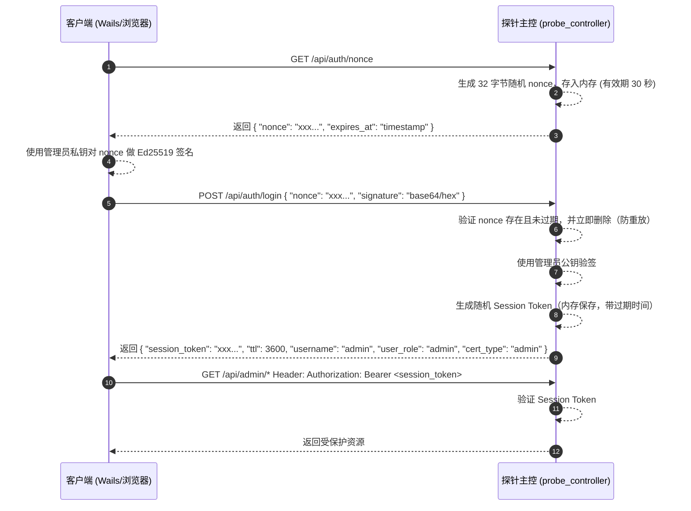

# 探针主控签名认证登录需求文档

## 1. 概述
当前探测器主控服务（`probe_controller`）通过 HTTPS（通常由 Cloudflare/Nginx 反向代理终止 TLS）暴露服务。为确保管理接口访问安全、防止重放攻击，系统采用 **挑战-响应（Challenge-Response）** 机制，并使用 **Ed25519 私钥签名 / 公钥验签** 完成登录鉴权。

## 2. 启动初始化（Root CA 与管理员身份）
服务首次启动时自动完成以下初始化：

1. 初始化黑名单存储 `blacklist.json`。
2. 检查并初始化 Root CA：
   - `./data/root_ca.crt.pem`
   - `./data/root_ca.key.pem`
3. 检查并初始化管理员身份：
   - 生成 Ed25519 管理员公私钥对
   - 将公钥写入 `cloudhelper.json` 的 `admin_public_key` 字段
   - 写出公钥文件 `./data/admin_public_key.pem`
   - 写出管理员私钥文件 `./data/initial_admin_private_key.pem`
   - 使用 Root CA 签发管理员证书 `./data/admin_key.crt.pem`

说明：
- 服务端登录验签仅依赖管理员公钥（`admin_public_key`）。
- 管理员私钥用于客户端签名，建议首次发放后离线保存并从服务端删除。

## 3. 认证交互流程

## 4. 路由与鉴权策略

系统遵循白名单与默认拒绝原则：

| 路由路径 | 接口说明 | 是否需要认证 |
| :--- | :--- | :---: |
| `GET /dashboard` | 公共状态页面 | ❌ 否 |
| `GET /dashboard/status` | 公共状态数据接口 | ❌ 否 |
| `GET /api/auth/nonce` | 获取登录挑战码 | ❌ 否 |
| `POST /api/auth/login` | 提交签名登录 | ❌ 否 |
| `GET /api/ping` | 内部/受保护状态探测 | ✅ 是 |
| `GET /api/admin/*` | 管理接口 | ✅ 是 |
| 其他未定义路由 | 默认拒绝 | ✅ 是（不暴露资源） |

## 5. 安全要求

- **防重放（Anti-Replay）**：nonce 即用即删；每个 nonce 绝对过期 30 秒。
- **请求风控与黑名单**：同一 IP 连续 5 次请求 nonce 且未成功登录，加入其 `/16 CIDR` 黑名单。
- **黑名单持久化**：黑名单独立存储（`blacklist.json`），重启后生效。
- **Token 随机性**：Session Token 必须使用安全随机源（`crypto/rand`）。
- **公私钥职责分离**：
  - 服务端长期保留公钥用于验签。
  - 私钥仅用于客户端签名，建议安全托管，不在服务端长期留存。
- **HTTPS 强制**：`/api/*` 路由需在 HTTPS 上访问；反代需转发 `X-Forwarded-Proto: https`。

## 6. 测试与验收标准

1. **初始化测试**：首次启动后自动生成 Root CA 文件、管理员公钥/私钥、管理员证书，并在 `cloudhelper.json` 中写入 `admin_public_key`。
2. **公开路由测试**：`GET /dashboard` 返回 `200`；`GET /dashboard/status` 返回 `200`。
3. **受保护路由测试**：未带 Token 访问 `GET /api/admin/status` 返回 `401`；未带 Token 访问 `GET /api/ping` 返回 `401`。
4. **过期测试**：nonce 超过 30 秒后提交登录，返回 nonce 过期错误。
5. **完整认证测试**：客户端使用管理员私钥签名 nonce，登录成功后携带 `session_token` 访问管理接口返回 `200`。
6. **黑名单风控测试**：同一 IP 连续 5 次仅请求 nonce，验证 `/16 CIDR` 被拉黑。
7. **黑名单持久化测试**：服务重启后黑名单仍生效。

## 7. 运维建议

- 首次部署后，立即备份并转移 `initial_admin_private_key.pem` 到安全设备或密钥系统。
- 若服务端不再需要私钥文件，删除 `initial_admin_private_key.pem`。
- 若需要轮换管理员密钥，建议使用受控轮换流程并同步客户端密钥。

## 8. 补充说明（关键细节）

### 8.1 密钥文件用途
- `root_ca.key.pem`：Root CA 私钥，用于后续给其他探针节点签发证书（高敏感，严禁外泄）。
- `root_ca.crt.pem`：Root CA 证书，可分发给需要校验证书链的组件。
- `admin_public_key.pem`：管理员公钥，服务端用于登录验签。
- `initial_admin_private_key.pem`：管理员私钥，仅用于客户端对 nonce 签名登录。

### 8.2 删除私钥文件的影响
- 删除服务端本地 `initial_admin_private_key.pem` **不会影响服务启动和验签**（服务端只依赖公钥）。
- 但若客户端侧没有可用私钥，则无法完成新的登录签名请求。
- 建议先完成私钥备份与客户端导入，再删除服务端本地私钥文件。

### 8.3 登录请求字段与签名编码
- 登录接口字段为：`nonce` + `signature`。
- `signature` 必须是对 `nonce` 原文进行 Ed25519 签名后的结果。
- 服务端当前支持 `signature` 的编码格式：`Base64`（标准/Raw/URL）或 `hex`。
- `nonce` 或 `signature` 缺失时，接口返回 `400`。

### 8.6 证书身份字段（新增）
- 管理员证书 `admin_key.crt.pem` 现在包含用户名、用户角色与证书类型字段。
- 服务端会在登录成功响应中返回：
  - `username`：用户名（如 `admin`）
  - `user_role`：用户角色（如 `admin` / `operator` / `viewer`）
  - `cert_type`：证书类型（如 `admin` / `ops` / `observer`）
- 管理客户端可基于 `username + user_role + cert_type` 做页面授权多态（Tab 可见性控制）。

### 8.4 管理员密钥轮换建议
1. 生成新的管理员密钥对（建议离线生成）。
2. 将新公钥更新到服务端（`admin_public_key` 与 `admin_public_key.pem` 保持一致）。
3. 将新私钥安全分发到管理员客户端。
4. 验证新私钥登录成功后，废弃旧私钥。

### 8.5 默认证书有效期
- `root_ca.crt.pem`：默认长期（100 年）。
- `admin_key.crt.pem`：默认长期（100 年）。
- 说明：私钥文件本身没有“过期时间”字段。

