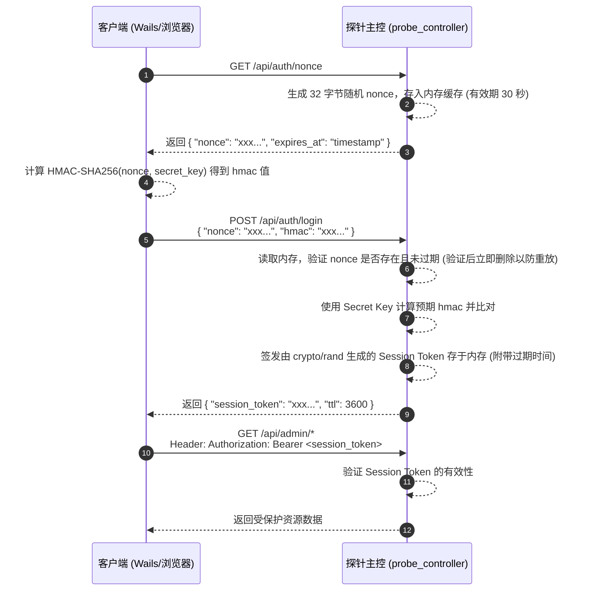

# 探针主控 HMAC 认证登录开发需求文档

## 1. 概述
当前探测器主控服务（`probe_controller`）主要通过 HTTPS（由 Cloudflare 终止 TLS）暴露服务。为确保管理接口访问的安全性，防止中间人攻击及重放攻击，本系统采用 **挑战-响应（Challenge-Response）机制**，基于 HMAC-SHA256 算法实现无密码网络传输的安全登录鉴权。

## 2. 身份凭证设计（首次启动初始化）
1. 服务启动时调用 `initAuth`。
2. 检查本地存储（例如 `cloudhelper.json` 的 `Store.Data["admin_key_hash"]` 字段）中是否存在管理员凭证的哈希值。
3. 若不存在，系统自动生成 **64 字节** 的强随机数，并进行 Hex 编码得到 128 字符的明文密钥（`Secret Key`）。
4. 对该明文密钥进行 `bcrypt` 哈希计算，将哈希结果保存至 `cloudhelper.json`。
5. 将 **明文密钥** 写入可执行文件同级目录的 `./data/initial_key.log`。管理员需妥善保管此文件或记录该密钥后将其删除。
6. 若服务后续重启且已存在该哈希值，则直接跳过初始化流程。

## 3. 认证交互流程设计

## 4. 路由访问与鉴权策略（默认拒绝）

系统访问控制应遵循 **白名单与默认拒绝 (Default Deny)** 原则，具体路由权限划分如下：

| 路由路径 | 接口说明 | 是否需要认证 |
| :--- | :--- | :---: |
| `GET /dashboard` | 公开状态页面、监控看板或落地页 | ❌ 否 |
| `GET /api/auth/nonce` | 获取登录挑战码阶段（Challenge） | ❌ 否 |
| `POST /api/auth/login`| 提交计算后的 HMAC（Response） | ❌ 否 |
| `GET /api/admin/*` | 系统内的各类管理与核心数据接口 | ✅ 是 |
| `GET /api/ping` | 探针状态嗅探接口 | ✅ 是 |
| **其他所有未明确路由** | 默认安全策略，拦截所有非法路径访问 | ✅ 是 |

## 5. 安全细节与边界要求
- **防重放攻击 (Anti-Replay):** `nonce`（一次性随机数）要求即用即删，服务端在收到同一 `nonce` 的登录请求验证通过（或失败）后，必须**立即**从内存中剔除，并且每个 nonce 设置的**绝对过期时间为 30 秒**。
- **Nonce 请求风控与黑名单:** 同一来源 IP 连续 **5 次**请求 `GET /api/auth/nonce` 后仍未登录成功（未完成有效 `POST /api/auth/login`），则将该 IP 所属 **`/16 CIDR`** 加入黑名单并拒绝后续认证请求。
- **黑名单存储方式:** 黑名单必须采用**独立文件**持久化存储（与主配置文件分离），服务重启后仍可加载生效。
- **Token 随机性保证:** Session Token **禁止**使用简单的规律字符串，必须依赖安全的随机源（如 Go 的 `crypto/rand`）生成。
- **凭证存储安全:** Secret Key 以 `bcrypt` 单向哈希的形式持久化，服务端不存储明文。
- **强制 HTTPS 环境:** 该认证方案需建立在安全传输层上。在现有架构下，服务端依赖网关层（如 Cloudflare）进行 TLS 终止，并确保上游访问为 HTTPS（推荐 TLS 1.3）。

## 6. 测试与验证标准 (验收条件)
1. **初始化测试**: 验证清理本地配置文件后首次启动，能够成功生成明文密钥日志 `initial_key.log` 和本地 JSON 内的 `admin_key_hash`。
2. **公开路由测试**: 验证访问 `GET /dashboard` 获得 `200 OK`；未带 Token 访问 `GET /api/admin/status`（或其它管理接口）获得 `401 Unauthorized`。
3. **过期测试**: 验证 `GET /api/auth/nonce` 获取挑战码超过 30 秒后提交认证，应被拒绝并返回相应的过期错误码。
4. **完整认证测试**: 客户端走完 Challenge-Response 流程，获取到正确下发的 `session_token`，并在随后的管理路由请求 HTTP 头部携带该 Token 成功获取 `200 OK` 响应。
5. **黑名单风控测试**: 模拟同一 IP 连续 5 次仅请求 `GET /api/auth/nonce` 且不完成成功登录，验证其所属 `/16 CIDR` 被加入黑名单，后续认证请求被拒绝。
6. **黑名单持久化测试**: 验证黑名单写入独立文件，服务重启后可正确加载，命中黑名单的 `/16 CIDR` 仍被拒绝。
