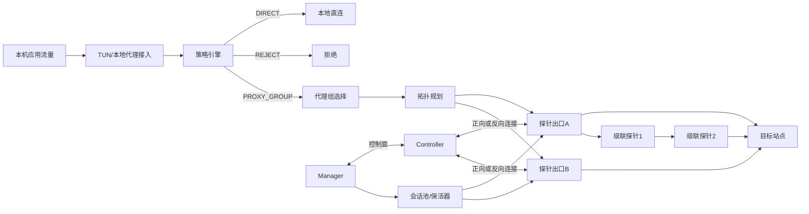

# 网络助手总体架构与单元设计（v0.2）

## 1. 设计范围

本文基于 `doc/network_assistant_plan.md` 的 12 条需求，输出：

- 总体架构设计
- 单元（模块）级设计

本次修订重点强化需求 11 与需求 12：拓扑设置后自动保活链路，业务层复用已建立连接；同时将探针服务接口与 NAT 公网映射纳入链路管理模型。

## 2. 总体架构设计

### 2.1 架构分层

- `接入层`：TUN/本地代理接管本机出站流量（TCP/UDP/HTTP）。
- `策略层`：规则匹配、兜底规则、代理组选择、直连白名单。
- `拓扑层`：探针出口、探针服务接口、公网映射、级联链路、正向/反向连接拓扑定义。
- `传输层`：私有协议承载在 TCP/HTTPS/HTTP3/WebSocket 之一。
- `会话层`：链路自动保活、重连、会话池与流复用。
- `安全层`：HTTPS codex 鉴权，成功后进入私有协议模式。
- `管理层`：链路管理、规则管理、状态与日志可视化。

### 2.2 系统角色

- `Manager`（本地网络助手）  
负责流量接入、规则决策、路径执行、会话池复用、UI 配置管理。

- `Controller`（主控）  
负责探针注册、鉴权、链路编排、代理组与级联拓扑下发。

- `Probe`（探针出口）  
负责出站转发；在级联场景下可同时充当中继跳点。

### 2.3 控制面、会话面、数据面

- `控制面`：规则、代理组、链路协议、拓扑、探针服务接口、公网映射、鉴权、健康状态。
- `会话面`：长连接维持、心跳、重连、连接池和流复用。
- `数据面`：业务流量按决策走 `DIRECT`、`PROXY_GROUP` 或 `REJECT`。

### 2.4 总体拓扑



## 3. 关键流程设计

### 3.1 拓扑生效与链路预热流程

1. 用户完成出口、探针服务接口、公网映射、级联链路、协议和正反向模式配置。
2. 控制面下发拓扑快照到 Manager。
3. 会话层按拓扑预建可复用长连接（单跳或级联路径）。
4. 进入心跳保活与健康探测状态。
5. 业务流量到达时优先复用已建连接。

### 3.2 出站流量决策流程

1. 流量进入接入层（TUN 或本地代理）。
2. 策略层按优先级匹配：`CIDR/IP/DOMAIN 后缀` + `direct_whitelist`。
3. 生成动作：
   - `DIRECT`：本地直连
   - `PROXY_GROUP`：按代理组选择探针出口（可级联）
   - `REJECT`：拒绝连接
4. 若为 `PROXY_GROUP`，会话层从会话池借用通道。
5. 数据面执行并上报状态/日志。

### 3.3 鉴权与私有协议切换流程

1. 先走 `HTTPS` 调用 codex 鉴权接口。
2. 鉴权成功：下发会话上下文并进入私有协议模式。
3. 鉴权失败：按策略延时返回 codex 失败响应。

### 3.4 故障与重连流程

1. 心跳超时或链路异常触发 `DEGRADED`。
2. 会话层按退避策略自动重连并重建会话池。
3. 重连成功后恢复 `ACTIVE` 并继续供业务复用。
4. 若长期不可用，策略层执行兜底动作（直连/代理组/拒绝）。

### 3.5 探针服务接口与 NAT 映射配置流程

1. 用户在网络助手链路管理中配置探针服务接口：监听地址、服务端口、传输协议、连接模式。
2. 若探针位于 `NAT` 后方，可额外手动配置公网访问地址与公网端口，且允许与服务端口不一致。
3. 控制面将配置归一化为出口端点模型，并校验必填项、端口范围和连接模式兼容性。
4. 拓扑层在生成逐跳路径时，按访问视角选择 `service_endpoint` 或 `public_endpoint` 作为实际拨号目标。
5. 运行态与可观测层上报最终使用的拨号地址，便于定位 `NAT` 映射配置错误。

## 4. 单元设计

### 4.1 单元清单

| 单元ID | 单元名称 | 核心职责 | 关键输入 | 关键输出 | 对应需求 |
|---|---|---|---|---|---|
| U1 | TrafficCapture | 接管本机流量（TCP/UDP/HTTP） | 本机出站流 | 标准化流会话 | 1,9 |
| U2 | RuleEngine | 规则匹配与优先级决策 | 会话元数据、规则集 | 路径动作 | 1,3,4,10 |
| U3 | DirectWhitelist | 管理 `direct_whitelist` | 白名单文件/配置 | 直连命中结果 | 3 |
| U4 | ProxyGroupManager | 管理代理组和用户选择 | 代理组配置、UI选择 | 出口候选 | 4,5,10 |
| U5 | LinkTopologyManager | 管理探针出口、服务接口、公网映射、拓扑、逐跳协议 | 出口配置、服务接口配置、拓扑配置 | 标准化链路拓扑与拨号端点 | 2,6,7,12 |
| U6 | CascadePlanner | 级联路径规划与校验 | 拓扑、健康状态 | 逐跳路径计划 | 2,7 |
| U7 | ConnectionModeManager | 正向/反向连接与拨号视角管理 | 连接模式、节点状态、访问视角 | 可用连接通道与实际拨号目标 | 2,12 |
| U8 | TransportAdapter | 承载层适配（TCP/HTTPS/HTTP3/WebSocket） | 传输配置、目标节点 | 统一通道对象 | 6,7 |
| U9 | PrivateProtocolGateway | 私有协议编解码与多路复用 | 鉴权上下文、通道 | 业务数据流 | 6,8,11 |
| U10 | LinkSessionPool | 自动保活、重连、连接复用池 | 拓扑快照、健康事件 | 可借用会话/流 | 11 |
| U11 | CodexAuthService | HTTPS codex 鉴权与失败延时响应 | 鉴权请求 | 鉴权结果/失败响应 | 8 |
| U12 | TUNAdapterManager | Windows/Linux TUN 生命周期管理 | 平台信息、驱动状态 | TUN就绪状态 | 9 |
| U13 | FallbackPolicy | 兜底规则执行 | 未命中/不可用会话 | 直连/代理组/拒绝 | 10,11 |
| U14 | Observability | 日志、指标、链路健康、复用率、端点拨号记录 | 运行事件 | 可观测数据 | 7,8,11,12 |

### 4.2 单元接口设计（逻辑接口 + 协议接口）

#### 4.2.1 接口分层约定

- `本地管理接口`：`Manager Frontend -> Wails App -> networkAssistantService`，用于模式切换、状态查询、TUN 安装和日志查看。
- `控制面接口`：`Manager -> Controller`，统一走 `wss://.../api/admin/ws`，采用 `request/response + push` 模式。
- `数据面接口`：`Manager -> Probe/Controller`，由 `TransportAdapter + PrivateProtocolGateway` 建立承载链路；当前兼容实现为 `WebSocket + yamux`。
- `单元内部接口`：Manager 内部模块之间的同步/异步调用接口，要求参数稳定、返回值可序列化、写操作具备幂等或显式版本控制。

接口约束：

- 对外 JSON 字段统一使用 `snake_case`。
- 线上的枚举值统一使用小写字符串，如 `direct/global/rule/tun`、`tcp/https/http3/websocket`、`forward/reverse`。
- 所有写接口都应支持 `expected_revision`，用于避免多端配置覆盖。
- 所有状态查询接口都返回 `revision`、`generated_at`，便于前端判断是否需要重新拉取。
- 涉及探针服务接口的配置必须显式区分 `service_endpoint` 与 `public_endpoint`；`public_port` 允许手动覆盖且不默认等于 `service_port`。

#### 4.2.2 本地管理接口（Manager Frontend -> Wails App）

本地管理接口是前端可直接消费的稳定边界，V2 继续沿用当前 Wails 暴露方式，但要把字段语义补齐。

- `GetNetworkAssistantStatus() -> NetworkAssistantStatus`
  - 只读、幂等。
  - 返回当前模式、已选出口、会话池摘要、TUN 状态和最近错误。
- `SyncNetworkAssistant(controller_base_url, session_token) -> NetworkAssistantStatus`
  - 触发一次控制面对齐。
  - 至少完成：校验会话、拉取可用出口/拓扑摘要、更新本地缓存。
- `SetNetworkAssistantMode(controller_base_url, session_token, mode, node_id) -> NetworkAssistantStatus`
  - `mode in {direct, global, rule, tun}`。
  - `direct` 不要求控制面在线。
  - `global/rule/tun` 要求 `controller_base_url` 与 `session_token` 可用。
  - 当前实现兼容 `direct/global/tun`；`rule` 作为 V2 正式模式保留。
- `RestoreNetworkAssistantDirect() -> NetworkAssistantStatus`
  - 强制回退为直连，并释放系统代理/TUN 占用。
- `InstallNetworkAssistantTUN() -> NetworkAssistantStatus`
  - 负责驱动准备，不等价于真正启用数据面。
- `EnableNetworkAssistantTUN() -> NetworkAssistantStatus`
  - 启用 TUN 数据面并更新系统路由/DNS 接管状态。
- `GetNetworkAssistantLogs(lines) -> NetworkAssistantLogResponse`
  - 返回结构化日志。
  - `lines` 建议限制在 `1..2000`，默认 `200`。

推荐将本地接口的返回模型稳定为：

```text
NetworkAssistantStatus {
  enabled: bool
  mode: "direct" | "global" | "rule" | "tun"
  node_id: string
  active_path_id?: string
  available_nodes: string[]
  available_paths?: string[]
  socks5_listen: string
  tunnel_route: string
  tunnel_status: string
  system_proxy_status: string
  last_error: string
  topology_revision?: int64
  rule_revision?: int64
  mux_connected?: bool
  mux_active_streams?: int
  mux_reconnects?: int64
  mux_last_recv?: string
  mux_last_pong?: string
  tun_supported?: bool
  tun_installed?: bool
  tun_enabled?: bool
  tun_library_path?: string
  tun_status?: string
}
```

```text
NetworkAssistantLogResponse {
  lines: int
  fetched_at: string
  entries: []NetworkAssistantLogEntry
}

NetworkAssistantLogEntry {
  time: string
  source: "manager" | "controller"
  category: string
  message: string
  line: string
}
```

#### 4.2.3 Manager 内部逻辑接口

内部逻辑接口建议按如下稳定形态拆分，便于后续把 `global` 演进为 `rule`、把单出口演进为多路径：

```text
TrafficCapture
- Start(mode, capture_config) -> CaptureHandle
- Stop() -> error
- Snapshot() -> CaptureRuntimeState

RuleEngine
- Evaluate(flow_meta, policy_snapshot) -> Decision
- ValidateRules(rules) -> ValidationResult

ProxyGroupManager
- Resolve(group_id, select_ctx) -> SelectedMember
- SetManualSelection(group_id, member_id, expected_revision) -> ApplyResult

LinkTopologyManager
- GetSnapshot() -> TopologySnapshot
- ApplySnapshot(snapshot, expected_revision) -> ApplyResult
- ResolvePath(group_id, flow_meta) -> PathPlan
- ResolveDialEndpoint(egress_id, access_view) -> DialEndpoint
- ValidateServiceEndpoints(snapshot) -> ValidationResult

CascadePlanner
- Plan(egress_id, topology_snapshot, health_snapshot) -> PathPlan
- Validate(path_plan) -> ValidationResult

ConnectionModeManager
- ResolveConnectionView(egress_endpoint, runtime_ctx) -> "service" | "public"
- ResolveDialEndpoint(egress_endpoint, access_view) -> DialEndpoint
- CanUseReverse(egress_endpoint) -> bool

TransportAdapter
- DialTransport(hop, auth_context) -> TransportChannel
- CloseTransport(channel_id) -> error
- Capabilities() -> TransportCapabilitySet

PrivateProtocolGateway
- OpenBusinessStream(session_ref, open_request) -> BusinessStream
- PushControlEvent(event) -> error
- CloseStream(stream_id, reason) -> error

LinkSessionPool
- EnsureWarm(topology_snapshot) -> WarmupResult
- Acquire(path_id, flow_meta) -> SessionLease
- Release(lease_id, result) -> error
- ReportHealth(path_id, health_event) -> error
- Snapshot() -> RuntimeStatusSnapshot

CodexAuthService
- AuthenticateHTTPS(auth_request) -> AuthResult
- BuildDelayFailResponse(failure_type, delay_policy) -> HTTPResponse
```

关键约束：

- `RuleEngine.Evaluate` 必须纯函数化，不直接依赖网络状态；网络状态通过 `policy_snapshot/health_snapshot` 注入。
- `LinkTopologyManager.ApplySnapshot` 成功后必须触发 `LinkSessionPool.EnsureWarm`，实现需求 11 的“拓扑生效即预热”。
- `LinkSessionPool.Acquire` 返回的是 `SessionLease` 而不是裸连接，便于记账复用率、借还超时和自动降级。
- `TransportAdapter` 只负责“某一跳如何连”，不负责多跳规划；多跳由 `CascadePlanner` 产出 `PathPlan`。
- `ResolveDialEndpoint` 不能假设 `public_port == service_port`；`NAT` 场景下必须显式使用链路管理中配置的公网地址/公网端口。

#### 4.2.4 控制面接口（Manager <-> Controller Admin WS）

控制面统一通过 `wss://<controller>/api/admin/ws` 访问，连接建立后必须先执行一次 `auth.session`。

统一消息包络：

```json
// request
{
  "id": "req-001",
  "action": "na.snapshot.apply",
  "payload": {}
}

// response
{
  "id": "req-001",
  "ok": true,
  "data": {}
}

// push
{
  "type": "na.runtime.status",
  "data": {}
}
```

字段规则：

- `id`：请求唯一 ID，由客户端生成。
- `action`：小写点分动作名。
- `payload`：动作入参；无入参时可省略或传空对象。
- `ok=false` 时，`error` 必填。
- push 事件不带 `id`，由 `type` 标识事件类别。

建议的控制面动作如下：

| 动作 | payload | data | 说明 |
|---|---|---|---|
| `auth.session` | `{ token }` | `{ authenticated: true }` | 建链后的首个动作；当前已存在 |
| `admin.tunnel.nodes` | `{}` | `{ nodes: []TunnelNode }` | 当前兼容动作，用于拉取单出口列表 |
| `na.snapshot.get` | `{ include_runtime?: bool }` | `NetworkAssistantSnapshot` | 一次性拉取规则、代理组、拓扑与运行态摘要 |
| `na.snapshot.apply` | `{ expected_revision, snapshot }` | `{ applied_revision, warmup_started, warnings[] }` | 原子下发配置快照并触发预热 |
| `na.egress.endpoint.validate` | `{ egresses }` | `{ valid, errors[], warnings[] }` | 校验探针服务接口、公网地址和 NAT 端口映射配置 |
| `na.egress.health.get` | `{ egress_ids?: []string }` | `{ items: []EgressHealth }` | 查询出口/中继健康状态 |
| `na.runtime.status.get` | `{ path_ids?: []string }` | `RuntimeStatusSnapshot` | 查询会话池、复用率、活跃路径 |
| `na.rule_set.validate` | `{ rules }` | `{ valid, errors[], warnings[] }` | 规则提交前的纯校验接口 |
| `na.path.warmup` | `{ path_ids?: []string }` | `{ accepted: []string, rejected: []{ path_id, reason } }` | 主动预热指定路径 |

控制面推送事件建议保留以下类型：

- `na.runtime.status`
  - 会话数、复用率、活跃路径变化。
- `na.path.health`
  - 某条路径从 `active -> degraded -> reconnecting` 的状态迁移。
- `na.controller.log`
  - 控制面日志摘要，供 UI 呈现。
- `na.config.applied`
  - 某次配置快照已生效，附带 `revision`。

说明：

- `admin.tunnel.nodes` 属于 V1 兼容动作，V2 优先以 `na.snapshot.get` 为主读接口。
- 写动作应尽量收敛为 `snapshot.apply`，避免规则、代理组、拓扑分别更新导致中间态不一致。
- `na.snapshot.apply` 中的 `egresses[]` 必须包含服务接口定义；若存在 `NAT` 手动映射，则同时包含 `public_endpoint`。

#### 4.2.5 数据面接口（Manager <-> Probe/Controller）

数据面分为两层：

- `承载链路层`：TCP/HTTPS/HTTP3/WebSocket 四选一，当前兼容实现为 `WebSocket`。
- `私有协议层`：建立在承载链路之上的多路复用和控制消息，当前兼容实现为 `yamux + open/relay`。

当前兼容隧道入口：

- `GET /api/ws/tunnel/{node_id}`
- 鉴权：`Authorization: Bearer <session_token>` 或 `?token=...`
- 约束：必须是 HTTPS/WSS 场景，反代时需要 `X-Forwarded-Proto=https`

当前/目标统一的开流请求建议如下：

```json
{
  "type": "open",
  "network": "tcp",
  "address": "example.com:443",
  "path_id": "path-hk-01",
  "trace_id": "trace-001",
  "rule_id": "rule-10"
}
```

```json
{
  "ok": true,
  "session_id": "sess-001",
  "path_id": "path-hk-01"
}
```

字段说明：

- `type`：当前固定为 `open`。
- `network`：`tcp | udp`。
- `address`：最终目标地址，格式为 `host:port`。
- `path_id`：可选；V1 单出口时可省略，V2 多跳/代理组场景建议显式带上。
- `trace_id`：可选；用于日志串联。
- `rule_id`：可选；便于观测“哪个规则命中了该流量”。
- 当前兼容实现的开流响应只要求 `ok/error`；`session_id/path_id` 属于 V2 可选扩展字段。

通道内的控制消息建议统一为：

```json
{
  "type": "controller_log",
  "category": "state",
  "message": "open stream failed"
}
```

保留事件类型：

- `controller_log`
- `path_state`
- `session_state`

其中当前实现已兼容 `controller_log`；`path_state/session_state` 为 V2 扩展事件，便于 UI 直接消费链路状态。

UDP 数据流约束：

- 沿用长度前缀帧格式：`2 bytes big-endian length + payload`。
- 单包上限建议保持 `<= 65535`，超限直接失败，不做分片重组。

#### 4.2.6 错误语义与版本控制

建议统一错误码语义，即便当前实现只返回 `error` 文本，也应在服务端内部先形成稳定枚举：

- `ERR_UNAUTHORIZED`
- `ERR_INVALID_PAYLOAD`
- `ERR_REVISION_CONFLICT`
- `ERR_RULE_VALIDATION`
- `ERR_PATH_UNAVAILABLE`
- `ERR_TRANSPORT_DIAL`
- `ERR_AUTH_FAILED`
- `ERR_WARMUP_TIMEOUT`

版本控制规则：

- 所有配置快照都带 `revision`。
- 所有写入动作都带 `expected_revision`。
- Controller 应保证 `applied_revision` 单调递增。
- Manager 若收到 `ERR_REVISION_CONFLICT`，必须先重新 `na.snapshot.get`，再决定是否覆盖。

### 4.3 单元状态机

#### LinkSession 状态

- `NEW` -> `AUTHING` -> `ESTABLISHED` -> `ACTIVE` -> `DEGRADED` -> `RECONNECTING` -> `ACTIVE/CLOSED`

#### SessionPool 状态

- `EMPTY` -> `WARMING` -> `READY` -> `SCALING` -> `READY`

#### BusinessStream 状态

- `ALLOCATED` -> `FORWARDING` -> `RELEASING` -> `RETURNED/CLOSED`

## 5. 核心数据模型

### 5.1 Rule

- `id`
- `priority`
- `enabled`
- `match_type`: `CIDR | IP | DOMAIN_SUFFIX`
- `match_value`
- `action`: `DIRECT | PROXY_GROUP | REJECT`
- `proxy_group_id`（action 为 PROXY_GROUP 时必填）

### 5.2 DirectWhitelist

- `entries[]`: `CIDR/IP/DOMAIN_SUFFIX`

### 5.3 ProxyGroup

- `id`
- `name`
- `members[]`（探针出口）
- `selected_member_id`（用户在界面选择）

### 5.4 EgressEndpoint

- `id`
- `name`
- `connection_mode`: `FORWARD | REVERSE`
- `transport`: `TCP | HTTPS | HTTP3 | WebSocket`
- `auth_profile`
- `health_status`
- `service_endpoint`
- `public_endpoint`（可选）
- `nat_enabled`
- `endpoint_source`: `DIRECT | NAT_MANUAL`

说明：

- `service_endpoint` 表示探针服务实际监听的地址与端口。
- `public_endpoint` 表示外部拨号应使用的公网地址与端口；在 `NAT` 场景下允许手工配置且与 `service_endpoint.port` 不一致。

### 5.5 ProbeServiceEndpoint

- `host`
- `port`
- `transport`
- `purpose`: `CONTROL | DATA | HEALTH`
- `reachable_scope`: `PRIVATE | PUBLIC`
- `manual`

说明：

- `manual=true` 表示该端点由用户手工录入，不从探针自上报结果自动覆盖。
- `public_endpoint` 推荐复用 `ProbeServiceEndpoint` 结构。

### 5.6 CascadePath

- `id`
- `hops[]`（每跳绑定 endpoint + transport + mode + dial_endpoint）
- `final_egress_id`

### 5.7 FallbackPolicy

- `action`: `DIRECT | PROXY_GROUP | REJECT`
- `proxy_group_id`（当 action=PROXY_GROUP）

### 5.8 LinkSession

- `session_id`
- `path_id`
- `transport`
- `mode`: `FORWARD | REVERSE`
- `state`
- `last_heartbeat_at`
- `reconnect_count`

### 5.9 SessionPoolStats

- `path_id`
- `total_sessions`
- `idle_sessions`
- `active_streams`
- `reuse_ratio`

### 5.10 NetworkAssistantSnapshot

- `revision`
- `generated_at`
- `rules[]`
- `direct_whitelist`
- `proxy_groups[]`
- `egresses[]`
- `paths[]`
- `fallback_policy`
- `runtime_defaults`

说明：

- `NetworkAssistantSnapshot` 是控制面读写的主模型。
- `paths[]` 是 Controller 归一化后的路径结果，可由 Manager 直接预热，不要求前端自己做多跳展开。
- 文中 `TopologySnapshot` 指 `egresses[] + paths[] + runtime_defaults` 的拓扑子集。
- 文中 `PolicySnapshot` 指 `rules[] + direct_whitelist + proxy_groups[] + fallback_policy` 的策略子集。

### 5.11 PathPlan

- `path_id`
- `group_id`
- `final_egress_id`
- `hops[]`
- `mode`: `FORWARD | REVERSE`
- `expected_health`: `HEALTHY | DEGRADED | DOWN`
- `warmup_required`

### 5.12 DialEndpoint

- `host`
- `port`
- `transport`
- `source`: `SERVICE | PUBLIC`
- `resolved_by`: `LINK_MANAGER | RUNTIME_DISCOVERY`

说明：

- `DialEndpoint` 是最终实际拨号目标。
- 在 `NAT` 场景下，`source=PUBLIC` 且 `port` 可以与探针服务监听端口不同。

### 5.13 FlowMeta

- `network`: `TCP | UDP | HTTP`
- `target_host`
- `target_ip`
- `target_port`
- `process_name`（可选）
- `rule_hint`（可选）
- `trace_id`

说明：

- `FlowMeta` 是 `TrafficCapture -> RuleEngine -> SessionPool` 的统一输入，避免不同层各自拼装字段。

### 5.14 Decision

- `action`: `DIRECT | PROXY_GROUP | REJECT`
- `matched_rule_id`
- `proxy_group_id`
- `path_id`
- `reason`

说明：

- `path_id` 在 `PROXY_GROUP` 决策后由 `ProxyGroupManager + CascadePlanner` 共同填充。
- `reason` 用于日志与调试，例如 `matched_suffix`, `fallback_to_direct`, `path_unavailable`。

### 5.15 SessionLease

- `lease_id`
- `session_id`
- `path_id`
- `stream_id`
- `acquired_at`
- `idle_timeout_sec`
- `reused`

说明：

- `SessionLease` 明确表示“借到的是一个可复用会话中的一个业务流”，不是整条底层 TCP 连接。

### 5.16 RuntimeStatusSnapshot

- `revision`
- `generated_at`
- `sessions[]`
- `pool_stats[]`
- `egress_health[]`
- `active_paths[]`
- `degraded_paths[]`

### 5.17 EgressHealth

- `egress_id`
- `status`: `UNKNOWN | HEALTHY | DEGRADED | DOWN`
- `last_ok_at`
- `last_error`
- `latency_ms`
- `transport`

### 5.18 TunnelNode

- `id`
- `name`
- `online`
- `transport_caps[]`
- `connection_modes[]`
- `service_endpoint`（可选）
- `public_endpoint`（可选）

说明：

- 当前代码只实际返回 `id/name/online`。
- `transport_caps[]`、`connection_modes[]`、`service_endpoint/public_endpoint` 是 V2 为多承载、多连接模式与 NAT 映射预留的扩展字段。

## 6. 需求到架构映射

| 需求 | 架构落点 |
|---|---|
| 1 | U1 + U2 + U13 |
| 2 | U5 + U6 + U7 |
| 3 | U3 + U2 |
| 4 | U2 + U4 |
| 5 | U4 |
| 6 | U8 + U9 |
| 7 | U5 + U6 + U8 + U14 |
| 8 | U11 + U9 |
| 9 | U12 + U1 |
| 10 | U13 + U4 + U2 |
| 11 | U10 + U9 + U14 |
| 12 | U5 + U7 + U14 |

## 7. 版本建议

- `V1`：规则分流（含 direct_whitelist）、代理组选择、兜底规则、单跳出口、链路保活与连接复用。
- `V2`：级联链路、正反向连接、逐跳异构协议、探针服务接口与 NAT 公网端口映射。
- `V3`：高级调度（自动选路/故障切换策略）、全量平台稳定化。
