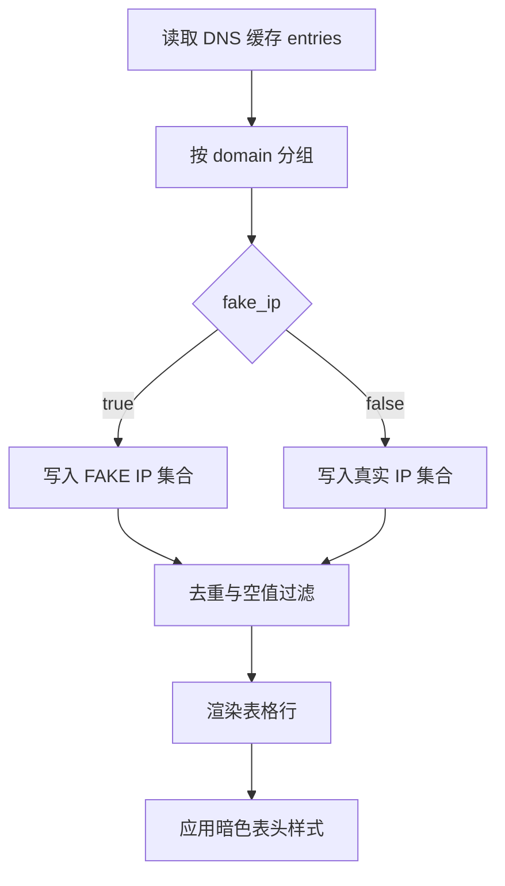

# 前端 DNS 缓存展示修复计划

## 1. 目标

修复两个前端问题：

1. DNS 缓存页表头视觉异常（你反馈为 tab 头标题栏发白）
2. DNS 缓存存在 FAKE IP 时，仅显示 FAKE IP、不显示真实 IP

本次方案仅调整前端展示与聚合逻辑，不改后端接口字段。

---

## 2. 现状与根因

### 2.1 数据来源确认

后端查询入口为 `QueryNetworkAssistantDNSCache`，底层在 `querySplitDNSCacheEntries` 组装结果，`fake_ip=true` 记录会同时携带 `ip`，并在后端额外提供 `fake_ip_value`。

这意味着前端收到的每条记录里，`ip` 字段并不能直接当作真实 IP 使用，必须结合 `fake_ip` 判断语义。

### 2.2 前端聚合问题

当前 `NetworkAssistantDNSCachePanel` 聚合逻辑中：

- `ips` 一律 append `entry.ip`
- `fakeIPs` 再 append `fake_ip_value` 或 fallback 到 `entry.ip`

结果是：FAKE 记录把 `entry.ip` 同时塞进 IP 列和 FAKE IP 列，真实 IP 与 FAKE IP 语义混淆；在某些聚合组合下，用户会感知为只看到 FAKE IP、真实 IP 不明显或被覆盖。

### 2.3 表头发白问题

DNS 缓存表格表头使用了浅色背景内联样式，和当前暗色主题不一致，造成表头视觉发白。

---

## 3. 改动范围

- `probe_manager/frontend/src/modules/app/components/NetworkAssistantDNSCachePanel.tsx`
- `probe_manager/frontend/src/App.css`

不涉及后端与协议字段调整。

---

## 4. 设计方案

### 4.1 聚合规则修正

按 `fake_ip` 分流，明确两列语义：

- IP 列：仅收集 `fake_ip=false` 的 `entry.ip`
- FAKE IP 列：
  - 优先收集 `fake_ip_value`
  - 无 `fake_ip_value` 时收集 `entry.ip`

并保持两列各自去重，不互相污染。

### 4.2 行级容错

- 所有字段先做 `trim`
- 空字符串不入集合
- 空集合统一展示 `-`
- domain 缺失时维持已有兜底逻辑，避免空 key 导致渲染异常

### 4.3 表头样式修正

将 DNS 缓存表头样式从浅色背景改为暗色主题样式，避免视觉发白：

- 背景使用深色半透明
- 文本使用浅色
- 边框保持与全局表格一致

建议改为 class 驱动，减少内联样式分散。

---

## 5. 实施步骤

1. 在 DNS 缓存聚合函数中重构 IP/FAKE IP 分流逻辑
2. 补充渲染容错（空值、异常值、重复值）
3. 为 DNS 缓存表格补充专用 class
4. 在样式文件中添加暗色表头定义并替换内联表头样式
5. 自测并记录回归结果

---

## 6. 验收标准

1. 当同一域名同时存在真实 IP 和 FAKE IP：
   - IP 列显示真实 IP
   - FAKE IP 列显示 FAKE IP
2. 仅存在 FAKE 记录时：
   - IP 列显示 `-`
   - FAKE IP 列显示对应地址
3. DNS 缓存页表头不再发白，风格与暗色主题一致
4. 查询筛选前后，以上规则保持一致
5. 页面无报错、无白屏

---

## 7. 回归测试清单

- 场景 A：仅真实 IP
- 场景 B：仅 FAKE IP
- 场景 C：真实 IP + FAKE IP 共存
- 场景 D：domain 为空或为 `-`
- 场景 E：重复记录去重
- 场景 F：按域名查询
- 场景 G：按 IP 查询

每个场景都检查：列值正确性、去重效果、表头样式一致性。

---

## 8. 执行流程图

---

## 9. 交付物

- 前端聚合逻辑修复
- DNS 缓存表头暗色样式修复
- 回归验证记录
