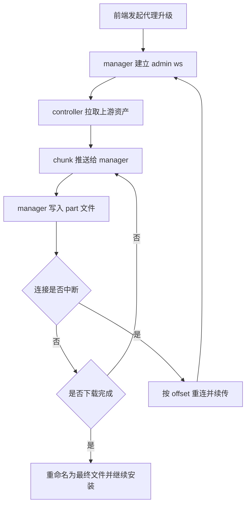

# 管理端代理升级下载稳定性改造计划

## 1. 现状核对结论

### 1.1 manager 侧
- 入口在 `UpgradeManagerViaProxy`，下载逻辑在 `downloadAssetViaProxy`
- 已有能力
  - `.part` 断点续传
  - WebSocket 中断后指数退避重连
  - 基于 `offset` 继续拉流
- 当前问题点
  - 超时参数为固定常量，缺少统一可配置策略
  - 错误上下文虽有透传，但缺少结构化分层标识，前端排障成本高

### 1.2 controller 侧
- `admin.proxy.download.stream` 由 `handleAdminWSProxyDownloadStream` 处理
- 已有能力
  - 支持 Range 偏移与 `206/416` 语义
  - chunk 推送事件 `proxy.download.chunk`
- 当前问题点
  - 固定总超时，缺少可配置化
  - 缺少针对该 action 的专门测试覆盖

### 1.3 frontend 侧
- 升级流程集中在 `useUpgradeFlow`
- 当前问题点
  - 失败提示以字符串拼接为主，缺少统一分类映射
  - 复杂链路报错时易退化为泛化提示

---

## 2. 改造目标

1. 代理升级下载在弱网和偶发断链下可自动恢复，不因短时抖动失败
2. manager 与 controller 的超时策略一致且可配置
3. 错误信息分层透传，后端返回可直接定位失败阶段
4. 补齐关键回归测试，防止后续回退

---

## 3. 代码改造步骤

### 步骤 A: 统一超时与重连配置

#### A1 manager 配置化
- 文件
  - `probe_manager/backend/upgrade.go`
- 动作
  - 将下载总超时、读空闲超时、最大重连次数、退避上下限改为可配置常量加载策略
  - 保留默认值，支持环境变量覆盖
- 验收
  - 不配置时行为与当前兼容
  - 配置后日志可见生效值

#### A2 controller 配置化
- 文件
  - `probe_controller/internal/core/ws_admin.go`
- 动作
  - 将 `adminWSProxyDownloadTimeout` 改为可配置加载
  - 与 manager 默认策略对齐
- 验收
  - 下载长时间场景不因固定短时阈值提前失败

### 步骤 B: 强化 manager 下载鲁棒性

#### B1 完善错误分层
- 文件
  - `probe_manager/backend/upgrade.go`
- 动作
  - 对握手失败、鉴权失败、流读取失败、落盘失败、重命名失败分别包装前缀
  - 在最终错误中保留 `offset`、`reconnect_attempts`、`status` 关键信息
- 验收
  - 任何失败都能直接定位阶段与上下文

#### B2 滑动读超时与重连边界审计
- 文件
  - `probe_manager/backend/upgrade.go`
- 动作
  - 确认每次读消息前刷新读截止时间
  - 明确哪些错误可重试，哪些错误立即失败
  - 对 stalled 场景维持明确失败信号
- 验收
  - 断线重连可继续，不会无限重试

### 步骤 C: 强化 controller 流式下载稳定性

#### C1 下载响应与返回语义收敛
- 文件
  - `probe_controller/internal/core/ws_admin.go`
- 动作
  - 保持 `200/206/416` 语义稳定
  - 明确 done 响应中的 `downloaded/total/status`
- 验收
  - manager 侧无需猜测即可完成续传判断

#### C2 可观测性增强
- 文件
  - `probe_controller/internal/core/ws_admin.go`
- 动作
  - 在失败分支增加更清晰错误上下文
  - 保留 request_id 与下载进度信息
- 验收
  - 可从日志直接还原失败阶段

### 步骤 D: 补齐测试

#### D1 manager 侧
- 文件
  - `probe_manager/backend/probe_link_test.go`
  - 视需要新增 `probe_manager/backend/upgrade_test.go`
- 用例
  - 首次流中断后自动重连并按 offset 续传
  - 416 场景正确完成并落盘
  - 不可重试错误立即失败

#### D2 controller 侧
- 文件
  - 新增 `probe_controller/internal/core/ws_admin_proxy_download_test.go`
- 用例
  - `admin.proxy.download.stream` 正常 chunk 推送
  - 偏移续传与 `206`
  - `416` 返回语义
  - 上游非 2xx 错误透传

---

## 4. 验收清单

- 代理升级在模拟断线后可自动恢复并完成
- 错误信息包含阶段、偏移、状态码等关键字段
- manager 与 controller 超时参数可配置且默认兼容
- 新增测试稳定通过

---

## 5. 实施流程图

---

## 6. 交付边界

### 本次包含
- manager 代理下载稳定性与错误透传改造
- controller 代理流下载超时配置化与测试补齐

### 本次不包含
- 前端升级失败提示可读性优化（放到第二阶段）
- 非升级链路的通用下载模块重构
- 远方 DNS 业务链路改造

### 第二阶段
- 前端升级失败提示分级映射与可操作文案优化
