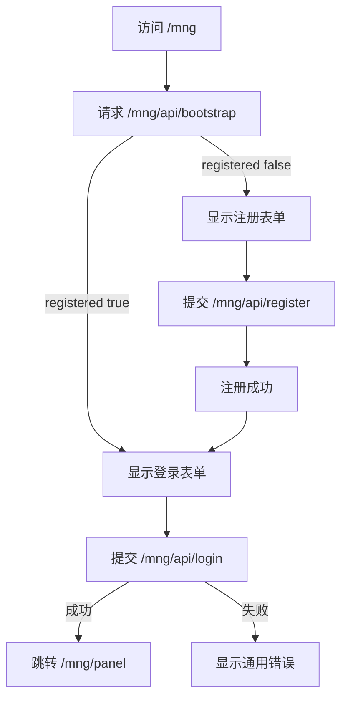

# Probe Controller 新增 /mng 独立认证域实施方案

## 目标
- 新增浏览器入口 `/mng`
- 首次访问可注册单账号
- 无默认账号
- 注册成功后永久关闭注册入口
- 登录成功进入 `/mng/panel`
- `/mng` 仅访问新增管理功能
- 不接入 `/dashboard` 与现有旧 API

## 范围边界
- 保持现有 `nonce+signature` 认证链路不变
- 保持现有 `/api/*` 与 `/dashboard/*` 路由行为不变
- 新增独立 `/mng/*` 路由与独立会话，不复用旧会话字段

## 落盘位置与存储约束
- `/mng` 认证数据写入 `probe_controller` 运行目录下 `./data/cloudhelper.json`
- 新增键空间 `mng_auth`，与现有字段并存，不覆盖旧认证字段
- `/mng` 会话仅保存在内存 `mng_sessions`，进程重启后会话失效
- 注册成功后仅允许登录，不再开放二次注册

## 技术设计

### 1 路由与页面
- `GET /mng`
  - 若未注册，展示注册界面
  - 若已注册，展示登录界面
- `GET /mng/panel`
  - 需通过 `/mng` 独立会话验证
  - 未登录则重定向 `/mng`
- `GET /mng/api/bootstrap`
  - 返回 `registered` 状态，用于页面初始化

### 2 认证接口
- `POST /mng/api/register`
  - 入参: `username password confirm_password`
  - 仅在未注册状态允许
  - 注册成功写入单账号并锁定注册入口
- `POST /mng/api/login`
  - 入参: `username password`
  - 成功后签发 `/mng` 会话
- `POST /mng/api/logout`
  - 失效当前 `/mng` 会话
- `GET /mng/api/session`
  - 返回当前会话状态

### 3 数据模型
在主存储中新增独立命名空间 `mng_auth`，建议字段
- `registered` 布尔
- `username` 字符串
- `password_hash` 字符串 采用 bcrypt
- `created_at` 字符串 RFC3339
- `updated_at` 字符串 RFC3339

运行时内存新增 `mng_sessions`
- 键: token
- 值: 过期时间
- 与旧 `authManager.sessions` 完全隔离

### 4 安全策略
- 密码仅存 bcrypt 哈希
- 登录失败返回统一错误文本，避免枚举用户名
- `/mng/api/register` 完成后永久返回禁止再次注册
- `/mng` 会话使用 HttpOnly Cookie
  - Path 为 `/mng`
  - SameSite 为 Strict
  - Secure 由 HTTPS 判定策略控制
- 增加基础防暴力机制
  - 按 IP 失败计数
  - 超阈值短时冻结

### 5 页面交互流

## 代码落点
- `probe_controller/internal/core/server.go`
  - 注册 `/mng` 与 `/mng/api/*` 路由
- `probe_controller/internal/core/middleware.go`
  - 新增 `mngAuthRequiredMiddleware`
- `probe_controller/internal/core/store.go`
  - 读取和保存 `mng_auth` 字段
- `probe_controller/internal/core`
  - 新增 `mng_auth.go` 认证与会话逻辑
  - 新增 `mng_handlers.go` HTTP 处理器
- `probe_controller/internal/dashboard/page.go`
  - 不改动，仅确认隔离
- `probe_controller/tests`
  - 新增 `/mng` 注册登录相关测试

## 验收标准
- 首次访问 `/mng` 可注册
- 注册后第二次注册被拒绝
- 登录成功可访问 `/mng/panel`
- 未登录访问 `/mng/panel` 被拦截
- 域名主路径 `/` 继续跳转 `/dashboard`，不跳转 `/mng`
- `/dashboard` 与旧 `/api/auth/*` 行为不变
- 旧 websocket 与旧 token 认证不受影响

## 实施步骤
1. 新增 `mng_auth` 结构与持久化读写
2. 新增 `/mng/api/register` `/mng/api/login` `/mng/api/logout` `/mng/api/session`
3. 新增 `/mng` `/mng/panel` 页面与前端交互脚本
4. 接入独立中间件与会话校验
5. 补齐单测与回归测试
6. 执行构建与路由验证
