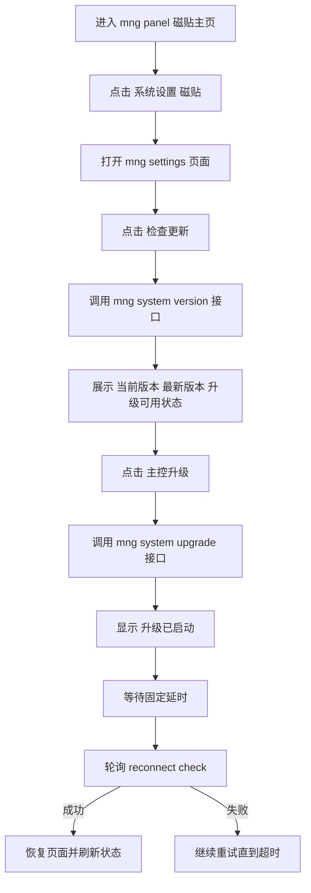

# Probe Controller `/mng` 磁贴主页与系统设置升级方案

## 1. 变更目标
- 将 `/mng/panel` 从信息卡片页改为磁贴样式主页
- 磁贴数量不固定，采用可扩展网格布局
- 新增系统设置磁贴，点击进入新页面 `/mng/settings`
- 系统设置页提供 检查更新 与 主控升级 按钮
- 检查更新按钮用于查询最新程序版本与是否可升级
- 点击主控升级后直接触发后端升级任务
- 前端进入延时重连流程，等待服务重启后自动恢复可用

## 2. 复用与最小改动策略
- 认证与会话继续复用现有 `/mng` 独立链路，不触碰旧 `nonce+signature`
- 升级执行逻辑复用已有 `triggerControllerUpgradeTask` 与进度状态读取逻辑
- 新增 `/mng` 域专用接口，仅做鉴权边界与响应结构适配
- 旧 `/dashboard` 与旧 `/api/*` 行为保持不变

## 3. 路由与接口设计

### 3.1 页面路由
- `GET /mng/panel`
  - 渲染磁贴主页
  - 受 `mngAuthRequiredMiddleware` 保护
- `GET /mng/settings`
  - 渲染系统设置页
  - 受 `mngAuthRequiredMiddleware` 保护

### 3.2 `/mng` 域 API
- `GET /mng/api/system/version`
  - 行为 检查更新并返回版本信息
  - 返回 建议包含 `current_version` `latest_version` `upgrade_available` `message`
- `POST /mng/api/system/upgrade`
  - 行为 直接触发升级任务
  - 返回 建议包含 `accepted` `message` `current_version` `latest_version`
- `GET /mng/api/system/upgrade/progress`
  - 行为 返回当前升级进度快照
  - 用于前端展示阶段与重启前状态
- `GET /mng/api/system/reconnect/check`
  - 行为 轻量健康检查
  - 用于前端延时重连时判断服务恢复

## 4. 前端交互方案

### 4.1 磁贴主页
- 采用 CSS Grid 实现响应式磁贴布局
- 磁贴数据结构化，支持后续扩展更多入口
- 首版至少包含
  - 系统设置 磁贴 可点击
  - 运行状态 磁贴 只读展示
  - 版本信息 磁贴 只读展示

### 4.2 系统设置页
- 核心操作区提供 检查更新 与 主控升级 两个按钮
- 点击 检查更新 后展示 当前版本 最新版本 升级可用状态
- 点击升级后按钮进入禁用态，防止重复触发

### 4.3 延时重连策略
- 升级触发成功后，先等待短延时
- 随后循环请求 `reconnect/check`
- 成功后自动恢复为可操作状态
- 达到重试上限后展示失败提示并允许手动重试

## 5. 后端实现要点
- 在 `mng` 处理器中新增系统设置页面与接口处理器
- 版本检查接口复用现有版本检查逻辑，避免重复调用链
- 升级接口内部复用现有升级任务函数，不重复造轮子
- 进度接口读取现有升级状态结构，映射为 `/mng` 前端需要的字段
- 重连检查接口返回简单 JSON

## 6. 测试与验收

### 6.1 新增测试
- `/mng/panel` 返回磁贴页，含系统设置入口
- `/mng/settings` 未登录重定向，已登录可访问
- 检查更新接口未登录 401，已登录返回版本检查结果
- 升级接口未登录 401，已登录可触发
- 进度接口未登录 401，已登录返回结构正确
- 重连检查接口可用于前端轮询

### 6.2 回归验证
- `/` 继续跳转 `/dashboard`
- 旧 `/api/auth/*` 与现有 WS 路由保持原行为
- `/mng` 会话隔离不受破坏

## 7. 落地清单
1. 更新 `mng` 页面模板与样式
2. 新增 `/mng/settings` 页面路由与处理器
3. 新增 `/mng/api/system/version` `/upgrade` `/progress` `/reconnect/check`
4. 对接前端检查更新 升级触发 与延时重连逻辑
5. 补充测试并执行 `go test ./...`
6. 更新需求跟踪文档状态
