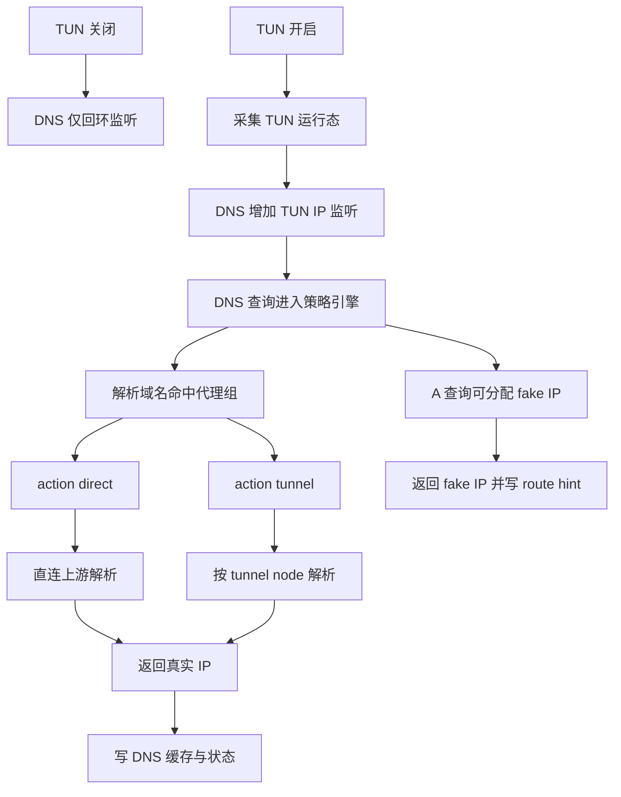

# Probe Node Windows TUN Fake IP 对齐实施计划 2026-04-25

## 1. 目标与范围

- 目标: 按 `probe_manager` 现行行为在 `probe_node` 对齐 Windows 侧 TUN DNS 能力。
- 本期范围:
  - Windows 完整对齐: 启用 TUN 后启用 Fake IP。
  - DNS 双监听: 常驻 `127.0.0.1` 与 TUN 网卡 IPv4 同时可用。
  - 代理组分流: 按 `rules_text` 命中组，再依据 `proxy_state` 的 `action` 与 `tunnel_node_id` 决策。
- 非本期范围:
  - Linux 新增 Fake IP 数据面不做，仅保持现状。

## 2. 现状基线

- `probe_node/local_dns_service.go`
  - 已有本机 DNS 服务。
  - 监听固定回环地址，具备 53 到 5353 回退。
  - 上游顺序已实现 `doh_proxy_servers > doh_servers > dot_servers > dns_servers`。
- `probe_node/local_console.go`
  - 已有 `proxy_group` 与 `proxy_state` 模型。
  - 已有组选择与 `tunnel_node_id` 校验。
  - 仅状态保存，没有 DNS 路由决策执行面。
- `probe_node/local_proxy_takeover_windows.go`
  - 已有 TUN 接管与默认路由分流。
  - 已通过环境变量读取 `PROBE_LOCAL_TUN_GATEWAY` 和 `PROBE_LOCAL_TUN_IF_INDEX`。
- `probe_manager/backend/network_assistant_internal_dns.go`
  - 已有 internal DNS + fake IP + route hint 参考实现。

## 3. 对齐设计总览

## 4. 关键模块设计

### 4.1 Windows TUN 运行态采集与统一状态源

新增运行态结构由 `probe_node` 内部统一维护:

- tun_if_index
- tun_gateway
- tun_ipv4 推荐固定 `198.18.0.1`
- tun_prefix_len 推荐 `15`
- tun_enabled

落点建议:

- `probe_node/local_proxy_takeover_windows.go`
  - 从接管流程回填 `gateway if_index`。
  - 增加可读函数供 DNS 模块查询当前 TUN 运行态。
- `probe_node/local_console.go`
  - TUN 启停后触发 DNS 监听编排。

### 4.2 DNS 双监听编排

将现有单监听改为监听集合:

- 常驻监听: `127.0.0.1:53` 或回退 `127.0.0.1:5353`。
- TUN 监听: `198.18.0.1:53`。

生命周期:

- 进程启动: 启动回环监听。
- TUN 启用成功: 启动 TUN 监听。
- TUN 关闭: 回收 TUN 监听。
- 监听失败不影响另一监听存活，状态独立记录。

### 4.3 Fake IP 数据面

参考 `probe_manager` 迁移最小必要子集:

- fake_ip_cidr 默认 `198.18.0.0/15`。
- 双向映射:
  - domain to fake_ip
  - fake_ip to entry route group tunnel_node_id expire
- TTL 与 DNS 共享。
- A 查询优先尝试 fake IP 分配，AAAA 保持真实解析。
- 保留地址规避:
  - 跳过 internal DNS 监听地址 `198.18.0.1`。

### 4.4 代理组分流闭环

新增 `probe_node` 规则决策层:

1. 解析域名命中 `proxy_group.rules_text`。
2. 取对应组在 `proxy_state` 的运行态动作。
3. 路由判定:
   - direct: 走直连 DNS 上游。
   - reject: 返回拒绝响应。
   - tunnel: 使用该组 `tunnel_node_id` 走隧道 DNS 路径。
4. 结果写入 DNS 缓存与 route hint。

备注:

- 当前代码库无完整 netstack 数据面，需在 DNS 侧先完成策略一致性。
- 连接侧完全一致分流需新增后续数据面衔接点，本期纳入 Windows 主路径实现。

### 4.5 配置模型扩展

扩展 `proxy_group.json` 顶层:

- fake_ip_cidr
- fake_ip_whitelist
- tun
  - doh_servers

扩展 `proxy_state.json` 运行态:

- dns
  - listeners
  - active_mode
  - last_error
- fake_ip
  - enabled
  - cidr
  - entry_count
  - last_gc_at

## 5. API 与控制台扩展

### 5.1 API

保留现有:

- `GET /local/api/dns/status`

扩展响应字段:

- listeners 数组
- tun_listener
- fake_ip_enabled
- fake_ip_cidr
- fake_ip_entry_count
- route_hint_count

新增调试接口建议:

- `GET /local/api/dns/fake_ip/list`
- `GET /local/api/dns/fake_ip/lookup?ip=`

### 5.2 控制台

`panel.html` 的 DNS Tab 增加:

- 回环监听状态
- TUN 监听状态
- fake IP 启用状态
- fake IP 池统计
- route hint 统计

## 6. 编码落点清单

- `probe_node/local_dns_service.go`
  - 重构为多监听。
  - 引入 fake IP 池与 route hint。
  - 引入按组路由 DNS 决策。
- `probe_node/local_console.go`
  - 配置结构扩展。
  - TUN 启停后通知 DNS 重编排。
  - 新增调试 API。
- `probe_node/local_proxy_takeover_windows.go`
  - 暴露 TUN 运行态读取能力。
- `probe_node/local_pages/panel.html`
  - DNS 页面状态展示扩展。
- `probe_node/local_console_test.go`
- `probe_node/local_console_methods_test.go`
- `probe_node/local_pages_routes_test.go`
- 新增建议:
  - `probe_node/local_dns_fake_ip_test.go`
  - `probe_node/local_dns_route_decision_test.go`
  - `probe_node/local_dns_multilistener_test.go`

## 7. 回归测试矩阵

### 7.1 Windows 主路径

- 启用 TUN 后:
  - 回环与 TUN IP 双监听均可查询。
  - A 查询命中 fake IP。
  - AAAA 查询走真实上游。
- 按组策略:
  - direct 组解析成功。
  - reject 组返回拒绝。
  - tunnel 组按 `tunnel_node_id` 路径解析。

### 7.2 失败与降级

- TUN 监听绑定失败时:
  - 回环监听仍可服务。
  - 状态接口可见失败原因。
- fake IP 池耗尽:
  - 自动回退真实解析。

### 7.3 Linux 不回归

- Linux 现有 TUN 接管与 DNS 路径不变。
- 不引入 fake IP 数据面行为。

## 8. 实施阶段切分

- Phase A 数据结构与状态管线
  - 模型扩展 + 状态接口扩展 + 页面字段扩展。
- Phase B DNS 双监听与 TUN 生命周期联动
  - 多监听与监听编排稳定性。
- Phase C Fake IP 与按组决策
  - fake IP 池 + route hint + rules_text 命中。
- Phase D 回归与文档
  - 全量测试 + 需求跟踪更新。

## 9. 风险与护栏

- 风险: `probe_node` 当前缺少 manager 级 netstack，连接层完全一致分流改造量大。
- 护栏:
  - 先保证 DNS 分流与 fake IP 行为一致。
  - 通过状态接口暴露可观测字段，确保调试闭环。
  - Linux 严格不改行为，避免跨平台回归。

## 10. 验收口径

- Windows 开启 TUN 后，DNS 同时监听回环与 TUN IP。
- A 查询在符合策略时返回 fake IP，且可反查域名与路由。
- 代理组规则与 `proxy_state` 动作共同决定 DNS 上游路径。
- 现有 `probe_node` 测试与新增测试全部通过。
