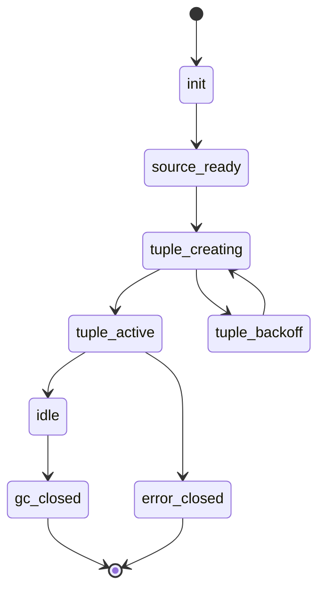

# UDP Association V2 字段级协议与关键数据结构草案

## 1. 目标

- 全链路统一使用四元组会话模型
- 消除 manager 侧 UDP endpoint 重复创建导致的冲突风暴
- 统一 manager controller probe 的会话键、生命周期、观测字段

## 2. 协议对象定义

### 2.1 tunnel_open 请求扩展

在 `network=udp` 时，`tunnel_open` 必须携带 `association_v2`。

```json
{
  "action": "tunnel_open",
  "payload": {
    "network": "udp",
    "address": "203.0.113.10:443",
    "association_v2": {
      "version": 2,
      "flow_id": "f6b3...",
      "src_ip": "10.7.0.2",
      "src_port": 53012,
      "dst_ip": "203.0.113.10",
      "dst_port": 443,
      "ip_family": 4,
      "transport": "udp",
      "route_group": "direct",
      "route_node_id": "",
      "route_target": "203.0.113.10:443",
      "route_fingerprint": "7f1f...",
      "nat_mode": "preserve_src_port",
      "idle_timeout_ms": 90000,
      "created_at_unix_ms": 0,
      "trace_id": "tun-udp-..."
    }
  }
}
```

### 2.2 字段语义

- `version` 协议版本，固定为 2
- `flow_id` 会话唯一标识，建议使用 hash
- `src_ip` 发起端源 IP
- `src_port` 发起端源端口
- `dst_ip` 目标 IP
- `dst_port` 目标端口
- `ip_family` 4 或 6
- `transport` 固定 udp
- `route_group` 路由组
- `route_node_id` 路由节点 ID
- `route_target` 实际拨号目标
- `route_fingerprint` route 维度稳定摘要
- `nat_mode` 取值
  - `preserve_src_port`
  - `auto_fallback_ephemeral`
- `idle_timeout_ms` 空闲回收时间
- `created_at_unix_ms` 创建时间
- `trace_id` 端到端追踪 ID

### 2.3 tunnel_open 响应扩展

```json
{
  "ok": true,
  "association_v2_ack": {
    "version": 2,
    "flow_id": "f6b3...",
    "controller_key": "c-...",
    "probe_key": "p-...",
    "bound_local": "10.7.0.2:53012",
    "nat_mode_applied": "preserve_src_port"
  }
}
```

## 3. 统一键模型

- SourceKey
  - `src_ip src_port ip_family transport`
- TupleKey
  - `src_ip src_port dst_ip dst_port ip_family transport`
- RouteKey
  - `route_group route_node_id route_target route_fingerprint`
- AssocKeyV2
  - `TupleKey + RouteKey`

建议字符串化规则

- 全部小写
- IP 使用标准压缩格式
- 字段顺序固定

## 4. 关键数据结构草案

### 4.1 manager

```go
type UDPSourceContext struct {
    SourceKey      string
    SrcIP          net.IP
    SrcPort        uint16
    IPFamily       uint8
    Transport      string
    Endpoint       *gonet.UDPConn
    CreatedAtUnix  int64
    LastActiveUnix atomic.Int64
    Refs           atomic.Int32
    Closed         atomic.Bool
}

type UDPTupleSession struct {
    AssocKeyV2      string
    FlowID          string
    TupleKey        string
    RouteKey        string
    Route           tunnelRouteDecision
    Upstream        io.ReadWriteCloser
    SourceCtx       *UDPSourceContext
    NATMode         string
    IdleTimeout     time.Duration
    CreatedAtUnix   int64
    LastActiveUnix  atomic.Int64
    InBytes         atomic.Uint64
    OutBytes        atomic.Uint64
    CreateFailStage atomic.Uint32
    Closed          atomic.Bool
}

type UDPSessionRegistry struct {
    mu          sync.RWMutex
    sources     map[string]*UDPSourceContext
    tuples      map[string]*UDPTupleSession
    failBackoff map[string]int64
}
```

### 4.2 controller

```go
type TunnelUDPAssocV2 struct {
    AssocKeyV2      string
    FlowID          string
    TupleKey        string
    RouteKey        string
    Target          string
    Conn            *net.UDPConn
    NATMode         string
    AttachedRefs    atomic.Int32
    LastActiveUnix  atomic.Int64
    CreatedAtUnix   int64
    Closed          atomic.Bool
}

type TunnelUDPAssocV2Pool struct {
    mu    sync.RWMutex
    items map[string]*TunnelUDPAssocV2
}
```

### 4.3 probe

```go
type ProbeUDPAssocV2 struct {
    AssocKeyV2      string
    FlowID          string
    TupleKey        string
    RouteKey        string
    Target          string
    Conn            *net.UDPConn
    NATMode         string
    AttachedRefs    atomic.Int32
    LastActiveUnix  atomic.Int64
    CreatedAtUnix   int64
    Closed          atomic.Bool
}

type ProbeUDPAssocV2Pool struct {
    mu    sync.RWMutex
    items map[string]*ProbeUDPAssocV2
}
```

## 5. 生命周期与状态机



状态说明

- `source_ready` source context 可复用
- `tuple_creating` 创建上游传输对象
- `tuple_backoff` 创建失败退避
- `tuple_active` 正常收发
- `idle` 空闲等待回收
- `gc_closed` GC 回收关闭
- `error_closed` 异常关闭

## 6. 冲突处理分层

统一错误阶段枚举

- `stage_endpoint_create`
- `stage_local_bind`
- `stage_upstream_open`
- `stage_stream_write`
- `stage_stream_read`

统一错误原因枚举

- `local_port_in_use`
- `local_bind_conflict`
- `socket_buffer_exhausted`
- `route_open_timeout`
- `upstream_refused`

## 7. 观测字段

调试接口统一输出

- `assoc_key_v2`
- `flow_id`
- `tuple_key`
- `route_key`
- `state`
- `attached_refs`
- `last_active_unix`
- `in_bytes`
- `out_bytes`
- `create_fail_stage`
- `create_fail_reason`

## 8. 落地文件清单

- manager
  - `probe_manager/backend/network_assistant_tun_stack_windows.go`
  - `probe_manager/backend/network_assistant_tun_udp.go`
  - `probe_manager/backend/network_assistant_mux.go`
  - `probe_manager/backend/ai_debug_udp_assoc.go`
- controller
  - `probe_controller/internal/core/ws_tunnel.go`
  - `probe_controller/internal/core/ws_tunnel_udp_assoc.go`
  - `probe_controller/internal/core/ws_tunnel_udp_debug.go`
- probe
  - `probe_node/link_chain_runtime.go`
  - `probe_node/link_chain_udp_assoc.go`
  - `probe_node/udp_assoc_debug.go`

## 9. 本草案约束

- 不考虑 v1 兼容与降级
- 直接以 v2 协议替换原 UDP association 语义
- 三端键模型与指标字段必须完全一致

## 10. 上线执行（v2 单栈）

> 说明：不引入 v1/v2 协议并行开关，不保留协议降级路径，直接完成 v2 单栈切换。

### 10.1 发布顺序

1. 先升级 controller（仅接收 v2 字段，不放量）
2. 再升级 probe（开启 v2 association 池）
3. 最后升级 manager（开启 `association_v2` 下发）

### 10.2 放量策略

- Phase A：内部节点 5%
- Phase B：单地域 25%
- Phase C：全量

每阶段观察窗口建议 30~60 分钟，关注：

- `udp_open_failed` 是否突增
- `association_send_failed` 是否突增
- manager/controller/probe 的 UDP active session 数是否同向收敛

### 10.3 清理项确认

- 移除 v1 语义相关分支与注释，不保留双栈判断
- 移除“临时降级到 direct/旧 association”类操作手册条目
- manager/controller/probe 三端调试输出仅保留 v2 键模型字段
- 上线前执行一次全链路并发冲突回归与 QUIC 高频压测

### 10.4 发布完成核验

- manager debug/controller debug/probe debug 会话计数收敛
- `route_fingerprint` 分布稳定
- 无持续性 `local_port_in_use` / `socket_buffer_exhausted` 尖峰

## 11. 测试与压测补充清单

### 11.1 并发冲突回归

- 同源端口对多目标（1->N）
- 同目标多源端口（N->1）
- 路由切换时 tuple 重建与旧会话 GC 并发

### 11.2 QUIC 高频场景

- 64/128/256 并发流，持续 10 分钟
- 短包高频（64~256B）与 MTU 邻近大包混合
- 随机抖动/丢包（1%~5%）下重传与会话稳定性

### 11.3 必检指标

- active associations 峰值与回落时间
- 新建失败分层（stage/reason）
- GC 回收时延（P50/P95）
- 端到端丢包率与 RTT 漂移
