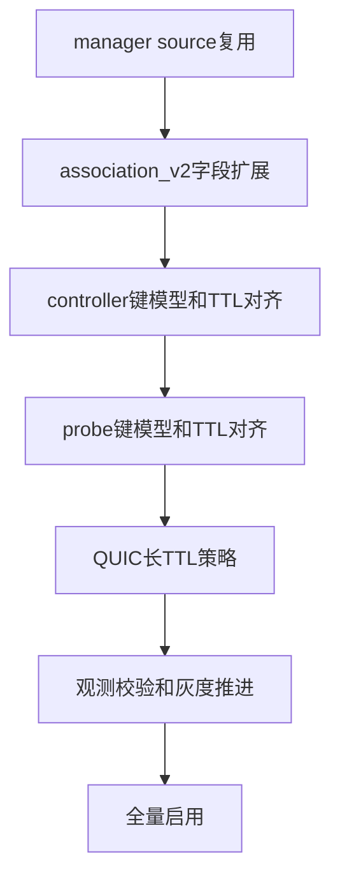

# UDP 三端复用与 QUIC 稳定性联动优化方案

## 1. 目标

- 降低 manager 侧 UDP 本地端口冲突
- 提升 UDP 会话复用命中率
- 通过 TTL 分层减少会话抖动与重复建连
- 提升 QUIC 在端口切换与 NAT 变化下的稳定性
- 保持 manager controller probe 三端协议语义一致

## 2. 当前基线与约束

- manager 当前 TUN UDP relay 以 tuple 维度复用，未实现 source 级共享 socket
- controller 与 probe 已有 UDP association 池，但键模型与 TTL 策略较保守
- 三端均存在 association_v2 元数据结构，但字段未覆盖 NAT 与 idle 策略

涉及文件

- `probe_manager/backend/network_assistant_tun_udp.go`
- `probe_manager/backend/network_assistant_tun_stack_windows.go`
- `probe_manager/backend/network_assistant_mux.go`
- `probe_manager/backend/ai_debug_udp_assoc.go`
- `probe_controller/internal/core/ws_tunnel.go`
- `probe_controller/internal/core/ws_tunnel_udp_assoc.go`
- `probe_controller/internal/core/ws_tunnel_udp_debug.go`
- `probe_node/link_chain_runtime.go`
- `probe_node/link_chain_udp_assoc.go`
- `probe_node/udp_assoc_debug.go`

## 3. 三端统一键模型

- SourceKey
  - src_ip src_port ip_family transport
- TupleKey
  - src_ip src_port dst_ip dst_port ip_family transport
- RouteKey
  - route_group route_node_id route_target route_fingerprint
- AssocKeyV2
  - tuple_key + route_key

约束

- 全部字段统一小写与 trim
- IP 使用标准字符串格式
- 任何一端缺失 assoc_key_v2 时统一回退到 tuple_key + route_key

## 4. TTL 分层策略

### 4.1 档位定义

- profile_dns_fast
  - `idle_timeout_ms`: 30000
  - `gc_interval_ms`: 10000
  - 用于 DNS 与一次性短报文
- profile_udp_default
  - `idle_timeout_ms`: 90000
  - `gc_interval_ms`: 15000
  - 用于普通 UDP 流量
- profile_quic_warm
  - `idle_timeout_ms`: 180000
  - `gc_interval_ms`: 30000
  - 用于 QUIC 新建后观察期
- profile_quic_stable
  - `idle_timeout_ms`: 420000
  - `gc_interval_ms`: 60000
  - 用于 QUIC 稳定会话
- profile_quic_long
  - `idle_timeout_ms`: 900000
  - `gc_interval_ms`: 120000
  - 用于长连接 QUIC 场景

### 4.2 QUIC 档位晋升与降级

- 初始命中 QUIC 特征流量进入 `profile_quic_warm`
- 连续活跃且无重建抖动后晋升 `profile_quic_stable`
- 满足长稳态条件再晋升 `profile_quic_long`
- 出现长空闲或失败重试时逐级降档，最低回落到 `profile_udp_default`

### 4.3 三端统一约束

- TTL 决策在 manager 侧做一次，并通过 association_v2 下发
- controller 与 probe 默认遵循下发值
- 若下发值缺失，三端统一回落 `profile_udp_default`
- 三端必须执行同一阈值边界
  - `idle_timeout_ms` 最小 30000
  - `idle_timeout_ms` 最大 900000

### 4.4 QUIC 识别信号

- 目标端口命中 QUIC 常见端口优先
- 首包特征命中 QUIC 长头格式时提升置信度
- 若无法确认，先使用 `profile_udp_default`，避免误判导致资源占用

## 5. manager 改造清单

### 5.1 source 级 socket 复用

- 在 `network_assistant_tun_udp.go` 新增 source socket 上下文
- 以 SourceKey 建立 sourceSocketPool
- tuple relay 不再总是持有独立 `directConn`
- relay 改为引用 source socket + 目标地址

### 5.2 多目标分流

- source socket 建立单读循环
- 按远端地址与 tuple 注册表映射回 relay
- 失败包计数与未知远端计数进入调试输出

### 5.3 冲突回退

- 首选 preserve_src_port 绑定
- 命中本地冲突时按策略回退 ephemeral
- QUIC profile 默认优先 preserve，回退阈值更保守

### 5.4 生命周期

- relay idle 与 source idle 分离
- source 仅在无 relay 引用且超时后关闭
- close 路径确保 source refs 不泄漏

## 6. controller 改造清单

- 在 `ws_tunnel.go` 解析并校验 association_v2 新字段
- 在 `ws_tunnel_udp_assoc.go` 支持
  - idle_timeout_ms
  - gc_interval_ms
  - ttl_profile
  - nat_mode
  - ip_family
  - transport
- pool key 统一优先 assoc_key_v2
- 回收逻辑改为每关联会话可配置 TTL
- debug 输出新增
  - ttl_profile
  - idle_timeout_ms
  - gc_interval_ms
  - nat_mode_applied
  - create_fail_stage
  - create_fail_reason

## 7. probe 改造清单

- 在 `link_chain_runtime.go` 保持 UDP stream 处理逻辑不变，增强 metadata 透传
- 在 `link_chain_udp_assoc.go` 对齐 controller 的 key 与 TTL 策略
- 支持 profile_quic_warm profile_quic_stable profile_quic_long 三档
- debug 输出对齐 controller 字段，便于跨端对账

## 8. QUIC 兼容增强

- 保持 source 端口稳定优先级高于普通 UDP
- 降低短时间重建概率，避免 QUIC 路径震荡
- association_v2 增加 NAT 模式与 TTL 明确语义
- 增加 QUIC 失败分类
  - idle_timeout_remote_close
  - rebind_not_accepted
  - path_validation_failed
  - udp_local_bind_conflict

## 9. 观测与验收

新增指标

- udp_source_reuse_hit_rate
- udp_local_bind_conflict_rate
- udp_assoc_recreate_rate
- quic_udp_rebind_success_rate
- ttl_profile_distribution

调试接口扩展

- manager `ai_debug_udp_assoc`
- controller `ws_tunnel_udp_debug`
- probe `udp_assoc_debug`

统一输出字段

- source_key
- tuple_key
- assoc_key_v2
- flow_id
- ttl_profile
- idle_timeout_ms
- gc_interval_ms
- nat_mode
- last_active
- refs
- close_reason

## 10. 灰度与回滚

配置开关

- udp_source_socket_reuse_enabled
- udp_ttl_profile_enabled
- udp_quic_long_ttl_enabled
- udp_assoc_v2_strict_enabled

灰度顺序

1. 开启观测字段与日志
2. 开启 manager source 复用
3. 开启 controller probe TTL 对齐
4. 开启 QUIC 长 TTL 策略
5. 开启严格 assoc_v2 校验

回滚策略

- 任一阶段异常升高，按开关逆序关闭
- 关闭后回退到旧键模型与旧 TTL
- 保留调试字段，便于复盘

## 11. 实施流程图

## 12. 测试矩阵

- 单元测试
  - 键构建与回退
  - TTL 计算与 GC 间隔
  - source refs 生命周期
- 集成测试
  - 同源端口多目标并发
  - 冲突注入后回退
  - controller probe 跨端 key 对齐
- QUIC 场景
  - 长连接空闲恢复
  - NAT 变化后重发成功率
  - 高并发下端口冲突下降验证
