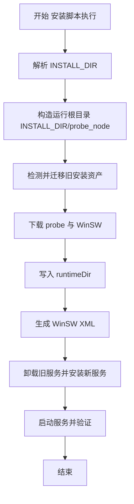

# Windows Probe 安装目录迁移完整方案

## 1. 目标

将 Windows 探针从当前安装根目录平铺模式迁移为统一子目录模式：

- 现状：`INSTALL_DIR\probe_node.exe`、`INSTALL_DIR\logs`、`INSTALL_DIR\probe_node-service.exe`
- 目标：`INSTALL_DIR\probe_node\probe_node.exe`、`INSTALL_DIR\probe_node\logs`、`INSTALL_DIR\probe_node\probe_node-service.exe`

同时覆盖：

- 安装脚本改造
- 服务配置改造
- 升级路径一致性
- 旧安装兼容迁移
- 文档与测试

---

## 2. 现状与影响点

### 2.1 Windows 安装脚本现状

关键文件：`scripts/install_probe_node_service_windows.ps1`

当前行为：

- 默认 `INSTALL_DIR=C:\Tools`
- `probe_node.exe` 写入 `INSTALL_DIR`
- `WinSW exe/xml` 写入 `INSTALL_DIR`
- `logs` 目录为 `INSTALL_DIR\logs`
- Service XML 以 `%BASE%` 为工作目录和日志目录（因此跟随 WinSW 所在目录）

### 2.2 probe_node 运行与升级现状

关键文件：`probe_node/upgrade.go`、`probe_node/main.go`、`probe_node/wintun_embed_windows.go`

当前行为：

- 升级替换目标依赖 `os.Executable` 解析的当前可执行路径
- 升级工作空间位于 `exeDir\.cloudhelper-upgrade`
- 数据目录优先尝试 `./data`，其次 `exeDir/data`
- wintun 内嵌库写入 `exeDir/temp/Lib/wintun/amd64/wintun.dll`

结论：

- 只要服务最终从 `INSTALL_DIR\probe_node\probe_node.exe` 启动，升级与运行时路径会自然收敛到子目录，不需要改动核心升级算法

---

## 3. 目标目录结构

统一为：

```text
INSTALL_DIR/
  probe_node/
    probe_node.exe
    probe_node-service.exe
    probe_node-service.xml
    logs/
    data/
    temp/Lib/wintun/amd64/wintun.dll
    .cloudhelper-upgrade/
```

兼容策略：

- 允许 `INSTALL_DIR` 根目录保留历史遗留文件
- 新版本服务与后续升级仅使用 `INSTALL_DIR\probe_node` 作为运行根
- 脚本支持重复执行，保持幂等

---

## 4. 安装脚本改造设计

文件：`scripts/install_probe_node_service_windows.ps1`

### 4.1 新增路径变量

在现有 `installDir` 基础上新增：

- `runtimeDir = Join-Path $installDir "probe_node"`
- `runtimeLogsDir = Join-Path $runtimeDir "logs"`
- `runtimeDataDir = Join-Path $runtimeDir "data"`

并将后续路径统一切换到 `runtimeDir`：

- `probeExePath`
- `winswExePath`
- `winswXmlPath`
- `Write-ServiceXml` 生成文件路径

### 4.2 WinSW 服务落点统一

将 WinSW 可执行与 XML 放在 `runtimeDir`，使 `%BASE%` 自动指向子目录：

- `<executable>%BASE%\probe_node.exe</executable>`
- `<workingdirectory>%BASE%</workingdirectory>`
- `<logpath>%BASE%\logs</logpath>`

### 4.3 服务重装流程增强

处理旧版本服务仍指向根目录的场景：

1. 查询服务是否存在
2. 停止服务
3. 尝试使用旧路径或新路径的 WinSW 执行 `uninstall`
4. 必要时 `sc delete`
5. 用 `runtimeDir` 下新 WinSW 安装并启动

---

## 5. 旧安装迁移策略设计

文件：`scripts/install_probe_node_service_windows.ps1`

新增迁移步骤，发生在下载完成后、服务安装前。

### 5.1 迁移来源

- `INSTALL_DIR\probe_node.exe`
- `INSTALL_DIR\probe_node.exe.bak*`
- `INSTALL_DIR\logs\*`
- `INSTALL_DIR\data\*`
- `INSTALL_DIR\probe_node-service.exe`
- `INSTALL_DIR\probe_node-service.xml`

### 5.2 迁移目标

全部收敛到 `runtimeDir` 及其子目录。

### 5.3 合并规则

- 目标不存在：直接移动
- 目标已存在：
  - 二进制与服务包装器：保留新下载版本，旧文件改名为 `*.legacy.<timestamp>` 后再移动或留在原位记录
  - `data`、`logs`：逐文件迁移，冲突文件采用 `*.legacy.<timestamp>`，不覆盖现有文件
- 迁移失败不中断主流程，记录 warning 并继续安装

### 5.4 幂等保障

- 每次执行前先检查源与目标是否已迁移
- 迁移函数可重复执行，重复执行不破坏已迁移结果

---

## 6. 升级链路一致性设计

### 6.1 结论

`probe_node` 当前升级实现基于 `os.Executable` 进行替换与重启；目录迁移完成后，升级行为会自动在 `INSTALL_DIR\probe_node` 内进行。

### 6.2 校验点

- 升级替换目标路径应为 `INSTALL_DIR\probe_node\probe_node.exe`
- 备份文件应位于同目录：`probe_node.exe.bak*`
- 升级工作区位于 `INSTALL_DIR\probe_node\.cloudhelper-upgrade`
- 重启后服务仍由 WinSW 在 `runtimeDir` 目录启动

### 6.3 最小代码改动原则

本次不改 `probe_node/upgrade.go` 主逻辑，重点通过安装脚本保证 exe 落点一致。

---

## 7. 测试方案

### 7.1 自动化测试

- 为安装脚本新增可测试函数拆分目标
  - 路径计算函数
  - 迁移决策函数
  - 冲突命名函数
- 如暂不引入 PowerShell 单测框架，至少增加 dry-run 日志路径校验分支

### 7.2 Windows 手工验证矩阵

1. 全新安装
   - 验证 `INSTALL_DIR\probe_node` 结构完整
   - 验证服务可启动

2. 从旧平铺目录升级
   - 预置旧文件在 `INSTALL_DIR` 根
   - 执行新脚本后验证迁移结果
   - 验证数据与日志未丢失

3. 重复执行脚本
   - 连续执行两次以上
   - 验证无破坏、无路径回退

4. 升级链路验证
   - 触发 probe 自升级
   - 验证替换与重启路径仍在子目录

5. 回滚场景验证
   - 模拟升级替换失败
   - 验证可恢复旧二进制并保持服务可用

---

## 8. 文档更新清单

### 8.1 README

文件：`README.md`

更新点：

- Windows 默认路径说明改为：
  - 安装根：`C:\Tools`
  - 实际运行目录：`C:\Tools\probe_node`
- 补充升级后目录迁移说明
- 补充日志与数据目录位置

### 8.2 安装升级文档

文件：`doc/install_upgrade.md`

新增 Windows 探针章节：

- 一键安装命令
- 目录结构
- 升级与迁移行为
- 常见问题与排查命令

---

## 9. 实施顺序



---

## 10. 可执行任务清单

1. 改造 `scripts/install_probe_node_service_windows.ps1` 路径与服务落点到 `runtimeDir`
2. 在脚本中实现旧安装迁移函数与幂等策略
3. 增强服务卸载重装流程，兼容旧 WinSW 路径
4. 补充日志，明确迁移动作与结果
5. 更新 `README.md` Windows 安装说明
6. 在 `doc/install_upgrade.md` 增加 Windows 安装升级章节
7. 执行 Windows 验证矩阵并记录结果
8. 收敛验收标准，确认后合入
